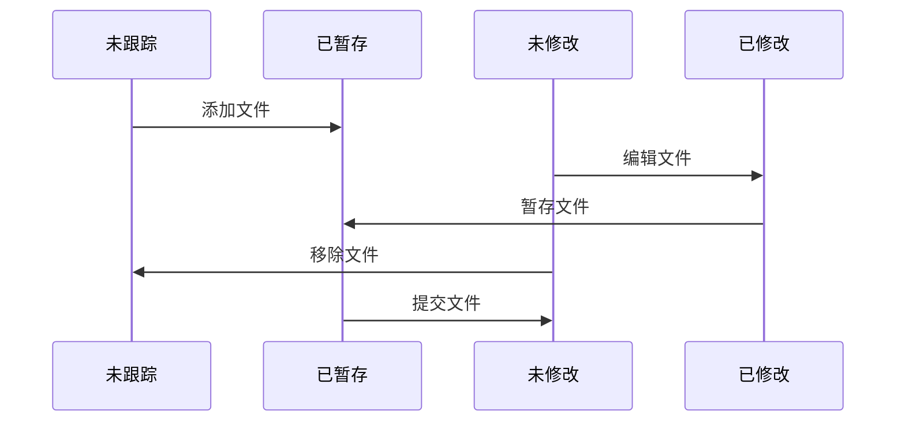

# Git教程

## 开始

### Git 简介

Git 是一种分布式版本控制系统，由开发出 Linux 的大神 Linus 撰写。

Git区分其他版本控制系统最重要的是快照的概念，每一次修改提交都被视作一个文件系统新的快照的生成。

### 安装 Git

在 Ubuntu 下可以用下面的命令安装：

`sudo apt-get install git`

在 Mac 下则使用 Homebrew：

`brew install git`

### 初次配置

安装完成后设置一下姓名，邮箱和默认编辑器：

```shell
git config --global user.name "Miachel Gu"
git config --global user.email "anyinlover@gmail.com"
git config --global core.editor vim
```

`--global`是一个全局参数，也可以对每个 Git 仓库设置不同的配置。

通过以下命令可以查看所有配置：

`git config --list`

也可以查看单个配置：

`git config user.name`

### 查看帮助

通过下面的命令可以打开man页

`git help config`

通过下面的命令能查看简单的用法提醒

`git config -h`

## Git基础

### 创建版本库

#### 从本地文件夹中创建

在某个目录下使用下面的命令，将其初始化成一个 Git 仓库：

`git init`

用以下命令可以将所有已有文件加入版本控制

```shell
git add .
git commit -m "Init project"
```

#### 从github等远程仓库克隆

`git clone https://github.com/libgit2/libgit2`

### 记录修改

Git 最重要的概念就是三分天下：工作区-缓存区-版本库。`add`操作是将工作区的文件加到缓存区中，`commit`操作是将缓存区文件加到版本库。

git中的文件状态分为两类，未跟踪和已跟踪，其中已跟踪又可以分为三种：未修改、已修改和已暂存。其相互转换方式如下：



#### 文件状态查看

`git status`查看仓库当前的状态：

`git status`

添加`-s`参数可以简化输出：

`git status -s`

#### 添加文件到暂存区

新添或者修改一个文件后，使用`git add`将其添加到暂存区：

`git add filename`

#### 忽略特殊文件

在 git 工作区根目录下建一个.gitignore 文件，可以指定不想提交的文件。
[Github 官网](https://github.com/github/gitignore)有不错的示例。

忽略文件原则：

- 忽略自动生成文件、如缩略图;
- 忽略编译生成的中间文件、可执行文件等。
- 忽略自己的带敏感信息的配置文件

#### 查看文件变化

如果需要查看已修改文件与暂存区的不同，使用以下命令：

`git diff`

如果需要查看暂存区与版本库的不同，使用以下命令：

`git diff --staged`

也可以指定比较修改过的文件：

`git diff filename`

#### 从暂存区添加到版本库

使用命令`git commit`将暂存区文件提交到仓库, `-m`后是提交的备注：

`git commit -m "add a file"`

`add`和`commit`分成了两步，可以多次`add`，一次`commit`。

`git commit -a -m "add all"` 可以自动保存工作区的修改到暂存区直接提交版本。

#### 删除文件

使用`git rm`删除已跟踪的文件，后面还需要`git commit`提交修改：

`git rm filename`

如果需要删除已暂存的文件，需要加`-f`参数。

如果想删除暂存区的文件，但在工作区仍然保留，使用：

`git rm --cached file`

### 查看版本记录

`git log`可以用来查看版本记录，其中一大串数字显示的是 SHA1 计算出来的`commit id`。默认情况下版本记录以逆序排序。

有一些参数对查看版本记录非常有帮助。

`git log -p -2`可以看到每个版本具体的修改处，数字可以控制显示数量。

`git log --stat`可以查看每个版本修改点的总结。

`git log --oneline`每一条版本记录显示一行日志。与`--graph`配合可以看到版本分支情况。

`git log --pretty=format`能更复杂的控制日志显示格式。

可以控制日志时间范围：

`git log --since=2.weeks`

`git log --until="2021-9-1"`

也可以查看涉及某个文件的修改：

`git log -- path/to/file`

### 撤销修改

#### 对已提交版本做修改

如果要对上一次提交的版本记录做一些小修改如修改提交备注或者添加忘添加的文件，可以使用：

`git commit --amend`

#### 回退暂存区文件

如果修改已经提交到暂存区了，那就需要使用下面的命令丢弃暂存区修改：

`git restore --staged filename`

#### 回退工作区文件

如果只是修改了工作区的文件，用下面的命令可以丢弃工作区修改：

`git restore filename`

### 远程仓库

#### 显示远程仓库

当从远程仓库克隆时，Git 自动会把本地`master`分支和远程`master`分支对应，远程仓库默认名称是`origin`。

要查看远程库的信息，使用`git remote`，`git remote -v` 显示更详细的信息。

#### 添加远程仓库

在 github 上 Create a new repo，命名为 learngit，在本地仓库已存在的情况下，将本地库与远程库相关联：

`git remote add pb git@github.com:anyinlover/learngit`

#### 从远程仓抓取内容

`git fetch origin` 注意这个命令只是抓取远程内容到本地，不执行合并动作。当本地分支和远程分支绑定时，可以使用`git pull` 自动抓取并合并。

#### 推送内容到远程仓

推送本地库内容到远程库: `git push origin master`

#### 检视远程仓

`git remote show origin` 可以看到远程仓库的具体信息。其中可以看到本地分支与远程分支的绑定情况和同步情况。

#### 重命名和删除远程仓

`git remote rename pb paul` 重命名远程仓。

`git remote rm paul` 删除远程仓。

### 标签管理

在发布版本时，打一个标签，可以唯一确定打标签时候的版本。标签是版本库的一个快照，实质是一个不能移动的指向 commit 的指针。

#### 查看标签

`git tag`查看所有标签

`git tag -l "v1.8.5*"` 查看符合模式的标签

#### 创建标签

创建带注释的标签：

`git tag -a v0.1 -m "version 0.1 released"`

如果要查看标签，用`git tag`找到标签名然后使用下面的命令：

`git show <tagname>`

用`-s`则能用私钥签名标签，签名采用 PGP 签名。需要安装 gpg。

`git tag -s v0.2 -m "signed version 0.2 released" commit_id`

git也支持创建轻量化标签，默认打在最新提交的 commit 上：

`git tag v1.0`

如果是要为历史提交打标签，需要找到对应的`commit_id`：

`git tag v0.9 commit_id`

#### 标签推送

默认`git push`不会推送标签，如果要把标签推送到远程：

`git push origin v1.0`

还可以推送全部标签到远程：

`git push origin --tags`

#### 删除标签

标签打错是可以删除的：

`git tag -d v0.1`

如果要删除远程标签：

`git push origin --delete v0.9`

#### 切换到标签

`git checkout v0.1`可以切换到标签

`git chekout -b version2 v0.2`基于标签创建新分支

### git别名

`git config --global alias.co checkout` 可以指定git别名

## git分支

### 背景知识

当在git中暂存一个文件时，git会计算一个`SHA-1`值，提交一个版本记录时会计算每个目录的`SHA-1`并构建一个文件树对象，其中包含文件夹和文件的组织关系。一个版本记录对象指向文件树对象，并且包含作者等其他信息。


每一个版本记录其实是一次文件树快照，可能存在0个，1个或多个父节点：


而一个分支只是一个轻量的可移动的指针，指向某个特定的版本记录。


当创建一个分支时，其实就是在当前位置创建了一个新的指针`git branch testing`:


`HEAD`是一个特殊的指针，指向当前分支：


通过下面的命令可以方便的看到分支和HEAD指向：

`git log --oneline --decorate`

切换分支`git checkout testing`会把`HEAD`指向testing分支，同时修改版本文件至testing分支所指的版本记录。


不同分支的版本记录可以各自演进，通过下面命令可以查看：

`git log --oneline --decorate --graph --all`

### 创建与合并分支

#### 基本分支创建

首先创建并切换到新分支`iss53`上：

`git checkout -b iss53`

上面的命令相当于下面两步：

```shell
git branch iss53
git checkout iss53
```

当新建分支`iss53`时，指向与`master`相同的提交，并把`HEAD`指向`iss53`，表示当前分支在`iss53`上。


现在对工作区的修改和提交发生在了`iss53`分支上，提交一次后会变成下面这样：


如果想切换分支回主分支，使用下面的命令，切换分支时最好保持工作区是干净的：

`git chekcout master`

此时如果有一个紧急补丁需要处理，则可以另开一个分支修改，改完之后是这样的：


如果想把`hotfix`分支的内容合并到`master`分支上, 由于master是hotfix的父节点，可以使用`Fast-forward`进行快速合并，也就是前面提到的移动指针，`master`就指向了`hotfix`的commit。

`git merge hotfix`


这个时候删除`hotfix`分支也没有关系（就是删除一个指针）：

`git branch -d hotfix`

#### 分支合并

当我们需要合并`iss53`分支时，此时master分支已经不在iss53的父节点上了，无法使用快速合并方式，此时的合并会使用三方合并的方式


三方合并会生成一个新的版本记录：


#### 解决冲突

当两个分支修改了同一个文件时，会发生合并冲突，需要手工修改后重新提交。

### 分支管理

`git branch`命令可以查看所有分支，带星号的是当前分支。

`git branch -v`命令可以查看分支最后一次版本记录信息

`git branch --merged`命令可以过滤出所有已经合入当前分支的分支，这些分支都可以被安全删除。

`git branch --no-merged`可以过滤出多有还没有合入当前分支的分支，这些分支删除会失败，除非使用`-D`强制删除。

`git branch --move bad corrected` 在本地修改分支名称

`git push --set-upstream origin corrected` 推送新分支到线上

`git push origin --delete bad` 删除线上旧分支

### 分支工作流

#### 长线分支

一种工作流方式是维护一个长线开发分支，master分支只用来版本发布。这样可以通过分层保持版本稳定。


#### 话题分支

通过话题分支可以进行特性开发，最后有选择性的进行合入：


### 远程分支

git在本地维护了远程分支的引用，之前的`git remote show origin`命令可以看到远程分支情况，远程分支一般名称为`origin/master`这种格式。


远程分支可能存在同步不及时的情况，只有在fetch的时候才会拉取最新的内容到本地。同步完成之后可能会变成如下：


当有多个远程服务器时，拉取分支可能会变成如下：


#### 推送分支

要将本地分支推送到远程分支上，可以使用`git push origin serverfix`

如果远程分支名称和本地分支名称不对应，需要指定`git push origin serverfix:awesome`

#### 跟踪分支

如果想在某个远程分支基础上创建本地分支进行工作，使用`git checkout -b serverfix origin/serverfix`，此时会创建一个跟踪分支，当使用`git pull`时会自动对应合并。

当使用clone命令时，master分支会自动跟踪远程分支。如果要把其他分支也设置为跟踪分支，分两种情况：

1. 如果本地分支还不存在，使用上面的命令，或者直接`git checkout serverfix`会自动创建本地跟踪分支
2. 如果本地分支已存在，在本地分支上使用`git branch -u origin/serverfix`

通过`git branch -vv`可以看到每个分支对应的远程分支情况。

#### 拉取分支

`git pull`其实就是`git fetch`和`git merge`的合并动作。

### git变基

对于之前分支合并中提到的iss53分支的情况，除了三向合并外，还可以使用变基合并。


`git rebase master` 完成之后会变成：


rebase本质上是找到两个分支的共同父节点，对当前分支的新增版本记录保存在临时文件里，然后以被rebase的分支为起点，按时间顺序重跑版本记录提交。rebase完成之后版本记录历史会很干净，只有一个合并的版本记录，适用于向项目主分支上合代码的情况。因为此时master分支只需要做一个快速合并就可以进行代码合入。

rebase和merge方法最后生成的快照是一样的，区别在于生成的版本记录历史。

#### 更高级的rebase用法


对于上面这种情况，如果只想把client分支合入主分支，可以使用下面的rebase命令：

`git rebase --onto master server client`

完成之后有如下的效果


#### rebase的危险

rebase本地分支没有影响，但是如果分支已经发布，rebase动作会对他人造成很大的困扰。

如果拉取了远程被rebase过的分支，一个补救方法是继续rebase一次。

`git pull --rebase`

#### rebase vs merge

rebase和merge是两种方式，一般建议发布时用rebase，而简单项目用merge就行。

## Git服务

### Git协议

1. 本地协议
2. HTTP协议
3. SSH协议
4. git协议：速度最快，没有鉴权

## 分布式协作

### 分布式工作流

下面是三种常见的分布式工作流


### 往项目提交代码

#### 提交准则

`git diff --check` 检查空格问题

尽量的分解为小的提交

考虑重写版本记录历史

遵循仓库提交代码消息格式

#### 私有小型团队

推送前需要merge主仓最新代码，使用简单


#### 私有管理团队

只有committer可以合代码，对于贡献者而言，一般的代码提交记录如下：


期间如果想了解他人做的修改，可以使用下面的命令：

`git log --no-merges issue54..origin/master`

#### 派生公开项目

需要单独fork，主仓会比较整洁。


```shell
git clone git@github.com:guguoshenqi/gitskill.git
git checkout -b featureA
git remote add myfork git@github.com:myfork/gitskill.git
git push -u myfor featureA
git request-pull origin/master myfork
```

一般情况下可以为了保持主仓版本记录整洁，可以使用rebase

```shell
git checkout featureA
git rebase origin/master
git push -f myfork featureA
```

如果代码检视发现有地方需要修改，下面这种方法也经常采用，可以让所有变动都合为一个版本记录。

```shell
git checkout -b featureBv2 origin/master
git merge --squash featureB
... change something ...
git commit
git push myfork featureBv2
```

### 维护项目

#### 使用特性分支

新合入的代码建议新开一个特性分支，多人情况下可以带上命名空间：

`git branch ghs/fun master`

#### 查看更改

`git log featureA --not master`可以查看新增的版本记录

`git diff master...featureA`可以查看具体的文件变化

#### 集成流程

有多种集成流程可以选择。

合并流程是最简单的，只维护了master日常分支，容易引入bug。


两阶段合并流程通过引入开发分支解决bug问题。


有些项目会使用更复杂的集成流程，比如git项目。

另一种代码集成的方式是变基或拣选。变基上面已经介绍过了，拣选可以选择某个具体的版本记录重跑：


`git cherry-pick e43a6`

Git 默认会使用`Fast forward`模式，这种模式在删除分支后，会丢掉分支信息。如果禁用 Fast forward 模式合并，会产生一个新的 commit，从而可以保存被删除分支信息，使用`--no-ff`参数：

`git merge --no-ff -m "merge with no-ff" dev`

## 使用 github

- 在 Github 上， 可以任意 Fork 开源仓库
- 自己拥有 Fork 后的仓库的读写权限
- 可以推送 pull request 给官方仓库来贡献代码

使用 SSH 方式连接 github，需要配置 SSH Key。假如主目录下无隐藏文件夹.ssh，就创建一个`ssh-keygen -t rsa -C "anyinlover@gmail.com"`。在.ssh 文件下有 id_rsa 和 id_rsa.pub 两个文件，将 id_rsa.pub 内容复制到 GitHub SSH Keys，注意不要有多余的空格或换行符。

## Git工具

### 版本记录选择

#### 简短的SHA-1

一般SHA-1取到前8-10个字符就可以避免歧义。

#### 分支引用

如果某个分支指向了某个版本记录，可以直接使用分支操作。`git rev-parse topic1`可以查看分支对应的版本记录。

#### 引用日志

`git reflog`引用日志保存了近几个月的HEAD和分支引用的历史，对于回退等操作很方便。

我们可以使用`git show HEAD@{5}`，或者`git show master@{yesterday}`来表示版本记录。

引用日志只保留在本地仓库。

#### 祖先引用

`HEAD^n`表示第几个父节点，默认不带n是第一个。在合并节点中比较有用

`HEAD~n`表示向前几个父节点，默认不带n是第一个。`HEAD~~`表示`HEAD~2`

#### 提交区间

`git log master..experiment` 表示只在experiment分支不在master分支的版本记录。

`git log ^master experiment`, `git log experiment --not master` 这两个用法一致。

`git log master...experiment` 会显示所有非共有的版本记录。

### 贮藏和清理

#### 贮藏

如果要修复一个紧急 Bug，而现有分支上的工作区又不干净，可以先用下面的命令保存工作现场：

`git stash`

在完成创建 Bug 分支并合并到现有分支时，可以再恢复工作现场。用下面的命令可以查看保存 stash 列表：

`git stash list`

有两种方法可以恢复工作现场

`git stash apply`
后不会删除 stash 列表，需要再用`git stash drop`来删除。

`git stach pop`
在恢复的同时也会删除 stash 列表。

在多次 stash 的情况下，可以先查看 stash 列表，然后再恢复指定的 stash：

`git stash apply stash@{0}`

贮藏有几个参数比较有用。第一个是`--keep-index`会在贮藏的同时将修改保留在索引中。第二个是`-u`会同时贮藏未跟踪的文件。

我们还可以从贮藏新建一个分支来避免潜在冲突 `git stash branch newone`

#### 清理

`git clean`默认会清理所有未被跟踪的文件，`-d`参数会同时清理目录 `-x`会清理被忽略的文件，一般推荐先`-n`试跑一次，OK的话再用`-f`进行清理。

### 重写历史

#### 修改最后一次提交

如果要修改最后一次提交使用`git commit --amend`

#### 修改多次提交

如果要修改多个提交信息则需要使用`git rebase -i HEAD~10`,可以删除、修改、拆分、压缩版本记录。

#### filter-branch

filter-branch功能强大：

`git fliter-branch --tree-filter 'rm -f passwords.txt' HEAD` 可以删除分支中所有历史记录的这个文件。

`git filter-branch --subdirectory-filter trunk HEAD` 可以指定子目录作为新的根目录。

甚至修改邮箱地址

```shell
git filter-branch --commit-filter '
        if [ "$GIT_AUTHOR_EMAIL" = "schacon@localhost" ];
        then
                GIT_AUTHOR_NAME="Scott Chacon";
                GIT_AUTHOR_EMAIL="schacon@example.com";
                git commit-tree "$@";
        else
                git commit-tree "$@";
        fi' HEAD
```

### 版本回退

理解版本回退最重要的是要理解工作区-缓存区-版本库三颗文件树。经典的git工作流程就是在这三种状态下切换。


`git reset`有三种模式。

soft模式只会回退版本，即将HEAD指向的分支移动回父节点，相当于撤销了上一次commit，此时工作区和缓存区的文件仍然是新版本的。


mixed模式会把缓存区的文件也替换成旧版本的，不加参数默认就是这种模式


hard模式则会把工作区的文件也替换成旧版本


## Git定制化

## 内部机制

