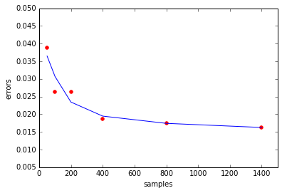
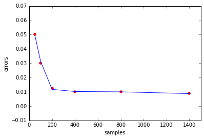

## 朴素贝叶斯习题

这一篇我得好好记载一下，差不多花了我一整个周日，实际投入时间估计超过八小时，最后还是参考原始的 octave 代码才写出我的 python 代码。但不得不说这一题让我也有很大的收获。python 文件处理，sparse 矩阵利用，贝叶斯公式的本质理解，朴素贝叶斯算法的深入理解，甚至 octave 语法的复习，都收获到不少。虽然最后自己也有些着急，但最终还是斩获了这道题目。

本题的主要难点在于需要真正的去理解朴素贝叶斯算法。讲义中的公式是不计单词次数的，也就是无论出现多少次都按一次计。但本题提供的材料却是考虑了次数。此外，讲义中提供的拉普拉斯平滑公式也有谬误，分母加的是 token 个数而不是简单的 2。此外，需要使用 log 来解决累乘后概率变小的问题。最后，要预测分类，还需要深入的理解贝叶斯公式。之前我一直陷入一个困惑：如果在垃圾邮件中某个关键词出现的概率是 0.9，直观来讲在测试集出现了 3 次，这个测试集是垃圾邮件的概率应该增大，但按公式来看却减小了。实际上的确是减小了，因为多出现一次后虽然概率有 0.9 是垃圾邮件，但还有 0.1 是正常邮件。这 0.1 体现了称为正常邮件的机会。所以概率这东西真的很神奇。再多谈几句先验概率和后验概率。先验概率就是一个经验概率，独立于测试集存在。经验+现状=结论。

展示一下我的代码，虽然简短，但是满满的心血啊！！！

```python
import numpy as np
from scipy.sparse import lil_matrix

def getxy(filename):
    f = open(filename)
    headerline = f.readline().rstrip() # remove trailing character \n
    row, col = [int(x) for x in f.readline().split()] # convert string to list
    tokenlist = f.readline().rstrip()
    matrix = lil_matrix((row,col)) # Row-based linked list sparse matrix
    category = lil_matrix((row,1))  # To construct a matrix efficiently

    for m in range(row):
        line = np.array([int(x) for x in f.readline().rstrip().split()])
        matrix[m, np.cumsum(line[1:-1:2])] = line[2:-1:2] # the cumulative sum of the elements
        category[m] = line[0]

    f.close() # remember close the file after finish using it
    x = matrix.tocsc() # convert lil_matrix to csc_matrix, for the following dot operation
    y = category.toarray().ravel() # convert lil_matrix to dense matrix

    return x,y,row,col

xt,yt,rowt,colt = getxy('ps2/MATRIX.TRAIN')

psi1 = (yt * xt + 1) / (sum((yt) * xt) + colt) # * operation represent dot between 1 -d array with sparse matrix
psi0 = ((1-yt) * xt + 1) / (sum((1-yt) * xt) + colt) # use Laplace smoothing

y1 = sum(yt) / rowt
y0 = 1 - y1

xs,ys,rows,cols = getxy('ps2/MATRIX.TEST')

yp1 = xs * np.log(psi1) + np.log(y1) # use log convert
yp0 = xs * np.log(psi0) + np.log(y0)

yp = yp1 - yp0
yp[yp > 0] = 1
yp[yp <= 0] = 0

err = yp - ys
print(len(err[err != 0])/rows)
```

## 最大概率的五个关键词

```python
z = np.log(psi1) - np.log(psi0)
temp = np.argpartition(-z,5)
result_args = temp[:5]
import pandas as pd
tokens = pd.read_table('ps2/TOKENS_LIST',header=None, sep = ' ').iloc[:,1].values
tokens[result_args]
```

## 不同训练样本的测试误差

```python
def geterror(trainname, testname):
    xt,yt,rowt,colt = getxy(trainname)

    psi1 = (yt * xt + 1) / (sum((yt)*xt) + colt) # * operation represent dot between 1 -d array with sparse matrix
    psi0 = ((1-yt) * xt + 1) / (sum((1-yt)*xt) + colt) # use Laplace smoothing

    y1 = sum(yt) / rowt
    y0 = 1 - y1

    xs,ys,rows,cols = getxy(testname)

    yp1 = xs * np.log(psi1) + np.log(y1) # use log convert
    yp0 = xs * np.log(psi0) + np.log(y0)

    yp = yp1 - yp0
    yp[yp > 0] = 1
    yp[yp <= 0] = 0

    err = yp - ys
    return len(err[err != 0])/rows

samples = [50,100,200,400,800,1400]
files = ['PS2/MATRIX.TRAIN.'+ str(x) for x in samples]

errors = [geterror(x,'PS2/MATRIX.TEST') for x in files]

% matplotlib inline
import matplotlib.pyplot as plt
plt.scatter(samples,errors,color = 'red')
plt.hold = True
plt.plot(samples, np.poly1d(np.polyfit(samples, errors,4))(samples))
plt.xlabel('samples')
plt.xlim(0,1500)
plt.ylabel('errors')
```



## 使用 SVM 分类

```python
from sklearn import svm

def svmerror(trainname,testname):
    xt,yt,rowt,colt = getxy(trainname)
    lin_svm = svm.LinearSVC()
    lin_svm.fit(xt.toarray(),yt)

    xs,ys,rows,cols = getxy(testname)

    yp = lin_svm.predict(xs.toarray())

    err = yp - ys
    return len(err[err != 0])/rows

samples = [50,100,200,400,800,1400]
files = ['PS2/MATRIX.TRAIN.'+ str(x) for x in samples]

svm_errors = [svmerror(x,'PS2/MATRIX.TEST') for x in files]

% matplotlib inline
import matplotlib.pyplot as plt
plt.scatter(samples,svm_errors,color = 'red')
plt.hold = True
plt.plot(samples, np.poly1d(np.polyfit(samples, svm_errors,4))(samples))
plt.xlabel('samples')
plt.xlim(0,1500)
plt.ylabel('errors')
```



## 朴素贝叶斯和 SVM 比较

朴素贝叶斯能用更少的数据快速学习，但也有较高的渐进误差。相反，SVM 在小样本时有较大误差，但能快速的逼近。一般而言，生成算法比判别算法需要更少的样本，但有更高的渐进误差。
