# Chapter 9: Asynchronous Sequential Circuits

The finite state machines introduced in the last chapter are *synchronous*, that is, they use a clock input to synchronize the flow of data within the circuit. They primarily do this by loading positive-edge-triggered flip-flops to lock in the value of the present state, and possibly also the values of system outputs. Most sequential systems are synchronous, but some are not. This chapter introduces **asynchronous sequential circuits**.

We start by describing the basic characteristics and model of asynchronous sequential circuits. Next, this chapter introduces the asynchronous system design process, first by analyzing an existing asynchronous circuit and then by demonstrating a complete design.

There are specific issues related to asynchronous sequential design that are not present, or are present much less frequently, in synchronous circuits. This chapter introduces oscillation, hazards, and races, and design strategies to resolve these issues in asynchronous sequential circuit design.

## 9.1 Overview and Model

The clock frequency used in digital circuits has increased dramatically over the past several decades. Whereas early microprocessors used clocks with frequencies around 3 MHz (3 million cycles per second), modern microprocessors use clocks with frequencies over 3 GHz, a thousand-fold increase. Due to improvements in the technology used to create integrated circuit chips, the individual components on these chips produce outputs more quickly, take up less space, and use less power per component. Producing outputs more quickly lowers the propagation delay and is primarily responsible for the faster clock time. But even at such high clock frequencies, there is sometimes a need for circuits that are even faster than these clock frequencies can support. This need can sometimes be met by asynchronous sequential circuits.

Asynchronous sequential circuits were mentioned briefly in Chapter 6. A generic model for these circuits is repeated in Figure 9.1. It is similar to the model for synchronous sequential circuits, with a couple of differences.

- Asynchronous sequential circuits do not use flip-flops or other storage elements to hold the present state. Instead, we model these circuits using a delay. The input to the delay block is the next state of the system. After a delay, this is output as the new present state.
- Since there are no flip-flops, there is no need for a clock signal.

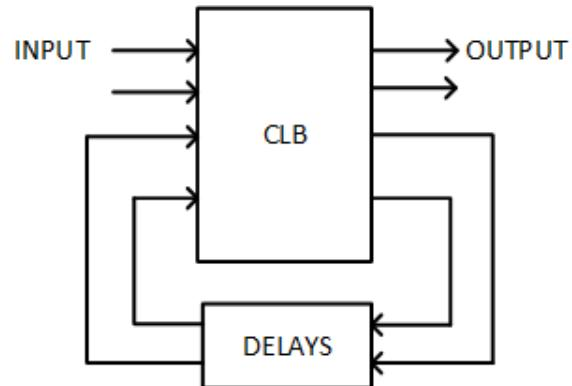

Figure 9.1: Generic model for an asynchronous sequential circuit.

Although there are differences between asynchronous and synchronous sequential circuits, there are also many similarities. Each employs a combinatorial logic block that receives system input values and the present state, and produces system outputs and the next state value. The design processes for the two are also similar, as are the tools used in the design process. In the next section, we'll examine the design process and the mechanisms we use in more detail.

## 9.2 Design Process

Before getting into the design process for asynchronous sequential systems, this section introduces several tools that we will use in the design process. To do this, we'll analyze a given circuit to illustrate how these tools work. Then we'll go through a complete design from beginning to end.

### 9.2.1 Analysis Example

To introduce the design tools, we will analyze an asynchronous sequential circuit we have already seen in this book, the S-R latch constructed using NOR gates. For this example, we will only consider the $Q$ output of the latch. We will ignore the output. Figure 9.2 (a) shows the design for this latch.

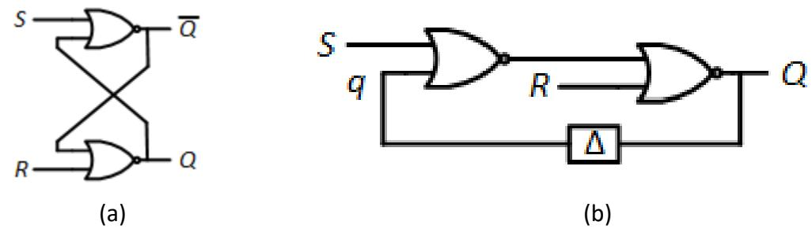

Figure 9.2: Asynchronous sequential circuit: the partial S-R latch: (a) Logic diagram; (b) Redrawn to incorporate delay and feedback.

When modeling asynchronous sequential circuits, it is standard practice to incorporate a delay block between what we would call the present state and the next state. We redraw the logic diagram to include this delay, and we reformat it to emphasize the feedback path in the circuit. This is shown in Figure 9.2 (b). By tracing through the data paths, you can verify that both circuits are the same.

Notice the new label, $q$, associated with the lower input of the leftmost NOR gate. In a steady state, $q$ has the same value as $Q$. When $Q$ changes, $q$ will also change, but only after a delay. In this circuit, $q$ is similar to the present state of the circuit; $Q$ is both a circuit output and similar to the next state.

From this circuit, we can determine the value of $Q$ as a function of $S$, $R$, and $q$, as follows.

$$
Q = (S + q)' + R)'
$$

Using DeMorgan's Law of the form $(A + B)' = A'B'$, this becomes

$$\begin{aligned} \mathcal{Q} &= ((\mathcal{S} + \mathcal{q})\, ')\, '\mathcal{R}\,' \\ &= (\mathcal{S} + \mathcal{q})\, '\mathcal{R}\,' \end{aligned}$$

Now that we have our function for $Q$, we can create a **transition table**. This looks very similar to a truth table. For this circuit, the table inputs are the circuit inputs, $S$, $R$, and $q$, and the output is circuit output $Q$. Just as with a truth table, we determine the output value for all possible combinations of input values. The transition table for this circuit is shown in Figure 9.3. Ignore the column labeled $PSD$ for now; we'll explain and make use of that shortly.

| S | R | q | Q | PSD state |
|---|---|---|---|-----------|
| 0 | 0 | 0 | 0 | a         |
| 0 | 0 | 1 | 1 | b         |
| 0 | 1 | 0 | 0 | c         |
| 0 | 1 | 1 | 0 | d         |
| 1 | 0 | 0 | 1 | e         |
| 1 | 0 | 1 | 1 | f         |
| 1 | 1 | 0 | 0 | g         |
| 1 | 1 | 1 | 1 | h         |

Figure 9.3: Transition table for the S-R latch.

We use the transition table to create the **excitation map**. This looks very much like the Karnaugh maps we have been using throughout this book. As with Karnaugh maps, we set up a grid, with the rows and columns corresponding to all possible input values. Figure 9.4 shows two ways to draw the excitation map for this circuit; they are equivalent.

|                   |  |  | SRIq | 0 1 |  |
|-------------------|--|--|------|-----|--|
|                   |  |  |      |     |  |
| q SR  00 01 11 10 |  |  | 01   |     |  |
|                   |  |  | 11   |     |  |
|                   |  |  | 10   |     |  |

Figure 9.4: Excitation maps for the S-R latch. The two maps are equivalent.

There is one very significant difference between the excitation map and a Karnaugh map. Notice that some, but not all of the entries are circled. The entries that are circled are the **stable states** of the circuit. A state is stable when, for its input values, the circuit is to remain in that state. That is, its present state and next state are the same, or $q = Q$.

To illustrate a stable state, consider the case when $S = 0$, $R = 0$, and $Q = 1$. An S-R latch with $SR = 00$ should retain its current value. Let's examine this from the beginning. Initially, $Q = 1$. After a brief delay, $q = 1$. The inputs to the first NOR gate are $S = 0$ and $q = 1$, and its output is $(0 + 1)' = 0$. The second NOR gate inputs this value and $R = 0$, outputting $(0 + 0)' = 1$. This cycle repeats continuously, and $Q$ does not change. This is shown in Figure 9.5 and its animation.

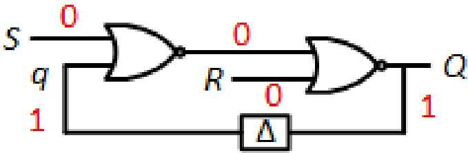

Figure 9.5: S-R latch in a stable state.

Not all states, however, are stable. When $Q \neq q$, the state is called a **transient state**. When a circuit enters a transient state, it immediately (after our Δ delay) transitions to another state. Because this occurs so quickly, we model this with our input values not changing while the circuit is in this state. If it goes to another transient state, it transitions out of that state, continuing until it reaches a stable state. A well-designed circuit will always reach a stable state. If it doesn't, well, we'll discuss this more later in this chapter.

As an example, let's say we are in the stable state just discussed, with $S = 0$, $R = 0$, and $Q = q = 1$. Then the $R$ input changes from 0 to 1, giving us $S = 0$, $R = 1$, and $Q = 1$. For an S-R latch, $S = 0$ and $R = 1$ should set $Q = 0$, not 1, so this state is transient, not stable. Tracing through our circuit, the first NOR gate has inputs $S = 0$ and $q = 1$ and outputs a 0. The second NOR gate has this input and $R = 1$, and it also outputs a 0. This sets $Q = 0$ and, after a brief delay, also sets $q = 0$. Now the first NOR gate has inputs $S = 0$ and $q = 0$ and outputs a 1. The second NOR gate has

this 1 and $R = 1$ as inputs and outputs a 0. The circuit has transitioned from the transient state with $S = 0$, $R = 1$, and $Q = 1$ to the stable state with $S = 0$, $R = 1$, and $Q = 0$. This is shown in Figure 9.6 and its animation.

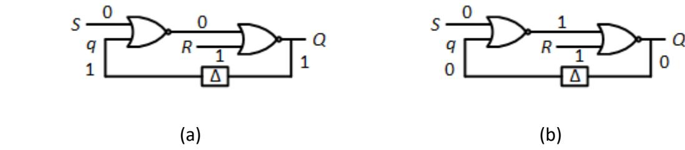

Figure 9.6: Transition from (a) a transient state to (b) a stable state.

Now, back to our analysis and one final tool, the **primitive state diagram**. This is similar to the state diagrams we have seen earlier in this book, but it takes into account the constraints placed on our system. The primitive state diagram for the S-R latch is shown in Figure 9.7. It uses the values in the $PSD$ column of the state transition table in Figure 9.3 to denote the states.

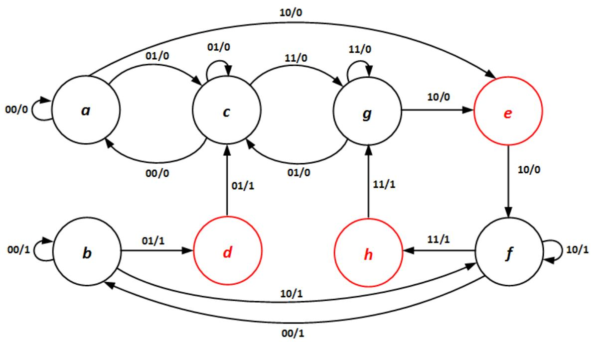

Figure 9.7: Primitive state diagram for the S-R latch. Transient states are shown in red.

We placed two constraints on asynchronous sequential circuits, and both are reflected in this primitive state diagram. First, at most one input value can change at a time. For this

reason, arcs are not included for inputs that change two values. For example, state $a$ corresponds to $S = 0$ and $R = 0$. The primitive state diagram does not include an arc from state $a$ with input values $S = 1$ and $R = 1$. The other three input combinations, $SR = 00$, $SR = 01$, and $SR = 10$, are included in the diagram.

The second constraint is that input values do not change during transient states. The transient states in the primitive state diagram, $d$, $e$, and $h$, each have one arc entering and one arc exiting; both have the same input values. Of course, the output value is different. If it were the same, our system would remain in the same state and this state would be stable, not transient.

With these tools, and those we will introduce shortly, we are ready to design an asynchronous sequential system from its initial specification to its final implementation. We'll do that in the next subsection.

### 9.2.2 Design Example

There are several ways to divide the steps in the design process for an asynchronous sequential system. Here are the steps we will use in this book.

1. Develop system specifications.
2. Define all states.
3. Minimize states.
4. Assign binary values to states.
5. Determine functions and design the circuit.

We will examine each of these steps as we proceed through our example design. In this subsection, we will design the S-R latch with only a $Q$ output.

#### Step 1: Develop System Specifications

We wish to design an asynchronous sequential system with two inputs, $S$ and $R$, and one output, $Q$. When $SR = 00$, output $Q$ should retain its previous value. If $SR = 01$, the system should set $Q = 0$, and the system should output $Q = 1$ when $SR = 10$. Finally, when $SR = 11$, the system should set output $Q$ to 0. Figure 9.8 shows a block diagram of our system.

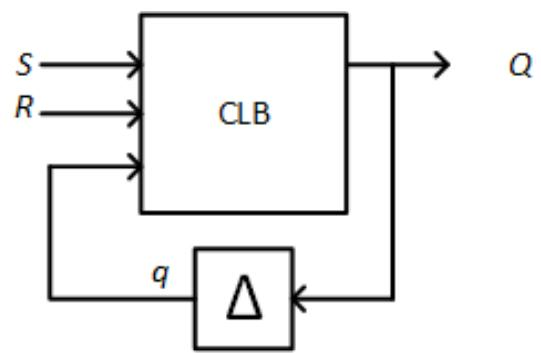

Figure 9.8: Block diagram for the S-R latch.

#### Step 2: Define States

In the block diagram for this system, there are three inputs to the combinatorial logic block that generate the next state and output values. These three inputs can take on any of 23 = 8 possible values, from 000 to 111, so this system has eight states (before minimization). Some of these states are stable, and the rest are transient. Figure 9.9 shows these states.

| State | S | R | q | Condition                     |
|-------|---|---|---|-------------------------------|
| a     | 0 | 0 | 0 | $S=0$, $R=0$, Previously $Q=0$ |
| b     | 0 | 0 | 1 | $S=0$, $R=0$, Previously $Q=1$ |
| c     | 0 | 1 | 0 | $S=0$, $R=1$, Sets $Q=0$       |
| d     | 0 | 1 | 1 | Transition to state c         |
| e     | 1 | 0 | 0 | Transition to state f         |
| f     | 1 | 0 | 1 | $S=1$, $R=0$, Sets $Q=1$       |
| g     | 1 | 1 | 0 | $S=1$, $R=1$, Sets $Q=0$       |
| h     | 1 | 1 | 1 | Transition to state g         |

Figure 9.9: Primitive states for the S-R latch. Transient states are shown in red.

To develop this table, we would go to the specification and identify values corresponding to the specification. These are the stable states of the system. The **Condition** column in the table shows which condition in the specification corresponds to each state.

The remaining values represent transient states. When the system is in a transient state, we want it to transition to a stable state. Its inputs ($S$ and $R$ for this system) cannot change when the system is in a transient state, so it must go to another state with the same input values but different outputs. The Condition column gives the next state for each transient state.

#### Step 3: Minimize States

To minimize states, we first create the primitive state diagram and a new mechanism, the **primitive state table**. Let's start with the primitive state diagram. For each state, we list all possible valid input combinations and determine the output value to be generated. We exclude values for which more than one input changes, and those that are not the same inputs as were set when the system enters a transient state. Figure 9.10 shows the primitive state diagram for this system. This is exactly the state diagram we derived for the S-R latch in Figure 9.7 in the previous subsection.

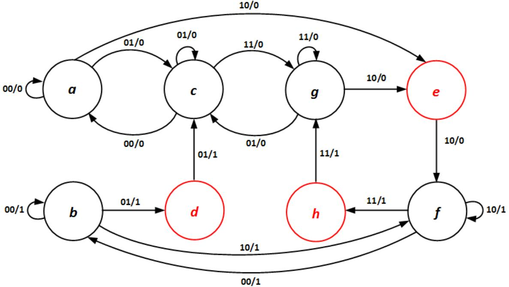

Figure 9.10: Primitive state diagram for the S-R latch.

Notice that some transitions are not made directly. For example, if the system is in state $b$ ($S = 0$, $R = 0$, $Q = q = 1$) and $R$ changes to 1, the system should transition to state $c$ ($S = 0$, $R = 1$, $Q = q = 0$). Remember that when input values change, $Q$ does not immediately change; there is a slight delay. In the primitive state diagram, I have placed all states with $q = 0$ in the upper row of the diagram, and all states in the lower row have $q= 1$. When input values change, the machine transitions to another state in the same row, that is, the output does not change. Also, the states in each column have the same input values but different output values. It is within these states that the machine changes its output. This can be summarized as follows.

When an asynchronous sequential system changes input and output values, it first changes its input values and, after a very brief transient delay, changes its output values.

Now let's look at the primitive state table. This table is equivalent to the primitive state diagram. To construct this table, we list each state in the first column. We then create one additional column for each possible combination of input values; for this example, the four columns correspond to $SR = 00, 01, 11$, and $10$. Then we fill in the table. For each state and input values, we list the next state and output values generated. When an input value is not valid, we place a dash in the table. As you'll see soon, we treat the dashes as don't care values. The complete primitive state table for this system is shown in Figure 9.11.

| State | 00  | 01  | 11  | 10  |
|-------|-----|-----|-----|-----|
| a     | a,0 | c,0 | --- | e,0 |
| b     | b,1 | d,1 | --- | f,1 |
| c     | a,0 | c,0 | g,0 | --- |
| d     | --- | c,0 | --- | --- |
| e     | --- | --- | --- | f,1 |
| f     | b,1 | --- | h,1 | f,1 |
| g     | --- | c,0 | g,0 | e,0 |
| h     | --- | --- | g,0 | --- |

Figure 9.11: Primitive state table for the S-R latch.

Now we are ready to minimize the states in our system. Since the primitive state diagram does not include the don't care conditions, it may be easier to use the primitive state table. To identify equivalent states and minimize the number of states, we compare every pair of states individually. When comparing two states, they are equivalent only if all the entries are equivalent. Two entries are equivalent if (i) they have the same state and output value, or (ii) one or both are don't cares.

We start by comparing states $a$ and $b$. Since their entries for input values 00, 01, and 10 have different outputs, they cannot be equivalent.

Moving on to $a$ and $c$, we find that both have $a,0$ for input value 00, and $c,0$ for input value 01. So far so good. In the next column, 11, state $c$ has the value $g,0$ and $a$ has a don't care. By definition, they also match. Finally, column $a$ has $e,0$ and $c$ has a don't care, so this matches as well. Since all entries match, $a$ and $c$ are equivalent.

We continue this process until we have compared every pair of states. Then we can create an implication table for our results. If we find any conditions necessary for equivalence, we include these entries in the table and continue to check these entries until the table is complete. For this example, there are no such conditions, and we get the implication table shown in Figure 9.12.

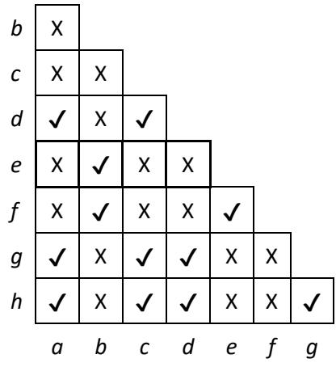

Figure 9.12: Implication table for the primitive state table for the S-R latch.

From this table, we see that there are several pairs of states that are equivalent, namely $a$ and $c$, $a$ and $d$, $a$ and $g$, $a$ and $h$, $b$ and $e$, $b$ and $f$, $c$ and $d$, $c$ and $g$, $c$ and $h$, $d$ and $g$, $d$ and $h$, $e$ and $f$, and $g$ and $h$.

We could choose one equivalence, combine the states, and repeat this process to see if more than two states are equivalent, but there is an easier way to do this. *For any set of states, the states are all equivalent if and only if every pair of states within the set are equivalent.*

Consider states $b$, $e$, and $f$. We have found that $b$ and $e$ are equivalent, $b$ and $f$ are equivalent, and $e$ and $f$ are equivalent. Therefore, states $b$, $e$, and $f$ are all equivalent to each other and can be combined. Following this same procedure, we can show that states $a$, $c$, $d$, $g$, and $h$ are also all equivalent. Our 8-state system can be reduced to a 2-state system.

To combine equivalent states, we create a single state that has the entries of its combined states. Consider the combined state for $b$, $e$, and $f$, which I'll call $\beta$. For inputs 00, $b$ and $f$ have the entry $b$,1 and $e$ has a don't care. Since we don't care what the entry is for $e$, we'll make it $b$,1. Now all three entries match. Since $b$ is combined into state $\beta$, the entry becomes $β$,1. We determine the other entries in the same way. We also combine $a$, $c$, $d$, $g$, and $h$ into a single state, which I'll call $\alpha$, and combine their entries in the same way. This gives us the revised state table shown in Figure 9.13 (a). The equivalent, revised state diagram is shown in Figure 9.13 (b).

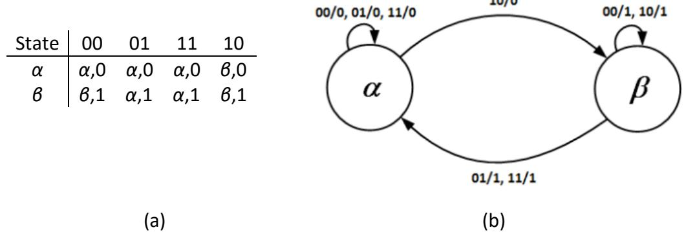

Figure 9.13: Revised (a) state table, and (b) state diagram for the S-R latch.

#### Step 4: Assign Binary Values To States

Since we have only two states in our system (after minimization), we need only one bit to represent each state. I choose to assign $\alpha = 0$ and $\beta = 1$.

#### Step 5: Determine Functions and Create Circuit

From here we can create the transition table and excitation map for the revised states. Again using $q$ as the present state and $Q$ as the next state, and including the binary values for $\alpha$ and $\beta$, we get the transition table shown in Figure 9.14 (a).

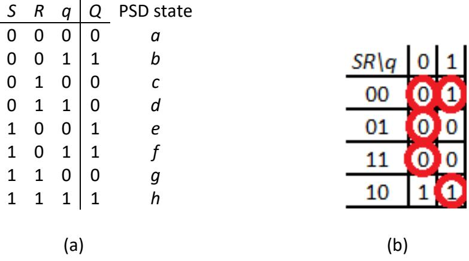

Figure 9.14: (a) State table, and (b) excitation map for the revised S-R latch.

As before, we can derive the excitation map from this state table. The excitation map is shown in Figure 9.14 (b). Both the state table and the excitation map are identical to those derived from the circuit for the S-R latch at the beginning of this section, which makes sense since we are now trying to develop that same circuit.

From this excitation map, it is straightforward to derive the function for $Q$, which is $Q = SR' + R'q$. A bit of logical manipulation transforms it as follows.

$$
\begin{aligned}
Q &= SR' + R'q \\
&= R'(S + q) \\
&= (R + (S + q)')'
\end{aligned}
$$

This in turn leads to the implementation using two NOR gates, one to generate $(S + q)'$ and the other to realize the final function. This circuit is shown in Figure 9.15 (a), with a delay block included to show the feedback generating $q$ from $Q$. The circuit is redrawn more like a traditional S-R latch in Figure 9.15 (b)

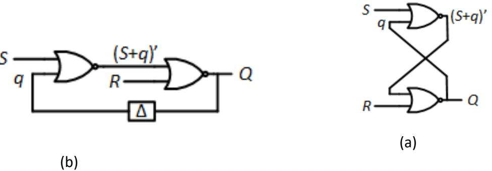

Figure 9.15: (a) Circuit to generate function $Q$. (b) Redrawn as a traditional S-R latch.

## 9.3 Unstable Circuits

Stability is an important consideration when designing asynchronous sequential circuits. We have previously introduced stable states, but what makes an entire circuit stable?

Simply put, an asynchronous sequential circuit is stable if it always reaches a stable state. It may pass through one or more transient states to reach a stable state, but it always gets there, no matter what value the inputs have and what state it is currently in.

This leads to an interesting and necessary condition. For each possible combination of input value, there must be at least one stable state. Furthermore, since input values do not change while the circuit is in a transient state, each transient state must ultimately transition to one of these stable states. If a set of input values does not have any stable states, this cannot happen, and the circuit is unstable.

Consider the circuit shown in Figure 9.16 (a). It is straightforward for us to find that the function for $Q$ can be expressed as

$$
Q = Aq + Bq'
$$

We can use this function as we create the transition table shown in Figure 9.16 (b).

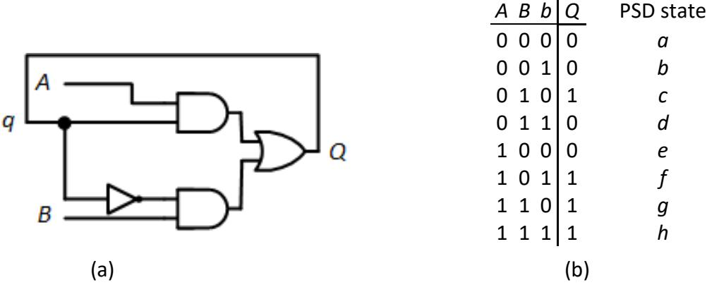

Figure 9.16: An unstable asynchronous sequential circuit: (a) Logic diagram; (b) Transition table.

You may already see the problem just by looking at the transition table, but it becomes much clearer when we create the excitation map for this circuit. This map is shown in Figure 9.17. Notice that the column for inputs $AB = 01$ has no stable states. If we input 01 to this circuit, it will constantly transition between two states. When $AB = 01$ and $q = 0$, it will set $Q = 1$. This value is fed back and, after a delay, $q = 1$. This leaves us with $AB = 01$ and $q = 1$, which sets $Q = 0$. This in turn sets $q = 0$, bringing us back to the original state. This bouncing back and forth between transient states is an **oscillation**.

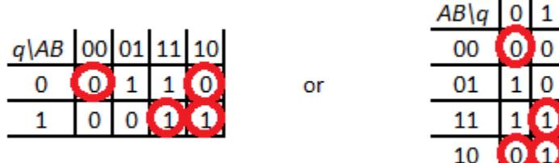

Figure 9.17: Excitation map for the unstable asynchronous sequential circuit.

Using the state labels in the transition table, we can create the primitive state diagram shown in Figure 9.18. Notice the loop in the graph between states $c$ and $d$. This is the same oscillation described in the previous paragraph.

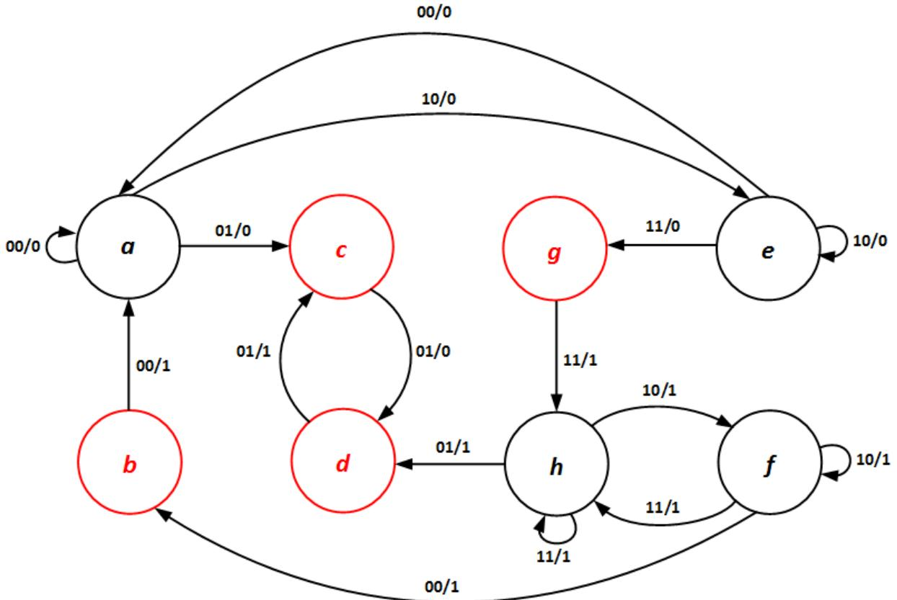

Figure 9.18: Primitive state diagram for the unstable asynchronous sequential circuit.

This process is useful during the analysis of existing circuits, as well as the initial design process. Once a function is determined, we can develop the transition table, excitation map, and primitive state diagram to identify unstable input conditions. However, there is no quick fix to this problem. If a specification is met and the solution leads to an unstable design, it is necessary to revise the initial specification to make the system fully stable.

## 9.4 Hazards

In combinatorial circuits, a **hazard** occurs when a change to a single input value causes a momentary change to an output value that, logically speaking, should not occur. In this section, we'll look at two classes of hazards, how to identify them, and how to design circuits that are hazard-free.

### 9.4.1 Static Hazards

You have already seen an example of a hazard earlier in this book. See if you can recall this example before continuing.

The example is our Shakespeare-inspired circuit, which comes from the end of Chapter 3 in our discussion of propagation delays. (See *Hamlet*, Act III, Scene 1.) The circuit, its timing diagram, and its animation are repeated in Figure 9.19. When input $ToBe$ changes from 1 to 0, inverted output $ToBe'$ changes from 0 to 1, but only after the brief propagation delay of the NOT gate. During this delay, the OR gate may see both inputs as 0 and momentarily set its output to 0. This is called a **static-1 hazard**; it occurs when the output should remain at 1, but it glitches to 0.

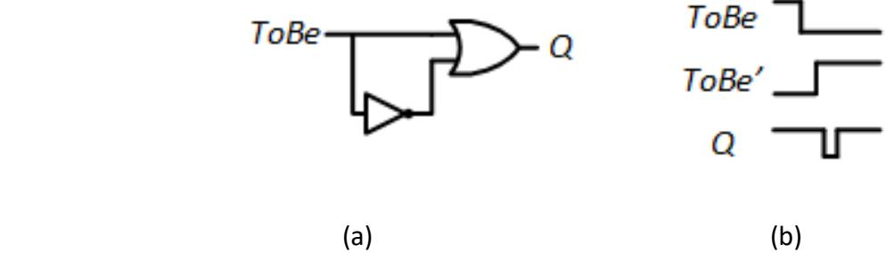

Figure 9.19: Example of a static-1 hazard: (a) Circuit; (b) Timing diagram.

There is an equivalent hazard, called a **static-0 hazard**, that occurs when an output that should remain at 0 glitches to 1. An example circuit and timing diagram are shown in Figure 9.20. In this circuit, when input $A$ changes from 0 to 1, the output of the NOT gate changes from 1 to 0 after a slight propagation delay. During the time the NOT gate is changing its output, the AND gate may interpret both inputs as 1, and thus output a 1 very briefly.

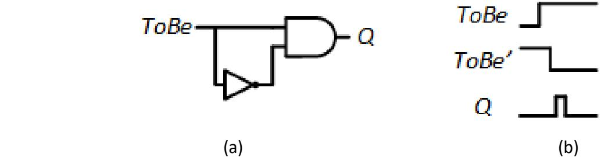

Figure 9.20: Example of a static-0 hazard: (a) Circuit; (b) Timing diagram.

In general, static-1 hazards occur most frequently in AND-OR circuits, that is, circuits with several AND gates, each of which sends its output to a single OR gate to generate the circuit output. Static-0 hazards typically occur in OR-AND circuits. These are common circuit configurations. AND-OR circuits are frequently used to implement sum-of-products functions, and OR-AND circuits typically implement product-of-sums functions.

#### 9.4.1.1 Recognizing Static-1 Hazards

One of the easiest ways to identify static hazards is to examine their Karnaugh maps. Consider, for example, a function with the truth table shown in Figure 9.21 (a). We can use this table to create the Karnaugh map in Figure 9.21 (b). Grouping adjacent 1s as shown in the figure, we derive the function $Q = ab' + a'c$. Finally, we implement it as shown in Figure 9.21 (c). It looks good, but it is not; it has a static-1 hazard.

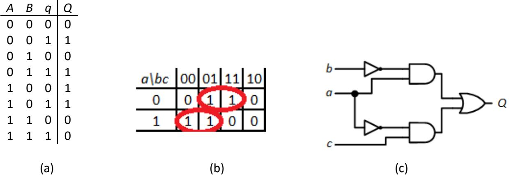

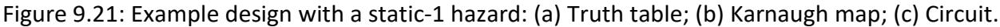

The hazard occurs when $b = 0$, $c = 1$, and $a$ changes from 1 to 0. Under these conditions, the upper AND gate changes from 1 to 0 and the lower gate changes from 0 to 1. However, because $a$ passes through a NOT gate before going into the lower AND gate, the upper gate

may change its output to 0 before the lower gate changes its output to 1. Both gates will send a 0 to the OR gate for a brief time, causing it to generate a glitch output of 0. This sequence is shown in Figure 9.22.

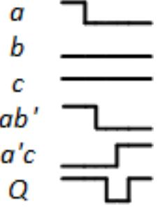

Figure 9.22: Timing diagram illustrating the static-1 hazard.

This is a key point in the root cause of static-1 hazards. These hazards occur when the value of two terms in the function change simultaneously, one from 0 to 1 and the other from 1 to 0. Due to different propagation delays, however, the two terms do not actually change at *exactly* the same time. There is a slight difference, and this difference causes the glitch.

In a Karnaugh map, each circled group corresponds to one of the AND gates. When changing only one input causes the circuit to move from one group to another in the Karnaugh map, we are changing the outputs of two of the AND gates. The AND gate for the group we are leaving changes from 1 to 0, and the AND gate for the group we are entering changes from 0 to 1. So, to find static-1 hazards in a Karnaugh map, look for adjacent 1s that are in different groups. In this map, this occurs in the cells with $abc = 001$ and $abc = 101$.

#### 9.4.1.2 Resolving Static-1 Hazards

Now that we have identified the hazard, how do we get rid of it? Think about this for a minute before reading on.

Hopefully you did think about this, and hopefully you found the solution. The way to get rid of the static-1 hazard is to add another term to our function and another group to the Karnaugh map. The new group should include all the terms that cause the glitch to appear. For our function, this occurs when $b = 0$ and $c = 1$, and $a$ is either 0 or 1. Our additional term is $b'c$. The revised Karnaugh map and circuit are shown in Figure 9.23.

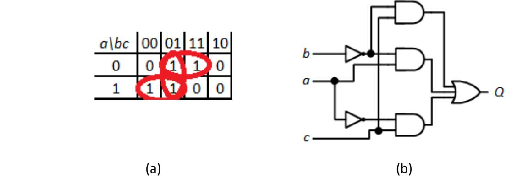

Figure 9.23: (a) Karnaugh map and (b) circuit updated to remove the static-1 hazard.

Now when the inputs change from $abc = 001$ to $abc = 101$, the output of the new, uppermost AND gate remains at 1. The output of this gate is input to the OR gate, which also keeps its output at 1, removing the glitch. Figure 9.24 shows the updated timing diagram.

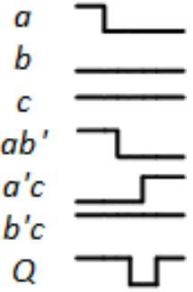

Figure 9.24: Timing diagram showing the static-1 hazard has been resolved.

#### 9.4.1.3 Recognizing and Resolving Static-0 Hazards

Just as we can recognize static-1 hazards in a Karnaugh map, we can also recognize static-0 hazards using K-maps. We form groups of the 0 terms; the sum of these is $Q'$. If any of the terms is true, then $Q = 0$ and $Q' = 1$.

For our previous example, we can group terms as shown in Figure 9.25. The two groups are $ab$ and $a'c'$.

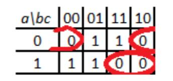

Figure 9.25: Karnaugh map with zeroes grouped.

We can apply DeMorgan's laws to generate a product of sums formula for $Q$ as follows.

$$
\begin{aligned}
Q' &= a b + a' c'\\
Q &= (a b + a' c')'\\
&= (a b)'(a' c')'\\
&= (a' + b')(a + c)
\end{aligned}
$$

We can implement this function for $Q$ using the circuit shown in Figure 9.26.

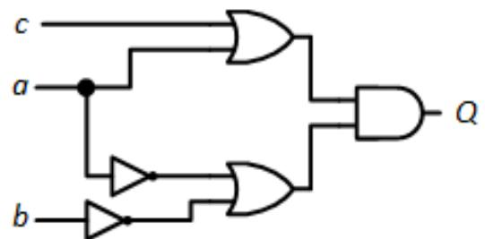

Figure 9.26: Circuit with static-0 hazard.

Static-1 hazards occur when moving from one group to another, and the same is true for static-0 hazards. In this example, this occurs when $b = 1$ and $c = 0$, and $a$ changes from 0 to 1. The output of the upper OR gate changes from 0 to 1, and the output of the lower OR gate changes from 1 to 0, but only after a slight propagation delay due to the NOT gate that outputs $a'$. During this delay, the AND gate may see both inputs as 1 and very briefly change its output to 1, as shown in the timing diagram in Figure 9.27.

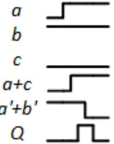

Figure 9.27: Timing diagram showing the static-0 hazard.

So far, everything presented seems analogous to the static-1 hazard. The solution continues this trend. To remove the static-0 hazard, we add a term to cover the terms with the hazard, in this case $bc'$. Our equations become

$$
\begin{aligned}
Q' &= ab + a'c' + bc' \\
Q &= (ab + a'c' + bc')' \\
&= (ab)'(a'c')'(bc')' \\
&= (a' + b')(a + c)( b' + c )
\end{aligned}
$$

The Karnaugh map, revised circuit, and new timing diagram are shown in Figure 9.28. As we can see in the timing diagram and animation, the additional OR gate outputs a 0 the entire time that the circuit transitions from $abc = 010$ to $abc = 110$. This ensures that the output of the AND gate remains at 0, removing the glitch.

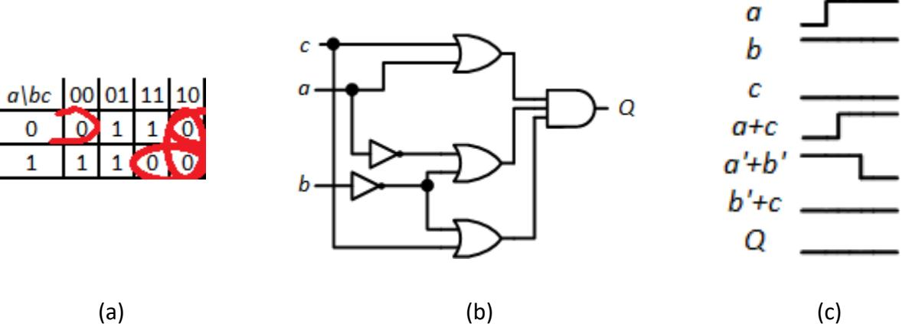

Figure 9.28: (a) Karnaugh map; (b) updated circuit; and (c) timing diagram with static-0 hazard removed.

### 9.4.2 Dynamic Hazards

Static hazards occur when an output that is (logically) not supposed to change experiences a glitch. It is also possible to have a glitch when an output *is* supposed to change. An output that should change from 0 to 1, for example, might have a glitch and change from 0 to 1, back to 0, and finally back to 1. This is called a **dynamic hazard**.

To see how a dynamic hazard can occur, consider the circuit shown in Figure 9.29 (a). The OR gate realizes the function $B + B'$. In theory, this value should always be 1. In practice, however, it has a static-1 hazard and can glitch to 0 when $B$ changes from 1 to 0, as described in the previous subsection. The AND gate realizes the function $(B + B')B'$, or $B'$.

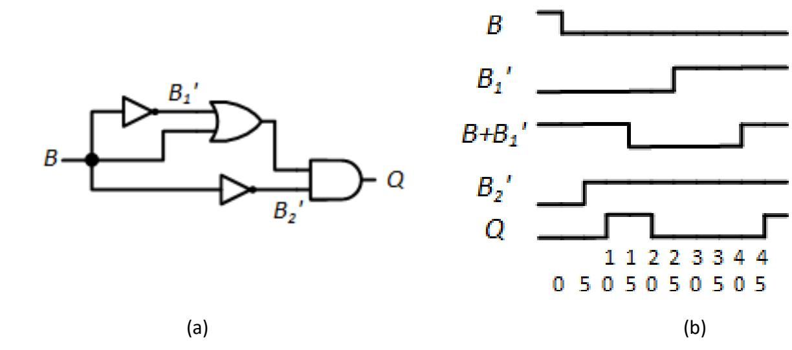

Figure 9.29: (a) Circuit with a dynamic hazard, and (b) its timing diagram.

To distinguish the outputs of the two inverters, I've labeled them $B'_1$ and $B'_2$. Both will output the value $B'$, but there is no guarantee that both will take *exactly* the same amount of time to produce this value. In this example, the lower NOT gate generates $B'_2$ more quickly than the upper NOT gate outputs $B'_1$. The lower NOT gate and the AND gate have 5 ns propagation delays, the OR gate has a propagation delay of 15 ns, and the propagation delay of the upper NOT gate is 25 ns.

The timing diagram in Figure 9.29 (b) and the animation for this figure show the signal values throughout the circuit as $B$ changes from 1 to 0. Initially, $B = 1$, $B'_1 = 0$, and the output of the OR gate $(B + B') = 1$. The output of the lower NOT gate, $B'_2$, is 0 and $Q = 0$.

Then $B$ changes from 1 to 0. 5 ns later, $B'_2$ changes from 0 to 1. This sets both inputs of the AND gate to 1. After an additional 5 ns to accommodate the propagation delay of the AND gate, its output becomes 1.

After another 5 ns, or 15 ns after $B$ changes from 1 to 0, the OR gate sets its output to 0 since its $B$ and $B'_1$ inputs are both 0. This sets one input of the AND gate to 0, and 5 ns later its output goes back to 0.

5 ns later, or 25 ns after $B$ changes, the output of the upper NOT gate, $B'_1$, becomes 1. After its 15 ns propagation delay, the output of the OR gate changes from 0 to 1. Now the inputs to the AND gate are again all set to 1, and 5 ns later the AND gate again outputs the final value of 1. This changing of the output of the AND gate, output $Q$, from 0 to 1 to 0 to 1 is the dynamic hazard in this circuit.

Now that we know where the dynamic hazard is within the circuit, how do we get rid of it? Think about this for a minute, but here's a hint: you've already seen the solution to this problem.

There is a specific condition of dynamic hazards that greatly simplifies the process of correcting them. *A dynamic hazard can only exist if the circuit also includes at least one static hazard.* In this circuit, the OR gate has a static-1 hazard that causes it to have a glitch in its output. This glitch is input to the AND gate, which causes its output to glitch and generates the dynamic hazard.

Putting this all together, if we get rid of the glitch generated by the static-1 hazard, we no longer have an input glitch to trigger the dynamic hazard. That's the key to mitigating dynamic hazards: get rid of the static hazards in the circuit and the dynamic hazards disappear.

## 9.5 Race Conditions

The hazards we introduced in the previous section are caused when a single input value changes. Within a circuit, there is another condition that can cause problems. This condition occurs when two (or more) values within a circuit are supposed to change simultaneously. It is very unlikely that the two values will change at *exactly* the same instant in time. In general, one may change slightly more quickly than the others, placing the circuit in a state that it should not be in. This is called a **race condition**.

To illustrate this, consider an asynchronous sequential circuit that continuously outputs two-bit values in the sequence 00 → 01 → 10 → 11 → 00… This circuit has four states with the same values as the outputs. Now look at the point where the state (and outputs) change from 01 to 10. If both bits change at exactly the same time, the circuit functions as desired. But what happens if the most significant bit changes slightly faster than the least significant bit? In this case, the circuit may go from 01 to 11 instead of from 01 to 10. If the least significant bit changes more quickly, the circuit might go from 01 back to 00. This, in a nutshell, is the issue arising from race conditions.

I was careful to specify that this is an *asynchronous* circuit. In synchronous circuits, race conditions typically occur in the combinatorial logic used to generate the inputs to flip-flops within the circuit. To resolve race conditions, we simply wait until all values have changed before loading the flip-flops. We can do this by reducing the frequency (and hence increasing the period) of the clock. For this reason, the remainder of this section will focus solely on race conditions in asynchronous sequential circuits.

Some race conditions don't matter, and some do. In the following two subsections, we'll look at these two cases. Then we'll examine methods to resolve race conditions when necessary.

### 9.5.1 Non-critical Race Conditions

When analyzing asynchronous sequential circuits, we are primarily concerned with the stable states. If a race condition exists, but all possible paths always lead to the desired stable state, the race condition is called a **non-critical race condition**. To see how this works, consider the example transition table shown in Figure 9.30. The circuit has four states, each represented by a 2-bit value: $a$ (00), $b$ (01), $c$ (10), and $d$ (11). Initially, the circuit is in state $a$ (00) and the inputs are set to 11; this is a stable state for this input value. Now the input changes to 01 and we want our circuit to transition to state $d$ (11). If both bits representing the state change from 0 to 1 at the same instant in time, the circuit goes directly to state $d$ as desired. This is possible but very unlikely.

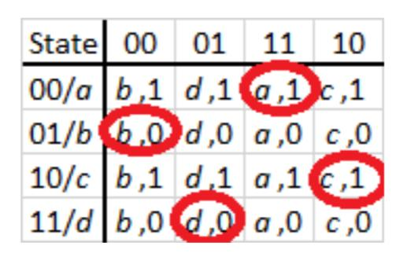

Figure 9.30: Transition table with non-critical race conditions.

Let's examine the two cases in which one bit of the state value changes more quickly than the other. If the most significant bit is faster, the circuit goes from state value 00 ($a$) to 10 ($c$). But looking at state $c$ for input value 01, we see that the circuit next goes to state $d$ (11). Since the most significant bit for both $c$ and $d$ is 1, it doesn't change any more. At this point, only the least significant bit changes from 0 to 1. With only one bit changing, the state value goes from 10 ($c$) to 11 ($d$), thus ending up in the final, stable state that we wanted it to go to.

If the least significant bit changes more quickly, the circuit instead goes from state $a$ (00) to state $b$ (01). State $b$ also transitions to state $d$ (11) with only the most significant bit in its state value changing.

No matter which bit of the state value (if either) changes more quickly, the circuit always ends up in state $d$. This is why this race condition is non-critical. There are also some other non-critical race conditions in this table. Identifying these race conditions is left as an exercise for the reader.

### 9.5.2 Critical Race Conditions

It would make our lives much easier if all races in asynchronous sequential circuits were noncritical, but that's just not the case. Frequently, races cause the circuit to go into the wrong stable state, and not function as desired. These races are called **critical races**.

The transition table shown in Figure 9.31 includes a critical race. Let's say the circuit is in state $a$ (00) and the input value is 0; the circuit is currently in a stable state. Then the input value changes from 0 to 1. The circuit should transition to state $d$ (11). If both bits of the state change simultaneously, unlikely but possible, this is exactly what happens. The circuit goes directly from state $a$ to state $d$.

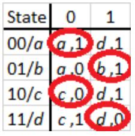

Figure 9.31: Transition table with a critical race condition.

Next, consider the case in which the most significant bit changes more quickly than the least significant bit. Instead of going directly to state $d$ (11), the state value changes from 00 to 10, bringing the circuit to state $c$. Fortunately, when the circuit is in state $c$ and the input is 1, it transitions from $c$ (10) to $d$ (11), which is the stable state we wanted to reach. So far the circuit is functioning as desired.

Finally, we see what happens if the least significant bit changes first. We go from state $a$ (00) to state $b$ (01). When the input is 1, this is a stable state and the circuit remains in this state. This is not where it should be, and this is a critical race.

We need to modify this system so that all critical races are removed. We look at how to do that in the next subsection.

### 9.5.3 Resolving Critical Race Conditions

As we've seen in the previous examples, both non-critical and critical race conditions occur when two or more bits of the state value change at the same time, but one may change more quickly than the other(s). When this happens, the circuit may enter an incorrect state, and thus fail to perform as required. The best way to get rid of races in an asynchronous sequential circuit is to assign state values so that each state transition only changes one bit of the state value. Just like a horse race with only one horse, there isn't really a race with only one bit changing; there isn't anything for it to race against.

Going back to the last example, let's swap the values for states $c$ and $d$. This makes our state representations $a = 00$, $b = 01$, $c = 11$, and $d = 10$. When our circuit is in state $a$ and the input value changes from 00 to 10 instead of from 00 to 11. For the new state values, this transition only changes one bit, which removes the race condition. Equally important, it does not introduce any other race conditions.

It is important to note that changing the state value does not change the output values. The circuit must still generate the outputs as originally specified. If the outputs were derived from the original state values, then we would need to redesign the logic to generate outputs based on the new state values. Remember that whoever is using the circuit does not see the states; they only see the input and output values.

#### 9.5.3.1 Another Example

We want to design an asynchronous sequential circuit that counts the number of times an input value changes. For simplicity, the circuit outputs a 2-bit value, $O1O0$, and a single input $I$. When $I$ changes either from 0 to 1 or from 1 to 0, the output value is incremented, progressing through the sequence 00 → 01 → 10 → 11 → 00…

Since there are four different output values, this circuit needs (at least) four states. For this example, the four states and their state values are $a$ (00), $b$ (01), $c$ (10), and $d$ (11). For the initial design, the output values are the same as the state values. Initially, the circuit is in state $a$ and input $I = 0$. When $I$ changes to 1, the circuit goes to state $b$. It stays in $b$ until $I = 0$; then it goes to $c$. When $I$ becomes 1, the circuit transitions to state $d$, and when $I$ is again 0, the circuit moves to state $a$. Before looking at the transition table in Figure 9.32, try to derive this table from the description given in this paragraph.

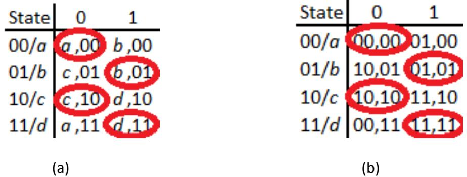

Figure 9.32: Transition table for the counter: (a) With symbolic state names; (b) With the initial binary state values.

It is relatively easy to determine the functions for the two-bit "next states" $Q_1$ and $Q_0$. We can see just by looking at the table that $Q_0$ = $I$. $Q_1$ is best determined using an excitation map. Its function is $q_1q'_0 + q_1I + q'_1q_0I'$. The circuit to realize these functions, and the entire asynchronous sequential machine, is shown in Figure 9.33. Because we chose these specific state assignments, the outputs can be expressed as $O_1 = Q_1$ and $O_0 = Q_0$.

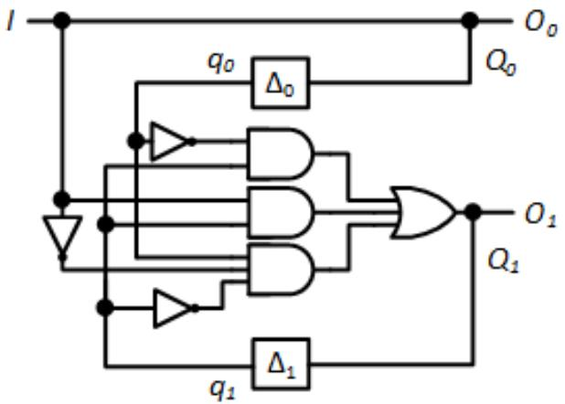

Figure 9.33: Preliminary circuit to realize the counter.

Unfortunately, this circuit has some critical races. Consider the case when the circuit is in state $b$ and input $I$ changes from 1 to 0. We want the circuit to transition from state $b$ to state $c$, with the state value changing from 01 to 10. This might happen if both bits change at exactly the same time. If the least significant bit changes more quickly than the most significant bit, which is realistic since it does not use any logic gates at all, the circuit would transition to state value 00, or state $a$. This is a stable state and the circuit would stay there, not reaching the desired state $c$. If, for some reason, $Q_1$ changes first, the circuit would go to state $d$ with state value 11. From here, it would try to go to state $a$ (00), and could go to that state. It could also go to state $b$ (01), which is where the circuit just was. There is also a chance that it will go to desired state $c$ (10), but this is by no means certain.

Once again, we can remove the race by setting the state values to $a$ (00), $b$ (01), $c$ (11), and $d$ (10). Figure 9.34 shows the state table with these values. Using the excitation maps, the development of which is left as an exercise for the reader, we derive the equations for state variables $Q_1$ and $Q_0$ as:

$$
\begin{aligned}
Q_1 &= q_0I'+ q_1'I \\
Q_0 &= q_0I'+ q_1I
\end{aligned}
$$

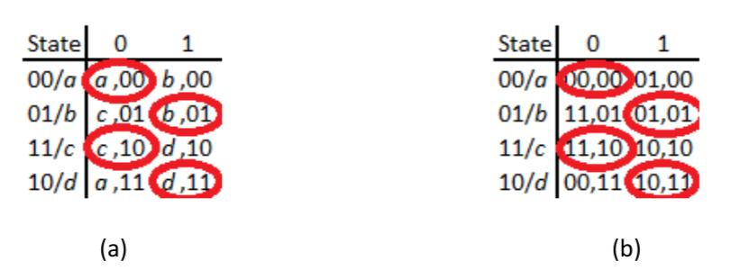

Figure 9.34: Transition table for the counter: (a) With symbolic state names; (b) With revised binary state values.

Since the outputs are no longer the same as the state values for states $c$ and $d$, we need to develop functions for the outputs. The reader can verify that these functions are

$$
\begin{aligned}
O_1 &= Q_1 \\
O_0 &= Q_1 \oplus Q_0
\end{aligned}
$$

The circuit for the counter with the revised state values is shown in Figure 9.35. This design has no race conditions.

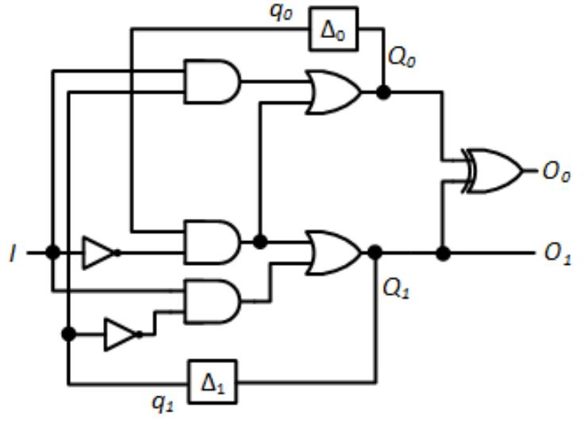

Figure 9.35: Final circuit to realize the counter.

#### 9.5.3.2 How Did We Do That?

So, how did I know that exchanging the state values for $c$ and $d$ would get rid of the critical races? There is a specific method I used, which I'll explain here. First, I looked at each row of the transition table to see which states are adjacent, that is, which states are involved in a transition. For state $a$, we stay in $a$ if $I = 0$ and go to $b$ if $I = 1$. Hence, $a$ and $b$ are adjacent. We ignore the cases when the circuit remains in the same state since the state values do not change. Continuing through the transition table row by row, we find that $b$ and $c$, $c$ and $d$, and $d$ and $a$ are also adjacent.

To remove races from the circuit, we want to assign values to each state so that adjacent states' values vary by only one bit. I started by assigning 00 to $a$.

State $a$ is adjacent to two states, $b$ and $d$. There are two values that are different from the 00 value of state $a$ by only one bit, 01 and 10. I assigned 01 to $b$ and 10 to $d$.

Now, state $b$ is adjacent to states $a$ and $c$. We've already assigned 00 to $a$, and there is only one other binary value that differs from the 01 value of state $b$ by one bit. We assign this value, 11, to state $c$. Finally, we see that the values of adjacent states $c$ (11) and $d$ (10) also vary by only one bit.

Notice that the counter progresses from $a \rightarrow b \rightarrow c \rightarrow d \rightarrow a \dots$, or through state values $00 \rightarrow 01 \rightarrow 11 \rightarrow 10 \rightarrow 00 \dots$ This is the 2-bit reflected Gray code introduced earlier in this book, and this is one of the most common uses of the Gray code, to get rid of races in asynchronous sequential circuits.

Gray codes work great when the number of states is exactly a power of 2 and you progress through the states sequentially. But that's not always the case. Consider the case when we want to extend this circuit so it counts from 0 to 5 instead of 0 to 3. It will have six states, which we label $a$, $b$, $c$, $d$, $e$, and $f$. We take the first six entries of the 3-bit Gray code and assign them to these states, which gives us $a = 000$, $b = 001$, $c = 011$, $d = 010$, $e = 110$, and $f = 111$. We can construct the transition table in much the same way as we did for the original example. This gives us the transition table and primitive state diagram shown in Figure 9.36.

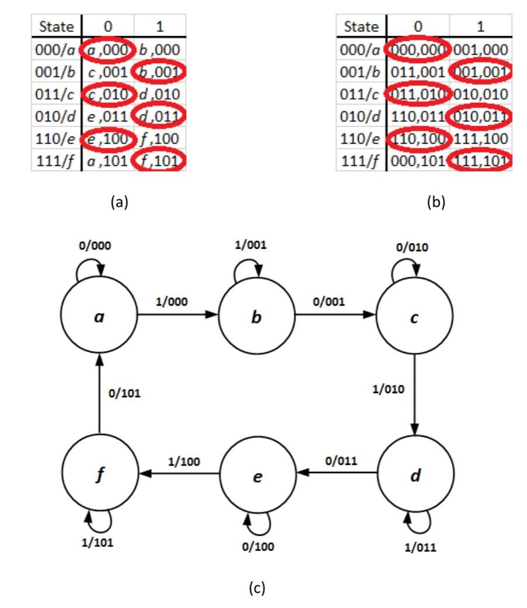

Figure 9.36: 6-value counter: (a) Primitive transition table; (b) Primitive transition table with state values listed; and (c) Primitive state diagram.

As we transition through the states of this asynchronous sequential system, using the Gray code sequence largely achieves its purpose. Almost all transitions change only one bit of the state value. The only transition that causes a problem occurs in state $f$ when input $I = 0$. There, the circuit transitions from state $f$ (111) to state $a$ (000). All three bits of the state value change, giving the circuit a three-way race.

Before reading on, try to list some ways to resolve this problem.

Hopefully you've developed some alternatives to the design presented here. Below are a few that I found.

1. Change the state value for $f$ from 111 to 100.
2. Change the state values for $d$, $e$, and $f$ from 010, 110, and 111 to 111, 110, and 100, respectively.
3. Add transient states between states $f$ and $a$.

For this example, we'll implement the third option.

The idea behind adding transient states is to have this system change only one bit of the state value for each transition. By incorporating transient states, the system can change one bit of the state value and then transition to another state very quickly, continuing until all bits are changed.

Since three bits are changed as the system goes from state $f$ to state $a$, this transition must be divided into three transitions, each of which changes one bit of the state value. To do this, we create two new transient states, $g$ and $h$, with state values 101 and 100, respectively. Instead of going from $f$ (111) to $a$ (000), the system will go from $f$ (111) to $g$ (101) to $h$ (100) to $a$ (000). Now, each transition changes only one bit of the state value and the critical race condition is removed. The revised transition table and state diagram are shown in Figure 9.37. Note the two entries for $I = 1$ in states $g$ and $h$. Since these are transient states, only the entries for $I = 0$ are defined in this design. The entries for $I = 1$ are treated as don't cares.

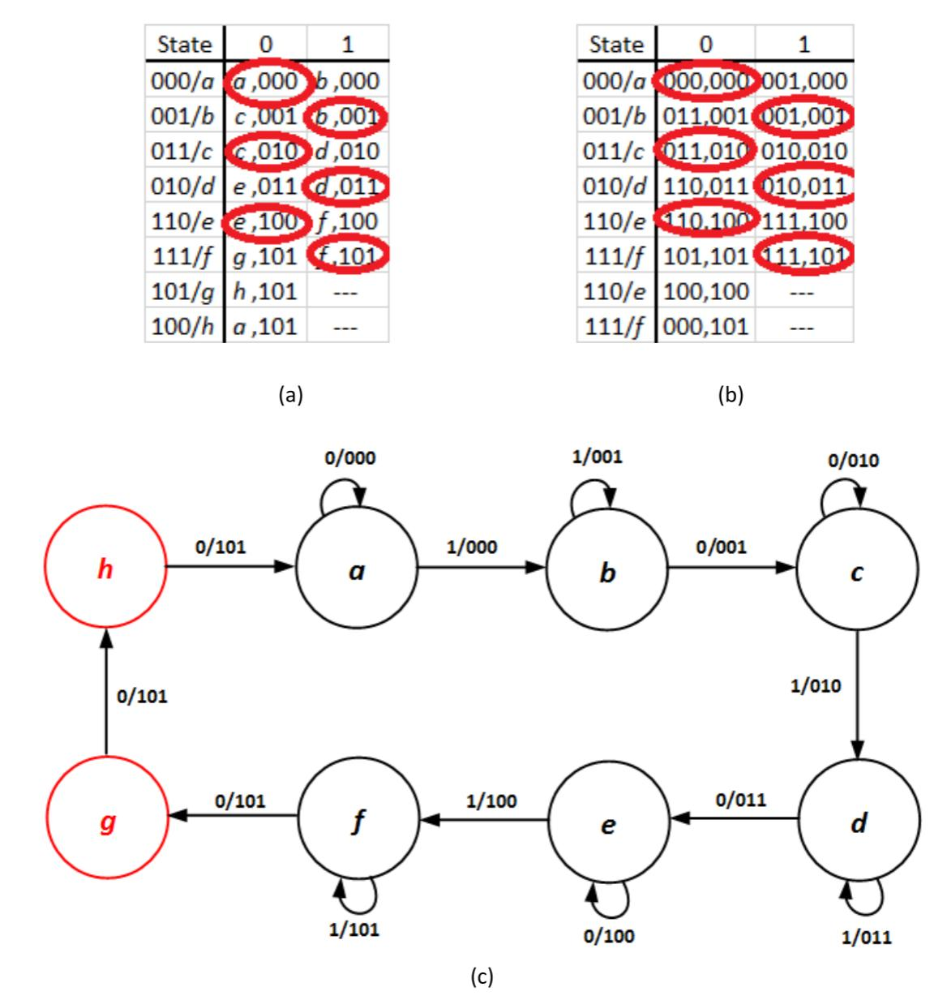

Figure 9.37: Revised (a) transition table; (b) transition table with state values listed; and (c) state diagram for the 6-value counter.

With the revised states, we can now design the asynchronous, race-free sequential circuit for this system. The circuit will sequence through the states properly and generate the correct outputs. This is left as an exercise for the reader.

## 9.6 Summary

The vast majority of sequential circuits are synchronous, that is, they use a clock to coordinate the flow of data within the circuit. Asynchronous sequential circuits, though less frequently used, still play an important role when even the fastest synchronous circuits are not fast enough.

Unlike synchronous circuits, asynchronous sequential circuits do not use storage elements such as flip-flops to store their present state. They incorporate feedback delays as they transition from one state to another.

There are several tools we can use to design and analyze asynchronous sequential circuits. A transition table is similar to a traditional truth table, with system inputs and the present state as inputs and system outputs and the next state as outputs. An excitation map is derived from the transition table. It looks much like a Karnaugh map, with stable entries circled. A primitive state diagram is very much like a traditional state diagram, incorporating constraints placed on the system.

The design process for asynchronous sequential systems begins with the specification of the system and definition of all states. This preliminary specification often results in a large number of states, which can often be combined to reduce the final number of states in the system. We then determine functions and create the final circuit to realize the system specification.

Asynchronous sequential circuits can have several issues that do not occur, or occur less often, in synchronous sequential circuits. A circuit that does not have at least one stable state for every possible combination of input value may oscillate, transitioning continuously between two or more transient states. Static hazards occur when an output value that should stay constant briefly glitches to the opposite value. Static glitches occur when going from one group of terms in a Karnaugh map to another group. Incorporating redundant logic is the usual way to remove static hazards from a circuit. Dynamic hazards occur when a value that is supposed to change once has a glitch and changes several times on its way to its intended value. Dynamic hazards are caused by static hazards. Removing the static hazards also removes the dynamic hazards they cause.

Race conditions occur when two values are supposed to change simultaneously, but the delays associated with the changes are not equal. A race condition is non-critical when the race does not change the overall system behavior; the circuit ultimately reaches its desired state and generates its specified output values. A critical race condition can result in a circuit reaching an incorrect state and outputting the wrong values. We can resolve critical race conditions by assigning binary values to states such that each transition changes only one bit, thus giving that bit nothing to race against. It is also possible to incorporate additional, transient states into the system to limit the number of bits that change to one per transition.

## Exercises

*For problems 1-5, analyze the S-R latch modified to only output .*

1. Show the circuit model with feedback and delay.

2. Show the transition table.

3. Show the excitation map.

4. Show the primitive state diagram.

5. Show the timing diagram for the S-R latch as inputs transition from 10 to 00 to 01.

*For problems 6-9, design the D latch as an asynchronous sequential circuit.*

6. Show the transition table and define the primitive states.

7. Minimize the states and show the revised transition table.

8. Show the excitation map and derive the functions.

9. Design the circuit to implement this design.

10. For the transition table below, identify and correct all oscillations.

| State | 00  | 01  | 11  | 10  |
|-------|-----|-----|-----|-----|
| a     | b,0 | d,1 | a,1 | c,0 |
| b     | c,0 | b,1 | c,1 | c,0 |
| c     | d,0 | c,1 | c,1 | c,0 |
| d     | d,1 | a,1 | a,1 | b,0 |

11. For the following circuit, identify and mitigate all static-1 hazards.

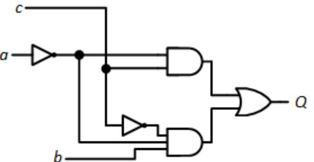

12. For the following circuit, identify and mitigate all static-0 hazards.

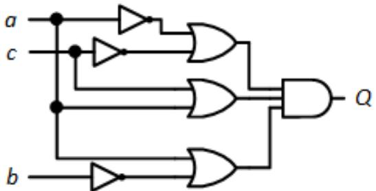

13. Find and resolve all dynamic hazards in the following circuit.

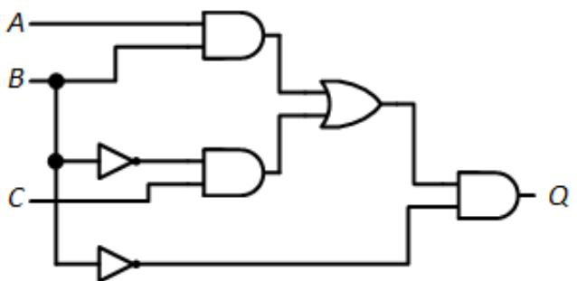

14. Find and resolve all dynamic hazards in the following circuit.

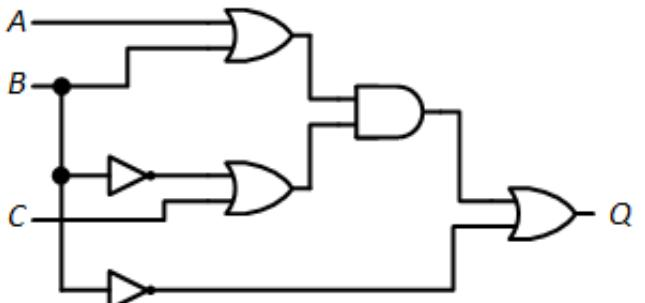

15. Find all non-critical race conditions in the transition table shown in Figure 9.30.

16. Develop the excitation maps for the transition table in Figure 9.34.

17. For the following transition table, identify all race conditions and indicate whether they are critical or non-critical.

| State | 00  | 01  | 11  | 10  |
|-------|-----|-----|-----|-----|
| 00/a  | a,0 | b,1 | d,1 | a,0 |
| 01/b  | c,1 | b,1 | d,1 | a,0 |
| 10/c  | c,1 | d,1 | d,1 | d,0 |
| 11/d  | c,0 | d,1 | d,1 | a,0 |

18. Resolve all critical race conditions in the transition table of the previous problem.

19. For the following circuit, identify all race conditions and indicate whether they are critical or non-critical.

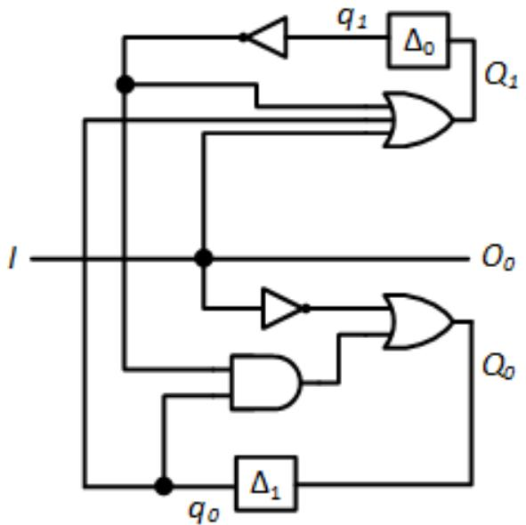

20. Resolve all critical race conditions in the circuit of the previous problem.

21. Redesign the six-state circuit in Section 9.5.3 using the first option for reassigning state values.

22. Redesign the six-state circuit in Section 9.5.3 using the second option for reassigning state values.

23. Design the circuit to complete the six-state circuit design at the end of Section 9.5.3.
