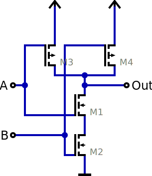
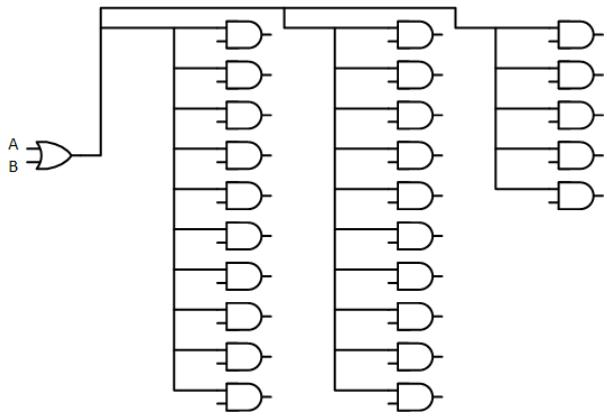
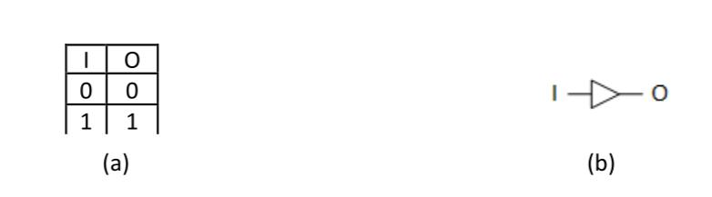
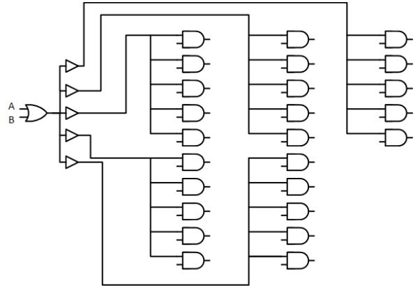
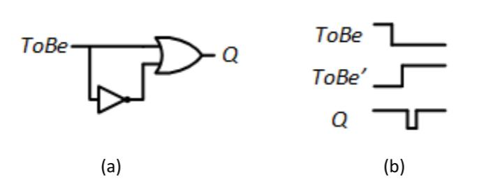

# Chapter 4: Beyond the Logic

> In theory, practice and theory are the same. In practice they are not.

This somewhat famous quote has been attributed to a number of people, including Albert Einstein, Richard Feynman, and Yogi Berra. Here, this quote is applicable to digital logic design. Just because some function is theoretically possible doesn't mean that it can be implemented directly as shown in a Boolean equation. In the real world, there are limitations imposed by constraints such as the amount of current a logic gate can output. Logic gates are quite fast, but not instantaneous. They do take some small amount of time to output their results.

In this section, we will examine some of these constraints: fan-in, fan-out, and propagation delays. We will also introduce the buffer, a component that performs no logical function but is used to overcome constraints in certain cases.

## CMOS Logic Family

It is apparent from the prior discussion of operating conditions that digital circuits need to have comparable input and output specifications in order to successfully communicate with each other. If a transmitter outputs a logic HIGH as $+3.4\mathsf{v}$ and the receiver needs a logic HIGH to be above $+4\upnu$ to be successfully interpreted as a logic HIGH, then these two circuits will not be able to communicate. In order to address this interoperability issue, digital circuits are grouped into logic families. A logic family is a group of parts that all adhere to a common set of specifications so that they work together. The logic family is given a specific name, and once the specifications are agreed upon, different manufacturers produce parts that work within the particular family. Within a logic family, parts will all have the same power supply requirements and DC input/output specifications such that if connected directly, they will be able to successfully communicate with each other. The phrase “connected directly” is emphasized because it is very possible to insert an interconnect circuit between two circuits within the same logic family and alter the output voltage enough so that the receiver will not be able to interpret the correct logic level. Analyzing the effect of the interconnect circuit is part of the digital design process. There are many logic families that exist (up to 100 different types!), and more emerge each year as improvements are made to circuit fabrication processes that create smaller, faster, and lower power circuits.

# 3.3.1 Complementary Metal-Oxide Semiconductors (CMOS)

The first group of logic families we will discuss is called complementary metal-oxide semiconductors, or CMOS. This is currently the most popular group of logic families for digital circuits implemented on the same integrated circuit (IC). An integrated circuit is where the entire circuit is implemented on a single piece of semiconductor material (or chip). The IC can contain transistors, resistors, capacitors, inductors, wires, and insulators. Modern integrated circuits can contain billions of devices and meters of interconnect. The opposite of implementing the circuit on an integrated circuit is to use discrete components. Using discrete components refers to where every device (transistor, resistor, etc.) is its own part and is wired together externally using either a printed circuit board (PCB) or jumper wires as on a breadboard. The line between ICs and discrete parts has blurred in the past decades because modern discrete parts are actually fabricated as an IC and regularly contain multiple devices (e.g., four logic gates per chip). Regardless, the term discrete is still used to describe components that only contain a few components where the term IC typically refers to a much larger system that is custom designed.

The term CMOS comes from the use of particular types of transistors to implement the digital circuits. The transistors are created using a metal-oxide semiconductor (MOS) structure. These transistors are turned on or off based on an electric field, so they are given the name metal-oxide semiconductor field-effect transistors, or MOSFETs. There are two transistors that can be built using this approach that operate complementary to each other, thus the term complementary metal-oxide semiconductors. To understand the basic operation of CMOS logic, we begin by treating the MOSFETs as ideal switches. This allows us to understand the basic functionality without diving into the detailed electronic analysis of the transistors.

# 3.3.1.1 CMOS Operation

In CMOS, there is a single power supply $(\mathsf{V}_{\mathsf{C C}}\mathsf{o r}\mathsf{V}_{\mathsf{D D}})$ and a single ground (GND). The ground signal is sometimes called $\mathsf{V}_{\mathsf{S}\mathsf{S}}$ . The maximum input and output DC specifications are equal to the power supply $(\mathsf{V}_{\mathsf{C C}}=\mathsf{V}_{\mathsf{O H-m a x}}=\mathsf{V}_{\mathsf{I H-m a x}})$ . The minimum input and output DC specification are equal to ground $(\mathsf{G N D}=0\mathsf{v}=\mathsf{V}_{\mathsf{O L-m i n}}=\mathsf{V}_{\mathsf{I L-m i n}})$ . In this way, using CMOS simplifies many of the specifications. If you state that you are using “CMOS with a $+3.4\mathsf{v}$ power supply,” you are inherently stating that $\mathsf{V}_{\mathsf{C C}}=\mathsf{V}_{\mathsf{O H-m a x}}=\mathsf{V}_{\mathsf{I H-m a x}}=+3.4\mathsf{v}$ and that $V_{\mathrm{OL-min}}=V_{\mathrm{1L-min}}=0v.$ . Many times, the name of the logic family will be associated with the power supply voltage. For example, a logic family may go by the name $^{\mathfrak{a}}+3.3\mathfrak{v}$ CMOS” or $^{\mathfrak{a}}+2.5\mathfrak{v}$ CMOS.” These names give a first-level description of the logic family operation, but more details about the operation must be looked up in the data sheet.

There are two types of transistors used in CMOS. The transistors will be closed or open based on an input logic level. The first transistor is called an N-type MOSFET, or NMOS. This transistor will turn on, or close, when the voltage between the gate and source $(\mathsf{V}_{\mathsf{G S}})$ is greater than its threshold voltage. The threshold voltage $(\mathsf{V}_{\top})$ is the amount of voltage needed to create a conduction path between the drain and the source terminals. The threshold voltage of an NMOS transistor is typically between 0.2v and 1v and much less than the $\mathsf{V}_{\mathsf{C C}}$ voltage in the system. The second transistor is called a P-type MOSFET, or PMOS. This transistor turns on, or closes, when the voltage between the gate and the source $(\mathsf{V}_{\mathsf{G S}})$ is less than $\mathsf{V}_{\mathsf{T}},$ where the $\mathsf{V}_{\mathsf{T}}$ for a PMOS is a negative value. This means that to turn on a PMOS transistor, the gate terminal needs to be at a lower voltage than the source. The type of transistor (i.e., P-type or N-type) has to do with the type of semiconductor material used to conduct current through the transistor. An NMOS transistor uses negative charge to conduct current (i.e., negative-type), while a PMOS uses positive charge (i.e., positive-type). Figure 3.21 shows the symbols for the PMOS and NMOS, the fabrication cross sections, and their switch-level equivalents.

Fig. 3.21 CMOS transistors

The basic operation of CMOS is that when driving a logic HIGH, the switches are used to connect the output to the power supply $(\mathsf{V}_{\mathsf{C C}})$ , and when driving a logic LOW, the switches are used to connect the output to GND. In CMOS, $\mathsf{V}_{\mathsf{C C}}$ is considered an ideal logic HIGH and GND is considered an ideal logic

LOW. $\mathsf{V}_{\mathsf{C C}}$ is typically much larger than $\mathsf{V}_{\mathsf{T}}\mathsf{s o}$ using these levels can easily turn on and off the transistors. The design of the circuit must never connect the output to $\mathsf{V}_{\mathsf{C C}}$ and GND at the same time or else the device itself will be damaged due to the current flowing directly from $\mathsf{V}_{\mathsf{C C}}$ to GND through the transistors. Due to the device physics of the MOSFETS, PMOS transistors are used to form the network that will connect the output to $\mathsf{V}_{\mathsf{C C}}$ (aka, the pull-up network), and NMOS transistors are used to form the network that will connect the output to GND (aka, the pull-down network). Since PMOS transistors are closed when the input is a 0 (thus providing a logic HIGH on the output) and NMOS transistors are closed when the input is a 1 (thus providing a logic LOW on the output), CMOS implements negative logic gates. This means CMOS can implement inverters, NAND and NOR gates, but not buffers, AND and OR gates, directly. In order to create a CMOS AND gate, the circuit would implement a NAND gate followed by an inverter and similarly for an OR gate and buffer.

# 3.3.1.2 CMOS Inverter

Let’s now look at how we can use these transistors to create a CMOS inverter. Consider the transistor arrangement shown in Fig. 3.22.

Fig. 3.22 CMOS inverter schematic

The inputs of both the PMOS and NMOS are connected together. The PMOS is used to connect the output to $\mathsf{V}_{\mathsf{C C}}$ , and the NMOS is used to connect the output to GND. Since the inputs are connected together and the switches operate in a complementary manner, this circuit ensures that both transistors will never be on at the same time. When $\mathsf{I n}=0$ , the PMOS switch is closed and the NMOS switch is open. This connects the output directly to $\mathsf{V}_{\mathsf{C C}}$ , thus providing a logic HIGH on the output. When $\ln{}=1$ , the PMOS switch is open and the NMOS switch is closed. This connects the output directly to GND, thus providing a logic LOW. This configuration yields an inverter. This operation is shown graphically in Fig. 3.23.

Fig. 3.23 CMOS inverter operation

# 3.3.1.3 CMOS NAND Gate

Let’s now look at how we use a similar arrangement of transistors to implement a 2-input NAND gate. Consider the transistor configuration shown in Fig. 3.24.

Fig. 3.24 CMOS 2-input NAND gate schematic

The pull-down network consists of two NMOS transistors in series (M1 and M2), and the pull-up network consists of two PMOS transistors in parallel (M3 and M4). Let’s go through each of the input conditions and examine which transistors are on and which are off and how they impact the output. The first input condition is when $\mathsf{A}=0$ and $\mathsf{B}=0$ . This condition turns on both M3 and M4 creating two parallel paths between the output and $\mathsf{V}_{\mathsf{C C}}$ . At the same time, it turns off both M1 and M2 preventing a path between the output and GND. This input condition results in an output that is connected to $\mathsf{V}_{\mathsf{C C}}$ resulting in a logic HIGH. The second input condition is when $\mathsf{A}=0$ and $\mathsf{B}=1$ . This condition turns on M3 in the pull-up network and M2 in the pull-down network. This condition also turns off M4 in the pull-up network and M1 in the pull-down network. Since the pull-up network is a parallel combination of PMOS transistors, there is still a path between the output and $\mathsf{V}_{\mathsf{C C}}$ through M3. Since the pull-down network is a series combination of NMOS transistors, both M1 and M2 must be on in order to connect the output to GND. This input condition results in an output that is connected to $\mathsf{V}_{\mathsf{C C}}$ resulting in a logic HIGH. The third input condition is when $\mathsf{A}=1$ and $\mathsf{B}=0$ . This condition again provides a path between the output and $\mathsf{V}_{\mathsf{C C}}$ through M4 and prevents a path between the output and ground by having M2 open. This input condition results in an output that is connected to $\mathsf{V}_{\mathsf{C C}}$ resulting in a logic HIGH. The final input condition is when $\mathsf{A}=1$ and $\mathsf{B}=1$ . In this input condition, both of the PMOS transistors in the pull-up network (M3 and M4) are off preventing the output from being connected to $\mathsf{V}_{\mathsf{C C}}$ . At the same time, this input turns on both M1 and M2 in the pull-down network connecting the output to GND. This input condition results in an output that is connected to GND resulting in a logic LOW. Based on the resulting output values corresponding to the four input codes, this circuit yields the logic operation of a 2-input NAND gate. This operation is shown graphically in Fig. 3.25.

Creating a CMOS NAND gate with more than two inputs is accomplished by adding additional PMOS transistors to the pull-up network in parallel and additional NMOS transistors to the pull-down network in series. Figure 3.26 shows the schematic for a 3-input NAND gate. This procedure is followed for creating NAND gates with larger numbers of inputs.

Fig. 3.26 CMOS 3-input NAND gate schematic

If the CMOS transistors were ideal switches, the approach of increasing the number of inputs could be continued indefinitely. In reality, the transistors are not ideal switches, and there is a limit on how many transistors can be added in series and continue to operate. The limitation has to do with ensuring that each transistor has enough voltage to properly turn on or off. This is a factor in the series network because the drain terminals of the NMOS transistors are not all connected to GND. If a voltage develops across one of the lower transistors (e.g., M3), then it takes more voltage on the input to turn on the next transistor up (e.g., M2). If too many transistors are added in series, then the uppermost transistor in the series may not be able to be turned on or off by the input signals. The number of inputs that a logic gate can have within a particular logic family is called its fan-in specification. When a logic circuit requires a number of inputs that exceed the fan-in specification for a particular logic family, then additional logic gates must be used. For example, if a circuit requires a 5-input NAND gate but the logic family has a fan-in specification of 4, this means that the largest NAND gate available only has 4-inputs. The 5-input NAND operation must be accomplished using additional circuit design techniques that use gates with 4 or less inputs. These design techniques will be covered in Chap. 4.

# 3.3.1.4 CMOS NOR Gate

A CMOS NOR gate is created using a similar topology as a NAND gate with the exception that the pull-up network consists of PMOS transistors in series and the pull-down network that consists of NMOS transistors in parallel. Consider the transistor configuration shown in Fig. 3.27.

Fig. 3.27 CMOS 2-input NOR gate schematic

The series configuration of the pull-up network will only connect the output to $\mathsf{V}_{\mathsf{C C}}$ when both inputs are 0. Conversely, the pull-down network prevents connecting the output to GND when both inputs are 0. When either or both of the inputs are true, the pull-up network is off, and the pull-down network is on. This yields the logic function for a NOR gate. This operation is shown graphically in Fig. 3.28. As with the NAND gate, the number of inputs can be increased by adding more PMOS transistors in series in the pull-up network and more NMOS transistors in parallel in the pull-down network.

The schematic for a 3-input NOR gate is given in Fig. 3.29. This approach can be used to increase the number of inputs up until the fan-in specification of the logic family is reached.

Fig. 3.29 CMOS 3-input NOR gate schematic

## 3.4.1 Fan-in

The fan-in of a logic gate is the maximum number of inputs it can support. If you are using TTL or CMOS chips, this has already been decided for you. The chip has some logic gates built into it, and each gate has a fixed number of inputs. When creating new designs, such as a new chip however, this may not be the case.

Consider, for example, an AND function that has 25 inputs. In theory, you could realize that function using a single 25-input AND gate, as shown in Figure 3.15 (a). In practice, however, your AND gate technology may have a fan-in of a much lower number, and you would have to find another way to implement this function.

Figure 3.15: A 25-input AND function: (a) Using a single AND gate; (b) Using multiple gates with a maximum fan-in of 5.

To realize this function, let's assume that your AND gates have a maximum fan-in of five. We could then divide our 25 inputs into five groups of five inputs each. Each group of five inputs could be input to a 5-input AND gate. The output of each gate would be 1 only when its five inputs are 1. Then, the output of each of these AND gates would be input to another 5input AND gate. The output of this gate would only be 1 when its five inputs are 1, which only occurs when all 25 inputs to the other AND gates are 1. This circuit is shown in Figure 3.15 (b).

### 3.4.2 Fan-out

Fan-out is comparable to fan-in, but on the other side of a logic gate. Succinctly put, the fan-out of a logic gate is the maximum number of inputs of other gates it can be connected to. The gate has a limit on how much current it can output. When it sends its output to more than one other component's input, this current is split up among those components. When the current becomes too small, these components may not recognize the input value correctly. A typical TTL component has a fan-out of around 5; it can send its output to up to five other component inputs.

Consider the circuit shown in Figure 3.16. The OR gate sends its output to 25 different AND gates. Although the logic may be correct in theory, in practice this will not work. The maximum fan-out of the OR gate is much less than the number used in this circuit.

Figure 3.16: A digital circuit that does not meet fan-out requirements.

Now let's look at a way to get around fan-out limitations.

### 3.4.3 Buffers

To boost the output signal, engineers developed a component called a **buffer**. It inputs a signal at a given logic value and outputs a signal at the same logic value. In terms of Boolean logic, a buffer looks like the most useless component imaginable. All it does is output whatever is input to it. A wire would perform the same logical function. Yet, it was invented and is commonly used in digital circuits. Its truth table and logic symbol are shown in Figure 3.17.

Figure 3.17: Buffer logic symbol and truth table.

Although its logic output has the same logical value as its input, there is an important difference. Its output current is at its maximum value, whereas the input current may be lower if the logic gate that supplies the input also sends it to other components.

To illustrate this, consider the 25-input AND gate in Figure 3.16. We can use buffers to realize this function while still meeting fan-out requirements. One way to do this is shown in Figure 3.18. Here, the OR gate sends its output to five buffers. Each buffer, in turn, sends its output to five AND gates. Since no component sends its output to more than five other inputs, this circuit meets fan-out requirements, assuming each component has a maximum fan-out of at least five.

Figure 3.18: Digital circuit that meets fan-out requirements.

### 3.4.4 Propagation Delay

Prior to this section, we have been looking at logic gates in an idealized way. When we change the inputs to a logic circuit, the outputs change to their new values instantaneously. In practice, however, this is not the case. There is a very small, but non-zero amount of time needed for a gate to change its output from 0 to 1 or from 1 to 0. This is called the **propagation delay**. In many circuits, this delay is quite tolerable. Even with the propagation delay, the circuit functions as desired. In some cases, however, this can cause problems.

Consider, for example, the circuit shown in Figure 3.19 (a). When $ToBe = 1$, the output should be 1 because the upper input to the OR gate is 1. When it is 0, the output of the inverter is 1, so the OR gate should again output a value of 1. In theory, $Q$ should always be 1, as shown in the truth table in Figure 3.19 (b).

Figure 3.19: $ToBe + ToBe'$: (a) Circuit diagram; (b) Truth table.

Now let's look at a more practical example, the same circuit with non-zero propagation delays. For simplicity, assume that the NOT gate has a propagation delay of 5 nanoseconds (ns), that is, it may not generate the correct value until 5 ns after the input changes. Also assume the OR gate has a propagation delay of 8 ns. As shown in the timing diagram in Figure 3.20, when $ToBe$ changes from 1 to 0, it may take 5 ns for the output of the NOT gate to change from 0 to 1. During this time, both inputs to the OR gate will be 0, causing it to output a value of 0. As with the NOT gate, this output is also delayed, this time by 8 ns. After an additional 5 ns, the OR gate has adjusted its output value based on the new value of $ToBe'$. This entire sequence is illustrated in the animation of the circuit and timing diagram in Figure 3.20.

Figure 3.20: $ToBe + ToBe'$: (a) Circuit diagram; (b) Timing diagram with propagation delays.

Finally, there's one other thing to consider. The delays within a gate may or may not be symmetric. That is, the propagation delay when an output changes from 0 to 1 may not be the same as when the output changes from 1 to 0. For TTL and CMOS chips, you can refer to the chip's datasheet to find these values, denoted as $tPLH$ (0 to 1) and $tPHL$ (1 to 0).
