# Chapter 2: Boolean Algebra

In the previous chapter, we introduced binary numbers, the base 2 number system. Consisting solely of two digits, 0 and 1, we examined them strictly as they represent numeric values. There is, however, another way to work with binary values, using them to represent logical values rather than numeric values. Here, 1 and 0 can be thought of as TRUE and FALSE. The digital circuits we will introduce and design throughout this book are based on this logical interpretation of binary values.

There is an entire branch of mathematics that focuses on binary values and the logical operations we can perform on them. It is called **Boolean algebra**, named after the English mathematician George Boole. Boolean algebra is the theoretical foundation upon which digital logic design is built. In this chapter, we'll introduce the basics of Boolean algebra and how we can use it to model real-world situations.

First, we introduce the fundamental operations of Boolean algebra and the basic postulates of this algebra. Then we will examine how to combine these operations to specify **functions**, which we will use to model the behavior of real-world actions or the desired behavior of a digital system. Truth tables are a convenient mechanism used to specify the function values for all possible Boolean input values. We'll also look at how to express functions based on truth table values, minterms, and maxterms.

Finally, we'll look at ways to analyze and simplify functions. Karnaugh maps are a graphical method used for this purpose. They make use of the Gray code we introduced in the previous chapter. We'll show why we need to use this code during our discussion of the topic. Karnaugh maps work well when you have up to four inputs. Beyond that, due to the human inability to see beyond three dimensions at any given time, they aren't very useful. We'll introduce another method, the Quine-McCluskey algorithm, which can be used to simplify functions with larger numbers of inputs. Finally, we'll look at incompletely specified functions. For these functions, sometimes we don't care what the output is for certain combinations of input values. We'll look at how to take advantage of this to simplify functions as much as possible.

## 2.1 Boolean Algebra

Before we can study digital logic design, we need to introduce the fundamentals of Boolean algebra. The most fundamental digital logic components implement basic Boolean operations, and more complex Boolean functions translate directly to digital logic designs.

First, I'll start by noting that, mathematically speaking, there are really many different Boolean algebras, an infinite number of them to be precise. Each of these Boolean algebras has a different number of distinct elements (think of these as digits). Each has $2^n$ digits, where $n$ is an integer and $n >=1$. Fortunately for us, we are concerned only with the Boolean algebra for which $n=1$, which has $2^1 =2$ digits, which we denote as 0 and 1. This is also referred to as a **switching algebra**.

We'll introduce Boolean algebra as follows. In the next subsection, we present the basic operations of Boolean algebra. We'll also introduce **truth tables**, a mechanism we will use throughout this chapter and the rest of this book. The following subsection examines some properties of this Boolean algebra and shows how we know they are correct.

### 2.1.1 Boolean Algebra Fundamentals

The fundamental components of any algebra are its symbol set and its operations. We have already seen the symbol set for this Boolean algebra, \{0, 1\}. Every Boolean variable takes on one of these two values.

With that out of the way, let's look at the operations that comprise this Boolean algebra. We'll start with the **AND** operation. The AND function takes two or more Boolean input values and generates a single output. The function output is 1 if and only if every input value is 1. If one or more inputs is 0, the function output is 0. Symbolically, we represent the AND function using the dot $(\cdot)$ or $\land$ symbol, or by simply concatenating the inputs that are ANDed by the function. For example, if we want to AND Boolean values $a$ and $b$, we could express this function as $a \cdot b$, $a \land b$, or simply $ab$.

The second function is the OR function. This function also has two or more Boolean inputs, but its output is 1 if *any* of its inputs is 1. It is only 0 when all its inputs are 0. It is denoted using the $+$ or $\lor$ symbol; the OR of $a$ and $b$ is expressed as $a + b$ or $a \lor b$.

Finally, there is the NOT function. Unlike the AND and OR functions, this function takes in only one input. Its output is the opposite of the input value. That is, when the input is 0, the output is 1, and when the input is 1 the output is 0. There are several ways to represent the NOT of an input, say $a$, including $a'$, $\neg a$, $!a$, $/a$, and $\underline{a}$.

There are several other functions that can be created using these functions, including the XOR (exclusive OR), NAND, NOR, and XNOR functions. They are not an official part of the specification of this Boolean algebra, but they are commonly used in digital logic design. Digital component designers have developed integrated circuit chips that implement the fundamental AND, OR, and NOT functions, as well as the XOR, NAND, NOR, and XNOR functions. We'll see more about this in Chapter 3.

### 2.1.2 Truth Tables

A truth table is a convenient mechanism to specify the output of any Boolean function, from the most fundamental to the most complex, for all possible combinations of input values. To illustrate how this works, consider the truth table for the AND function, shown in Figure 2.1 (a). Since there are two inputs ($a$ and $b$), there are $2^2 = 4$ possible combinations of input values: $a=0$ and $b=0$; $a=0$ and $b=1$; $a=1$ and $b=0$; and $a=1$ and $b=1$. (If we have three inputs, we would have $2^3 = 8$ possible combinations of input values.) In the table, we list these input values on the left side of the vertical line, one combination of inputs per row. On the right side, we list the value of the function for the input values in each row. Here, the function is only 1 in the last row, where all inputs are 1. Figures 2.1 (b) and 2.1 (c) show the truth tables for the OR and NOT functions.

|(a)$a$ | $b$ | AND | (b)$a$ | $b$ | OR | (c)$a$ | NOT |
|-----|-----|-----|-----|-----|-----|-----|-----|
| 0   | 0   | 0   | 0   | 0   | 0   | 1   | 0   |
| 0   | 1   | 0   | 0   | 1   | 1   | 0   | 1   |
| 1   | 0   | 0   | 1   | 0   | 1   |     |     |
| 1   | 1   | 1   | 1   | 1   | 1   |     |     |

Figure 2.1: Truth tables for the functions (a) AND, (b) OR, and (c) NOT.

Truth tables are a nice way to show how these fundamental functions work, but they are most useful when used to specify the behavior of more complex functions. We'll see how this works later in this chapter.

### 2.1.3 Boolean Algebra Properties

Mathematically speaking, an algebra is a theory encompassing a set of elements and a set of operations performed on those elements. For our Boolean algebra, we have seen that the set of elements is \{0, 1\} and the set of operations is \{AND, OR, NOT\}. An algebra must also have a set of **axioms** (also called **postulates**) that are essentially the most basic rules or properties of the algebra.

American mathematician **Edward Huntington** proposed a set of axioms for our Boolean algebra, collectively called **Huntington's postulates**. In addition, other axioms have been proposed that are true for this Boolean algebra, but are not an official component of the definition of the algebra. Some of Huntington's postulates are solely for mathematical completeness. Others can directly impact the design of digital logic circuits.

The remainder of this section will introduce these postulates and show how they are true for this Boolean algebra. We'll start with Huntington's postulates.

#### Closure

Closure means that for any fundamental function, if all the function inputs are in the algebra's set of elements, then the function's outputs are also in this set of elements. We can see this is true by looking at the truth tables in Figure 2.1. For each truth table, all possible combinations of input values are listed, and each function output is always equal to either 0 or 1.

#### Identity Elements

For each function with more than one input, there is an element that causes the output of the function to be the same as the other input. Note that the identity element does not have to be the same for each function. Different functions can have different identity elements.

For our Boolean algebra, we have two functions that need identity elements, AND and OR. We'll look at them individually, and once again we'll use truth tables to justify this postulate. Starting with the AND function, it is straightforward to show that 1 is the identity element for this function. Figure 2.2 (a) shows the truth table for this function, with $a$ as the input and $a \cdot 1$ as the function output. Clearly, $a \cdot 1 = a$.

| (a)$a$ | $a \cdot 1$    | (b)$a$ | $a + 0$    |
|---|--------------|---|--------------|
| $0$ | $0 \cdot 1 = 0$ | $0$ | $0 + 0 = 0$ |
| $1$ | $1 \cdot 1 = 1$ | $1$ | $1 + 0 = 1$ |

Figure 2.2: Truth tables showing the identity elements for the (a) AND, and (b) OR functions.

Using this same approach, we can see that 0 is the identity element for the OR operation. This is shown in Figure 2.2 (b).

#### Commutativity

This is a fancy way of saying that the order of the inputs does not matter. For this algebra, this means that $a \cdot b$ = $b \cdot a$, and $a + b$ = $b + a$. As before, we use truth tables to verify that this Boolean algebra has this property, as shown in Figure 2.3.

|(a) $a$ | $b$ | $a \cdot b$ | $b \cdot a$ | (b) $a$ | $b$ | $a + b$ | $b + a$ |
|---|---|----------|----------|---|---|-------|-------|
| 0 | 0 | 0        | 0        | 0 | 0 | 0     | 0     |
| 0 | 1 | 0        | 0        | 0 | 1 | 1     | 1     |
| 1 | 0 | 0        | 0        | 1 | 0 | 1     | 1     |
| 1 | 1 | 1        | 1        | 1 | 1 | 1     | 1     |

Figure 2.3: Truth tables verifying the commutativity of the (a) AND, and (b) OR functions.

Note that this property does not necessarily apply to all operations in all algebras. In traditional algebra, basic arithmetic, addition and multiplication are commutative but subtraction and division are not. For example $5-3 \ne 3-5$ and $6 \div 2 \ne 2 \div 6$.

#### Distributivity

The distributive property uses both 2-operand functions, with each being distributed over the other. The property for the distribution of the AND function over the OR function can be expressed as

$$
a \cdot (b + c) = (a \cdot b) + (a \cdot c)
$$

Again using a truth table, we can verify this property is true for the distribution of AND over OR. This table is shown in Figure 2.4.

| $a$ | $b$ | $c$ | $b + c$ | $a \cdot (b+ c)$ | $a \cdot b$ | $a \cdot c$ | $(a \cdot b)+ (a \cdot c)$ |
|---|---|---|----------|-------------------|----------|----------|----------------------------|
| 0 | 0 | 0 | 0        | 0                 | 0        | 0        | 0                          |
| 0 | 0 | 1 | 1        | 0                 | 0        | 0        | 0                          |
| 0 | 1 | 0 | 1        | 0                 | 0        | 0        | 0                          |
| 0 | 1 | 1 | 1        | 0                 | 0        | 0        | 0                          |
| 1 | 0 | 0 | 0        | 0                 | 0        | 0        | 0                          |
| 1 | 0 | 1 | 1        | 1                 | 0        | 1        | 1                          |
| 1 | 1 | 0 | 1        | 1                 | 1        | 0        | 1                          |
| 1 | 1 | 1 | 1        | 1                 | 1        | 1        | 1                          |

Figure 2.4: Truth table verifying the distributive property of AND over OR.

The distribution of OR over AND can be expressed as

$$
a + (b \cdot c) = (a + b) \cdot (a + c)
$$

| $a$ | $b$ | $c$ | $b \cdot c$ | $a + (b \cdot c)$ | $a + b$ | $a + c$ | $(a + b) \cdot (a + c)$ |
|---|---|---|----------|-------------------|----------|----------|----------------------------|
| 0 | 0 | 0 | 0        | 0                 | 0        | 0        | 0                          |
| 0 | 0 | 1 | 0        | 0                 | 0        | 1        | 0                          |
| 0 | 1 | 0 | 0        | 0                 | 1        | 0        | 0                          |
| 0 | 1 | 1 | 1        | 1                 | 1        | 1        | 1                          |
| 1 | 0 | 0 | 0        | 1                 | 1        | 1        | 1                          |
| 1 | 0 | 1 | 0        | 1                 | 1        | 1        | 1                          |
| 1 | 1 | 0 | 0        | 1                 | 1        | 1        | 1                          |
| 1 | 1 | 1 | 1        | 1                 | 1        | 1        | 1                          |

The truth table in Figure 2.5 verifies this property.

Figure 2.5: Truth table verifying the distributive property of OR over AND.

#### Inverse

Each element in the algebra has an inverse such that $a \cdot a' = 0$ and $a + a' = 1$. The truth tables in Figure 2.6 show that this is the case for our Boolean algebra.

| (a)$a$  | $a'$     | $a \cdot a'$  | (b)$a$    | $a'$ | $a + a'$ |
|----|-------|----|-----------| ---- | ---- |
| 0  | 1  | $ 0 \cdot 1 = 0$ | 0 | 1 |  $0 + 1 = 1$ |
| 1  | 0 | $1 \cdot 0 = 0$   | 1  | 0 | $1 + 0 = 1$ |

Figure 2.6: Truth table verifying the inverse property for the (a) AND, and (b) OR functions.

#### Distinct Elements

Huntington's postulates specify that the algebra must have at least two distinct elements. This was added just to exclude the trivial case of a Boolean algebra with $2^0 = 1$ element. Our Boolean algebra has two elements, 0 and 1, and thus meets this requirement.

Beyond Huntington's postulates, there are several other axioms that are true for this Boolean algebra. As with Huntington's postulates, some are used widely to minimize functions and the digital logic needed to implement them.

#### Idempotence

When a function takes one value for both its inputs, the value of the function is equal to the value of the input. Mathematically, this means $a \cdot a = a$, and $a + a = a$ for this algebra. Figure 2.7 shows the truth tables that verify this property.

| (a)$a$ | $a \cdot a$ | (b)$a$ | $a + a$ |
|---|--------------|---|-----------|
| 0 | $0 \cdot 0 = 0$ | 0 | $0 + 0 = 0$ |
| 1 | $1 \cdot 1 = 1$ | 1 | $1 + 1 = 1$ |

Figure 2.7: Truth table verifying the idempotence property for the (a) AND, and (b) OR functions.

#### Involution

The inverse of the inverse of an element is the same as the element. You can think of this as a double negative bringing you back to the original value. The truth table in Figure 2.8 verifies that this property is true for this algebra.

| $a$ | $a'$ | $\{a'\}'$ |
|---|---|---|
| 0 | 1 | $1' = 0$ |
| 1 | 0 | $0' = 1$ |

Figure 2.8: True table verifying the involution property

#### Absorption

This property has direct use in minimizing functions and digital logic. It has two forms.

$$
\begin{aligned}
a + (a \cdot b) &= a \\
a \cdot (a + b) &= a
\end{aligned}
$$

The truth tables in Figure 2.9 verify both forms of this property.

|(a)$a$ | $b$ | $a \cdot b$ | $a + (a \cdot b)$ | (b)$a$ | $b$ | $a + b$ | $a \cdot (a + b)$ |
|---|---|---| ---  | --- | --- | --- | --- |
| 0 | 0 | 0 | 0 | 0 | 0 | 0 | 0 |
| 0 | 1 | 0 | 0 | 0 | 1 | 1 | 0 |
| 1 | 0 | 0 | 1 | 1 | 0 | 1 | 1 |
| 1 | 1 | 1 | 1 | 1 | 1 | 1 | 1 |

Figure 2.9: Truth table verifying both forms of absorption.

#### Associativity

When you have only one type of operation occurring in a function, the order in which you perform them does not change the value of the function. Specifically,

$$
\begin{aligned}
(a \cdot b) \cdot c &= a \cdot (b \cdot c) \\
(a + b) + c &= a + (b + c)
\end{aligned}
$$

Although Huntington did not include this in his postulates for Boolean algebras, it is indeed true. Figure 2.10 shows the truth table for the AND function and Figure 2.11 shows the truth table for the OR function.

| $a$ | $b$ | $c$ | $a \cdot b$ | $(a \cdot b) \cdot c$ | $b \cdot c$ | $a \cdot (b \cdot c)$ |
|---|---|---|----------|-------------------|----------|-------------------|
| 0 | 0 | 0 | 0        | 0                 | 0        | 0                 |
| 0 | 0 | 1 | 0        | 0                 | 0        | 0                 |
| 0 | 1 | 0 | 0        | 0                 | 0        | 0                 |
| 0 | 1 | 1 | 0        | 0                 | 1        | 0                 |
| 1 | 0 | 0 | 0        | 0                 | 0        | 0                 |
| 1 | 0 | 1 | 0        | 0                 | 0        | 0                 |
| 1 | 1 | 0 | 1        | 0                 | 0        | 0                 |
| 1 | 1 | 1 | 1        | 1                 | 1        | 1                 |

Figure 2.10: Truth table showing the associative property for the AND function.

| $a$ | $b$ | $c$ | $a+ b$ | $(a + b) + c$ | $b + c$ | $a + (b + c)$ |
|---|---|---|----------|-------------|-------|-------------|
| 0 | 0 | 0 | 0        | 0           | 0     | 0           |
| 0 | 0 | 1 | 0        | 1           | 1     | 1           |
| 0 | 1 | 0 | 1        | 1           | 1     | 1           |
| 0 | 1 | 1 | 1        | 1           | 1     | 1           |
| 1 | 0 | 0 | 1        | 1           | 0     | 1           |
| 1 | 0 | 1 | 1        | 1           | 1     | 1           |
| 1 | 1 | 0 | 1        | 1           | 1     | 1           |
| 1 | 1 | 1 | 1        | 1           | 1     | 1           |

Figure 2.11: Truth table showing the associative property for the OR function.

#### De Morgan's Laws

Two theorems of logic developed by Augustus De Morgan are fundamental in digital logic design. However, they were not developed for digital circuits, which did not exist when these theorems were first published in 1850. Rather, they were developed as part of De Morgan's efforts as a reformer in the study of logic and propositional calculus. The original theory behind his laws dates to the 14th century. De Morgan's contribution was to develop the logical, mathematical expression of them. In De Morgan's own words, (1851) the theorems are:

1. The negation (or contradictory) of a disjunction is equal to the conjunction of the negative of the alternatives – that is, not(p or q) equals not(p) and not(q), or symbolically $\neg(p \lor q) = \neg p \land \neg q$.

2. The negation of a conjunction is equal to the disjunction of the negation of the original conjuncts – that is, not(p and q) equals not(p) or not(q), or symbolically $\neg(p \land q) = \neg p \lor \neg q$.

To decipher this, it helps to know that a conjunction is the AND function, a disjunction is the OR function, and the negation, contradiction, and ~ symbol are the NOT function.

Well, all of that was quite a mouthful. Fortunately, rewriting the laws in our notation, and using *a* and *b* instead of *p* and *q*, greatly simplifies them. The first law becomes

$$
(a + b)' = a' \cdot b'
$$

Once again, a truth table demonstrates the validity of this law. Figure 2.12 shows the truth table for De Morgan's first law.

| $a$ | $b$ | $a + b$ | $(a+ b)'$ | $a'$ | $b'$ | $a' \cdot b'$ |
|---|---|-------|-------------|----|----|------------|
| 0 | 0 | 0     | 1           | 1  | 1  | 1          |
| 0 | 1 | 1     | 0           | 1  | 0  | 0          |
| 1 | 0 | 1     | 0           | 0  | 1  | 0          |
| 1 | 1 | 1     | 0           | 0  | 0  | 0          |

Figure 2.12: Truth table verifying De Morgan's first law.

The second De Morgan's law can also be expressed simply in our notation.

$$
(a \cdot b)' = a' + b'
$$

Figure 2.13 shows the truth table to verify this law.

| $a$ | $b$ | $a \cdot b$ | $(a \cdot b)'$ | $a'$ | $b'$ | $a' + b'$ |
|---|---|----------|-------------|----|----|------------|
| 0 | 0 | 0        | 1           | 1  | 1  | 1          |
| 0 | 1 | 0        | 1           | 1  | 0  | 1          |
| 1 | 0 | 0        | 1           | 0  | 1  | 1          |
| 1 | 1 | 1        | 0           | 0  | 0  | 0          |

Figure 2.13: Truth table verifying De Morgan's first law

## 2.2 Boolean Functions

The fundamental Boolean operations we introduced in the previous section are just that, fundamental. They are fine for some of the things we want to model, and ultimately design and build circuits to implement. In most cases, however, we want to model more complex operations that may be a combination of these operations. We refer to these as **Boolean functions**.

To illustrate this, envision the following scenario based on one of my favorite sports, baseball. We are entering the last day of the regular season, and my favorite team is leading its division by one game over its dreaded archrival. Each team has one game remaining to be played, not against each other. Figure 2.14 shows one such scenario.

| Team          | W  | L  | GB  |
|---------------|----|----|-----|
| (a) Favorite  | 95 | 66 | --- |
| (b) Archrival | 94 | 67 | 1.0 |

Figure 2.14: Baseball divisional standing entering the final day of the season.

In order to win its division, my favorite team must have a better record than its archrival. To model the possible last-game results, I'll start by creating two Boolean values.

$$
\begin{aligned}
a = \text{My favorite team wins its final game} \\
b = \text{Dreaded archrival wins its final game}
\end{aligned}
$$

Each of these values is 1 if the statement is true, that is, the team wins its final game, and 0 if it is false and the team loses its final game. There are $2^2 = 4$ possible outcomes: both teams lose; my team loses and the archrival team wins; my team wins and the archrival team loses, and; both teams win. Figure 2.15 shows the final standings for all four scenarios.

| (a)Team          | W  | L  | GB  | (b)Team          | W   | L  | GB  | (c)Team          | W  | L  | GB  | (d)Team          | W   | L  | GB  |
|---------------|----|----|-----|---------------|-----|----|-----|---------------|----|----|-----|---------------|-----|----|-----|
| (a) Favorite  | 95 | 67 | --- | (a) Favorite  | 95  | 67 | --- |  (a) Favorite  | 96 | 66 | --- | (a) Favorite  | 96  | 66 | --- |
| (b) Archrival | 94 | 68 | 1.0 | (b) Archrival | 95  | 67 | --- |  (b) Archrival | 94 | 68 | 2.0 | (b) Archrival | 95  | 67 | 1.0 |

Figure 2.15: Final division standings when (a) both teams lose their final game; (b) my favorite team loses and the archrival team wins; (c) my favorite team wins and the archrival team loses; and (d) both teams win.

As we can see from this figure, my team finishes with a better record and wins the division in three of the four scenarios. In the fourth scenario, the two teams are tied and a tiebreaker criterion determines the division winner. For this example, we'll assume the archrival team would win the tiebreaker, so my team would lose the division in this case. (Otherwise my favorite team would win 100% of the time, which would be great for my team but would make for a lousy example.)

Now let's put all this information into one truth table, shown in Figure 2.16. This truth table has two inputs, $a$ and $b$, the two Boolean values we created earlier. It has one output, $W$, that is 1 when my favorite team wins the division and 0 when it does not. The first row, with $a = 0$ and $b = 0$, represents the scenario in which both teams lose their last game. In this case, shown in Figure 2.15 (a), my favorite team wins the division, indicated by a 1 in the $W$ (= my team wins the division) column. The second row has $a = 0$ and $b = 1$, the scenario in which my favorite team loses its last game and the archrival team wins its last game. They both end up with the same record, as shown in Figure 2.15 (b). The archrival team holds the tiebreaker, and they win the division. My favorite team does not win the division, so $W$ is 0. The third row is the case when my favorite team wins its final game ($a = 1$) and their archrival loses its final game ($b = 0$); this is shown in Figure 2.15 (c). Here, my favorite team wins its division, so $W = 1$. The last row, with $a = 1$ and $b = 1$, occurs when both teams win their final game. As shown in Figure 2.15 (d), my team wins the division, so $W = 1$.

| a | b | W |
|---|---|---|
| 0 | 0 | 1 |
| 0 | 1 | 0 |
| 1 | 0 | 1 |
| 1 | 1 | 1 |

Figure 2.16: Truth table for my favorite team winning its division.

Now that we have the truth table, we would next derive a single function for $W$ that will produce the correct value for all possible cases. We'll look at two common methods to do this in the following subsections, along with a discussion of how they are related, followed by a couple of more complex examples.

### 2.2.1 Sum of Products

In the **sum of products** method, we create a product for each row of the truth table. For each product, we have either an input or its complement, for every single input, ANDed together. If a row has a 1 value for an input, we use the original input; if it is 0, we use its complement. By doing this, the product, the AND of these terms, is equal to 1 only for that row's input values.

This is probably a bit confusing, but another truth table may help clear this up. Figure 2.17 (a) shows all four possible ANDed values, $a' \cdot b'$, $a' \cdot b$, $a \cdot b'$, and $a \cdot b$. The first row, with $a = 0$ and $b = 0$, only sets one ANDed term to 1, $a' \cdot b'$. The other terms are also set to 1 for only one combination of values of $a$ and $b$. The value set to 1 is called the **minterm** for these input values. Figure 2.17 (b) shows the minterm for each row.

| (a)$a$ | $b$ | $a' \cdot b'$ | $a' \cdot b$ | $a \cdot b'$ | $a \cdot b$ | (b) $a$ | $b$ | Minterm            |
|---|---|------------|-----------|-----------|----------|------------------------------|--- |--- |
| 0 | 0 | 1          | 0         | 0         | 0        | 0 | 0 | $a' \cdot b'(m_0)$ |
| 0 | 1 | 0          | 1         | 0         | 0        | 0 | 1 | $a' \cdot b(m_1)$ |
| 1 | 0 | 0          | 0         | 1         | 0        | 1 | 0 | $a \cdot b'(m_2)$ |
| 1 | 1 | 0          | 0         | 0         | 1        | 1 | 1 | $a \cdot b(m_3)$ |

Figure 2.17: (a) Values of all minterms for all possible input values; (b) Minterm associated with all possible input values.

Notice the last value in each row of the table in Figure 2.17 (b). One common notation for minterms is to denote each minterm as lowercase $m$ with a subscript. If you read the inputs from left to right as a binary number, and then convert that number to decimal, the decimal value is the subscript of $m$ for that row. That is, when $a = 0$ and $b = 0$, the inputs are 00 in binary, which is 0 in decimal. The minterm for that row is thus $m_0$. Similarly, inputs of 01, 10, and 11 give us minterms $m_1$, $m_2$, and $m_3$, respectively.

So, now we have the products. Where's the sum? The sum is an OR operation. We take every minterm in a row that has the function output ($W$ in this case) equal to 1, and logically OR them together. For this function, the first, third, and fourth rows have $W = 1$. Their minterms are $a' \cdot b'$, $a \cdot b'$, and $a \cdot b$. We can OR these three terms together to get $W = (a' \cdot b') + (a \cdot b') + (a \cdot b)$, or $W = m_0 + m_2 + m_3$.

### 2.2.2 Product of Sums

The **product of sums** method is sort of the opposite of the sum of products method. For each sum, we logically OR together either an input or its complement for every single input. Unlike sum of products, however, we use the original term if it is 0 and its complement if it is 1. As shown in Figure 2.18 (a), this gives us only one sum per row that is equal to 0; the rest are 1.

| (a)$a$   | $b$ | $a + b$ | $a + b'$ | $a'+ b$ | $a'+ b'$ | (b)$a$ | $b$ | Maxterm           |
|-----|---|-------|--------|-----------|------------|---|---|-------------------|
| 0   | 0 | 0     | 1      | 1         | 1          | 0 | 0 | $a + b(M_0)$     |
| 0   | 1 | 1     | 0      | 1         | 1          | 0 | 1 | $a + b'(M_1)$       |
| 1   | 0 | 1     | 1      | 0         | 1          | 1 | 0 | $a' + b(M_2)$ |
| 1   | 1 | 1     | 1      | 1         | 0          | 1 | 1 | $a' + b'(M_3)$   |

Figure 2.18: (a) Values of all maxterms for all possible input values; (b) Maxterm associated with all possible input values.

The sums shown in Figure 2.18 (a) are called **maxterms**. Unlike minterms, which have a value of 1 in only one row, maxterms have a value of 0 in only one row. Furthermore, only one maxterm is 0 in each row. The maxterm with a value of 0 is the maxterm for that row. The maxterms for all rows are shown in Figure 2.18 (b). Just as we used lowercase $m$ for minterms, we use uppercase $M$ with a subscript for maxterms. The subscript for the maxterms is calculated exactly the same as it was calculated for minterms.

Now that we have the sums, we need to combine them to create our final function. We do this by ANDing together the maxterms for all rows that set the function to 0.

For our function, there is only one maxterm that is 0, $a + b'$, or $M_1$. Thus, this becomes our final function, $W = a + b'$. It is straightforward to verify that this function yields the desired truth table shown in Figure 2.16.

### 2.2.3 The Relationship between Minterms and Maxterms

There seems to be a sort of symmetry between minterms and maxterms. When we express a function as a sum of products using minterms, we take all the minterms that set a function to 1 and OR them together. Each minterm *adds* one set of input values that sets the function to 1. In our example, there are three cases that set our output to 1, so there are three minterms that are ORed together to give us our final function, $W = (a' \cdot b') + (a \cdot b') + (a \cdot b)$.

In contrast, we express a function as a product of sums by ANDing together all maxterms that set the function to 0. Each maxterm *removes* one set of input values that sets the function to 0. When all the input values that set the function to 0 are removed, we are left with all the input values that set it to 1. This gives us a different, but equivalent, representation of the function, $W = a + b'$ in this example.

Now look at the truth tables we used to generate the $m$ and $M$ values. In Figure 2.15 (a), we see that each row has exactly one minterm set to 1, whereas Figure 2.18 (a) has exactly one maxterm set to 0. Furthermore, the position of these values is the same in each row. The value of minterm $m_i$ is the opposite of the value of maxterm $M_i$, or $m_i$ = $M'_i$, or $m'_i$ = $M_i$.

We can show this is true by using De Morgan's laws. Consider $m_0 = a' \cdot b'$. Using De Morgan's second law, we know that

$$
m'_0 = (a' \cdot b')' = (a')' + (b')' = a + b = M_0
$$

You can follow the same procedure to show that this is true for all minterms and maxterms.

We could have gone in the other direction as well, showing that $M_i = m'_i$, or $M'_i = m_i$. Again looking at $M_0 = a + b$, we use De Morgan's first law to show that

$$
M'_0 = (a+b)' = a' \cdot b' = m_0
$$

Finally, we can look at the two equations generated using minterms and maxterms to see another relationship. If we use our $m$ and $M$ terms, we have expressed our function $W$ as

$$
\begin{aligned}
W &= m_0 + m_2 + m_3 \\
&= M_1
\end{aligned}
$$

For each subscript value, we use its minterm if it yields a value of 1 for the function, or its maxterm if it generates a value of 0. Each index is included in exactly one of the two equations.

### 2.2.4 Additional Examples

In this subsection, we'll go through a couple of more complex examples. First, we'll start off with the function *q* = *a*'*bc*' + *ac*. This function has three inputs, *a*, *b*, and *c*, so its truth table has 23=8 rows. Figure 2.19 shows the truth table for this function and its minterms. To calculate the value of function *q*, we simply plugged in the values of *a*, *b*, and *c* into the equation for each row.

| a | b | c | q | Minterm   |
|---|---|---|---|-----------|
| 0 | 0 | 0 | 0 | $a'b'c'\ m_0$ |
| 0 | 0 | 1 | 0 | $a'b'c\ m_1$ |
| 0 | 1 | 0 | 1 | $a'bc'\ m_2$ |
| 0 | 1 | 1 | 0 | $a'bc\ m_3$ |
| 1 | 0 | 0 | 0 | $ab'c'\ m_4$ |
| 1 | 0 | 1 | 1 | $ab'c\ m_5$ |
| 1 | 1 | 0 | 0 | $abc'\ m_6$ |
| 1 | 1 | 1 | 1 | $abc\ m_7$ |

Figure 2.19: Truth table for $q = a'bc' + ac$ with minterms shown.

Looking at the table, we can reconstruct the equation as $q = m_2 + m_5 + m_7$, or $q = a'bc' + ab'c + abc$. This is different from, but equivalent to, our initial equation. In the next section, we'll look at ways to simplify our equations as much as possible.

Now let's do this again, but using maxterms instead of minterms. We have reconstructed the truth table in Figure 2.20, this time showing the maxterm for each row.

| a | b | c | q | Maxterm     |
|---|---|---|---|-------------|
| 0 | 0 | 0 | 0 | $a+b+c\ M_0$    |
| 0 | 0 | 1 | 0 | $a+b+c'\ M_1$   |
| 0 | 1 | 0 | 1 | $a+b'+c\ M_2$   |
| 0 | 1 | 1 | 0 | $a+b'+c'\ M_3$  |
| 1 | 0 | 0 | 0 | $a'+b+c\ M_4$   |
| 1 | 0 | 1 | 1 | $a'+b+c'\ M_5$  |
| 1 | 1 | 0 | 0 | $a'+b'+c\ M_6$  |
| 1 | 1 | 1 | 1 | $a'+b'+c'\ M_7$ |

Figure 2.20: Truth table for $q = a'bc' + ac$ with maxterms shown.

ANDing together the maxterms for rows with $q = 0$ gives us the equation

$$
\begin{aligned}
q &= M_0 \cdot M_1 \cdot M_3 \cdot M_4 \cdot M_5 \\
&= (a + b + c) \cdot (a + b + c') \cdot (a + b' + c') \cdot (a' + b + c) \cdot (a' + b' + c)
\end{aligned}
$$

Here is one final example to conclude this section. Instead of starting with an equation, we are given a truth table and must develop the sum of products and product of sums equations for this function. The truth table for this example is given in Figure 2.21. To simplify our work, the minterms and maxterms are also shown.

| a | b | c | q | Minterm   | Maxterm     |
|---|---|---|---|-----------|-------------|
| 0 | 0 | 0 | 0 | $a'b'c'\ m_0$ | $a+b+c\ M_0$    |
| 0 | 0 | 1 | 1 | $a'b'c\ m_1$  | $a+b+c'\ M_1$   |
| 0 | 1 | 0 | 1 | $a'bc'\ m_2$  | $a+b'+c\ M_2$   |
| 0 | 1 | 1 | 1 | $a'bc\ m_3$   | $a+b'+c'\ M_3$  |
| 1 | 0 | 0 | 1 | $ab'c'\ m_4$  | $a'+b+c\ M_4$   |
| 1 | 0 | 1 | 1 | $ab'c\ m_5$   | $a'+b+c'\ M_5$  |
| 1 | 1 | 0 | 0 | $abc'\ m_6$   | $a'+b'+c\ M_6$  |
| 1 | 1 | 1 | 1 | $abc\ m_7$    | $a'+b'+c'\ M_7$ |

Figure 2.21: Truth table for the function $q$ with minterms and maxterms shown.

As before, we create the sum of products form of the equation for $q$ by ORing together all minterms for which $q = 1$. For this truth table, this becomes

$$
\begin{aligned}
q &= m_1 + m_2 + m_3 + m_4 + m_5 + m_7 \\
&= (a' \cdot b' \cdot c) + (a' \cdot b \cdot c') + (a' \cdot b \cdot c) + (a \cdot b' \cdot c') + (a \cdot b' \cdot c) + (a \cdot b \cdot c)
\end{aligned}
$$

Using maxterms, we find the product of sums equation by ANDing the maxterms for which $q = 0$. This gives us the equations

$$
\begin{aligned}
q &= M_O \cdot M_6 \\
&= (a + b + c) \cdot (a' + b' + c)
\end{aligned}
$$

One thing to note about these equations is that they may have quite a few terms. In general, we want to make our equations as simple as possible. When we design digital circuits to realize functions, simpler functions lead to smaller and simpler circuits. Simpler circuits are highly desirable. In the next section, we'll look at ways to minimize these logic equations.

## 2.3 Minimizing Functions

As we saw in the previous section, both the sum of products and product of sums methods give us correct equations for desired functions, but these equations may be unnecessarily large. In practice, we want functions to be as simple as possible while still being correct. When we create digital circuits to realize functions, simpler functions require less hardware and wiring, use less power, and usually are faster than circuits for more complex functions. Knowing how to simplify functions is an important skill for digital logic designers to have.

In this section, we introduce **Karnaugh maps**, or **K-maps**, a visual tool that designers can use to minimize functions. Karnaugh maps work well when a function has up to four terms. Beyond that, this method becomes increasingly difficult to use. Another method, the **Quine-McCluskey algorithm**, can be used for those functions; we'll introduce that method as well. Finally, we'll examine how to use these methods for functions that are incompletely specified, that is, we don't know the value of the function for certain values of the inputs, nor do we care. This is not at all uncommon; it typically occurs when we know that certain input values will never occur. We can use this to our advantage to minimize some functions even more than we otherwise would be able to.

### 2.3.1 Karnaugh Maps

Just as Boolean algebras were developed from a logic perspective, Karnaugh maps also have their foundations in logic theory. **Allan Marquand** developed a method to diagram logic for $n$ elements in the early 1880s. This work was expanded by **Edward Veitch** in 1952 as the basis for his **Veitch diagrams**, which are used to "simplify truth functions." **Maurice Karnaugh** further extended Veitch's work to create the Karnaugh maps we still use today to minimize digital logic circuits.

A Karnaugh map looks similar to a grid. To create this grid, we split up the function inputs into two sets as evenly as possible. If we have four inputs, two are placed in each set; three inputs are split so one set has two and the other has one. The possible values in the two sets become the labels for the rows and columns of the grid. The value placed in the cell of the grid is the value of the function for the values of the inputs for the cell's row and column. There's more to this, but let's stop here for a moment.

#### 2.3.1.1 2-Input Maps

Now that we've dispensed with the formal, perhaps a bit confusing description, let's look at some Karnaugh maps for functions to see how this really works.

Let's start with our baseball function, $W = (a' \cdot b') + (a \cdot b') + (a \cdot b)$. This function has two inputs, $a$ and $b$, so it's easy to split them into two equal sets, one with $a$ and the other with $b$. Each set has one element which has $2^1 = 2$ possible values, so we need to have a grid that is 2 × 2. I'll arbitrarily assign the set with $a$ to the rows and the set with $b$ to the columns. This gives us the map shown in Figure 2.22 (a).

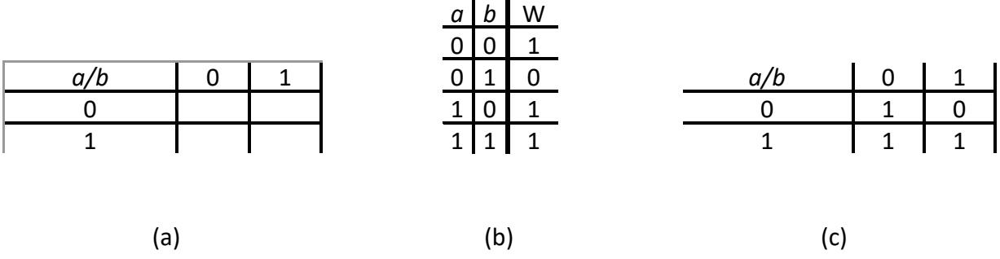

Figure 2.22: (a) A 2 × 2 Karnaugh map; (b) Truth table for the baseball function; (c) Karnaugh map with values for function *W* shown.

Notice the label in the upper left corner of the grid, $a\backslash b$. This indicates that the values shown below this square, the labels of the rows, are the possible values of $a$. The values to the right of this, the labels of the columns, are the possible values of $b$.

Next, we need to fill in the rest of the Karnaugh map. Consider the first empty cell, in the row with $a$ = 0 and the column with $b = 0$ We go to the truth table we developed earlier for this function, repeated in Figure 2.22 (b), and look up the value of $W$ for these input values. Here, $W = 1$, so we enter the value 1 into this cell. We do the same thing for each cell in the Karnaugh map, giving us the completed Karnaugh map shown in Figure 2.22 (c).

So, now we have this Karnaugh map. We didn't create it just to make a nice looking map. We want to use it to help us develop the most simple function equation possible. To do this, we group together adjacent 1s in the map. For this map, look at the bottom row. It has two cells, both with a value of 1. These cells are adjacent, so we can group them together. We do this by drawing a circle or oval around the two terms, as shown in Figure 2.23 (a). This is called an **implicant**.

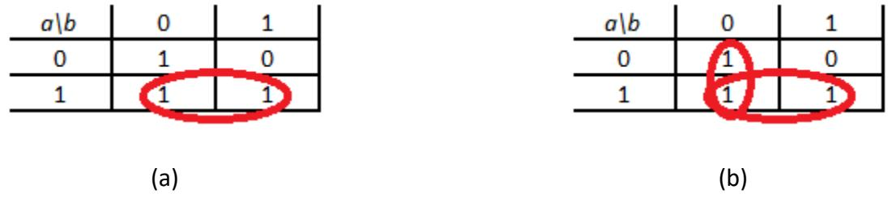

Figure 2.23: Karnaugh map for the function $W$: (a) with $a$ terms grouped; (b) with $a$ terms and $b'$ terms grouped.

There is a second implicant in this Karnaugh map, the two 1s in the column with $b= 0$. Figure 2.23 (b) shows the Karnaugh map with both implicants.

Notice the 1 in the row with $a = 1$ and the column with $b = 0$. That term is in both implicants, and that's OK. *A cell with a 1 can be in more than one implicant*.

Here is another important point. *Every cell with a 1 must be in an implicant*. If it cannot be grouped with any other cell, we just circle it and make it its own implicant.

Mathematically, these implicants are created by performing algebraic operations. Consider the first implicant, which combines the cells with $a = 1$ and $b = 0$, with the cell for which $a = 1$ and $b = 1$. The first cell corresponds to minterm $a \cdot b'$ ($a = 1$, $b = 0$ or $b' = 1$, $1 \cdot 1 = 1$), and the second is minterm $a \cdot b$. Grouping the two cells is essentially a logical OR operation. This group corresponds to the following equation.

$$
\begin{aligned}
\text{Group 1} &= (a \cdot b') + (a \cdot b) \\
&= a \cdot (b' + b) \\
&= a \cdot 1 \\
&= a
\end{aligned}
$$

This is the rationale for grouping terms. When we group terms together, we create one term that covers the group's terms. As a bonus, the one term is simpler than any of the terms that are grouped together.

We can follow the same procedure for the second implicant as follows.

$$
\begin{aligned}
\text{Group 2} &= (a' \cdot b') + (a \cdot b') \\
&= (a' + a) \cdot b' \\
&= 1 \cdot b' \\
&= b'
\end{aligned}
$$

Finally, we logically OR the two implicant values together to get our final function, $W = a + b'$.

#### 2.3.1.2 3-Input Maps

Karnaugh maps for two inputs are useful, to a degree, but their value is somewhat limited. If you didn't have the Karnaugh map, you might be able to just look at the truth table and figure out the minimal equation because there are so few terms. Karnaugh maps become more useful when we have functions with more inputs, up to a point. Consider the Karnaugh map for a truth table we saw in the previous section, repeated in Figure 2.24 (a).

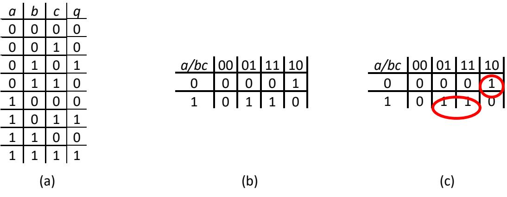

Figure 2.24: (a) Function truth table; (b) Karnaugh map; (c) Karnaugh map with implicants shown.

To create the Karnaugh map, first we divide the inputs as evenly as possible. This function has three inputs, so we put one ($a$) in one set and the other two ($b$ and $c$) in the other set. It doesn't matter which input is in each set; I just chose these arbitrarily. Also, each input has to be completely in one set; you can't have 1½ inputs in each set.

Since the first set has one input, it has $2^1 = 2$ rows, just like the Karnaugh map for the baseball function. The other set, however, has two inputs, so our Karnaugh map has $2^2 = 4$ columns. Figure 2.24 (b) shows the Karnaugh map for this truth table.

There are a couple of really important things I need to explain before we continue. First, notice the top left cell of the Karnaugh map has the text $a\backslash bc$. This means that the two-bit value in the label for each column specifies the values of *b* and *c* in that order. For example, the column labeled 01 has $b = 0$ and $c = 1$.

The other thing to note is the order of the labels. When we have only two rows or columns, the order is always sequential, first 0, then 1. When we have more than two rows or columns, however, this is not the case. The columns are not ordered 00, 01, 10, 11; they are ordered 00, 01, 11, 10. *The order of the labels follows the Gray code*. We do this so we can group adjacent terms. If we ordered the columns sequentially, we could not group together entries in adjacent columns 01 and 10.

Finally, we group terms just as we did before. The 1 in the upper right corner ($a = 0$, $bc = 10$, or $a'bc'$) cannot be grouped with any other terms, so we just circle it as its own implicant. The other two terms can be grouped together as follows.

$$
(a \cdot b' \cdot c) + (a \cdot b \cdot c) = (a \cdot c) \cdot (b' + b) = (a \cdot c)
$$

Thus our final function becomes $a'bc' + ac$.

Indicants can have more than two entries of 1, but the total number of entries must always be an exact power of 2, that is, 1, 2, 4, 8, … and so on. To see how this works, let's look at another truth table we saw earlier, repeated in Figure 2.25 (a).

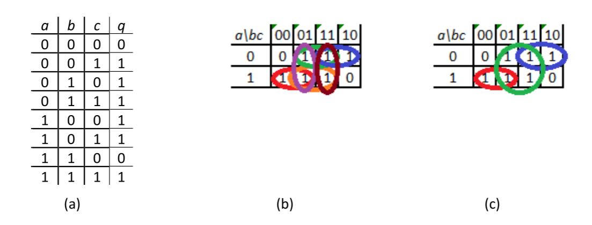

Figure 2.25: (a) Function truth table; (b) Karnaugh map with implicants of size 2; (c) Karnaugh map with implicants prime implicants shown.

We can create the Karnaugh map for this truth table just as we did before, and then we circle each possible implicant of two terms, as shown in Figure 2.25 (b). There are a lot of implicants circled in this figure, six to be precise. Now, we want to see if we can combine any of these implicants of two into larger implicants.

Two implicants can be combined if they are completely adjacent. That is, they can't have only part of the group being adjacent. For this function, consider the two implicants shown in Figure 2.26 (a). The two terms in column 01 are adjacent, but the terms in columns 00 and 11 are not, so these two implicants cannot be combined.

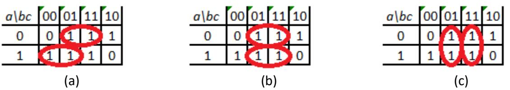

Figure 2.26: (a) Two non-adjacent implicants; (b) and (c) Two adjacent implicants that can be combined.

The two implicants circled in Figure 2.26 (b), however, can be combined. Each term along their common edge is adjacent to a term in the other implicant. The same is true for the two implicants circled in Figure 2.26 (c). The final implicants are shown in Figure 2.25 (c). The three implicants in the figure are all of maximum size; they cannot be combined further. They are called **prime implicants**. Both groupings in Figures 2.26 (b) and (c) group together the same elements and give us the same function.For the first figure, our implicants are

$$
\begin{aligned}
( a \cdot b' \cdot c ) + ( a \cdot b \cdot c ) &= ( a \cdot c ) \\
( a' \cdot b' \cdot c ) + ( a' \cdot b \cdot c ) &= ( a' \cdot c )
\end{aligned}
$$

Our final implicant is

$$
(a \cdot c) + (a' \cdot c) = c
$$

The second figure has the implicants

$$
\begin{aligned}
( a' \cdot b' \cdot c ) + ( a \cdot b' \cdot c ) &= ( b' \cdot c ) \\
( a' \cdot b \cdot c ) + ( a \cdot b \cdot c ) &= ( b \cdot c )
\end{aligned}
$$

They are grouped together as

$$
(b' \cdot c) + (b \cdot c) = c
$$

The other two groups have the functions $(a \cdot b')$ and $(a' \cdot b)$, and our final function is $(a \cdot b') + (a' \cdot b) + c$.

There is another way that terms can be adjacent that is not so obvious. Consider the Karnaugh map shown in Figure 2.27 (a). There are two terms set to 1 in this Karnaugh map, and they appear quite distant from each other. However, they are actually adjacent, because *the rows and columns of the Karnaugh map wrap around*. That is, the last cell in each row/column is actually next to the first cell in that row/column. Traditionally, we group them as shown in Figure 2.27 (b).

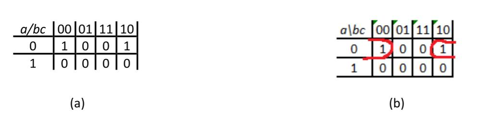

Figure 2.27: (a) Karnaugh map; (b) Karnaugh map with implicant shown.

Mathematically, the two cells are adjacent if they have only one input that is different, and that is the case here. The left cell has $a = 0$, $b = 0$, and $c = 0$, and corresponds to minterm $a'b'c'$. The other cell set to 1 has $a = 0$, $b = 1$, and $c = 0$, or minterm $a'b'c'$. Grouping these two cells together gives us an implicant with value $(a' \cdot b' \cdot c') + (a' \cdot b \cdot c') = (a' \cdot c') \cdot (b' \cdot b) = (a' \cdot c')$.

We can only draw the Karnaugh map in two dimensions, as a flat grid. Mathematically speaking, however, it is more like a three-dimensional torus. To see this, get a doughnut and a piece of paper. Draw a Karnaugh map (just the cells, no labels) on a piece of paper, cut it out, and try wrapping it around the doughnut. You may find it helpful to draw the squares as trapezoids since the inner diameter of the doughnut is smaller than the outer diameter. This will show you all the adjacencies within the Karnaugh map. After you have done this, take a picture to document your success, and then feel free to remove your Karnaugh map and eat the doughnut as your reward for a job well done.

#### 2.3.1.3 4-Input Maps

The largest Karnaugh map you can reasonably use has four inputs. This map is shown in Figure 2.28. Notice that both the rows and columns use the Gray code sequence for their labels. It is left as an exercise for the reader to group the terms in this map into prime implicants and obtain an optimal function.

| ab/cd | 00 | 01 | 11 | 10 |
|-------|----|----|----|----|
| 00    | 0  | 1  | 0  | 1  |
| 01    | 1  | 1  | 0  | 0  |
| 11    | 1  | 1  | 1  | 1  |
| 10    | 0  | 1  | 0  | 0  |

Figure 2.28: A 4-input Karnaugh map with function values shown.

There is one final point I need to share with you regarding implicants. Sometimes, after you have created your Karnaugh map and generated all the prime implicants, you don't need to include all of them in your final equation for the function. As an example, consider the Karnaugh map shown in Figure 2.29 (a). This map has three prime implicants as shown in the figure. The lower prime implicant has the function $a \cdot b'$; the vertical prime implicant has the function $b' \cdot c$; and the upper prime implicant has the function $a' \cdot c$. We could express this overall function as $(a \cdot b') + (b' \cdot c) + (a' \cdot c)$, but we can do better than that. Notice that both cells in $b' \cdot c$ are also included in one of the other two prime implicants, so we can remove it from the overall function, leaving us with $(a \cdot b') + (a' \cdot c)$, as shown in Figure 2.29 (b).

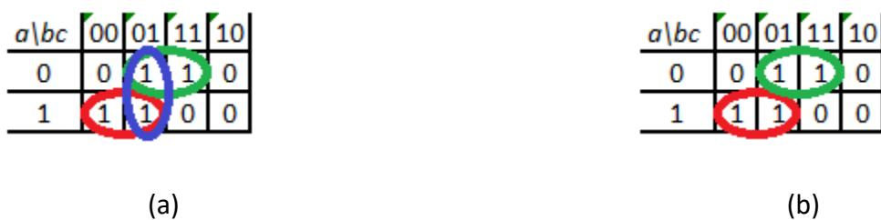

Figure 2.29: Karnaugh map with (a) all prime implicants; (b) essential prime implicants.

Look at the original map with all prime implicants and find the cell with $a = 1$, $b = 0$, and $c = 0$. This cell is in only one prime implicant. That means any final function must include this prime implicant, otherwise it will not produce the desired function value of 1 for these input values. Such a prime implicant is called an **essential prime implicant**. Using similar reasoning, the upper prime implicant is also an essential prime implicant. Knowing that these two essential prime implicants must be in the final function, we can see that we are already setting the function to 1 for all terms in the vertical prime implicant, so we don't need to include it.

Summarizing, here's the overall procedure to determine the function from a truth table using Karnaugh maps.

- Divide the function inputs into two sets, splitting them up as evenly as possible.
- Create the blank Karnaugh map with these two sets, using the Gray code to create the labels.
- Fill in the cells of the Karnaugh map with the values of the functions from the truth table.
- Group adjacent terms together as implicants.
- Group implicants together to form larger implicants, repeating until each implicant has reached its maximum size. These are the prime implicants for the function.
- Identify cells that are covered by only one prime implicant. These are the essential prime implicants and must be included in the final function.
- Find a cell that is equal to 1 but not in any essential prime implicant. Find one prime implicant that covers this cell and add it to the final function. Repeat this process for other cells that are not covered by any essential prime implicant and the other prime implicants you have added to the final function until all cells are covered.

### 2.3.2 Quine-McCluskey Algorithm

In theory, you can create a Karnaugh map for any number of function inputs. Realistically, though, Karnaugh maps are difficult to work with when you have more than four function inputs. For $n$ inputs, each cell in the Karnaugh map is adjacent to $n$ other cells. For 5 or more inputs, some of the adjacent cells do not border the cell, which takes away one of the main advantages of Karnaugh maps.

For functions with larger numbers of inputs, we can use the **Quine-McCluskey algorithm**. (This algorithm can also be used for functions with fewer inputs, but Karnaugh maps already work well for these functions.) The original algorithm was developed by **William Quine** in 1952, though the underlying approach was previously developed by **Hugh McColl** in 1878 in the domain of logic. **Edward McCluskey** extended this algorithm in 1956 to give us the algorithm we use today. Computer programs that minimize logic functions are based on this algorithm, not Karnaugh maps.

The Quine-McCluskey algorithm is a tabular method that has two phases. In the first phase, we create a table and manipulate it to determine the prime implicants for the function. This is equivalent to circling adjacent terms in Karnaugh maps and building them up until each has reached its maximum size. Then we determine the function from among these prime implicants in the second phase. We'll describe the steps in this algorithm as we go through a very simple example you have seen before, the baseball example we have used throughout this chapter.

We start with the truth table for this function, shown again in Figure 2.30 (a). We use this table to create the table we will actually use in the first phase of the Quine-McCluskey algorithm. We take each entry in the truth table that sets the function value to 1 and add the input values for that entry to our table. Then we group all the entries based on the number of 1s in the entries. For our truth table, there are three entries that set the function output to 1. They are: $a = 0$ and $b = 0$; $a = 1$ and $b = 0$; and $a = 1$ and $b = 1$. We list these entries as 00, 10, and 11, respectively. Then we divide the entries by the number of 1s. Group 0 has 00; group 1 has 10; and group 2 has 11. These groups are shown in Figure 2.30 (b).

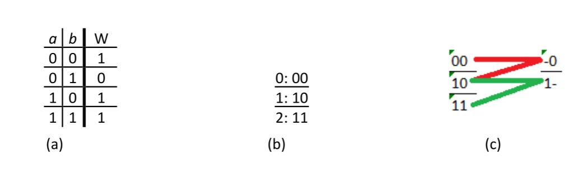

Figure 2.30: Determining the equation for the baseball function using the Quine-McCluskey algorithm: (a) Truth table for the function; (b) Table used by the Quine-McCluskey algorithm; (c) Generating prime implicants.

Now that we have our table, the next step is to generate the prime implicants. This process is analogous to finding prime implicants in Karnaugh maps. We group together terms until we have grouped as many as possible. To do this, we start with group 0. We take every term in group 0 and compare it to every term in group 1. If a pair of terms has all but one input that are the same, we create an entry in the next column with a dash in place of the input that is different, and all the values that are the same. As shown in Figure 2.30 (c), we combine 00 and 10 to form term -0. Note that we don't have to compare group 0 to group 2. Since group 2 has two terms that are 1 and group 0 has no terms that are 1, there cannot be a pair of terms that vary by only one input.

Next, we go to group 1 and compare each term to every term in group 2. This combines 10 and 11 to form the term 1-. If there are any terms that could not be combined with any other terms, we circle these terms; they are prime implicants. None of our initial terms in this example are prime implicants; each was combined with at least one other term.

We would then group these newly created terms based on the number of 1s and repeat the process, with one very important difference. We only compare terms that have their dashes in the same location. This ensures that we avoid combining terms that are not aligned properly. In our example, our two newly created terms, 1- and -0, have their dashes in different locations, so we cannot compare them. We circle them both and phase 1 of our algorithm is complete. If we had created new terms, we would repeat the process on each column of newly created terms.

All entries in each column have exactly the same number of dashes. Initially, no entries have any dashes. In the next column, each entry has exactly one dash, which makes sense since we replace the one input that is different with a dash. Every newly created column adds one dash to the entries. A function with $n$ inputs will create at most $n$ columns, usually less.

For all the prime implicants we generated using the first phase of the Quine-McCluskey algorithm, the values without dashes can be used to represent the term as a product of input variables. A 1 represents the original term and a 0 signifies that we use the complement of the term. Terms with a dash are not included. Just as combining terms algebraically ended up removing an input from the combined term, the dash does the same thing. Our two prime implicants, 1- and -0, correspond to $a$ and $b'$, respectively.

Now, on to phase 2. We need to determine which prime implicants to include in our final function. To do this, we create another table. The columns of this table are the input values that set the function to 1. The rows are the prime implicants we generated in phase 1. Our baseball function has three columns (00, 10, and 11), and two rows (1- and -0). In each entry in the table, we place a check mark if the prime implicant includes the term for that column, or leave it blank if it does not. The initial table is shown in Figure 2.31 (a).

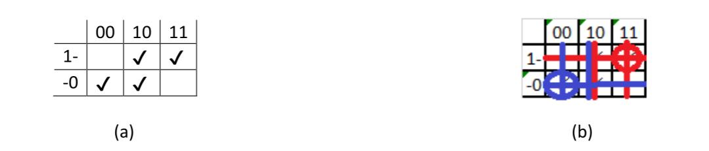

Figure 2.31: Quine-McCluskey algorithm, phase 2, for the baseball example: (a) Initial table; (b) Table with essential prime implicants circled and rows and columns crossed out.

First, we look at this table to see if any column has only one entry checked. If so, the prime implicant for that column is an essential prime implicant. We circle that term and draw a horizontal line through that row. We find all entries in that row and draw a vertical line through their columns. For our example, we have two essential prime implicants. Figure 2.31 (b) shows the table with essential prime implicants circled and rows and columns crossed out.

If any columns are not yet crossed out, we still need prime implicants to ensure those terms set the function to 1. We try to choose prime implicants that cover as many of the remaining terms as possible to minimize the overall function. For our example, all terms are covered by the essential prime implicants, and our final function is $W = a + b'$.

Another familiar example

Let's look at another example we've seen before, the truth table repeated in Figure 2.32 (a). This function has six input values that set the function to 1. Grouping these input values as before gives us the table shown in Figure 2.32 (b).

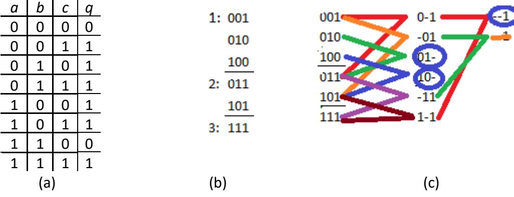

Figure 2.32: Another Quine-McCluskey example: (a) Truth table for the function; (b) Table used by phase 1; (c) Generating prime implicants.

As before, we compare each term in group 1 to each term in group 2, and each term in group 2 to each term in group 3 to generate the second column in Figure 2.32 (c). We repeat the procedure on the second column, remembering to compare only entries that have dashes in the same location. Two entries, 01- and 10-, cannot be combined with any other terms and are circled.

Notice, in the last column, we generated the term --1 twice. Recall that when we used Karnaugh maps to determine this function, we were able to combine two implicants of size 2 to create the same implicant of size 4 in two different ways; see Figure 2.26. That is what's happening here. Since we only need this term once, we simply cross out any duplicates.

Finally, with only one term left, --1, there is nothing to combine it with and it is circled as a prime implicant. Our three prime implicants are 10-, 01-, and --1, or $ab'$, $a'b$, and $c$.

Now we move on to phase 2. We create the table for this function as before, shown in Figure 2.33 (a). Looking at the table, the columns for inputs 001, 010, 100, and 111 each have only one entry checked. The prime implicants for these entries are essential. We circle them and cross out the rows and columns as before, as shown in Figure 2.33 (b). With all columns covered, this phase is complete. Our final function is $(a \cdot b') + (a' \cdot b) + c$.

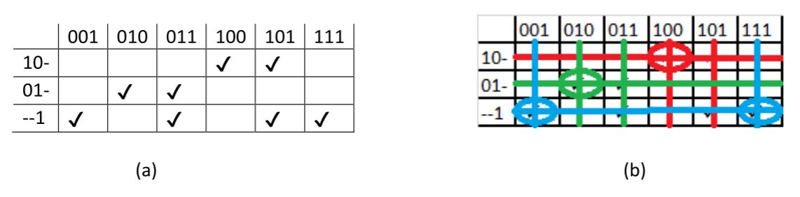

Figure 2.33: Phase 2 of the Quine-McCluskey algorithm: (a) Initial table; (b) Table with essential prime implicants circled and rows and columns crossed out.

A new, more complex example

To close out this section, let's look at a more complex example with five inputs. For larger functions, it is not uncommon to express it as a sum of minterms using the little-$m$ notation. Our function is $\sum m(4,5,6,7,11,12,13,14,15,22,27,31)$. The expanded truth table is shown in Figure 2.34.

| a | b | c | d | e | q |
|---|---|---|---|---|---|
| 0 | 0 | 0 | 0 | 0 | 0 |
| 0 | 0 | 0 | 0 | 1 | 0 |
| 0 | 0 | 0 | 1 | 0 | 0 |
| 0 | 0 | 0 | 1 | 1 | 0 |
| 0 | 0 | 1 | 0 | 0 | 1 |
| 0 | 0 | 1 | 0 | 1 | 1 |
| 0 | 0 | 1 | 1 | 0 | 1 |
| 0 | 0 | 1 | 1 | 1 | 1 |
| 0 | 1 | 0 | 0 | 0 | 0 |
| 0 | 1 | 0 | 0 | 1 | 0 |
| 0 | 1 | 0 | 1 | 0 | 0 |
| 0 | 1 | 0 | 1 | 1 | 1 |
| 0 | 1 | 1 | 0 | 0 | 1 |
| 0 | 1 | 1 | 0 | 1 | 1 |
| 0 | 1 | 1 | 1 | 0 | 1 |
| 0 | 1 | 1 | 1 | 1 | 1 |
| 1 | 0 | 0 | 0 | 0 | 0 |
| 1 | 0 | 0 | 0 | 1 | 0 |
| 1 | 0 | 0 | 1 | 0 | 0 |
| 1 | 0 | 0 | 1 | 1 | 0 |
| 1 | 0 | 1 | 0 | 0 | 0 |
| 1 | 0 | 1 | 0 | 1 | 0 |
| 1 | 0 | 1 | 1 | 0 | 1 |
| 1 | 0 | 1 | 1 | 1 | 0 |
| 1 | 1 | 0 | 0 | 0 | 0 |
| 1 | 1 | 0 | 0 | 1 | 0 |
| 1 | 1 | 0 | 1 | 0 | 0 |
| 1 | 1 | 0 | 1 | 1 | 1 |
| 1 | 1 | 1 | 0 | 0 | 0 |
| 1 | 1 | 1 | 0 | 1 | 0 |
| 1 | 1 | 1 | 1 | 0 | 0 |
| 1 | 1 | 1 | 1 | 1 | 1 |

Figure 2.34: Truth table for final example function

As always, we create the table for phase 1 of the algorithm. We can read these values directly from the truth table, or we can simply look at the minterms and list the subscripts as 5 bit values (because we have five inputs for our function). Using either method, we get the initial table shown in Figure 2.35 (a).

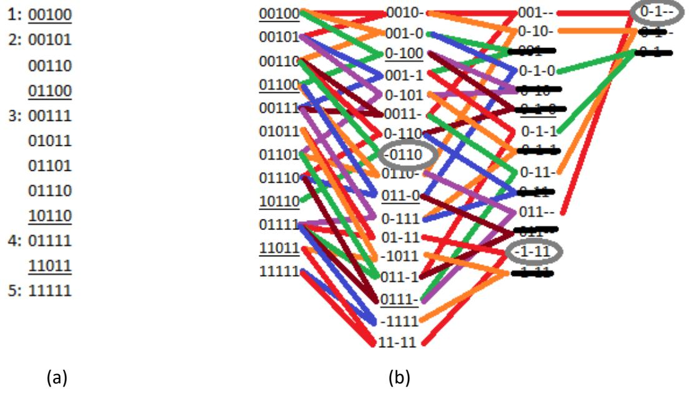

Figure 2.35: Final example phase 1 table: (a) Initial table; (b) Final table with prime implicants circled.

Figure 2.35 (b) shows the results obtained from phase 1 of the Quine-McCluskey algorithm. There are three prime implicants: -0110, -1-11, and 0-1--, or $b'cde'$, $bde$, and $a'c$.

With this information, we create the table for phase 2 of the algorithm, shown in Figure 2.36. Once again, all three prime implicants are essential. Our final function is $a'c + bde + b'cde'$.

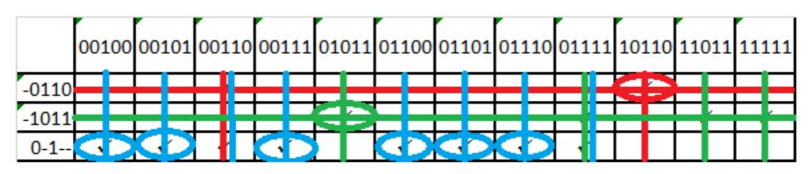

Figure 2.36: Final table for phase 2 of the final example function.

### 2.3.3 Don't Care Values and Incompletely Specified Functions

The functions we've looked at so far are completely specified, that is, they have a specific output value for every possible combination of input values. However, this is not always the case. For some functions, there are times we don't care what output value is generated. The most common reason for this is that certain combinations of input values will never occur. We don't care what output our function generates because we will never input those particular values.

A classic example of this is a BCD to 7-segment decoder. This function has four inputs; together, these inputs represent decimal digits 0 (0000) to 9 (1001). There are actually seven functions, $a$ through $g$, that either turn on or turn off one of the seven segments of an LED display. Figure 2.37 shows the segments and the truth table for our ten defined inputs. A value of 1 indicates that the LED for that segment is lit.

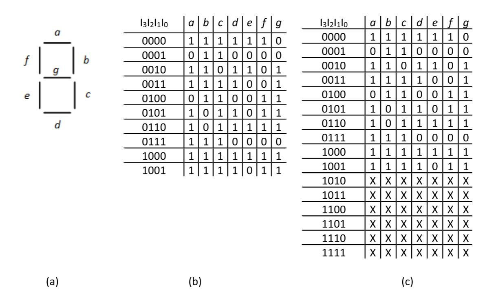

Figure 2.37: (a) 7-segment LED labels; (b) Truth table for defined inputs; (c) Truth table with don't care values shown.

But what happens if we input one of the unspecified values, 1010 through 1111? In practice, we're only displaying decimal digits, so we don't care what it shows because we're never going to input those values anyway. The question is, how can we use this to our advantage to minimize our functions?

This is the role of the **don't care** output. We denote this output as X in the truth table. Figure 2.37 (c) shows the truth table with don't care values included.

To see how we handle don't care values, let's look at the function for segment $g$. Using the last column of the table, we can create the Karnaugh map shown in Figure 2.38 (a). Just as we included outputs set to X in the truth table, we also include X values in the Karnaugh map.

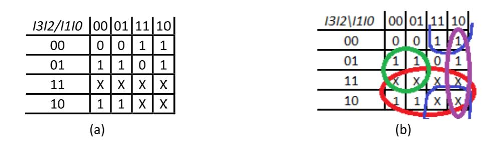

Figure 2.38: Segment $g$ of the BCD to 7-segment decoder: (a) Original Karnaugh map; (b) One possible final Karnaugh map with prime implicants shown.

When we start to group together terms, we might group together the two 1s in the lower left cells, with inputs 1000 and 1001. But these two cells can be grouped with the two don't care values above it to form a group of four terms. And these four cells can be grouped together with the four cells to their right to form a group of eight cells, which becomes a prime implicant.

We continue the process, identifying other prime implicants and winnowing them down to create a final function. Figure 2.38 (b) shows the Karnaugh map with final prime implicants; this function is $I_3 + (I_2 \cdot I'_1) + (I_1 \cdot I'_0) + (I'_2 \cdot I_1)$. There is another possible function for this segment with one different prime implicant. See if you can find it before continuing with the rest of this section.

The Quine-McCluskey algorithm has an elegant way of handling don't care values. It includes them in phase 1 to minimize the prime implicants, but it excludes them in phase 2 since we don't really have to generate any specific output value for these inputs.

In our compact minterm notation, we would represent this function as  $\sum m(2,3,4,5,6,8,9) + \sum d(10,11,12,13,14,15)$. The $m$ terms are the minterms that set $g$ to 1 and the $d$ terms are the don't care values. Figure 2.39 shows phase 1 of the algorithm.

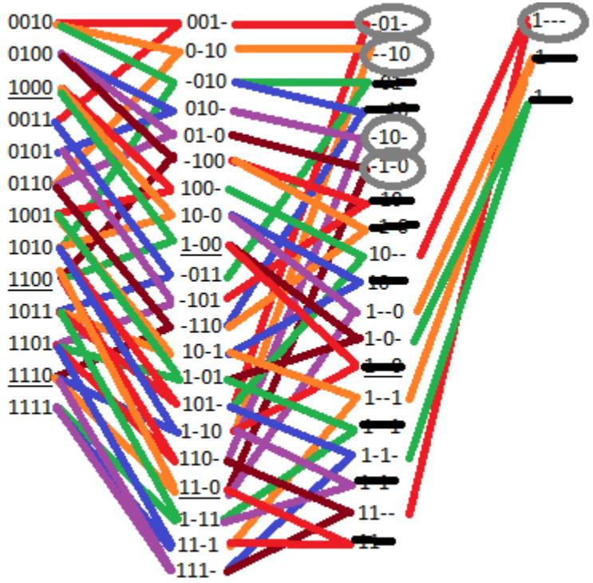

Figure 2.39: Phase 1 of the Quine-McCluskey algorithm to determine the function for $g$.

Finally, we create the table for phase 2, this time excluding the don't care values. Figure 2.40 shows this table after essential prime implicants are identified. These three terms, -01-, -10-, and 1---, $(I'_2 \cdot I_1$, $I_2 \cdot I'_1$, and $I_3)$ must be included in the final function. You can choose either of the two remaining prime implicants to cover input 0110 and complete the function.

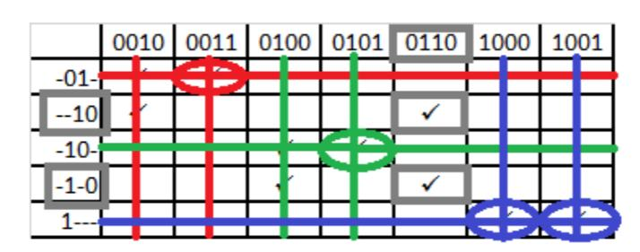

Figure 2.40: Phase 2 of the Quine-McCluskey algorithm to determine the function for $g$.

## 2.4 Summary

Boolean algebra is the mathematical basis for digital logic design. Using 1 and 0 to represent TRUE and FALSE, and incorporating the AND, OR, and NOT operations, we can create a function to realize any desired output values for all combinations of input values. Functions can be used to model real world scenarios. There are an infinite number of Boolean algebras. Fortunately, digital logic design is based on the very simplest Boolean algebra, also called the switching algebra. As with any algebra, our Boolean algebra follows some basic postulates that specify its behavior.

Truth tables are one way to show the behavior of a function. It specifies the value of the function for all possible combinations of input values. The equation for the function can be derived directly from these input values, or the outputs can be treated as minterms or maxterms and then used to specify the function.

Karnaugh maps are a useful tool that allows us to graphically combine terms and minimize function equations. Minimizing equations results in simpler digital logic designs to realize those functions, which has several benefits. Karnaugh maps become difficult to use when a function has more than four inputs. The Quine-McCluskey algorithm can be used for any number of inputs. Some functions do not specify output values for some input values. We can use these don't care outputs to minimize the function equations.

This concludes Part I, the background portion of this book. In the next chapter, we start the design of digital circuits with Part II, Combinatorial Logic. This chapter will introduce the basic digital logic components and show how they can be combined in circuits to realize desired functions.

## Exercises

1. Show the truth tables for the 3-input AND and OR functions.

2. Show the truth tables for the 4-input AND and OR functions.

3. Verify the commutativity property of the 3-input AND and OR functions.

4. Verify the distributive property for
	- a. $a \cdot (b + c + d)$
	- b. $a + (b \cdot c \cdot d)$

5. Verify associativity for
	- a. $(a \cdot b) \cdot (c \cdot d) = a \cdot (b \cdot c) \cdot d$
	- b. $(a + b) + (c + d) = a + (b + c) + d$

6. Use De Morgan's law to find the function equivalent to $(a + b')'$.

7. Use De Morgan's law to find the function equivalent to $(a \cdot b')'$.

8. Show De Morgan's laws for three variables and the truth tables to verify them.

9. Create the truth table for the function $a + (a' \cdot b) + (a' \cdot c)$.

10. Specify the function in Problem 9 as a sum of products and as a product of sums.

11. Create the truth table for the function $a + (a \cdot b') + (b' \cdot c) + (a' \cdot c)$.

12. Specify the function in Problem 11 as a sum of products and as a product of sums.

13. Create the truth table for the function $a \cdot (b + c') + (a \cdot b' \cdot c)$.

14. Specify the function in Problem 13 as a sum of products and as a product of sums.

15. Minimize the function of Problem 9 using Karnaugh maps.

16. Minimize the function of Problem 9 using the Quine-McCluskey algorithm.

17. Minimize the function of Problem 11 using Karnaugh maps.

18. Minimize the function of Problem 11 using the Quine-McCluskey algorithm.

19. Minimize the function of Problem 13 using Karnaugh maps.

20. Minimize the function of Problem 13 using the Quine-McCluskey algorithm.

21. Show the truth table corresponding to the following Karnaugh map. Find all prime implicants and essential prime implicants, and give the minimal function for these values.

| a/bc | 00 | 01 | 11 | 10 |
|------|----|----|----|----|
| 0    | 1  | 0  | 1  | 0  |
| 1    | 1  | 1  | 1  | 1  |

22. For the truth table you created for Problem 21, use the Quine-McCluskey algorithm to determine the minimal function.

23. Show the truth table corresponding to the following Karnaugh map. Find all prime implicants and essential prime implicants, and give the minimal function for these values.

| I3I2/I1I0 | 00 | 01 | 11 | 10 |
|-----------|----|----|----|----|
| 00        | 0  | 1  | 0  | 1  |
| 01        | 1  | 1  | 0  | 0  |
| 11        | 1  | 1  | 1  | 1  |
| 10        | 0  | 1  | 0  | 0  |

24. For the truth table you created for Problem 23, use the Quine-McCluskey algorithm to determine the minimal function.

25. Show the truth table corresponding to the following Karnaugh map. Find all prime implicants and essential prime implicants, and give the minimal function for these values.

| I3I2/I1I0 | 00 | 01 | 11 | 10 |
|-----------|----|----|----|----|
| 00        | 1  | 0  | 1  | 1  |
| 01        | 0  | 1  | 0  | 1  |
| 11        | X  | X  | X  | X  |
| 10        | 1  | 0  | X  | X  |

26. For the truth table you created for Problem 25, use the Quine-McCluskey algorithm to determine the minimal function.

27. Use the Quine-McCluskey algorithm to determine the minimum function for $\sum m(3, 11, 12, 13, 14, 15, 19, 27)$. The function has five inputs.
