# Chapter 3: Digital Logic Fundamentals

In the previous chapter, we introduced the fundamentals of Boolean algebra and functions. In this chapter, we'll look at digital logic, circuitry developed to realize these functions. Digital logic can be used to implement any Boolean function ranging from the simplest functions to complex computer systems.

We start by introducing logic gates that realize the fundamental functions described in the previous chapter, including AND, OR, XOR, and NOT. Then we will examine how to use these gates to realize more complex functions using the sum of products and product of sums introduced in Chapter 2. We will also look at inverse functions, because sometimes it is easier to design a circuit that does the exact opposite of what you want it to do and then invert its output. Finally, we'll look at some real-world constraints that go beyond the underlying logic that must be accounted for when designing digital logic circuits.

## 3.1 Basic Logic Gates

In Chapter 2, we examined several fundamental Boolean operations. In this chapter, we'll move from the algebraic specification of a Boolean function to designing a circuit to realize that function.

Engineers developed integrated circuit chips that can realize these functions. For the AND function, two or more pins on the chip are connected to the inputs of the AND function, which implements the AND function inside the chip. Circuit designers connect these pins to external inputs or other components in their circuits to send data to these inputs. The output of the function is connected to another pin on the chip. Circuit designers can send this value out to other parts of the circuit or send it out from the circuit as needed.

The part of the chip that performs the function is called a logic gate. Just as there are different logic functions, there are different logic gates to realize these functions. Each gate has its own logic symbol that is used in circuit diagrams. Next we'll look at some of the most fundamental logic gates.

Let's start with the AND gate. As its name implies, it implements the AND function: its output is 1 only when all inputs are 1. If any input is 0, its output is 0. In theory, an AND gate could have any number of inputs, but in practice an AND gate has a relatively small number of inputs, usually 2, 3, or 4. There are some physical limitations inherent to digital circuits that must be accounted for beyond just the Boolean logic. We will discuss these more at the end of this chapter and the end of Chapter 4.

Figure 3.1 (a) shows the standard schematic symbol for a 2-input AND gate. Its truth table is shown in Figure 3.1 (b). For AND gates with more than two inputs, we use the same gate symbol, just with more input lines. Three- and four-input AND gates are shown in Figure 3.1 (c). The development of their truth tables are left as exercises for the reader.

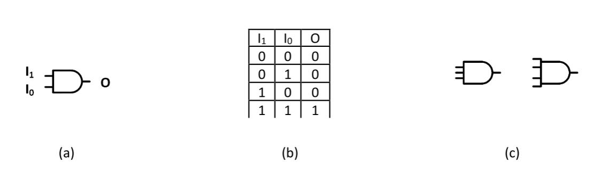

Figure 3.1: AND gates: (a) 2-input AND gate; (b) Truth table; (c) 3- and 4-input AND gates.

The OR gate, like the AND gate, has two or more inputs and one output. The output is 1 if any input is 1, and is 0 only if all inputs are set to 0. The 2-input OR gate is shown in Figure 3.2 (a). Its truth table is given in Figure 3.2 (b), and 3- and 4-input OR gates are shown in Figure 3.2 (c).

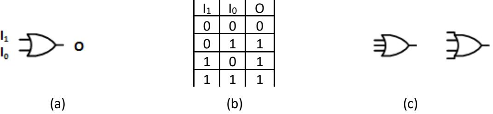

Figure 3.2: OR gates: (a) 2-input OR gate; (b) Truth table; (c) 3- and 4-input OR gates.

The exclusive-or, XOR, gate can have two or more inputs, though it usually has only two. The output is 1 if an odd number of inputs are equal to 1, and it is 0 if the gate has an even number of inputs set to 1. Figure 3.3 shows the symbol for the 2-input XOR gate, its truth table, and the 3- and 4-input XOR gates.

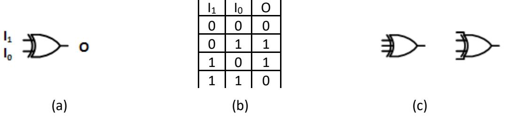

Figure 3.3: XOR gates: (a) 2-input XOR gate; (b) Truth table; (c) 3- and 4-input XOR gates.

Unlike the previous gates, the NOT gate can have only one input. Its output is the complement of the input. That is, when the input is 0 the output is 1, and when the input is 1 the output is 0. Figure 3.4 shows the symbol for the NOT gate and its truth table.

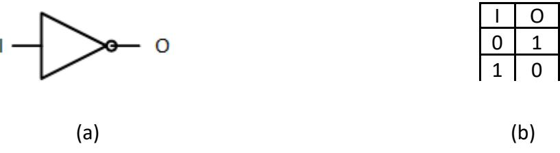

Figure 3.4: NOT gate: (a) Symbol; (b) Truth table.

As we saw in the previous chapter, there are also complementary functions for the AND, OR, and XOR functions. The NAND function is 0 when all its inputs are 1 and 1 if any input is 0. The symbol for the 2-input NAND gate, shown in Figure 3.5 (a), is simply the symbol for the 2 input AND gate with a circle at its output, which indicates that it is followed by an inverter. (Actually, internally these gates are designed the other way around; the AND gate is a NAND gate followed by an inverter.) Figure 3.5 (b) and (c) show the truth table for the 2-input NAND gate and the symbol for the 3- and 4-input NAND gates, respectively.

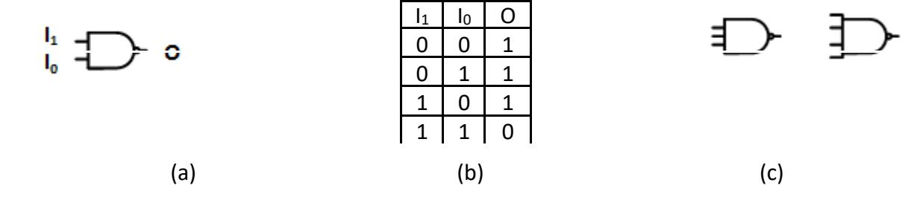

Figure 3.5: NAND gates: (a) 2-input NAND gate; (b) Truth table; (c) 3- and 4-input NAND gates.

Continuing on, Figure 3.6 shows the symbols and truth table for the NOR gate, and Figure 3.7 shows this information for the exclusive-NOR (XNOR, not NXOR) gate. Note that the output of the 2-input XNOR gate is 1 when its two inputs are equal. For this reason, it is sometimes referred to as the equivalence function.

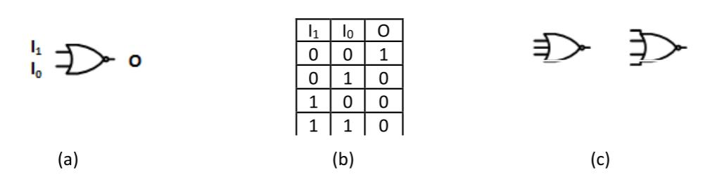

Figure 3.6: NOR gates: (a) 2-input NOR gate; (b) Truth table; (c) 3- and 4-input NOR gates.

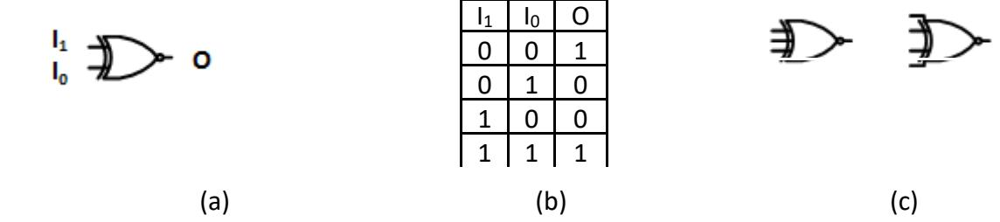

Figure 3.7: XNOR gates: (a) 2-input XNOR gate; (b) Truth table; (c) 3- and 4-input XNOR gates.

## 3.2 Implementing Functions

Now that we have seen the fundamental logic gates, we'll spend some time in this section looking at how to use these logic gates to realize logic functions. Using some of the sample functions we examined in Chapter 2, we first implement functions using the least number of gates possible. Then we will design circuits to implement functions using sum of products and product of sums.

### 3.2.1 Minimizing Logic

The first steps when designing a digital logic circuit are to determine the value of the output for all possible input values and to create a Boolean equation that generates these outputs. Let's start with an equation we used in Chapter 2, $q = a'bc' + ac$. For your reference, its truth table is shown in Figure 3.8 (a).

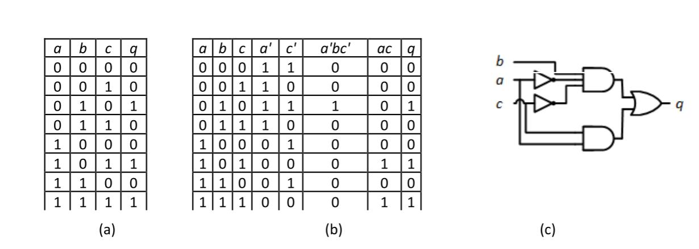

Figure 3.8: Implementing the function $q = a'bc' + ac$: (a) Original truth table; (b) Expanded truth table; (c) Digital logic circuit to implement this function.

Just by looking at the equation for the function, we can see several of the gates that we will need in our final circuit:

- Two NOT gates to generate $a'$ and $c'$
- One 3-input AND gate to generate $a'bc'$
- One 2-input AND gate to generate $ac$
- One 2-input OR gate to combine $a'bc'$ and $ac$ to produce $q$

The expanded truth table in Figure 3.8 (b) shows the values of $a'$, $c'$, $a'bc'$, $ac$, and $q$ for all values of $a$, $b$, and $c$.

Finally, we implement all of this in digital logic. The sequence of gates is dependent on the availability of their inputs. For example, the OR gate cannot combine $a'bc'$ and $ac$ until we have generated these functions. In addition, we cannot create $a'bc'$, the output of the 3-input AND gate, until we have generated $a'$ and $c'$. Note that $b$ is an input, so it can be connected directly to one of the inputs of this gate. Similarly, the 2-input AND gate receives inputs $a$ and $c$ directly. The complete circuit is shown in Figure 3.8 (c), animated for all possible input values.

In this example, we were given the final equation for output $q$. Sometimes, however, we may have only the output specified for some or all input values. If this is the case, we will need to develop an equation that generates these outputs and then design a circuit to realize that equation. Consider another function from Chapter 2 with the truth table shown in Figure 3.9 (a)

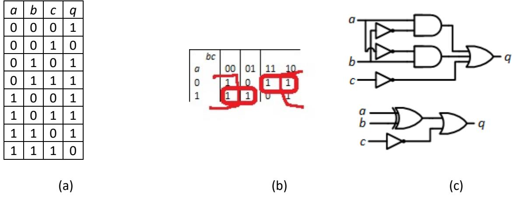

Figure 3.9: Another function: (a) Truth table; (b) Karnaugh map; (c) Implementation of $q = ab' + a'b + c'$ and $q = (a \oplus b) + c'$.

In Chapter 2, we used a Karnaugh map to generate the function $q = ab' + a'b + c'$, as shown in Figure 3.9 (b). We can create a circuit to realize this function using the same procedure we used for the previous function. We will need three NOT gates to generate $a'$, $b'$, and $c'$, two 2-input AND gates to generate $ab'$ and $a'b$, and one 3-input OR gate to combine $ab'$, $a'b$, and $c'$. This is shown in the first circuit in Figure 3.9 (c).

Karnaugh maps are very useful for creating AND/OR-based functions, but sometimes we can reduce the number of gates by going beyond these maps. In this example, $ab' + a'b$ is the same as $a \oplus b$. We could substitute this into our equation, giving us $q = (a \oplus b) + c'$. Then we could replace the two AND gates and the two NOT gates that generate $a'$ and $b'$ with a single XOR gate. In addition, the OR gate would only need two inputs instead of three. A circuit to realize this revised function is also shown in Figure 3.9 (c).

### 3.2.2 Implementing Functions using Sum of Products

Recall from Chapter 2 that each row of the truth table, or each square in the Karnaugh map, corresponds to one minterm. For each variable, we AND together either the variable or its complement. We AND the variable if its value in the row is 1, or we AND its complement if its value is 0. For example, the minterm for the row with $a = 1$, $b = 0$, and $c = 1$, is $ab'c$. Figure 3.10 (a) shows the truth table for a function we looked at previously, $q = a'bc' + ac$.

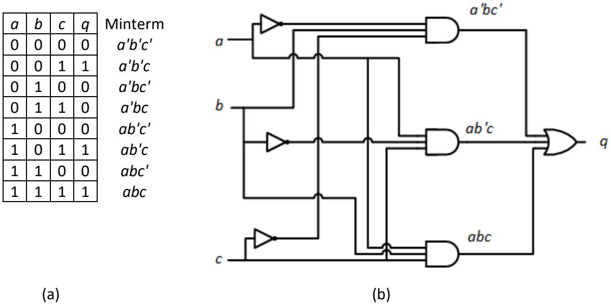

Figure 3.10: Implementing $q = a'bc' + ac$ using sum of products: (a) Truth table; (b) Circuit to realize $q$ using minterms.

To create a sum of products function, we first generate each minterm that sets $q$ to 1. In this example, we need three NOT gates to output $a'$, $b'$, and $c'$, three 3-input AND gates to generate $a'bc'$, $ab'c$, and $abc$, and finally a 3-input OR gate to combine these three minterms and output a 1 if any of them is 1. A circuit to realize this implementation is shown in Figure 3.10 (b).

Comparing the two circuits to generate $q$, shown in Figures 3.8 (c) and 3.10 (b), it is clear that the sum of products circuit is larger than the original circuit. So, why should we bother with sum of products? There are several reasons, some of which we'll discuss now and others that we will examine in later chapters. If your goal is to minimize the digital logic needed to realize a function, a very reasonable and frequently used goal, the sum of products can serve as a useful first step in developing your final function. Karnaugh maps are quite useful when you have a limited number of inputs, typically 4 or less, but other methods are used with larger numbers of inputs. These methods often start with minterms and reduce their equations (and thus the circuits that implement these equations) from there. Also, designers have implemented some standard, more complex, digital components that can be used to realize functions. We will introduce some of these components in the next chapter and how they can be used to realize functions in Chapter 5.

Now let's look at the other example from the previous subsection. Figure 3.11 (a) shows the truth table from Figure 3.10 (a) with the addition of the minterms associated with each row. There are six rows that set q to 1, so our sum of products implementation would use six 3-input AND gates to generate these minterms, one 6-input OR gate to combine the minterms, and three NOT gates to produce $a'$, $b'$, and $c'$. The circuit is shown in Figure 3.11 (b).

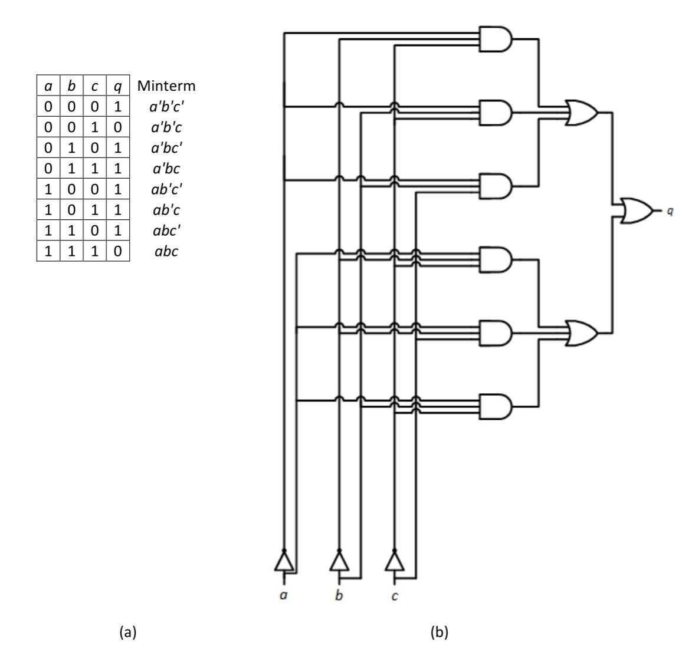

Figure 3.11: Implementing $q = a'b'c' + a'bc' + a'bc + ab'c' + ab'c + abc'$ using sum of products: (a) Truth table; (b) Circuit to realize $q$ using minterms.

There are a couple of things we can generalize from these two examples. First, each circuit has a column of AND gates followed by a single OR gate. For this reason, a sum of products is said to be implemented by an AND-OR circuit. Each AND gate generates one minterm and the OR gate combines them to produce the final output function. This leads to a second generalization: the number of rows in the truth table that set the output to 1 is also the number of AND gates in the first stage, and also the number of inputs to the OR gate. This is true because each row corresponds to one minterm; each row that outputs a 1 is one minterm

we must check. Since each AND gate outputs the value of one minterm, the two numbers must be equal.

One thing that is obvious about the circuit for this function is that it is quite large. We saw much simpler circuits for this function in Figure 3.9 (c). In the next subsection, we'll look at another design methodology that can also produce smaller circuits for some functions.

### 3.2.3 Implementing Functions using Product of Sums

In the previous example, six of the eight possible minterms set the output to 1, resulting in a circuit that requires a lot of digital logic. Here's another way of approaching this function. Instead of saying the function is 1 if one of the minterms that sets $q$ to 1 is active, we could say the function is 1 if none of the minterms that sets $q$ to 0 is active. That is, if it isn't set to 0, then it must be set to 1.

For our previous function, there are two minterms that set $q$ to 0, $a'b'c$ and $abc$. If $a = 0$, $b = 0$, and $c = 1$, then minterm $a'b'c$ is active (because $a' = 1$, $b' = 1$, and $c = 1$). Minterm $abc$ is active when $a = 1$, $b = 1$, and $c = 1$. For any other values of $a$, $b$, and $c$, neither of these minterms is active. It doesn't matter which of the other minterms is active; they all set $q$ to 1.

In terms of our function, $q = 1$ if $a'b'c = 0$ and $abc = 0$. In Boolean algebra, we can express this as

$$
q = (a'b'c + abc)'
$$

Applying De Morgan's Laws, specifically $X + Y = (X'Y')'$, or $(X + Y)' = X'Y'$, with $X = a'b'c$ and $Y = abc$, this becomes

$$
q = (a'b'c)'(abc)'
$$

We can apply De Morgan's Laws to each individual term, this time using the form $XYZ = (X' + Y' + Z')'$, or $(XYZ)' = X' + Y' + Z'$. For the first term, $a'b'c$, we set $X = a'$, $Y = b'$, and $Z = c$, and this becomes

$$
(a'b'c)' = (a+b+c')
$$

(Remember that $(a')' = a$ and $(b')' = b$.) Following the same procedure, $(abc)' = (a' + b' + c')$, and our function becomes

$$
q = (a + b + c')(a' + b' + c')
$$

The terms $(a + b + c')$ and $(a' + b' + c')$ are called **maxterms**. Each maxterm is always 1 except for one unique combination of input values. The first maxterm, $(a + b + c')$, is one for all possible values of $a$, $b$, and $c$ except $a = 0$, $b = 0$, and $c = 1$. The second term, $(a' + b' + c')$, is only zero when $a = 1$, $b = 1$, and $c = 1$. If either of these combinations of values is active, one of the two terms will be 0, and $q = 0 \cdot 1$ (or $1 \cdot 0$) = 0. For all other values of $a$, $b$, and $c$, both terms are 1 and $q = 1 \cdot 1 = 1$.

From the structure of the equations for $q$, we can see that we will need two 3-input OR gates to generate our maxterms and one 2-input AND gate to combine them, as well as three NOT gates to produce $a'$, $b'$, and $c'$. Figure 3.12 shows the expanded truth table and a circuit to implement the function as a product of sums.

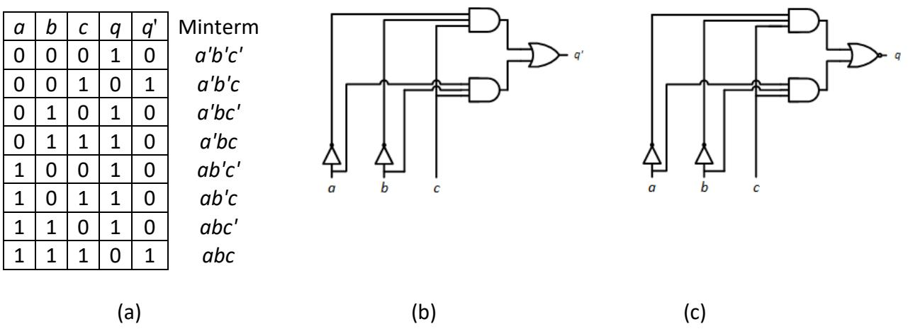

Figure 3.12: Implementing $q = (a + b + c')(a' + b' + c')$ using Product of Sums: (a) Expanded truth table; (b) Circuit to realize $q$ using maxterms.

Just as the minterm implementation produced a two-stage circuit, the maxterm circuit also has two stages. This time, however, the circuit has OR gates in the first stage and an AND gate in the second stage. This is referred to as an OR-AND circuit.

## 3.3 Inverse Functions

Sometimes it is easier to implement the inverse of a function rather than the function itself, and then just invert it to realize the desired function. In this section, we'll examine how to do this using both minterms and maxterms.

### 3.3.1 Inverse Functions Using Minterms

To illustrate how this can be done using minterms, let's start with the function given in Figure 3.11. This table, repeated and expanded in Figure 3.13 (a), has six of its eight minterms set $q$ to 1. We have expanded the table to add a column with the value of $q'$, which is only set to 1 by two minterms. First we will create a circuit to realize $q'$; then we will invert its output to generate $q$.

Figure 3.13: Implementing $q = (a'b'c + abc)'$ using Sum of Products for inverse functions: (a) Truth table; (b) Circuit to realize $q'$; (c) Inverting the output to realize $q$.

Using only minterms, $q'$ is only equal to 1 when either $a'b'c$ or $abc$ is 1. Just as we did previously, we can use AND gates to generate the minterms and an OR gate to combine them to produce the overall function. This circuit is shown in Figure 3.13 (b).

But we're not quite done. Remember that this circuit generates the inverse of our function, $q'$, and we still need to invert that value to generate our final function, $q$. We could accomplish this by placing a NOT gate at the output of the OR gate. A simpler method is to replace the OR gate with a NOR gate. The final circuit is shown in Figure 3.13 (c).

In general, realizing inverse functions using minterms can reduce the hardware needed when the number of minterms is large. In the truth table, this occurs when more than half the entries set the function to 1.

### 3.3.2 Inverse Functions Using Maxterms

Just as inverse functions can be created more efficiently when the number of minterms is large, inverse functions can also be created using less hardware when the number of maxterms is large. Let's return to another function from the previous section, $q = a'bc' + ac$. Its truth table, with corresponding maxterms, is shown in Figure 3.14 (a).

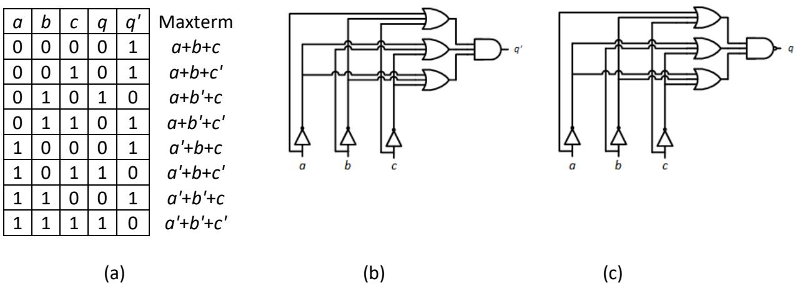

Figure 3.14: Implementing $q = ((a+b'+c)(a'+b+c')(a'+b'+c'))'$ using product of sums for inverse functions: (a) Truth table; (b) Circuit to realize $q'$; (c) Inverting the output to realize $q$.

If we wanted to realize $q$ directly as a product of sums, we would generate each minterm that sets $q$ to 0 and logically AND them together. For this function, we would need five 3-input OR gates and one 5-input AND gate. In this case, generating the inverse function and then inverting its output produces a simpler design.

Consider how we could generate $q'$ as a product of sums. Function $q'$ has only three maxterms equal to zero, so our circuit would need only three 3-input NOR gates and one 3 input AND gate. This circuit is shown in Figure 3.14 (b).

Finally, since this circuit generates $q'$, not $q$, we need to invert its output. We can do this by replacing the AND gate with a NAND gate. The final circuit is shown in Figure 3.14 (c).

Just as inverse functions can be used to reduce hardware when the number of minterms is large, they can also reduce hardware when the number of maxterms is large. Unlike minterms, however, this is the case when more than half the entries in the truth table set the function to 0.

### 3.3.3 What Inverse Functions Really Are

I haven't told you the entire story behind inverse functions yet, but I'll do so now. Inverse functions, as presented so far in this section, are not generally called inverse functions. Remember from Chapter 2 that each set of inputs that sets a function output to 1 is a minterm, and each that sets the function to 0 is a maxterm. In reality, the inverse function of minterms is just using the maxterms to set the function, and the inverse function of maxterms is just using the minterms to set the function. Both set it equally well; it's just a matter of selecting which method gives you the simplest circuits for the function you wish to realize.

## 3.4 Beyond the Logic

> In theory, practice and theory are the same. In practice they are not.

This somewhat famous quote has been attributed to a number of people, including Albert Einstein, Richard Feynman, and Yogi Berra. Here, this quote is applicable to digital logic design. Just because some function is theoretically possible doesn't mean that it can be implemented directly as shown in a Boolean equation. In the real world, there are limitations imposed by constraints such as the amount of current a logic gate can output. Logic gates are quite fast, but not instantaneous. They do take some small amount of time to output their results.

In this section, we will examine some of these constraints: fan-in, fan-out, and propagation delays. We will also introduce the buffer, a component that performs no logical function but is used to overcome constraints in certain cases.

### 3.4.1 Fan-in

The fan-in of a logic gate is the maximum number of inputs it can support. If you are using TTL or CMOS chips, this has already been decided for you. The chip has some logic gates built into it, and each gate has a fixed number of inputs. When creating new designs, such as a new chip however, this may not be the case.

Consider, for example, an AND function that has 25 inputs. In theory, you could realize that function using a single 25-input AND gate, as shown in Figure 3.15 (a). In practice, however, your AND gate technology may have a fan-in of a much lower number, and you would have to find another way to implement this function.

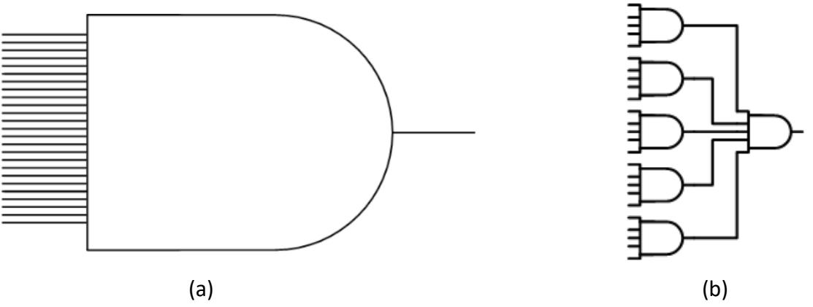

Figure 3.15: A 25-input AND function: (a) Using a single AND gate; (b) Using multiple gates with a maximum fan-in of 5.

To realize this function, let's assume that your AND gates have a maximum fan-in of five. We could then divide our 25 inputs into five groups of five inputs each. Each group of five inputs could be input to a 5-input AND gate. The output of each gate would be 1 only when its five inputs are 1. Then, the output of each of these AND gates would be input to another 5input AND gate. The output of this gate would only be 1 when its five inputs are 1, which only occurs when all 25 inputs to the other AND gates are 1. This circuit is shown in Figure 3.15 (b).

### 3.4.2 Fan-out

Fan-out is comparable to fan-in, but on the other side of a logic gate. Succinctly put, the fan-out of a logic gate is the maximum number of inputs of other gates it can be connected to. The gate has a limit on how much current it can output. When it sends its output to more than one other component's input, this current is split up among those components. When the current becomes too small, these components may not recognize the input value correctly. A typical TTL component has a fan-out of around 5; it can send its output to up to five other component inputs.

Consider the circuit shown in Figure 3.16. The OR gate sends its output to 25 different AND gates. Although the logic may be correct in theory, in practice this will not work. The maximum fan-out of the OR gate is much less than the number used in this circuit.

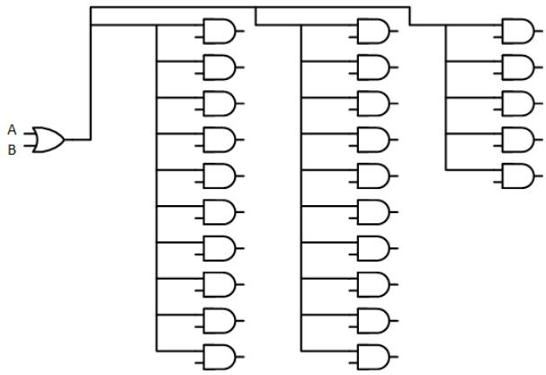

Figure 3.16: A digital circuit that does not meet fan-out requirements.

Now let's look at a way to get around fan-out limitations.

### 3.4.3 Buffers

To boost the output signal, engineers developed a component called a **buffer**. It inputs a signal at a given logic value and outputs a signal at the same logic value. In terms of Boolean logic, a buffer looks like the most useless component imaginable. All it does is output whatever is input to it. A wire would perform the same logical function. Yet, it was invented and is commonly used in digital circuits. Its truth table and logic symbol are shown in Figure 3.17.

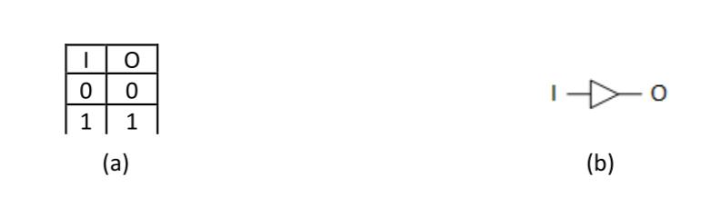

Figure 3.17: Buffer logic symbol and truth table.

Although its logic output has the same logical value as its input, there is an important difference. Its output current is at its maximum value, whereas the input current may be lower if the logic gate that supplies the input also sends it to other components.

To illustrate this, consider the 25-input AND gate in Figure 3.16. We can use buffers to realize this function while still meeting fan-out requirements. One way to do this is shown in Figure 3.18. Here, the OR gate sends its output to five buffers. Each buffer, in turn, sends its output to five AND gates. Since no component sends its output to more than five other inputs, this circuit meets fan-out requirements, assuming each component has a maximum fan-out of at least five.

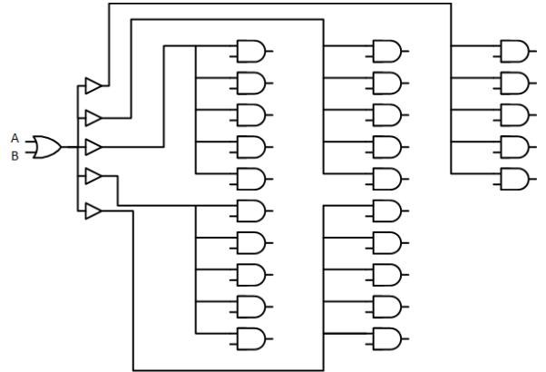

Figure 3.18: Digital circuit that meets fan-out requirements.

### 3.4.4 Propagation Delay

Prior to this section, we have been looking at logic gates in an idealized way. When we change the inputs to a logic circuit, the outputs change to their new values instantaneously. In practice, however, this is not the case. There is a very small, but non-zero amount of time needed for a gate to change its output from 0 to 1 or from 1 to 0. This is called the **propagation delay**. In many circuits, this delay is quite tolerable. Even with the propagation delay, the circuit functions as desired. In some cases, however, this can cause problems.

Consider, for example, the circuit shown in Figure 3.19 (a). When $ToBe = 1$, the output should be 1 because the upper input to the OR gate is 1. When it is 0, the output of the inverter is 1, so the OR gate should again output a value of 1. In theory, $Q$ should always be 1, as shown in the truth table in Figure 3.19 (b).

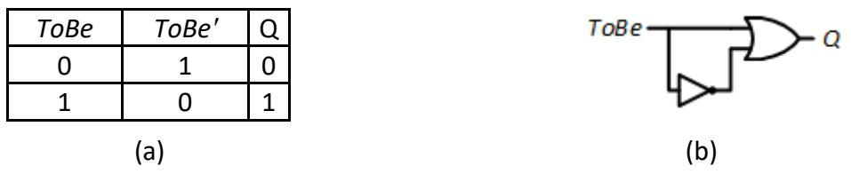

Figure 3.19: $ToBe + ToBe'$: (a) Circuit diagram; (b) Truth table.

Now let's look at a more practical example, the same circuit with non-zero propagation delays. For simplicity, assume that the NOT gate has a propagation delay of 5 nanoseconds (ns), that is, it may not generate the correct value until 5 ns after the input changes. Also assume the OR gate has a propagation delay of 8 ns. As shown in the timing diagram in Figure 3.20, when $ToBe$ changes from 1 to 0, it may take 5 ns for the output of the NOT gate to change from 0 to 1. During this time, both inputs to the OR gate will be 0, causing it to output a value of 0. As with the NOT gate, this output is also delayed, this time by 8 ns. After an additional 5 ns, the OR gate has adjusted its output value based on the new value of $ToBe'$. This entire sequence is illustrated in the animation of the circuit and timing diagram in Figure 3.20.

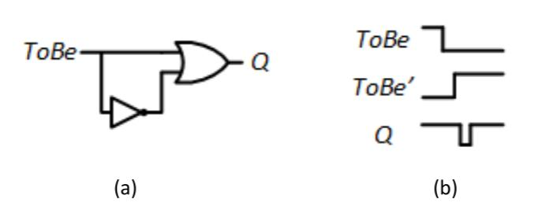

Figure 3.20: $ToBe + ToBe'$: (a) Circuit diagram; (b) Timing diagram with propagation delays.

Finally, there's one other thing to consider. The delays within a gate may or may not be symmetric. That is, the propagation delay when an output changes from 0 to 1 may not be the same as when the output changes from 1 to 0. For TTL and CMOS chips, you can refer to the chip's datasheet to find these values, denoted as $tPLH$ (0 to 1) and $tPHL$ (1 to 0).

## 3.5 Summary

In this chapter, we introduced digital logic components that realize fundamental Boolean functions. The AND gate outputs a logic 1 only if all its inputs are 1. The OR gate, on the other hand, outputs a logic 1 if *any* of its inputs is 1. The XOR, or exclusive OR, gate outputs a 1 if it has an odd number of inputs equal to 1. The NOT gate, unlike these other gates, has only one input. It sets its output to the opposite of its input value. The NAND, NOR, and XNOR gates perform exactly the opposite functions of the AND, OR, and XOR gates, respectively.

Next, this chapter examined how to realize more complex functions with these gates using sum of products and product of sums methods, as well as inverse functions.

Beyond the Boolean algebra used to specify functions, there are some physical limitations to digital logic that must be taken into account when designing a digital circuit. This chapter examined fan-in and fan-out, and the use of buffers to overcome some of these limitations. We also introduced propagation delay, which can inject timing delays into circuits that sometimes produce unintended consequences.

Some functions are used frequently in digital logic design. Engineers have developed integrated circuit chips to realize these functions; using them in digital circuits reduces the amount of power used, wiring needed in the circuit, and other parameters. We'll introduce some of these functions in the next chapter.

## Exercises

1. Show the truth tables for the 3- and 4-input AND gates.

2. Show the truth tables for the 3- and 4-input OR gates.

3. Show the truth tables for the 3- and 4-input XOR gates.

4. Show the truth tables for the 3- and 4-input NAND gates.

5. Show the truth tables for the 3- and 4-input NOR gates.

6. Show the truth tables for the 3- and 4-input XNOR gates.

7. Develop a minimal function for the truth table shown below and design a circuit to realize this function.

| a | b | c | q |
|---|---|---|---|
| 0 | 0 | 0 | 0 |
| 0 | 0 | 1 | 0 |
| 0 | 1 | 0 | 1 |
| 0 | 1 | 1 | 1 |
| 1 | 0 | 0 | 0 |
| 1 | 0 | 1 | 0 |
| 1 | 1 | 0 | 1 |
| 1 | 1 | 1 | 0 |

8. For the truth table in Problem 7, develop a function consisting solely of minterms and design a circuit to realize this function.

9. For the truth table in Problem 7, develop a function consisting solely of maxterms and design a circuit to realize this function.

10. For the truth table in Problem 7, develop a function to realize $q'$, the inverse of $q$, and design a circuit to realize $q$ based on this inverse function.

11. Develop a minimal function for the truth table shown below and design a circuit to realize this function.

| a | b | c | q |
|---|---|---|---|
| 0 | 0 | 0 | 1 |
| 0 | 0 | 1 | 0 |
| 0 | 1 | 0 | 1 |
| 0 | 1 | 1 | 1 |
| 1 | 0 | 0 | 0 |
| 1 | 0 | 1 | 1 |
| 1 | 1 | 0 | 1 |
| 1 | 1 | 1 | 0 |

12. For the truth table in Problem 11, develop a function consisting solely of minterms and design a circuit to realize this nction.

13. For the truth table in Problem 11, develop a function consisting solely of maxterms and design a circuit to realize this nction.

14. For the truth table in Problem 11, develop a function to realize $q'$, the inverse of $q$, and design a circuit to realize $q$ sed on this inverse function.

15. Redesign the circuit that implements the 25-input AND function in Figure 3.15 using gates with a maximum fan-in of 3.

16. Redesign the circuit that implements the 25-output function in Figure 3.16 using gates with a maximum fan-out of 3.

17. Figures 3.9, 3.11, 3.12, and 3.14 show four different circuits to realize the same function. For the maximum propagation delays for individual gates shown below, what is the maximum propagation delay for each circuit?

| Gate              | TTL IC #         | Maximum propagation delay |
|-------------------|------------------|---------------------------|
| 2-input AND gate  | 74LS08           | 20ns                      |
| 3-input AND gate  | 74LS11           | 20ns                      |
| 3-input NAND gate | 74LS10           | 15ns                      |
| 2-input OR gate   | 74LS32           | 22ns                      |
| 3-input OR gate   | 74LS32 (2 gates) | 44ns                      |
| 2-input XOR gate  | 74LS86           | 30ns                      |
| NOT gate          | 74LS04           | 15ns                      |
