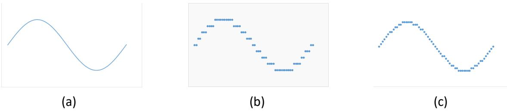
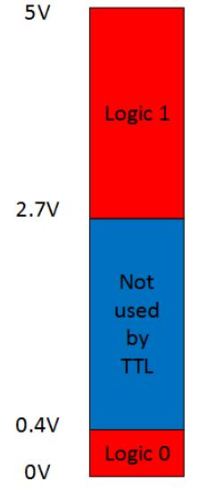

# Chapter 1: Digital Systems and Numbers

Digital systems are everywhere. From consumer appliances to the most advanced supercomputer, including the phone/tablet/computer you're using right now to read this ebook, virtually no aspect of our lives is untouched by these systems. To design these systems, the designer needs to understand what digital systems are (and are not), the mathematical background underlying digital systems, the components used in these systems, and how the digital design process works. We'll look at all of these as we progress through the book. In this chapter, we'll start with the basics.

Digital systems use binary values. Mathematically, binary is a base-2 system, where each value within the system is either 0 or 1. We'll look at what this means and how we represent these values in various media.

Just as we represent decimal numbers using more than one digit, we can represent binary numbers using more than one binary digit, or bit. In this chapter, we'll introduce several numeric formats used in some digital systems.

Binary values can also be used to represent nonnumeric data, such as alphanumeric characters (letters, numbers, and symbols). We'll look at a couple of the most commonly used formats.

Finally, this chapter introduces Gray code, a reflected binary code. We will make use of this code in Chapter 2 as we optimize our first digital designs.

## 1.1 What Are Digital Systems?

The world is digital! Everything is run by computers! Digital this! Digital that! Blah, blah, blah. You've probably heard all of this and more. But what is digital? What does it mean to be digital? What is something if it isn't digital? And how do you design something that is digital?

These are all fair questions. The first three are pretty straightforward, and we'll discuss them shortly. However, exploring that last question could fill many textbooks. This book will cover the basics of digital logic design for relatively simple systems. More advanced systems, such as computer systems and microprocessor design, build on the design methodologies presented here, but they are much more complex than those included in this book.

To answer the first question, let's start with a quote.

> There may be said to be two kinds of people in the world, those who constantly divide everybody into two classes, and those who do not. – Robert Benchley

In this section, we're going to be the kind of people who divide electrical signals into two classes. **Analog** signals are continuous. They can take on any value within a given range. In the sine wave shown in Figure 1.1 (a), the amplitude (height) of the sine wave can take on any value from -1 to +1. Any value in this range corresponds to the amplitude at some point(s) on the sine wave.

Figure 1.1: (a) Analog sine wave; (b) Digital representation with nine possible values; (c) Digital representation with nineteen possible values.

In contrast, digital signals are **quantized**. They can only take on specific values, and there are gaps between these values. The digital signals can only approximate the equivalent analog values. Consider a digital system that can represent only these nine values: -1, -¾, -½, -¼, 0, ¼, ½, ¾, and 1. Figure 1.1 (b) shows how we could represent the sine wave in this digital system by rounding the value of the amplitude to its nearest digital value.

The digital wave is rather choppy as compared to the analog wave. However, we can make the digital wave more like the analog wave by increasing the number of possible values. The digital wave in Figure 1.1 (c) uses a digital system with 19 possible values: -1, -0.9, -0.8, -0.7, -0.6, -0.5, -0.4, -0.3, -0.2, -0.1, 0, 0.1, 0.2, 0.3, 0.4, 0.5, 0.6, 0.7, 0.8, 0.9, and 1. You can see this wave is not as smooth as the analog wave, but it is much smoother than the previous digital wave.

So, if analog gives us smoother curves and more accurate values, why should we even use digital? There are many reasons to use digital. Digital signals are less susceptible to noise during transmission, resulting in less distortion and better signal quality. Furthermore, transmission across greater distances is possible with digital than with analog. Digital signals can transmit more information (per second) than analog signals. Digital circuits are often cheaper to design and manufacture than analog circuits. There are other reasons as well.

## 1.2 One and Zero

> There are 10 kinds of people in the world, those who know binary, and those who don't. – Anonymous (with apologies to Robert Benchley)

When we examine digital logic, we see that it uses discrete values. Unlike decimal, which has ten digits, digital logic uses **binary** values. Binary is base 2, as opposed to base 10 for decimal, and it has only two digits. These are typically represented as 1 and 0. Each value is called a **bit**, short for binary digit. You can also think of these values as true and false (which can be helpful when we discuss Boolean algebra in Chapter 2), on and off (like a light switch, but only a regular toggle switch, not a dimmer switch), or yes and no. As we design digital circuits, we'll mostly use 1 and 0.

So, why do we use binary? Why not use ternary (base 3) or some other base? As it turns out, it is much simpler to design electronics that generate two possible values than it is to design circuits that can output three or more possible values. If we need more possible values,

we can combine more outputs to represent these values. We'll look at how to do this for numeric values in the next section.

Now back to the electronics. Digital logic gates, the fundamental building blocks of digital systems, are constructed from transistors. Without going too in-depth, a transistor can be used in a circuit that is configured as a switch. When the switch is off, the circuit generates a very low voltage that corresponds to a logic value of 0. When it is on, it outputs a voltage that is interpreted as a logic value of 1. The circuit does not spend any appreciable time in the region between these two extremes, though it does spend some minimal time there as it transitions from one extreme to the other. Figure 1.2 shows these regions for transistor-transistor logic.

Figure 1.2: Voltage levels for transistor-transistor logic with a 5V source.

There are numerous ways to represent 1 and 0. As we just saw, voltage values are one way to do this. For TTL, transistor-transistor logic, 2.7V to 5V typically represents the logic value 1 and 0V to 0.4V represents logic 0. Values for other technologies are shown in Figure 1.3. Note that one technology, emitter-coupled logic, uses a negative power supply and thus has negative voltage values for its logic levels.

| Technology                                    | Source voltage | Logic 1   | Logic 0 |
|-----------------------------------------------|----------------|-----------|---------|
| TTL: transistor-transistor logic              | 5V             | 2.7-5V    | 0-0.4V  |
| CMOS: complementary metal-oxide semiconductor | 5V 3.3V        | 4.44-5V 2.4-3.3V  | 0-0.5V 0-0.4V  |
| ECL: Emitter-coupled logic                    | -5.2V          | -0.9V     | -1.75V  |
| PECL: Positive ECL                            | 5V 3.3V          | 4.1V 2.27-3.3V  | 0-3.3V 0-1.68V  |

Figure 1.3: Voltages corresponding to logic values for several technologies

Memory chips are used to store digital logic values. For the E2PROM memory chips used in flash drives, SD cards, and solid-state drives, these values are similar to those of TTL chips.

Voltage is not the only way to store digital logic values, though any other method ultimately must be converted to voltages to be used by the rest of a digital system. A traditional (non-SSD) drive stores each bit by magnetizing a portion of the disc in one of two directions. The drive has two heads to read values from the disc. Reading the value induces a current from one head to the other. The current flows in one of two directions, from the first head to the second or vice versa, depending on the magnetization of the disc at that point. Circuitry (connected to the heads of the disc drive) outputs a voltage value corresponding to logic 1 or logic 0 that depends on the direction of current flow.

Optical discs, including CDs, DVDs, and Blu-Ray, encode logic values in one of two ways. For pre-recorded discs, such as a movie you might buy on Blu-Ray (if anyone is still buying discs by the time you read this), the discs are manufactured with areas called **pits** and **lands** that reflect light. The disc drive shines a laser onto a portion of a disc that stores one bit and senses the intensity of the reflected light. A higher intensity corresponds to a logic value of 1 and a lower intensity denotes logic 0. Recordable optical discs, such as DVD RW, write data to the disc by darkening and lightening areas of the disc to achieve the same result. As an aside, note that Blu-Ray discs use lasers of a different frequency than CDs and DVDs which allows them to focus on a smaller area of the disc; this is why they can store more data than the other optical discs.

## 1.3 Representing Numbers in Binary – Basics

Ultimately, we want to use binary values to represent all types of information. Foremost among these are numbers and alphanumeric characters. In this section, we'll introduce the basics of binary numbers. In the following sections we'll look at more complex numeric formats and formats for characters.

### 1.3.1 How Binary Numbers Work

To explain how binary numbers work, first let's look at how decimal numbers work, since the general method is similar. The decimal number system has ten digits, 0 to 9, but it wouldn't be very useful if it could not represent values greater than nine. To do this, we use multiple digits in a number. The value of each digit is based on both its value as a digit and its place in the number. Consider, for example, the number 135.79. The 1 is in the hundreds place, so its value is 1 × 100 = 100. Similarly, the 3 has a value of 3 × 10 = 30 because it is in the tens place, and so on for the remaining digits. We could expand this as

$$
\begin{aligned}
135.79 &= \langle 1 \times 100 \rangle + \langle 3 \times 10 \rangle + \langle 5 \times 1 \rangle + \langle 7 \times 0.1 \rangle + \langle 9 \times 0.01 \rangle \\
&= \langle 1 \times 10^2 \rangle + \langle 3 \times 10^1 \rangle + \langle 5 \times 10^0 \rangle + \langle 7 \times 10^{-1} \rangle + \langle 9 \times 10^{-2} \rangle
\end{aligned}
$$

Binary numbers are created in the same way, except we use powers of 2 instead of powers of 10 since binary is base 2. For example, the binary number 1011.01 can be expressed as follows.

$$
\begin{aligned}
1011.01 &= (1 \times 2^3) + (0 \times 2^2) + (1 \times 2^1) + (1 \times 2^0) + (0 \times 2^{-1}) + (1 \times 2^{-2}) \\
&= (1 \times 8) + (0 \times 4) + (1 \times 2) + (1 \times 1) + (0 \times \frac{1}{2}) + (1 \times \frac{1}{4}) \\
&= 11\frac{1}{4}
\end{aligned}
$$

You can include more bits to represent larger numbers or numbers with larger denominators.

### 1.3.2 Octal and Hexadecimal Notations

Properly designed digital circuits can deal with large binary numbers fairly easily. For humans, however, long strings of 0s and 1s can become tedious and error-prone. Consider, for instance, the decimal number 927.625. We would express this in binary as 1110011111.101. To make it simpler for people to understand these numbers, we often use notations that combine several bits into one symbol. It is fairly easy to convert binary notation to another notation that is an exact power of 2, such as base 8 (octal) or base 16 (hexadecimal). It is much more complex to convert from binary to another base, such as base 5.

First, let's look at octal notation. This is base 8. It has eight symbols, 0 to 7. Since $8 = 2^3$, we can combine groups of three binary bits into single octal digits. The key is to start at the right place; that place is the radix point. (Think of this as the decimal point, but in any base/radix.) Going to the left, divide the binary bits into groups of three bits. If the final group has less than three bits, add leading zeroes to complete a group of three bits. Now do the same with the bits to the right of the radix point that represent the fractional portion of the number, grouping the bits into threes going right and adding trailing zeroes if needed to complete the final group. Figure 1.4 shows how we do this for our example value.

$$
\begin{aligned}
927.625 = 1110011111.101 &= 001\ 110\ 011\ 111.101 \\
&=\ \ 1\ \ \ \ \ 6\ \ \ \ \ 3\ \ \ \ \ 7\ \ .\ 5
\end{aligned}
$$

Figure 1.4: Converting 927.625 from binary to octal. Zeroes added to complete groups of three bits are shown in red.

Hexadecimal is base 16. It has 16 symbols. We can use the decimal symbols 0 to 9 for ten of these symbols, but we still need six symbols for the values corresponding to 10 to 15. Hexadecimal uses the letters A to F for these values, with A=10, B=11, C=12, D=13, E=14, and F=15.

With that out of the way, we can use the same conversion process we used for octal, with one exception. Since 16=24, we divide our binary number into groups of four bits instead of three. Figure 1.5 shows the conversion process for our example value.

$$
\begin{aligned}
927.625 = 1110011111.101 &= 0011\ 1001\ 1111.1010 \\
&= \ \ \ 3\ \ \ \ \ \ 9\ \ \ \ \ \ \ F\ \ \ .\ \ A
\end{aligned}
$$

Figure 1.5: Converting 927.625 from binary to hexadecimal. Zeroes added to complete groups of four bits are shown in red.

### 1.3.3 Converting from Decimal to Binary

There's one step I didn't cover explicitly yet: How did I get from 927.625 to 1110011111.101? You may have a calculator app that will do this automatically for you. If so, great, but put it away for a few minutes while we introduce the underlying process. We're actually going to have two separate processes, one for the integer part of the number and one for the fractional part.

First, let's look at the integer part. We divide 927 ÷ 2 to get a quotient of 463 and a remainder of 1. What we're really doing is expressing 927 as 463 × 2 + 1. Next, we divide 463 by 2 to get 463 = 231 × 2 + 1, We continue this process until we're down to a final value of 0, we have:

$$
\begin{aligned}
927 &= 463 \times 2^1 + 1 \times 2^0 \\
&= (231 \times 2^1 + 2^0) \times 2^1 + 2^0 = 231 \times 2^2 + 1 \times 2^1 + 1 \times 2^0 \\
&= (115 \times 2^1 + 2^0) \times 2^2 + 1 \times 2^1 + 1 \times 2^0 = 115 \times 2^3 + 1 \times 2^2 + 1 \times 2^1 + 1 \times 2^0 \\
&= (57 \times 2^1 + 2^0) \times 2^3 + 1 \times 2^2 + 1 \times 2^1 + 1 \times 2^0 = 57 \times 2^4 + 1 \times 2^3 + 1 \times 2^2 + 1 \times 2^1 + 1 \times 2^0 \\
&= (28 \times 2 + 2^0) \times 2^4 + 1 \times 2^3 +1 \times 2^2 + 1 \times 2^1 + 1 \times 2^0 = 28 \times 2^5 + 1 \times 2^4 + 1 \times 2^3 +1 \times 2^2 + 1 \times 2^1 + 1 \times 2^0 \\
&= 14 \times 2^6 + 0 \times 2^5 + 1 \times 2^4 + 1 \times 2^3 + 1 \times 2^2 + 1 \times 2^1 + 1 \times 2^0 \\
&= 7 \times 2^7 + 0 \times 2^6 + 0 \times 2^5 + 1 \times 2^4 + 1 \times 2^3 + 1 \times 2^2 + 1 \times 2^1 + 1 \times 2^0 \\
&= 3 \times 2^8 + 1 \times 2^7 + 0 \times 2^6 + 0 \times 2^5 + 1 \times 2^4 + 1 \times 2^3 + 1 \times 2^2 + 1 \times 2^1 + 1 \times 2^0 \\
&= 1 \times 2^9 +
1 \times 2^8 + 1 \times 2^7 + 0 \times 2^6 + 0 \times 2^5 + 1 \times 2^4 + 1 \times 2^3 + 1 \times 2^2 + 1 \times 2^1 + 1 \times 2^0 \\
&= 1110011111_2
\end{aligned}
$$

The remainders are combined to give us the binary representation of the integer. The first remainder is the least significant bit and the last remainder is the most significant bit. For our value of 927, this is 1110011111.

We calculate the fractional portion using a different but analogous approach. Instead of dividing by 2, we multiply by 2. The bits of the fraction in binary are the integer portion of each product. For our fraction of 0.625, we first multiply by 2 to get 0.625 × 2 =1.25, or 0.625 = 1.25 × 2-1. We keep the 1 and repeat the process on the remaining fractional value, 0.25, and continue until the remaining fraction is 0. (Sometimes a fraction would never end. For example, 1/3 = .010101… in binary. Normally we would decide how many bits to include in the fraction and round the result to that many bits.) Figure 1.7 shows this process for our fractional value.

$$
\begin{aligned}
0.625 &= 1.25 \times 2^{-1} = 1 \times 2^{-1} + 0.25 \times 2^{-1} \\
&= 1 \times 2^{-1} + (0.5 \times 2^{-1}) \times 2^{-1} = 1 \times 2^{-1} + 0 \times 2^{-2} + 0.5 \times 2^{-2} \\
&= 1 \times 2^{-1} + 0 \times 2^{-2} + (1 \times 2^{-1}) \times 2^{-2} = 1 \times 2^{-1} + 0 \times 2^{-2} + 1 \times 2^{-3} \\
&= 0.101_2
\end{aligned}
$$

Here, we combine the bits of the integer part of the product to generate the binary fraction. The first 1, generated by 0.625 × 2, is the most significant bit of the fraction. Unlike the integer procedure, which generated bits from least significant to most significant, the fraction procedure generates the bits in the opposite order, from most significant to least significant. It may help to describe this by saying that both procedures start by generating the bit closest to the radix point and move further away each iteration.

The final step is trivial. We simply concatenate the integer and fraction to produce the final result. For our example, this yields 927.625 = 1110011111.101.

As you might have guessed, you can use this process to convert a number from decimal (base ten) to any arbitrary base. Instead of dividing and multiplying by 2, we divide and multiply by the base we are converting to.

## 1.4 Numeric Formats

Many digital systems, mostly computers, use several different numeric formats. In this section, we'll look at some of these formats. The first type, unsigned formats, is typically used for integers. In spite of its name, one unsigned format allows for both positive and negative numbers. We'll explain how this works shortly. Next, we'll introduce floating point formats and the IEEE 754 floating point standard that is supported by virtually all computer systems.

### 1.4.1 Unsigned Formats

There are two unsigned formats we discuss in this section. The first, traditional unsigned numbers, is simply the integer portion of the binary format we introduced in the previous section. Here, an *n*-bit number can take on any integer value from $0$ to $2^n - 1$. Figure 1.6 (a) shows the values for all 4-bit numbers in this format.

The second unsigned format is two's complement. Before we discuss this format, let's take a minute to discuss what complements are and how they are formed.

A complement is the opposite of something. For binary numbers, there are two different types of complements: one's complement and two's complement. To obtain the one's complement of a binary number, you can do one of two things:

- Change all the 1s to 0s and all the 0s to 1s (inverting bits), or
- Subtract the number from a number of equal length that is all 1s.

Figure 1.7 shows both processes for the binary value 0101, or 5 in decimal.

| Binary | Unsigned traditional(a) | Binary | Unsigned two's complement(b) |
|--------|----------------------|--------|---------------------------|
| 0000   | 0                    | 0000   | 0                         |
| 0001   | 1                    | 0001   | 1                         |
| 0010   | 2                    | 0010   | 2                         |
| 0011   | 3                    | 0011   | 3                         |
| 0100   | 4                    | 0100   | 4                         |
| 0101   | 5                    | 0101   | 5                         |
| 0110   | 6                    | 0110   | 6                         |
| 0111   | 7                    | 0111   | 7                         |
| 1000   | 8                    | 1000   | -8                        |
| 1001   | 9                    | 1001   | -7                        |
| 1010   | 10                   | 1010   | -6                        |
| 1011   | 11                   | 1011   | -5                        |
| 1100   | 12                   | 1100   | -4                        |
| 1101   | 13                   | 1101   | -3                        |
| 1110   | 14                   | 1110   | -2                        |
| 1111   | 15                   | 1111   | -1                        |

Figure 1.6: Values for all 4-bit binary numbers in (a) traditional and (b) two's complement unsigned notations.

$$
\begin{aligned}
  & \; 0 \;\; 1 \;\; 0 \;\; 1 \qquad \qquad \qquad \;\; 1 \;\; 1 \;\; 1 \;\; 1 \\
  & \downarrow \;\; \downarrow \;\; \downarrow \;\; \downarrow \qquad \qquad \quad \; - \; 0 \;\; 1 \;\; 0 \;\; 1 \\[-2.5ex]
  & \qquad \qquad \qquad \qquad \qquad \rule{1.5cm}{0.4pt} \\[-1ex]
  & \; 1 \;\; 0 \;\; 1 \;\; 0 \qquad \qquad \qquad \;\; 1 \;\; 0 \;\; 1 \;\; 0 \\
  & \qquad (a) \qquad \qquad \qquad \qquad \quad (b)
\end{aligned}
$$

Figure 1.7: Creating one's complement by (a) inverting bits, and (b) subtraction.

The two's complement is simply the one's complement plus 1. Just as was the case for the one's complement, there are two ways we can produce the two's complement of a binary number:

- Create the one's complement and add 1, or
- Subtract the number from a number that has a leading 1 and as many zeroes as there are bits in the original number. (For example, we would subtract a 4-bit number from 10000, a leading 1 and four zeroes.)

Figure 1.8 shows both methods for our previous value, 0101.

$$
\begin{aligned}
  & \; 0 \;\; 1 \;\; 0 \;\; 1 \qquad \qquad \qquad 1 \;\; 0 \;\; 0 \;\; 0 \;\; 0\\
  & \downarrow \;\; \downarrow \;\; \downarrow \;\; \downarrow \qquad \qquad \quad - \quad 0 \;\; 1 \;\; 0 \;\; 1 \\[-2.5ex]
  & \qquad \qquad \qquad \qquad \qquad \rule{1.8cm}{0.4pt} \\[-1ex]
  & \; 1 \;\; 0 \;\; 1 \;\; 0 \qquad \qquad \qquad \quad 1 \;\; 0 \;\; 1 \;\; 1 \\
+ & \qquad \quad \;\; 1 \\[-2.5ex] % Adjust vertical space before line
  & \rule{1.5cm}{0.4pt} \\[-1ex] % Draw a line manually (adjust width)
  & \;1 \;\; 0 \;\; 1 \;\; 1 \\
  & \qquad (a) \qquad \qquad \qquad \qquad \quad (b)
\end{aligned}
$$

Figure 1.8: Creating two's complement by (a) creating one's complement and adding 1, and (b) subtraction.

Now, the reason we did all this is because *the two's complement of a number represents the negative of that number in two's complement notation*. For two's complement numbers with *n* bits, the values can range from $-2^{n-1}$ to $+2^{n-1}-1$. When the most significant bit is 1, the number is negative. When it is 0, the number is positive or zero. Figure 1.7 (b) shows the values for all 4-bit numbers in two's-complement format.

Comparing these two unsigned formats, we see that both use the same representation when the leading bit is 0. The difference in value occurs when the leading bit is 1.

Here's one final question. Why is the two's complement notation called unsigned when the values can be either positive or negative? There's a good reason for this, which we'll see in the next subsection.

### 1.4.2 Floating Point Numbers

Digital systems that use floating point numbers typically follow the **IEEE 754 Floating Point Standard** for binary numbers. A number, $V$, is expressed as:

$$
V = (-1)^s \times M \times 2^E
$$

Where:

* **$s$ (Sign):** Determines the sign of the number: $s = 0$ for positive, $s = 1$ for negative.
* **$M$ (Significand/Mantissa):** A fractional binary number. It ranges from $1$ to $2 - \epsilon$ for normalized values, or from $0$ to $1 - \epsilon$ for denormalized values, where $\epsilon$ is the machine epsilon.
* **$E$ (Exponent):** Weights the value by a power of 2.

Figure 1.9 summarizes the key characteristics of common floating-point formats:

| Format | Total Bits | Exponent Bits ($k$) | Fraction Bits ($n$) |
| :----- | :--------- | :------------------ | :------------------ |
| Double | 64         | 11                  | 52                  |
| Float  | 32         | 8                   | 23                  |
| FP16   | 16         | 5                   | 10                  |
| BF16   | 16         | 8                   | 7                   |

Figure 1.9: Floating-point Formats

Floating-point numbers can represent various special values, defined by the exponent ($e$) and fraction ($f$) fields, Where the bias is $2^{k-1} - 1$.

| Category            | Condition                 | Value                                       |
| :------------------ | :------------------------ | :------------------------------------------ |
| Normalized Values   | $0 < e < 2^k - 1$         | $(-1)^s \times (1 + f) \times 2^{e - bias}$ |
| Denormalized Values | $e = 0$                   | $(-1)^s \times f \times 2^{1 - bias}$       |
| Infinity            | $e = 2^k - 1$, $f = 0$    | $(-1)^s \times \infty$                      |
| NaN (Not a Number)  | $e = 2^k - 1$, $f \neq 0$ | NaN                                         |

Figure 1.10: Different kind of Float

**Denormalized numbers** serve two crucial purposes:

1.  **Representation of Zero:** They allow for distinct representations of positive ($+0.0$) and negative ($-0.0$) zero, differentiated by the sign bit.
2.  **Representation of Values Close to Zero:** They enable the representation of numbers very close to $0.0$, filling the gap between zero and the smallest normalized number.

## 1.5 Representing Nonnumeric Data

Not all data is numeric; this sentence is proof of that statement. Much of the data used by digital systems is not numeric, and much of that data consists of letters and other characters. In this section, we'll briefly look at two popular schemes for encoding characters, ASCII and Unicode.

### 1.5.1 ASCII

As mainframe computers began to find more uses in industry, and more companies designed and manufactured them, it became necessary to standardize some aspects such as the codes used to represent characters. One standard, initiated by IBM engineer Bob Bemer, led to the development of **ASCII**, the American Standard Code for Information Interchange. This standard dates back to the early 1960s, when it was developed by the American Standards Association. When its use was mandated for all systems used by the United States federal government, its success was assured.

ASCII specifies 7-bit codes for $2^7=128$ characters. Of these 128 characters, 95 are characters that can be printed, including uppercase and lowercase letters, decimal digits, and punctuation marks. The other 33 are control characters, which controlled the teletype machines of that era, performing functions like line feed to make the teletype machine go to the start of the next line.

Figure 1.11 shows the ASCII characters and their binary codes. The character names in italics are the nonprinting control characters.

ASCII solved a lot of problems for computer developers, but it also had some significant drawbacks. It did a great job if you wanted to encode text written in English, but it lacked characters used in other languages, such as ñ in Spanish. If you wanted to write in a language that uses a different alphabet, such as Russian, or a language that uses pictorial characters, such as Japanese or Chinese, ASCII wasn't going to work for you. Several extensions to ASCII were developed. They typically extended the ASCII code to eight bits, which allowed up to $2^8=256$ characters. In these extended versions, the first 128 characters were usually the original ASCII characters, and the other 128 were the extended characters. This was a stopgap; clearly a more robust system was needed. One such system is **UNICODE**, described next.

| Code     | Character | Code     | Character | Code     | Character | Code     | Character |
|----------|----------|----------|----------|----------|----------|----------|----------|
| 00000000 | NUL      | 00100000 | space    | 01000000 | @        | 01100000 | `        |
| 00000001 | SOH      | 00100001 | !        | 01000001 | A        | 01100001 | a        |
| 00000010 | STX      | 00100010 | "        | 01000010 | B        | 01100010 | b        |
| 00000011 | ETX      | 00100011 | #        | 01000011 | C        | 01100011 | c        |
| 00000100 | EOT      | 00100100 | \$       | 01000100 | D        | 01100100 | d        |
| 00000101 | ENQ      | 00100101 | %        | 01000101 | E        | 01100101 | e        |
| 00000110 | ACK      | 00100110 | &        | 01000110 | F        | 01100110 | f        |
| 00000111 | BEL      | 00100111 | '        | 01000111 | G        | 01100111 | g        |
| 00001000 | BS       | 00101000 | (        | 01001000 | H        | 01101000 | h        |
| 00001001 | HT       | 00101001 | )        | 01001001 | I        | 01101001 | i        |
| 00001010 | LF       | 00101010 | *        | 01001010 | J        | 01101010 | j        |
| 00001011 | VT       | 00101011 | +        | 01001011 | K        | 01101011 | k        |
| 00001100 | FF       | 00101100 | ,        | 01001100 | L        | 01101100 | l        |
| 00001101 | CR       | 00101101 | -        | 01001101 | M        | 01101101 | m        |
| 00001110 | SO       | 00101110 | .        | 01001110 | N        | 01101110 | n        |
| 00001111 | SI       | 00101111 | /        | 01001111 | O        | 01101111 | o        |
| 00010000 | DLE      | 00110000 | 0        | 01010000 | P        | 01110000 | p        |
| 00010001 | DC1      | 00110001 | 1        | 01010001 | Q        | 01110001 | q        |
| 00010010 | DC2      | 00110010 | 2        | 01010010 | R        | 01110010 | r        |
| 00010011 | DC3      | 00110011 | 3        | 01010011 | S        | 01110011 | s        |
| 00010100 | DC4      | 00110100 | 4        | 01010100 | T        | 01110100 | t        |
| 00010101 | NAK      | 00110101 | 5        | 01010101 | U        | 01110101 | u        |
| 00010110 | SYN      | 00110110 | 6        | 01010110 | V        | 01110110 | v        |
| 00010111 | ETB      | 00110111 | 7        | 01010111 | W        | 01110111 | w        |
| 00011000 | CAN      | 00111000 | 8        | 01011000 | X        | 01111000 | x        |
| 00011001 | EM       | 00111001 | 9        | 01011001 | Y        | 01111001 | y        |
| 00011010 | SUB      | 00111010 | :        | 01011010 | Z        | 01111010 | z        |
| 00011011 | ESC      | 00111011 | ;        | 01011011 | [        | 01111011 | \{        |
| 00011100 | FS       | 00111100 | \<        | 01011100 | \        | 01111100 | \|         |
| 00011101 | GS       | 00111101 | =        | 01011101 | ]        | 01111101 | \}        |
| 00011110 | RS       | 00111110 | >        | 01011110 | ^        | 01111110 | ~        |
| 00011111 | US       | 00111111 | ?        | 01011111 | _        | 01111111 | DEL      |

Figure 1.11 ASCII Table

### 1.5.2 UNICODE

As computing expanded its scope and breadth, English was joined by many other languages used for documents stored in digital form. Some of these languages used the same characters as English, sometimes with their own additions, and others used completely different characters. It became clear that having a new encoding that encompassed all these characters, or at least as many as feasible, was desirable. Several systems were developed; the most commonly used is UNICODE.

UNICODE is actually a set of several encoding standards. The most popular are UTF-8 and UTF-16. UTF-8 was designed to maintain compatibility with ASCII. UTF-16 was designed to address the inclusion of non-English characters. UTF-16 supports over one million characters, but we'll focus on the most basic representation, which uses 16 bits to specify one of $2^{16}=65536$ different codes. Most of these codes specify one specific character, though some are used in combination with a second 16-bit code to specify a character. In addition to English language characters, UTF-16 also encodes Cyrillic, Arabic, Hebrew, Chinese, Japanese, Korean, and many other characters. I won't list all the characters here. See the UNICODE Consortium website or your favorite online search engine for these character encodings.

## 1.6 Gray Code

Counting in binary is fairly straightforward. Just as we count from 0→1→2→3→4→5→6→7 in decimal, we can count from 000→001→010→011→100→101→110→111 in binary. If all three bits in the binary count change at exactly the same time, this sequence works fine. There are ways to make this happen, often using additional hardware to synchronize these transitions. Without this additional hardware, however, we could run into a problem.

Consider the transition from 011 to 100. If the first bit changes faster than the other two, we could go to 111 instead of 100. Similarly, a faster second bit could bring us to 001, and a faster third bit could send us to 010.

Another way to avoid this issue is to develop sequences in which only one bit changes in each transition. Although not quite as useful when counting, this is very useful when developing state machines (introduced later in this book). It also serves as the basis for Karnaugh maps, which are used to simplify functions and their circuits, and are introduced in the next chapter. This is the reason we're introducing this topic now.

The **Gray code**, named after Bell Labs physicist Frank Gray, is a reflected binary code. To construct this code, we start with a 1-bit sequence of 0 and 1, shown in Figure 1.12 (a). To extend this to a 2-bit sequence, we first reflect the code, as shown in Figure 1.12 (b). We then add a leading 0 to each entry above the line and a leading 1 to every value below the line to give us the complete 2-bit code; see Figure 1.12 (c). (If we were to go through this code in sequence, the last entry goes back to the first entry.) We could repeat this process to generate the 3-bit Gray code shown in Figure 1.12 (d), and we could extend this sequence to produce a Gray code of any length. Here, the 3-bit Gray code follows the sequence 000→001→011→010→110→111→101→100.

$$
\begin{aligned}
& 0 \qquad \qquad 0 \qquad \qquad 00 \qquad \qquad 000 \\
& 1 \qquad \qquad 1 \qquad \qquad 01 \qquad \qquad 001 \\[-2.5ex]
& \; \qquad \qquad \rule{0.3cm}{0.4pt} \\[-1ex]
& \;\; \qquad \qquad 1 \qquad \qquad 11 \qquad \qquad 011 \\
& \;\; \qquad \qquad 0 \qquad \qquad 10 \qquad \qquad 010 \\[-2.5ex]
& \qquad \qquad \qquad \qquad \qquad \qquad \quad \;\; \rule{0.8cm}{0.4pt} \\[-1ex]
& \qquad \qquad \qquad \qquad \qquad \qquad \qquad 110 \\
& \qquad \qquad \qquad \qquad \qquad \qquad \qquad 111 \\
& \qquad \qquad \qquad \qquad \qquad \qquad \qquad 101 \\
& \qquad \qquad \qquad \qquad \qquad \qquad \qquad 100 \\
& (a) \qquad \quad (b) \qquad \quad \;\; (c) \qquad \qquad (d)
\end{aligned}
$$

Figure 1.12: Gray codes: (a) 1-bit Gray code; (b) Reflecting the 1-bit code; (c) Adding leading bit to produce the 2-bit Gray code; (d) 3-bit Gray code.

## 1.7 Summary

Digital systems are ubiquitous. Unlike analog systems, which use continuous values, digital systems have discrete values with gaps between the values. By making the gaps small enough, a digital system can approximate an analog system.

The binary number system is the basis for digital systems. The binary system has only two values, which we call one and zero. The components used to construct digital systems are typically built using transistors or other semiconductor components. Voltage levels represent these two logic values. Some storage devices use magnetization or reflectivity. Ultimately, these are converted to their corresponding voltage values.

Just as with decimal numbers, binary numbers can be extended beyond 0 and 1 by using more binary digits, or bits. Long strings of bits can be difficult to read (for humans), so we often use octal or hexadecimal notation to represent binary numbers. Digital systems, however, always work with binary values. The processes to convert numbers between decimal, binary, octal, and hexadecimal are straightforward.

In addition to traditional binary numbers, there are other ways to represent numbers in binary. These include unsigned and signed notations, as well as floating point. There are also encodings for nonnumeric data, such as characters. ASCII and UNICODE are two commonly used methods. UNICODE specifies several different encodings, of which UTF-8 and UTF-16 are used most frequently.

Gray codes are sequences of binary values in which adjacent values have only one bit that is different. It is useful in designing systems to avoid issues when more than one bit changes its value simultaneously. It is the basis for Karnaugh maps, a method used to simplify binary functions, and hence the digital logic we use to implement these functions.

In the next chapter, we will introduce Boolean algebra. This is the mathematics behind binary numbers and the basis for the digital logic we will use to design digital systems throughout this book and beyond.

## Exercises

1. List three analog and three digital systems or devices found in a typical home.

2. Besides those listed at the end of Section 1.1, what are some other advantages that digital systems have over analog systems? What are some advantages that analog systems have over digital systems?

3. Convert 631 from:
	- a. Decimal to binary
	- b. Binary to octal
	- c. Binary to hexadecimal

4. Convert 185.375 from:
	- a. Decimal to binary
	- b. Binary to octal
	- c. Binary to hexadecimal

5. Convert 10111101 from binary to:
	- a. Decimal
	- b. Octal
	- c. Hexadecimal

6. Convert 1011011010.01 from binary to:
	- a. Decimal
	- b. Octal
	- c. Hexadecimal

7. Convert 1537 directly (i.e. without first converting to binary) from decimal to:
	- a. Octal
	- b. Hexadecimal

8. Convert 753 from octal to hexadecimal.

9. Convert A7F from hexadecimal to octal.

10. Show the decimal number 13 in the following formats:
	- a. Traditional unsigned (8 bits)
	- b. Unsigned two's complement (8 bits)

11. Show the decimal number -13 in the following formats:
	- a. Unsigned two's complement (8 bits)

12. A digital system stores floating point numbers using an 8-bit significand and a 4-bit exponent with a bias of 8. Show how it stores the binary number 101.11101.

13. A digital system stores floating point numbers using an 8-bit significand and a 4-bit exponent with a bias of 8. Show how it stores the binary number .00101101.

14. Show how the binary value 101.11101 is stored in IEEE 754:
	- a. Single precision format
	- b. Double precision format

15. Show how the binary value .00101101 is stored in IEEE 754:
	- a. Single precision format
	- b. Double precision format

16. Show how your name is encoded in:
	- a. ASCII
	- b. UTF-8
	- c. UTF-16
17. Convert the following ASCII codes to the characters they represent:

1000011 1101111 1101101 1110000 1110101 1110100 1100101 1110010

18. Convert the following UTF-8 codes to the characters they represent:

01000100 01101001 01100111 01101011 01110100 0110001 01101100

19. Convert the following UTF-16 codes (shown in hexadecimal format) to the characters they represent

0043 0069 0072 0063 0075 0069 0074

20. Convert the codes shown in the previous three problems to each of the other formats. Show the 4-bit Gray code.
