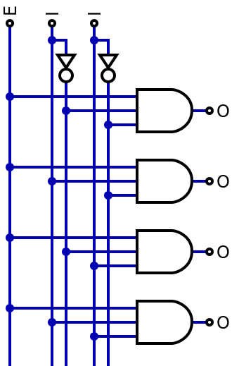
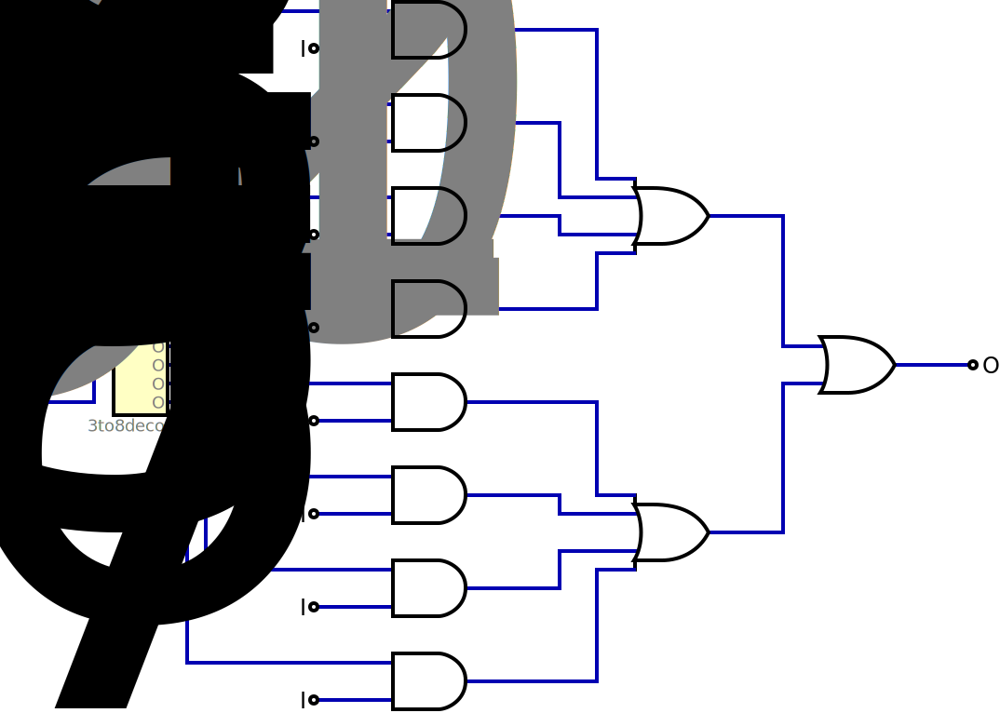
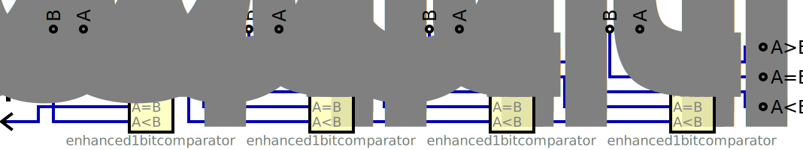

# Chapter 4: More Complex Components

When designing digital circuits, there are certain functions that tend to occur frequently. Semiconductor manufacturers have designed dedicated chips that implement these functions, so designers can incorporate them into their circuits directly. This takes up less space on the circuit board, requires less wiring, and uses less power than if the designer had to recreate the function using the fundamental digital logic gates introduced in the previous chapter. Similarly, CAD systems have libraries with these components and functions that designers can use in their designs. In either case, the chips and library components improve the efficiency of the design process. Since the chips and components have been thoroughly tested and verified, they can also increase the reliability of the overall design.

In this chapter, we will examine several of these functions: decoders, encoders, multiplexers, demultiplexers, comparators, and adders. In addition, we will introduce buffers. They do not perform functions like the other components, but they are needed in some circuits to overcome the physical limitations inherent to digital systems.

## 4.1 Decoders

As its name implies, the primary function of a decoder is to, well, decode. It takes in some binary value and outputs a signal corresponding to that value. Recall from Chapter 1 how several binary bits can represent a numeric value. The decoder performs this function in a single chip or CAD component. Decoders are used inside memory chips to access individual memory locations and in computers to access specific input and output devices.

### 4.1.1 Decoder Basics

A decoder has $n$ inputs. Together, these bits represent a single $n$-bit value. The $n$ bits can represent any of $2^n$ values, ranging from 0 to $2^n – 1$. For example, two bits can represent any of four (22) values: 00, 01, 10, 11, or 0, 1, 2, 3, or 0 to 3 (0 to $2^2 – 1$). Three bits can represent any value from 0 (000) to 7 (111), and so on for any value of $n$. The decoder also has $2^n$ outputs, each representing one of the $2^n$ possible values of the inputs. We typically refer to this as an $n$ to $2^n$ decoder.

Figure 4.1 shows a generic 3 to 8 decoder. Inputs $I_2$, $I_1$, and $I_0$ represent a 3-bit value. $I_2$ is the most significant bit and $I_0$ is the least significant bit. For example, $I_2=1$, $I_1=0$ and $I_0=0$ represents the binary value 100, or 4. Outputs $O_0$ to $O_7$ correspond to the eight ($2^3$) possible values represented by these bits. The output corresponding to the input value is set to 1 and the other outputs are set to 0. For input value 100, the decoder sets $O_4$ to 1 and the other seven outputs to 0. The animation in the figure shows the outputs for each possible input value.

Figure 4.1: Generic 3 to 8 decoder with values shown.

The decoder just presented, however, is not completely accurate. Whatever value is input to this decoder always generates one specific output. But sometimes we don't want any of the outputs to be active. (Why? We'll get to that shortly.) To do this, a decoder may have an *enable* input. When the enable signal is active (usually 1), the decoder works exactly as described previously. It sets the output corresponding to the inputs to 1 and the remaining outputs to 0. However, if the enable input is 0, all the outputs are set to 0, even the output corresponding to the input value. This is shown in Figure 4.2.

Figure 4.2: Generic 3 to 8 decoder with enable and values shown.

Now, back to our previous question. Why would we sometimes not want any decoder outputs to be active? That has a lot to do with the limitations of chip manufacturing. When decoder chips were first developed, chip manufacturing technologies had limits on how many pins could be on a chip. Since each input and each output is assigned to one pin, limiting the number of pins limits the number of inputs and outputs, which limits the maximum size of the decoder. For typical chips, the largest decoder is 4 to 16.

You can use the enable signal to combine two or more decoders and make them act like a single, larger decoder. To see how this works, consider the circuit shown in Figure 4.3. We combine two 3 to 8 decoders to create a 4 to 16 decoder. We have a 4-bit value, but each decoder only has three inputs. We take the three lowest order bits and connect them to the three inputs of both decoders. Then we use the remaining bits, only one bit in this case, to generate the values for the enable signals. In this figure, we take the most significant bit of the 4-bit value and use it to generate the enable signals. We pass it through a NOT gate to enable the upper decoder, and we also send it directly to the enable of the lower decoder. When this bit is 0, the NOT gate outputs a 1, the upper decoder is enabled, and the three lower bits cause one of the decoder's outputs to be active. Since it is input directly to the enable of the lower decoder, that decoder is disabled, or not enabled, and all its outputs are set to 0. Conversely, when the most significant bit is 1, the upper decoder is disabled and the lower decoder is enabled. As shown in the figure, the outputs of the upper decoder correspond to input values 0000 (0) to 0111 (7) and those of the lower decoder are activated by input values 1000 (8) to 1111 (15).

Figure 4.3: 4 to 16 decoder constructed using two 3 to 8 decoders.

There are other ways to combine decoders. Consider the circuit shown in Figure 4.4. Here, we use four 2 to 4 decoders to generate the outputs of a 4 to 16 decoder. These decoders input the two low-order bits of the input value, and the two remaining bits are used to generate the enable signals. We could use combinatorial logic gates, but instead we use another 2 to 4 decoder.

Figure 4.4: 4 to 16 decoder constructed using 2 to 4 decoders.

### 4.1.2 Decoder Internal Design

Now that we've seen how decoders work from the outside, the next question is how they work on the inside. What does the circuitry inside a decoder chip look like (as a digital logic circuit) that makes it generate the correct outputs for every possible combination of input values? More succinctly, how can you design a decoder?

One way to do this is to determine the function for each output, and then implement these functions in digital logic, much as we did in the previous chapter.

Consider, for example, a 2 to 4 decoder with an enable signal. Its truth table is shown in Figure 4.5 (a). Now consider output $O_0$. It should only be set to 1 when $I_1 = 0$, $I_0 = 0$, and enable input $E = 1$. Figure 4.5 (c) shows complete circuit to realize this function.

| $E$ | $I_1$ | $I_0$ | $O_0$ | $O_1$ | $O_2$ | $O_3$ |
| --- | ----- | ----- | ----- | ----- | ----- | ----- |
| 0   | X     | X     | 0     | 0     | 0     | 0     |
| 1   | 0     | 0     | 1     | 0     | 0     | 0     |
| 1   | 0     | 1     | 0     | 1     | 0     | 0     |
| 1   | 1     | 0     | 0     | 0     | 1     | 0     |
| 1   | 1     | 1     | 0     | 0     | 0     | 1     |

$$
\begin{aligned}
O_0 &= EI'_0I'_1 \\
O_1 &= EI_0I'_1 \\
O_2 &= EI'_0I_1 \\
O_3 &= EI_0I_1
\end{aligned}
$$

Figure 4.5: 2 to 4 decoder: (a) Truth table (b) Representation (c) Complete circuit.

### 4.1.3 BCD to 7-segment Decoder

Although you could design a chip to implement any function, it is only economically feasible to produce chips for commonly used functions. Otherwise, you would not sell enough chips to cover your development and manufacturing costs. One commonly used function is to convert a BCD (binary-coded decimal) value to the signals needed to display it on a 7-segment LED display. This is the function performed by a BCD to 7-segment decoder.

A BCD to 7-segment decoder has a 4-bit input that has the value of a decimal digit ranging from 0 to 9, or 0000 to 1001. These decoders generally assume that they do not receive an invalid input, 1010 to 1111. When designing the decoder, the outputs associated with these inputs are treated as don't care values, which simplifies the design of the chip. This decoder has seven outputs, labeled $a$, $b$, $c$, $d$, $e$, $f$, and $g$, which are connected to the display and cause the segments to light up or remain unlit.

Figure 4.6 (a) Generic BCD to 7-segment decoder; (b) 7-segment display with segments labeled.

There are two types of 7-segment displays: common anode and common cathode. In common anode displays, the inputs to the LEDs in the display are connected together, and in the circuit they are connected to the positive voltage of the power supply, or logic 1. The outputs of the LEDs are connected to the outputs of the decoder. When the decoder output is 0, the LED lights up; when it is 1, the LED is off. Common cathode displays do the opposite. The outputs of the LEDs are connected together and connected to the circuit ground, which is logic 0. A decoder output of 1 lights the LED and 0 turns it off.

To design a BCD to 7-segment decoder, we will use the same procedure we've been using all along. First, we create a truth table with four inputs (corresponding to the BCD digit) and seven outputs (one for each segment). We will design a common cathode decoder, so we want each segment's value to be 1 when it should be lit. Figure 4.7 (a) shows the truth table for our decoder.

| $I_3$ | $I_2$ | $I_1$ | $I_0$ | $a$ | $b$ | $c$ | $d$ | $e$ | $f$ | $g$ |
| ----- | ----- | ----- | ----- | --- | --- | --- | --- | --- | --- | --- |
| 0     | 0     | 0     | 0     | 1   | 1   | 1   | 1   | 1   | 1   | 0   |
| 0     | 0     | 0     | 1     | 0   | 1   | 1   | 0   | 0   | 0   | 0   |
| 0     | 0     | 1     | 0     | 1   | 1   | 0   | 1   | 1   | 0   | 1   |
| 0     | 0     | 1     | 1     | 1   | 1   | 1   | 1   | 0   | 0   | 1   |
| 0     | 1     | 0     | 0     | 0   | 1   | 1   | 0   | 0   | 1   | 1   |
| 0     | 1     | 0     | 1     | 1   | 0   | 1   | 1   | 0   | 1   | 1   |
| 0     | 1     | 1     | 0     | 1   | 0   | 1   | 1   | 1   | 1   | 1   |
| 0     | 1     | 1     | 1     | 1   | 1   | 1   | 0   | 0   | 0   | 0   |
| 1     | 0     | 0     | 0     | 1   | 1   | 1   | 1   | 1   | 1   | 1   |
| 1     | 0     | 0     | 1     | 1   | 1   | 1   | 1   | 0   | 1   | 1   |
| x     | x     | x     | x     | x   | x   | x   | x   | x   | x   | x   |

$$
\begin{aligned}
a &= I'_0I'_2 + I_0I_2 + I1 + I3 \\
b &= I'_0I'_1 + I_0I_1 + I'_2 \\
c &= I_0 + I'_1 + I_2 \\
d &= I'_0I'_2 + I_0I'_1I_2 + I'_0I_1 + I_1I'_2 + I3 \\
e &= I'_0I'_2 + I'0I_1 \\
f &= I'_0I'_1 + I'_0I_2 + I'_1I_2 + I_3 \\
g &= I'_0I_1 + I_1I'_2 + I'_1I_2 + I_3
\end{aligned}
$$

Figure 4.7 BCD to 7-segment decoder: (a) Truth table; (b) Representation (c) Complete Circuit.

Next, we create the function for each segment individually. Finally, we design the complete circuit to realize the function. One possible circuit is shown in Figure 4.7 (c).

## 4.2 Encoders

If the name encoder makes you think it is the opposite of a decoder, you're mostly right. Encoders are used to create an $n$-bit output that corresponds to the one of its $2^n$ inputs that is active. In this section, we'll look at the basics of encoding and the encoder's internal design, as well as a special encoder, called the priority encoder, which is used when more than one input is active.

### 4.2.1 Encoder Basics

Whereas a decoder takes an $n$-bit input and sets one of its $2^n$ outputs to 1, the encoder goes in the other direction. It has $2^n$ inputs, numbered 0 to $2^n – 1$, and outputs the $n$-bit value corresponding to the single input that is set to 1.

Consider the generic 8 to 3 encoder shown in Figure 4.8. If one of the eight inputs is set to 1, the three output bits indicate which input is set. For example, if input $I_6$ is 1, the output would be set to $O_2 = 1$, $O_1 = 1$, and $O_0 = 0$, or 110.

Figure 4.8: Generic 8 to 3 encoder with values shown.

As long as one input is active, the encoder functions as described. But what does the encoder do if none of the inputs is active? Since the encoder outputs binary values, the $O_2$, $O_1$, $O_0$, will always be set to a value corresponding to one of the inputs, even though that input isn't active. This is the reason this encoder includes another output, $V$. $V$ is the *valid* output. The encoder sets $V$ to 1 if any of the inputs is equal to 1, or 0 if none of the inputs is 1. When using an encoder, there are two things we need to check. One is the encoded output bits and the other is the valid bit. If $V$ = 1, then the output bits indicate which input is active. However, if $V$ = 0, then no input is active, regardless of the value of the output bits. Figure 4.9 shows the truth table for the generic 8 to 3 encoder. For this encoder, $O_2$, $O_1$, $O_0$ is set to 000 when there is no active input.

| $I_7$ | $I_6$ | $I_5$ | $I_4$ | $I_3$ | $I_2$ | $I_1$ | $I_0$ | $O_2$ | $O_1$ | $O_0$ | $V$ |
| ----- | ----- | ----- | ----- | ----- | ----- | ----- | ----- | ----- | ----- | ----- | --- |
| 0     | 0     | 0     | 0     | 0     | 0     | 0     | 0     | 0     | 0     | 0     | 0   |
| 0     | 0     | 0     | 0     | 0     | 0     | 0     | 1     | 0     | 0     | 0     | 1   |
| 0     | 0     | 0     | 0     | 0     | 0     | 1     | 0     | 0     | 0     | 1     | 1   |
| 0     | 0     | 0     | 0     | 0     | 1     | 0     | 0     | 0     | 1     | 0     | 1   |
| 0     | 0     | 0     | 0     | 1     | 0     | 0     | 0     | 0     | 1     | 1     | 1   |
| 0     | 0     | 0     | 1     | 0     | 0     | 0     | 0     | 1     | 0     | 0     | 1   |
| 0     | 0     | 1     | 0     | 0     | 0     | 0     | 0     | 1     | 0     | 1     | 1   |
| 0     | 1     | 0     | 0     | 0     | 0     | 0     | 0     | 1     | 1     | 0     | 1   |
| 1     | 0     | 0     | 0     | 0     | 0     | 0     | 0     | 1     | 1     | 1     | 1   |

Figure 4.9: Truth table for the generic 8 to 3 encoder.

As with decoders, it is possible to combine encoders to handle more inputs. Figure 4.10 shows a 16 to 4 encoder constructed using two 8 to 3 encoders. Let's look at each part of this circuit in more detail.

Figure 4.10: 16 to 4 encoder constructed using 8 to 3 encoders.

The encoder system has 16 inputs. This circuit allocates inputs 0 to 7 (0000 to 0111) to the upper encoder and 8 to 15 (1000 to 1111) to the lower encoder. This becomes important when we generate the data outputs shortly.

If any input from $I_0$ to $I_7$ is active, the upper encoder sets its $V$ output to 1 and its $O$ outputs to the value of the active input, 000 to 111. The same is true for inputs $I_8$ to $I_{15}$ for the lower decoder. Figure 4.11 (a) shows a partial truth table for this system as it generates outputs $O_2$, $O_1$, and $O_0$. From this table, we can verify that logically ORing together the corresponding outputs (the two $O_2$s, the two $O_1$s, and the two $O_0$s) produces the correct three low-order bits of the encoder output.

| Active Input | Upper Encoder $O_2$ | Upper Encoder $O_1$ | Upper Encoder $O_0$ | Lower Encoder $O_2$ | Lower Encoder $O_1$ | Lower Encoder $O_0$ | Overall $O_2$ | Overall $O_1$ | Overall $O_0$ |
| ------------ | ------------------- | ------------------- | ------------------- | ------------------- | ------------------- | ------------------- | ------------- | ------------- | ------------- |
| None         | 0                   | 0                   | 0                   | 0                   | 0                   | 0                   | 0             | 0             | 0             |
| $I_0$        | 0                   | 0                   | 0                   | 0                   | 0                   | 0                   | 0             | 0             | 0             |
| $I_1$        | 0                   | 0                   | 1                   | 0                   | 0                   | 0                   | 0             | 0             | 1             |
| $I_2$        | 0                   | 1                   | 0                   | 0                   | 0                   | 0                   | 0             | 1             | 0             |
| $I_3$        | 0                   | 1                   | 1                   | 0                   | 0                   | 0                   | 0             | 1             | 1             |
| $I_4$        | 1                   | 0                   | 0                   | 0                   | 0                   | 0                   | 1             | 0             | 0             |
| $I_5$        | 1                   | 0                   | 1                   | 0                   | 0                   | 0                   | 1             | 0             | 1             |
| $I_6$        | 1                   | 1                   | 0                   | 0                   | 0                   | 0                   | 1             | 1             | 0             |
| $I_7$        | 1                   | 1                   | 1                   | 0                   | 0                   | 0                   | 1             | 1             | 1             |
| $I_8$        | 0                   | 0                   | 0                   | 0                   | 0                   | 1                   | 0             | 0             | 0             |
| $I_9$        | 0                   | 0                   | 0                   | 0                   | 0                   | 1                   | 0             | 0             | 1             |
| $I_{10}$     | 0                   | 0                   | 0                   | 0                   | 1                   | 0                   | 0             | 1             | 0             |
| $I_{11}$     | 0                   | 0                   | 0                   | 0                   | 1                   | 0                   | 0             | 1             | 1             |
| $I_{12}$     | 0                   | 0                   | 0                   | 1                   | 0                   | 0                   | 1             | 0             | 0             |
| $I_{13}$     | 0                   | 0                   | 0                   | 1                   | 0                   | 0                   | 1             | 0             | 1             |
| $I_{14}$     | 0                   | 0                   | 0                   | 1                   | 1                   | 0                   | 1             | 1             | 0             |
| $I_{15}$     | 0                   | 0                   | 0                   | 1                   | 1                   | 0                   | 1             | 1             | 1             |

| Active Input | Upper Encoder $V$ | Lower Encoder $V$ | Overall V | Overall $O_3$ |
| ------------ | ----------------- | ----------------- | --------- | ------------- |
| None         | 0                 | 0                 | 0         | 0             |
| $I_0$        | 1                 | 0                 | 1         | 0             |
| $I_1$        | 1                 | 0                 | 1         | 0             |
| $I_2$        | 1                 | 0                 | 1         | 0             |
| $I_3$        | 1                 | 0                 | 1         | 0             |
| $I_4$        | 1                 | 0                 | 1         | 0             |
| $I_5$        | 1                 | 0                 | 1         | 0             |
| $I_6$        | 1                 | 0                 | 1         | 0             |
| $I_7$        | 1                 | 0                 | 1         | 0             |
| $I_8$        | 0                 | 1                 | 1         | 1             |
| $I_9$        | 0                 | 1                 | 1         | 1             |
| $I_{10}$     | 0                 | 1                 | 1         | 1             |
| $I_{11}$     | 0                 | 1                 | 1         | 1             |
| $I_{12}$     | 0                 | 1                 | 1         | 1             |
| $I_{13}$     | 0                 | 1                 | 1         | 1             |
| $I_{14}$     | 0                 | 1                 | 1         | 1             |
| $I_{15}$     | 0                 | 1                 | 1         | 1             |

| Active Input | $O_3$ | $O_2$ | $O_1$ | $O_0$ | $V$ |
| ------------ | ----- | ----- | ----- | ----- | --- |
| None         | 0     | 0     | 0     | 0     | 0   |
| $I_0$        | 0     | 0     | 0     | 0     | 1   |
| $I_1$        | 0     | 0     | 0     | 1     | 1   |
| $I_2$        | 0     | 0     | 1     | 0     | 1   |
| $I_3$        | 0     | 0     | 1     | 1     | 1   |
| $I_4$        | 0     | 1     | 0     | 0     | 1   |
| $I_5$        | 0     | 1     | 0     | 1     | 1   |
| $I_6$        | 0     | 1     | 1     | 0     | 1   |
| $I_7$        | 0     | 1     | 1     | 1     | 1   |
| $I_8$        | 1     | 0     | 0     | 0     | 1   |
| $I_9$        | 1     | 0     | 0     | 1     | 1   |
| $I_{10}$     | 1     | 0     | 1     | 0     | 1   |
| $I_{11}$     | 1     | 0     | 1     | 1     | 1   |
| $I_{12}$     | 1     | 1     | 0     | 0     | 1   |
| $I_{13}$     | 1     | 1     | 0     | 1     | 1   |
| $I_{14}$     | 1     | 1     | 1     | 0     | 1   |
| $I_{15}$     | 1     | 1     | 1     | 1     | 1   |

Figure 4.11: Truth tables for the 16 to 4 encoder: (a) O_utputs $O_2$, $O_1$, and $O_0$; (b) $O_3$ and $V$; (c) Final truth table.

Next, let's look at $O_3$. When any input from $I_0$ to $I_7$ is active, our output will be a value from 0 (0000) to 7 (0111). All of these values have $O_3$ = 0. If an input from $I_8$ to $I_{15}$ is active, then the output will be in the range from 8 (1000) to 15 (1111). All of these values have $O_3$ = 1. Fortunately for our circuit, all of these inputs set the $V$ output of the lower encoder to 1, and all other inputs result in that output being set to 0. So, we can use that $V$ output to generate $O_3$ directly.

Finally, we need to generate the final $V$ output. This should be 1 whenever any of the 16 inputs is 1. Since $V$ of the upper encoder is 1 when any input from $I_0$ to $I_7$ is active, and $V$ of the lower encoder is 1 when an input from $I_8$ to $I_{15}$ is active, we can logically OR these two signals together. The resulting signal is a 1 when any input from $I_0$ to $I_{15}$ is 1, which is exactly what we want.

Figure 4.11 (b) shows the values of $O_3$ and $V$ for all possible inputs. The final truth table for the overall circuit is shown in Figure 4.11 (c).

### 4.2.2 Encoder Internal Design

The internal design of the encoder is relatively straightforward. To design the 8 to 3 encoder, we start with the truth table shown in Figure 4.9. Then we determine the function for each individual output and create a circuit to realize each function.

First, let's look at output $O_2$. It should be set to 1 when any of inputs $I_4$, $I_5$, $I_6$, or $I_7$ is active, or $O_2 = I_4 + I_5 + I_6 + I_7$. (Remember from Chapter 2, + is the logical OR operation.) Following the same process, we come up with these functions for the chip outputs.

$$
\begin{aligned}
O_2 &= I_4 + I_5 + I_6 + I_7 \\
O_1 &= I_2 + I_3 + I_6 + I_7 \\
O_0 &= I_1 + I_3 + I_5 + I_7 \\
V &= I_0 + I_1 + I_2 + I_3 + I_4 + I_5 + I_5 + I_7
\end{aligned}
$$

Figure 4.12 shows a circuit to realize these functions.

Figure 4.12: Internal design of an 8 to 3 encoder.

### 4.2.3 Priority Encoders

The circuit shown in Figure 4.12 works under most, but not all, circumstances. When exactly one input is active, it outputs the correct output value and sets $V$ to 1, indicating that we have a valid input. When no inputs are active, it sets $V$ to 0, as required. But what happens when more than one input is active? For example, if $I_6$ and $I_3$ are both set to 1, the circuit will set $O_2$ = 1, $O_1$ = 1, $O_0$ = 1, and $V$ = 1, which incorrectly indicates that input $I_7$ is active.

This is not a design flaw, but rather a limitation of our design. At the beginning of this section, I stated that the encoder outputs the value corresponding to the *single* input that is set to 1. This encoder is designed to work only when we can ensure that no more than one input is active, and that is the case for many circuits. Sometimes, however, it is possible for more than one input to be active, and we must choose which one to encode. To do this, we use a special type of encoder called the priority encoder.

A priority encoder acts just like a normal encoder, with one exception. When more than one input is active, a priority encoder outputs the value for the highest numbered active input. That is, each input has priority over all inputs with lower numbers, and all inputs with higher numbers have priority over it. In our earlier example, when $I_6$ and $I_3$ are both active, the priority encoder outputs 110, because input $I_6$ has priority over input $I_3$.

Figure 4.13 (a) shows the truth table for the 8 to 3 priority encoder. Unlike the regular encoder, which requires that no more than one input is set to 1, the priority encoder has no restrictions on its input values. It simply encodes the highest numbered active input and ignores those below it.

| $I_7$ | $I_6$ | $I_5$ | $I_4$ | $I_3$ | $I_2$ | $I_1$ | $I_0$ | $O_2$ | $O_1$ | $O_0$ | $V$ |
| ----- | ----- | ----- | ----- | ----- | ----- | ----- | ----- | ----- | ----- | ----- | --- |
| 0     | 0     | 0     | 0     | 0     | 0     | 0     | 0     | 0     | 0     | 0     | 0   |
| 0     | 0     | 0     | 0     | 0     | 0     | 0     | 1     | 0     | 0     | 0     | 1   |
| 0     | 0     | 0     | 0     | 0     | 0     | 1     | x     | 0     | 0     | 1     | 1   |
| 0     | 0     | 0     | 0     | 0     | 1     | x     | x     | 0     | 1     | 0     | 1   |
| 0     | 0     | 0     | 0     | 1     | x     | x     | x     | 0     | 1     | 1     | 1   |
| 0     | 0     | 0     | 1     | x     | x     | x     | x     | 1     | 0     | 0     | 1   |
| 0     | 0     | 1     | x     | x     | x     | x     | x     | 1     | 0     | 1     | 1   |
| 0     | 1     | x     | x     | x     | x     | x     | x     | 1     | 1     | 0     | 1   |
| 1     | x     | x     | x     | x     | x     | x     | x     | 1     | 1     | 1     | 1   |

$$
\begin{aligned}
O_2 &= I_4 + I_5 + I_6 + I_7 \\
O_1 &= I_2I'_4I'_5 + I_3I'_4I'_5 + I_6 + I_7 \\
O_0 &= I_1I'_2I'_4I'_6 + I_3I'_4I'_6 + I_5I'_6 + I_7 \\
V &= I_0 + I_1 + I_2 + I_3 + I_4 + I_5 + I_5 + I_7
\end{aligned}
$$

Figure 4.13: 8 to 3 priority encoder: (a) Truth table; (b) Representation (c) Circuit design.

Naturally, implementing prioritization increases the complexity of the design for a priority encoder as compared to a normal encoder, at least for parts of the circuit. As shown in the circuit for the 8 to 3 priority encoder in Figure 4.13 (c), the circuitry to generate $O_2$ and $V$ is the same as for the normal encoder. However, this is not the case for the other outputs.

Consider output $O_1$. The normal priority encoder sets this output to 1 if we are encoding input $I_2$, $I_3$, $I_6$, or $I_7$. These inputs would be encoded as 010, 011, 110, and 111, respectively, all of which have the middle bit set to 1. This would also be the case for the priority encoder, but only if we are encoding one of these inputs. This will always be the case for $I_6$ and $I_7$, but not necessarily for $I_2$ and $I_3$. For example, if $I_2$ and $I_5$ are both active, the priority encoder outputs 101, the value for $I_5$. Here, $O_1$ should be 0, not 1.

The design resolves this problem by checking to see if $I_4$ or $I_5$ is active. The circuit sets $O_1 = 1$ if (either $I_6$ or $I_7$ is active) or if (($I_2$ or $I_3$ is active) AND (neither $I_4$ nor $I_5$ is active)). The circuit to generate $O_0$ follows this same process, but it is more complex. It sets $O_0$ to 1 under the following conditions.

$$
\begin{aligned}
&(\text{IF } I_7 = 1) \text{ OR} \\
&(\text{IF } I_5 = 1 \text{ AND } I_6 = 0) \text{ OR} \\
&(\text{IF } I_3 = 1 \text{ AND } I_4 = 0 \text{ AND } I_6 = 0) \text{ OR} \\
&(\text{IF } I_1 = 1 \text{ AND } I_2 = 0 \text{ AND } I_4 = 0 \text{ AND } I_6 = 0) \\
&\text{THEN } O_0 = 1
\end{aligned}
$$

## 4.3 Multiplexers

A multiplexer, or MUX for short, is a digital circuit that has several inputs and allows one of them to pass through to its single output. In addition to these data inputs, it has several control inputs that specify which data input is to pass through to the output. It has many uses in digital circuits, one of which we will see in the next chapter.

### 4.3.1 Multiplexer Basics

Although different from a decoder, the multiplexer and decoder employ the same design principles for part, but not all, of their designs. Throughout this subsection, I'll highlight these similarities. Later in this section, we'll design a multiplexer that uses a decoder in its design.

To start, consider the generic 8-input multiplexer and its truth table, both shown in Figure 4.14. The eight data inputs are labeled $I_0$ to $I_7$. In a circuit, each input will have a logical 0 or 1 connected to it, usually generated by some other digital logic in the circuit. In many circuits, these input values may change over time.

| E   | $S_2$ | $S_1$ | $S_0$ | $O$   |
| --- | ----- | ----- | ----- | ----- |
| 0   | X     | X     | X     | 0     |
| 1   | 0     | 0     | 0     | $I_0$ |
| 1   | 0     | 0     | 1     | $I_1$ |
| 1   | 0     | 1     | 0     | $I_2$ |
| 1   | 0     | 1     | 1     | $I_3$ |
| 1   | 1     | 0     | 0     | $I_4$ |
| 1   | 1     | 0     | 1     | $I_5$ |
| 1   | 1     | 1     | 0     | $I_6$ |
| 1   | 1     | 1     | 1     | $I_7$ |

Figure 4.14: 8 to 1 multiplexer: (a) Truth table; (b) Generic representation with values shown.

The three inputs labeled $S_2$, $S_1$, and $S_0$ select the input to be passed to the output. The three bits are decoded in the same way as they are in the decoder. However, in the decoder these bits set the selected output bit to 1. In the multiplexer, they select an input and send it to the output. For example, if $S_2S_1S_0$ 110 (6), then whatever value is on input $I_6$ is output via $O_0$. In the truth table, we list the value of output $O_0$ as $I_6$ to indicate that $O_0$ equals whatever value is being input to $I_6$. Finally, the multiplexer has an enable input, $E$. When $E$ = 1, the multiplexer is enabled and acts as described. However, when $E$ = 0, the multiplexer is disabled and outputs the value 0, regardless of the values on the data inputs and select signals.

Also, as is the case for decoders, we can combine two or more multiplexers to act like one larger multiplexer. We follow the same strategy used to combine decoders. We use the low-order select bits to choose an input from each multiplexer and the high-order select bits to enable exactly one of the multiplexers.

Figure 4.15 (a) shows two 8-input multiplexers combined to act like a single 16-input
multiplexer.

| $S_3$ | $S_2$ | $S_1$ | $S_0$ | $O_A$ | $O_B$    | $O$      |
| ----- | ----- | ----- | ----- | ----- | -------- | -------- |
| 0     | 0     | 0     | 0     | $I_0$ | 0        | $I_0$    |
| 0     | 0     | 0     | 1     | $I_1$ | 0        | $I_1$    |
| 0     | 0     | 1     | 0     | $I_2$ | 0        | $I_2$    |
| 0     | 0     | 1     | 1     | $I_3$ | 0        | $I_3$    |
| 0     | 1     | 0     | 0     | $I_4$ | 0        | $I_4$    |
| 0     | 1     | 0     | 1     | $I_5$ | 0        | $I_5$    |
| 0     | 1     | 1     | 0     | $I_6$ | 0        | $I_6$    |
| 0     | 1     | 1     | 1     | $I_7$ | 0        | $I_7$    |
| 1     | 0     | 0     | 0     | 0     | $I_8$    | $I_8$    |
| 1     | 0     | 0     | 1     | 0     | $I_9$    | $I_9$    |
| 1     | 0     | 1     | 0     | 0     | $I_{10}$ | $I_{10}$ |
| 1     | 0     | 1     | 1     | 0     | $I_{11}$ | $I_{11}$ |
| 1     | 1     | 0     | 0     | 0     | $I_{12}$ | $I_{12}$ |
| 1     | 1     | 0     | 1     | 0     | $I_{13}$ | $I_{13}$ |
| 1     | 1     | 1     | 0     | 0     | $I_{14}$ | $I_{14}$ |
| 1     | 1     | 1     | 1     | 0     | $I_{15}$ | $I_{15}$ |

Figure 4.15: (a) 16 to 1 multiplexer constructed using two 8 to 1 multiplexers; (b) Truth table.

Notice from the truth table in Figure 4.15 (b) that only one multiplexer is enabled at a time, the upper multiplexer when $S_3 = 0$ and the lower one when $S_3 = 1$. The multiplexer that is not enabled outputs 0, regardless of its input values, while the enabled multiplexer outputs the value of one of its inputs. Then these values are logically ORed together. Since any value ORed with 0 is its original value, this passes the selected input value directly to the output.

### 4.3.2 Multiplexer Internal Design

Now that we've seen what a multiplexer looks like from the outside, we need to design the internal logic circuit to make it perform its desired functions. As usual, we'll start with a truth table. Figure 4.16 (a) shows the truth table for the multiplexer, but we've expanded it to include the different data input values.

| E   | $I_0$ | $I_1$ | $I_2$ | $I_3$ | $I_4$ | $I_5$ | $I_6$ | $I_7$ | $S_2$ | $S_1$ | $S_0$ | $O$ |
| --- | ----- | ----- | ----- | ----- | ----- | ----- | ----- | ----- | ----- | ----- | ----- | --- |
| 0   | X     | X     | X     | X     | X     | X     | X     | X     | X     | X     | X     | 0   |
| 1   | 0     | X     | X     | X     | X     | X     | X     | X     | 0     | 0     | 0     | 0   |
| 1   | 1     | X     | X     | X     | X     | X     | X     | X     | 0     | 0     | 0     | 1   |
| 1   | X     | 0     | X     | X     | X     | X     | X     | X     | 0     | 0     | 1     | 0   |
| 1   | X     | 1     | X     | X     | X     | X     | X     | X     | 0     | 0     | 1     | 1   |
| 1   | X     | X     | 0     | X     | X     | X     | X     | X     | 0     | 1     | 0     | 0   |
| 1   | X     | X     | 1     | X     | X     | X     | X     | X     | 0     | 1     | 0     | 1   |
| 1   | X     | X     | X     | 0     | X     | X     | X     | X     | 0     | 1     | 1     | 0   |
| 1   | X     | X     | X     | 1     | X     | X     | X     | X     | 0     | 1     | 1     | 1   |
| 1   | X     | X     | X     | X     | 0     | X     | X     | X     | 1     | 0     | 0     | 0   |
| 1   | X     | X     | X     | X     | 1     | X     | X     | X     | 1     | 0     | 0     | 1   |
| 1   | X     | X     | X     | X     | X     | 0     | X     | X     | 1     | 0     | 1     | 0   |
| 1   | X     | X     | X     | X     | X     | 1     | X     | X     | 1     | 0     | 1     | 1   |
| 1   | X     | X     | X     | X     | X     | X     | 0     | X     | 1     | 1     | 0     | 0   |
| 1   | X     | X     | X     | X     | X     | X     | 1     | X     | 1     | 1     | 0     | 1   |
| 1   | X     | X     | X     | X     | X     | X     | X     | 0     | 1     | 1     | 1     | 0   |
| 1   | X     | X     | X     | X     | X     | X     | X     | 1     | 1     | 1     | 1     | 1   |

Figure 4.16: 8 to 1 multiplexer (a) Truth table; (b) Internal design.

For this design, we're going to take a slightly different approach. Instead of creating one large Karnaugh map, we create circuits for each possible value of select signals $S_2$, $S_1$, and $S_0$, and then combine the outputs to produce the final output of the multiplexer.

Consider the case $S_2S_1S_0 = 000$ and $E = 1$. In the first column of AND gates, only the uppermost AND gate outputs a 1; all others have at least one input equal to 0 and output a 0. In the second column, the uppermost AND gate has one input set to 1 by the previous AND gate and the other equal to the value on input $I_0$. If $I_0 = 0$, $1 ^ 0 = 1$, and the gate outputs a 1; if it is 1, $1 ^ 1 = 1$ and it outputs a 1. In either case, it outputs the value of $I_0$. The other AND gates in this column all input 0s from their previous AND gates and therefore output 0s, regardless of the value of their data inputs. Finally, we logically OR these values ($I_0$ and all 0s together. Anything ORed with 0 is equal to its original value ($0 + 0 = 0$, $1 + 0 = 1$), so the output would just be the value of $I_0$. The reasoning is the same for the other values of the select signals. Of course, if $E = 0$, all AND gates output a 0 and $O_0$ becomes 0, as desired when the multiplexer is not enabled. The complete design is shown in Figure 4.16 (b).

Much of this design may look familiar to you. Everything from the first column of AND gates to the left edge of the circuit is just a 3 to 8 decoder with an enable input. This is highlighted in the animation in Figure 4.17, where the circuit is transformed to one using a decoder to replace these components.

Figure 4.17: 8 to 1 multiplexer constructed using a 3 to 8 decoder.

## 4.4 Demultiplexers

The term demultiplexer has two different meanings. In many cases, demultiplexer is just another name for decoder, and the two may be used interchangeably. In the other meaning, a demultiplexer routes a single data input to one of several outputs, with select bits indicating which output receives the data. Since we have already covered decoders in Section 4.2, this section focuses solely on the latter definition.

A demultiplexer, like the decoder, has $n$ select inputs and $2^n$ outputs, numbered $0$ to $2^n – 1$, and an enable input. In addition, it has a single data input. A generic 1 to 8 demultiplexer is shown in Figure 4.18 (a). As indicated in the truth table in Figure 4.18 (b), when the demultiplexer is enabled, the input value is sent to the output specified by the select bits. For example, when $S_2S_1S_0 = 110$, output $O_6$ gets the value on the demultiplexer input.

| E   | $S_2$ | $S_1$ | $S_0$ | $O_0$ | $O_1$ | $O_2$ | $O_3$ | $O_4$ | $O_5$ | $O_6$ | $O_7$ |
| --- | ----- | ----- | ----- | ----- | ----- | ----- | ----- | ----- | ----- | ----- | ----- |
| 0   | X     | X     | X     | 0     | 0     | 0     | 0     | 0     | 0     | 0     | 0     |
| 1   | 0     | 0     | 0     | $I$   | 0     | 0     | 0     | 0     | 0     | 0     | 0     |
| 1   | 0     | 0     | 1     | 0     | $I$   | 0     | 0     | 0     | 0     | 0     | 0     |
| 1   | 0     | 1     | 0     | 0     | 0     | $I$   | 0     | 0     | 0     | 0     | 0     |
| 1   | 0     | 1     | 1     | 0     | 0     | 0     | $I$   | 0     | 0     | 0     | 0     |
| 1   | 1     | 0     | 0     | 0     | 0     | 0     | 0     | $I$   | 0     | 0     | 0     |
| 1   | 1     | 0     | 1     | 0     | 0     | 0     | 0     | 0     | $I$   | 0     | 0     |
| 1   | 1     | 1     | 0     | 0     | 0     | 0     | 0     | 0     | 0     | $I$   | 0     |
| 1   | 1     | 1     | 1     | 0     | 0     | 0     | 0     | 0     | 0     | 0     | $I$   |

Figure 4.18: (a) Generic 1 to 8 demultiplexer (b) Truth table.

To help you understand how a demultiplexer works, visualize the demultiplexer as a decoder with a data input. The demultiplexer decodes the select bits as usual, but then we logically AND the data input with each individual decoder output. This is shown in Figure 4.19. The selected output of the decoder (if enabled) is 1 and all other outputs are 0. $I ^ 1 = I$, which is output on the selected output. All other outputs have the value $I ^ 0 = 0$.

Figure 4.19: 1 to 8 demultiplexer constructed using a 3 to 8 decoder: Circuit diagram

## 4.5 Comparators

Computers can perform numerous arithmetic operations on numeric data, such as adding, subtracting, multiplying, or dividing two numbers. They use circuits designed specifically to perform these operations, and these circuits often employ specially designed components. One such component is the comparator.

A comparator does not add or subtract two values, nor does it perform any other arithmetic or logical operation. Rather, it inputs two numbers, let's call them $A$ and $B$, and determines which is larger, or if they are equal. Figure 4.20 shows a generic 4-bit comparator.

Figure 4.20: Generic 4-bit comparator.

For this comparator, $A$ and $B$ can take on any value from 0000 (0) to 1111 (15). Exactly one of the three outputs will be active, depending on the values of $A$ and $B$.

To see how this works, consider how you would compare two 4-digit decimal numbers, say 2021 and 2910. (Just as the comparator has two inputs with the same number of bits, this example also requires two values with the same number of digits.) First, we compare the two digits in the thousands place. For this example, they are both the same, 2, which doesn't tell us anything about which number is larger, so we go to the next digit. The hundreds digit in the first number is 0 and in the second number is 9, so we know the second number must be larger than the first. There is no need to check the remaining digits.

Here's a general rule we can use to help us design a comparator. One number ($A$) is greater than the other number ($B$) if one of these two conditions is met.

1. The digit we are checking in $A$ is greater than the digit in $B$ AND all previous digits in these two numbers are the same; or
2. A previous digit had already determined that $A$ is greater than $B$.

We would start at the most significant digit and work our way down to the least significant digit. If we have not found one number to be greater than the other by the time we have finished comparing all pairs of digits, then the two numbers are equal.

Since we are dealing with binary numbers, the comparison process is relatively straightforward. If we are comparing bits $A_i$ and $B_i$, one of these three conditions is met:

$$
\begin{aligned}
&A_i > B_i \text{ if } A_i = 1 \text{ AND } B_i = 0 \\
&A_i < B_i \text{ if } A_i = 0 \text{ AND } B_i = 1 \\
&A_i = B_i \text{ if } A_i = B_i = 1 \text{ OR } A_i = B_i = 0
\end{aligned}
$$

Figure 4.21: A 1-bit comparator.

Notice, in my design, I took advantage of the fact that, if $A_i$ is not greater than $B_i$, and $A_i$ is not less than $B_i$, then $A_i$ must be equal to $B_i$. This allows me to use a single NOR gate to generate the $A = B$ signal.

But what if a previous bit had already determined that one number is larger than the other? If we are to construct a comparator using multiple copies of this circuit, one for each bit, we need to make use of the results from previous bits. If we call these previous bits $A > B_{in}$, $A < B_{in}$, and $A = B_{in}$, then we can say

$$
\begin{aligned}
& A > B_{OUT} = 1 \text{ IF } (A > B_{IN} = 1) \text{ OR } (A = B_{IN} = 1 \text{ AND } A_i = 1 \text{ AND } B_i = 0 ) \\
& A < B_{OUT} = 1 \text{ IF } (A < B_{IN} = 1) \text{ OR } (A = B_{IN} = 1 \text{ AND } A_i = 0 \text{ AND } B_i = 1 ) \\
& A = B_{OUT} = 1 \text{ IF } (A = B_{IN} = 1) \text{ AND } (A_i = B_i)
\end{aligned}
$$

We can modify the circuit from Figure 4.21 as shown in Figure 4.22 (a) to incorporate these functions. Figure 4.22 (b) shows how this circuit can be replicated and configured to create a 4-bit comparator.

Figure 4.22: (a) An enhanced 1-bit comparator; (b) Four-bit comparator.

There is another method to perform comparison by subtracting two numbers and examining the result. We will look at this method later in this book.

## 4.6 Adders

So far we have examined components that perform logical functions on binary values. But we can also design logic circuits that treat their inputs as numeric values and perform arithmetic operations on these values. In this section we examine adders, which, as their name implies, add two numeric inputs to produce a numeric output. We'll start with half adders and full adders, the basic building blocks, and then we'll use these building blocks to design adders that can add any two $n$-bit values.

### 4.6.1 Half Adders

The half adder is the most fundamental arithmetic circuit there is. It inputs two 1-bit values, arithmetically adds them, and outputs the sum. As shown in Figure 4.23 (a), the output can have a value of 0 (0 + 0), 1 (0 + 1 or 1 + 0), or 2 (1 + 1). The last value is represented as 10 in binary, so the half adder must output two bits. The least significant bit is called the *sum*, usually denoted $S$, and the most significant bit is the carry, or $C$. The truth table for the half adder is shown in Figure 4.23 (b).

| A   | B   | C   | S   |
| --- | --- | --- | --- |
| 0   | 0   | 0   | 0   |
| 0   | 1   | 0   | 1   |
| 1   | 0   | 0   | 1   |
| 1   | 1   | 1   | 0   |

Figure 4.23: Half adder: (a) Inputs and outputs; (b) Truth table; (c) Internal design.

So, how can we take these two input values, $A$ and $B$, and generate our sum and carry outputs? We do this by treating this as a digital logic design problem, just as we have done when designing the other components in this chapter. We design the logic for $C$ and $S$ based solely on the value of inputs $A$ and $B$.

Carry output $C$ is relatively straightforward. It is only set to 1 when $A = B = 1$. This is just the AND function, and $C = A \land B$. The sum, $S$, is slightly more complicated but also pretty straightforward. It is 1 when either $A = 1$ and $B = 0$ or $A = 0$ and $B = 1$. This is equivalent to $A = 1$ and $B' = 1$ or $A' = 1$ and $B = 1$. In the circuit shown in Figure 4.23 (c), examine the portion of the circuit that generates output $S$. The upper AND gate outputs a 1 when $A = 1$ and $B' = 1$; the lower gate outputs a 1 when $A' = 1$ and $B = 1$. The OR gate sets $S$ to 1 when either AND gate outputs a 1, and 0 otherwise, exactly as desired.

There are other ways you could design the half adder. Everyone is going to come up with the same design for $C$, but there are a few different ways to generate $S$. Looking at the truth table, you may have noticed that $S$ is the exclusive OR of $A$ and $B$. We could have used an XOR gate to generate $S$, as shown in Figure 4.24 (a). Less obvious, but still valid, we can find all values that set $S$ to 0 and NOR them together. That is, if we look at all the combinations that set $S$ = 0, and none of them are met, then $S$ must be set to 1. One circuit to do this is shown in Figure 4.24 (b). Note that we reduce the size of our circuit by reusing the AND gate that generates $C$. Now it both generates $C$ and provides one of the inputs to the NOR gate that generates $S$.

Figure 4.24: Additional implementations of the half adder: (a) Using an XOR gate; (b) Using $C$ to generate $S$.

### 4.6.2 Full adders

Half adders work perfectly when adding numbers that are only one bit each, but they have a problem when adding numbers that are more than one bit. To illustrate this, We want to add two numbers, 3 and 1, and generate the correct result, 4. In binary, this could be expressed as 11 + 01 = 100. We use subscripts to indicate the individual bits of each number as usual, starting with bit 0 as the least significant bit. Here, $A = 11$, so $A_1 = 1$ and $A_0 = 1$. Similarly, $B = 01$, or $B_1 = 0$ and $B_0 = 1$. We input $A_0$ and $B_0$ into the first half adder and $A_1$ and $B_1$ into another. The final sum should be $C$ of the most significant adder followed by all the sum bits, $C_1S_1S_0$ in this case.

For these values, this circuit does not work. It has $C_1 = 0$, $S_1 = 1$, and $S_0 = 0$, generating the result 010, or 2. Clearly, $3 + 1 \neq 2$.

The problem has to do with $C_0$. We generate a value for $C_0$, but we don't do anything with it when we generate the final sum. The half adder's inputs are all used by inputs $A$ and $B$. There are no inputs available to make use of the carry bits when generating the sum. We need a new type of adder to make this work. That adder is the full adder.

The full adder has three inputs. Typically two are used for data, just as we did with the half adder. The third input is used for the carry generated by the previous adder. Since the largest result we can have is 3, or 11, when all three inputs are 1 and we form the sum 1 + 1 + 1, we still need only two outputs.

Figure 4.26 (a) shows the full adder and Figure 4.26 (b) shows its truth table. As before, we can design a circuit by treating each output as a separate function and creating a circuit for each function. Figure 4.26 (c) shows one possible circuit; other designs are left as exercises for the reader.

| A   | B   | $C_{IN}$ | $C_{OUT}$ | S   |
| --- | --- | -------- | --------- | --- |
| 0   | 0   | 0        | 0         | 0   |
| 0   | 0   | 1        | 0         | 1   |
| 0   | 1   | 0        | 0         | 1   |
| 0   | 1   | 1        | 1         | 0   |
| 1   | 0   | 0        | 0         | 1   |
| 1   | 0   | 1        | 1         | 0   |
| 1   | 1   | 0        | 1         | 0   |
| 1   | 1   | 1        | 1         | 1   |

Figure 4.26: Full adders: (a) Inputs and outputs; (b) Truth table; (c) Internal design.

### 4.6.3 Ripple adders

Now that we have the full adder, we can create a circuit to add numbers that have more than one bit. The easiest way to do this is to create a ripple adder. This is just a series of full adders with each full adder's carry out bit connected to the carry in of the next higher adder. Figure 4.27 shows how this works when adding 11 + 01. By making use of all the carry bits, this circuit successfully adds these two numbers producing the output 100, or 4.

Figure 4.27: Successful addition using full adders.

There are two things I want to point out about this circuit. First, you can create a ripple adder that adds larger numbers by simply adding more full adders to the circuit and connecting the carry out and carry in signals as we did here. Second, take a look at the least significant bit. There is no other bit to send it a carry input, so this input must be wired to logic 0 to function properly. Alternatively, we could have used a half adder for only this least significant bit of the ripple adder. It is left as an exercise for the reader to verify that both implementations work correctly.

### 4.6.4 Carry-lookahead Adders

Although ripple adders function properly, they are relatively slow. To see why this is, consider the 4-bit ripple adder adds 111 + 0001. Initially, each adder adds its two data inputs. The least significant adder generates a carry out value of 1. This is connected to the carry in bit of the next full adder. Its inputs change from $A = 1$, $B = 0$, $C_{in} = 0$ to $A = 1$, $B = 0$, $C_{in} = 1$, and its outputs change from $C_{out} = 0$, $S = 1$ to $C_{out} = 1$, $S = 0$. The same process is repeated for each full adder in sequence. Each adder has to wait for the previous adder to update its carry value before it can generate its final result. Logic gates are fast, but they do take time to output their results. As the number of bits to be added increases, these delays add up.

To speed this up, designers developed **carry-lookahead adders**. Like ripple adders, they add two binary numbers. Unlike ripple adders, however, they do not need to wait for carry values to propagate from bit to bit through the adder. Instead, they include additional circuitry that "looks ahead" to see if a carry input will be generated and calculates its results accordingly. As with the ripple adder, carry-lookahead adders incorporate full adders to add two values. The difference lies in how they generate carry output values.

To understand how this works, consider a full adder within a carry-lookahead adder. It has three inputs, two data inputs and a carry in, and two outputs, the sum and carry out. Our goal is to speed up how we generate the carry out signal.

There are two cases that can cause the carry out to be set to 1. One is when the two data inputs are both 1. Regardless of the value of the carry input signal, the carry out will always be 1 in this case. We are adding either 1 + 1 + 0 = 10 or 1 + 1 + 1 = 11, both of which set carry out to 1. We say that the input values *generate* a carry out.

The second case is when one of the input values is 1 and the carry in is 1. Here we add either 0 + 1 + 1 = 10 or 1 + 0 + 1 = 10. The 1 on the carry in is *propagated* to the carry out signal.

Putting these two cases together, the carry out signal is 1 if we generate a carry from the data inputs or if we propagate a 1 from the carry input to the carry output.

For each full adder, we will generate values that indicate if a carry is generated or if it can be propagated. Then we will combine these signals with the carry in to generate the initial logic functions for the carry out signals. But there is one more step. We will expand each function by substituting in the function for the previous carry bit so that each carry output is expressed solely in terms of the data inputs. This is how the adder "looks ahead" when generating the carry bits. To clarify how this works, we'll go through these steps individually for the 4-bit adder. The inputs $A$ and $B$ have four bits, labeled $A_3A_2A_1A_0$ and $B_3B_2B_1B_0$.

Each full adder generates a carry if its two input bits are both 1. It is easy to check for this by ANDing the two inputs together. We will call this function $g$, for *generate*. For our 4-bit adder, these functions are:

$$
\begin{aligned}
g_0 &= A_0 \cdot B_0 \\
g_1 &= A_1 \cdot B_1 \\
g_2 &= A_2 \cdot B_2 \\
g_3 &= A_3 \cdot B_3
\end{aligned}
$$

A full adder propagates its carry in if one of its inputs is 1. We could exclusive OR the two input bits to produce a propagate function, but we're going to do something different. We will logically OR the two together instead. I'll explain why shortly. This gives us the following propagate functions.

$$
\begin{aligned}
p_0 &= A_0 + B_0 \\
p_1 &= A_1 + B_1 \\
p_2 &= A_2 + B_2 \\
p_3 &= A_3 + B_3
\end{aligned}
$$

Now, the carry out for each full adder is 1 if either the input data generates a carry or if the carry input is 1 and the input data propagates the carry. We can express this as:

$$
\begin{aligned}
c_0 &= g_0 + p_0c_{in} (\text{ with no carry in this is just }g_0) \\
c_1 &= g_1 + p_1c_0 \\
c_2 &= g_2 + p_2c_1 \\
c_3 &= g_3 + p_3c_2
\end{aligned}
$$

(Remember that the carry in for each full adder, except the least significant bit, is the carry out of the previous full adder.)

Finally, we can substitute in the carry values until every function is expressed solely in terms of the data inputs, or of the data inputs and the $g$ and $p$ values, which are constructed solely from the data inputs. Proceeding from the least significant carry bit, we get:

$$
\begin{aligned}
c_0 &= g_0 + p_0c_{in} \\
c_1 &= g_1 + p_1c_0 = g_1 + p_1g_0 + p_1p_0c_{in} \\
c_2 &= g_2 + p_2c_1 = g_2 + p_2g_1 + p_2p_1g_0 + p_2p_1p_0c_{in} \\
c_3 &= g_3 + p_3c_2 = g_3 + p_3g_2 + p_3p_2g_1 + p_3p_2p_1g_0 + p_3p_2p_1p_0c_{in}
\end{aligned}
$$

Before we get to the sum outputs, let's go back to why we use the OR function instead of the exclusive OR to implement the propagate functions. OR gates are faster than XOR gates and require less hardware in their internal designs. That alone makes the OR gate a better choice, *but only if the circuit still functions properly.* In this case, it does. Figure 4.29 shows two truth tables. The first (a) generates the carry out using the exclusive OR function. The second (b) uses the OR function. As the tables demonstrate, both produce the same value for the carry out for all possible input values.

| A   | B   | $C_{IN}$ | $g = AB$ | $p = A \oplus B$ | $C_{OUT} = g + pC_{IN}$ |
| --- | --- | -------- | -------- | ---------------- | ----------------------- |
| 0   | 0   | 0        | 0        | 0                | 0                       |
| 0   | 0   | 1        | 0        | 0                | 0                       |
| 0   | 1   | 0        | 0        | 1                | 0                       |
| 0   | 1   | 1        | 0        | 1                | 1                       |
| 1   | 0   | 0        | 0        | 1                | 0                       |
| 1   | 0   | 1        | 0        | 1                | 1                       |
| 1   | 1   | 0        | 1        | 0                | 1                       |
| 1   | 1   | 1        | 1        | 0                | 1                       |

| A   | B   | $C_{IN}$ | $g = AB$ | $p = A + B$ | $C_{OUT} = g + pC_{IN}$ |
| --- | --- | -------- | -------- | ----------- | ----------------------- |
| 0   | 0   | 0        | 0        | 0           | 0                       |
| 0   | 0   | 1        | 0        | 0           | 0                       |
| 0   | 1   | 0        | 0        | 1           | 0                       |
| 0   | 1   | 1        | 0        | 1           | 1                       |
| 1   | 0   | 0        | 0        | 1           | 0                       |
| 1   | 0   | 1        | 0        | 1           | 1                       |
| 1   | 1   | 0        | 1        | 1           | 1                       |
| 1   | 1   | 1        | 1        | 1           | 1                       |

Figure 4.29: Carry out functions: (a) Using XOR to set $p$; (b) Using OR to set $p$;

The only time $p$ is different in the two functions occurs when $A = B = 1$. The XOR sets $p$ to 0 and the OR sets it to 1. However, in this case, $g$ is 1, which sets the carry out to 1 regardless of the value of $pC_{in}$. This is why we can use the OR function instead of the XOR function.

Finally, we need to set the sum bits. We can do this as we did before, by exclusive ORing the two data bits and the carry input bit. As an alternative, we can exclusive OR the full adder's $g$, $p$, and carry in bits. Figure 4.30 shows the truth tables for both functions, which verify that both produce the same output for all possible input values.

| A   | B   | $C_{IN}$ | $S = A \oplus B \oplus C_{IN}$ |
| --- | --- | -------- | ------------------------------ |
| 0   | 0   | 0        | 0                              |
| 0   | 0   | 1        | 1                              |
| 0   | 1   | 0        | 1                              |
| 0   | 1   | 1        | 0                              |
| 1   | 0   | 0        | 1                              |
| 1   | 0   | 1        | 0                              |
| 1   | 1   | 0        | 0                              |
| 1   | 1   | 1        | 1                              |

| A   | B   | $C_{IN}$ | $g = AB$ | $p = A + B$ | $S = g \oplus p \oplus C_{IN}$ |
| --- | --- | -------- | -------- | ----------- | ------------------------------ |
| 0   | 0   | 0        | 0        | 0           | 0                              |
| 0   | 0   | 1        | 0        | 0           | 1                              |
| 0   | 1   | 0        | 0        | 1           | 1                              |
| 0   | 1   | 1        | 0        | 1           | 0                              |
| 1   | 0   | 0        | 0        | 1           | 1                              |
| 1   | 0   | 1        | 0        | 1           | 0                              |
| 1   | 1   | 0        | 1        | 1           | 0                              |
| 1   | 1   | 1        | 1        | 1           | 1                              |

Figure 4.30: Sum functions: (a) Using data and carry in; (b) Using $g$, $p$, and carry in.

The complete design is shown in Figure 4.31. For simplicity, we used the non-expanded functions for the carry bits when designing this circuit.

Figure 4.31: 4-bit carry-lookahead adder.

## 4.7 Tri-state Buffers

In Chapter 3, we introduced the buffer, a simple component that outputs whatever value is input to it. In this section, we introduce a special type of buffer that is often used with buses, called a **tri-state buffer**. Before describing these buffers, however, we need to spend a brief amount of time talking about buses.

A bus is simply a wire used to transmit data. Many components can send data onto the bus (though only one at a time), and many can receive data from the bus (this can be more than one at a time, subject to fan-out limitations).

Buses can simplify a circuit by reducing the connections between components. For example, consider a highway with 100 entrances/exits. Each of these has an entrance ramp to go onto the highway, and an exit ramp to leave the highway. You can go from any entrance to any exit using this highway.

Now consider how to connect these locations without using a highway. In order to travel directly from any one location to any of the others, we would need to build a road directly between each pair of locations. This would total up to 4,950 roads. Furthermore, each location would need 99 entrance and exit ramps, one for each road to/from each destination. In complex digital systems, such as computers or microprocessor chips, this simply is not feasible. For this reason, many digital systems use buses.

To connect components to a bus, you can't just connect, say, the output of an AND gate straight onto the bus. That works fine when the AND gate is sending its output to other components via the bus, but not so well when it is not sending data through the bus. In this case, it would still be putting data onto the bus, even if another component was trying to use it. It would interfere with the data that should be on the bus, and components trying to read that data might not be able to read it correctly. We need a way to connect components to the bus when needed and to isolate them from the bus at all other times. This is the purpose of tri-state buffers.

The tri-state buffer and its truth table are shown in Figure 4.32. In addition to its data input, the tri-state buffer has an enable signal. When enabled, the tri-state buffer acts just like a traditional buffer. When it is not enabled, its output is the high-impedance state, denoted as Hi-Z.

| E   | I   | O   |
| --- | --- | --- |
| 0   | X   | Z   |
| 1   | 0   | 0   |
| 1   | 1   | 1   |

Figure 4.32: Tri-state buffer logic symbol and truth table.

To understand how high impedance works, we need to go back to Ohm's Law. You may recall this law states that current equals voltage divided by resistance, or $I = V/R$. Well, that is correct when a circuit has only resistive elements, but it does not take into account the impedance introduced by inductive and capacitive elements. In practice, $I = V/Z$, where $Z$ is the overall impedance of the circuit.

When a tri-state buffer is disabled, it has a very high impedance. As $Z$ increases, and the voltage remains the same, the current decreases greatly, typically to some number of micro-Amperes, or millionths of an Ampere. A circuit can usually handle some number of disabled tristate buffers placing micro-Amperes of current onto the bus and still have components read the value on the bus correctly. Essentially, disabled components act as if they are disconnected from the bus. As long as no more than one tri-state buffer sends data onto the bus at any time, the system should function as desired.

## 4.8 Summary

In this chapter, we have examined several types of logical functions that are commonly used in digital circuit design. Decoders enable one of their outputs based on the value that is selected, and encoders set an output based on which of its inputs is active. Multiplexers pass the selected input's value through to its output, and demultiplexers send a single input value to its selected output. Comparators and adders treat their inputs as numeric data. Comparators examine the data and set an output to indicate which input value is greater, or if both are the same. Adders output the arithmetic sum of their two inputs. Buffers do not modify their inputs, but can be used to overcome physical limitations inherent to digital electronics.

In the next chapter, we will use some of these components to implement more complex functions than those we saw in Chapter 3. We will also introduce two new components: the lookup ROM and the Programmable Logic Device.
