# Chapter 5: More Complex Functions

The components introduced in the previous chapter have many real-world applications. Decoders can be used in computer systems to elect one of many memory chips based on the address specified by the microprocessor. Multiplexers can select one of several inputs to be sent to another component. Encoders can be used to specify the row and column of a key that is pressed on a keypad. The possible uses of these components is limited only by the creativity of the engineer using them.

In this chapter, we look at a limited application, realizing Boolean functions. We start by focusing on two components: decoders and multiplexers. Each can be used to realize functions in a relatively straightforward manner. Then we introduce ROMs, read-only memory chips. Although memory chips are most commonly used to store data and programs in computer systems, ROMs can also be configured to realize combinatorial functions by serving as lookup tables.

## 5.1 Implementing Functions using Decoders

Among their many uses in digital logic design, decoders can be used to realize functions by following a standard procedure. To illustrate how this works, consider the 3 to 8 decoder and its truth table shown in Figure 5.1. Output $O_0=1$ when $a=0$, $b=0$, and $c=0$. Alternatively, we can say that $O_0=a'b'c'$. We can do this for each output, which gives us the functions shown in the last column of the table.

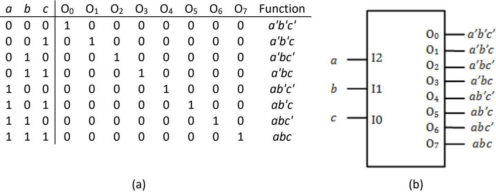

Figure 5.1: 3 to 8 decoder: (a) Truth table; (b) Decoder.

Now comes a key point that underlies this whole design methodology. **Each of the outputs represents a minterm of the inputs.** To implement a function as a sum of products, we can input the function inputs to the decoder and logically OR the desired outputs to realize the function.

Let's look at a couple of examples we worked out earlier to illustrate this process. In Figure 5.2 (a), we have the truth table for function $q$. This function is equal to 1 when $a=0$, $b=1$, and $c=0$; $a=1$, $b=0$, and $c=1$; or $a=1$, $b=1$, and $c=1$. Alternatively, $q=a'bc'+ab'c+abc$. In the previous chapter, we combined the last two terms and implemented the function as $q=a'bc'+ac$, but we can't do that when we use a decoder to realize the function. Since each decoder output represents one minterm, we must express the function solely using minterms. The three decoder outputs corresponding to $a'bc'$, $ab'c$, and $abc$ are $O_2$, $O_5$, and $O_7$, respectively. Logically ORing these three outputs together gives us the value for function $q$. This circuit is shown in Figure 5.2 (b).

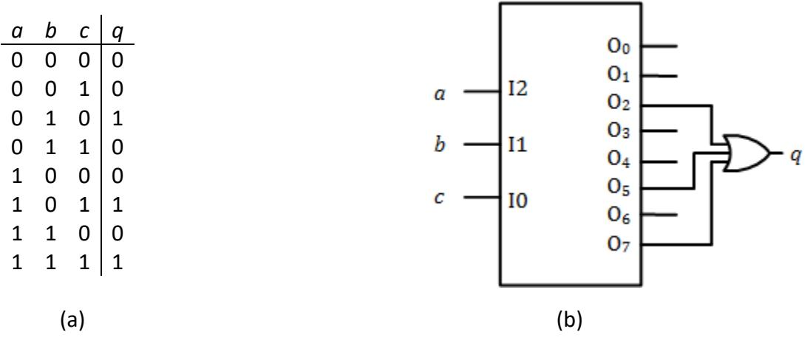

Figure 5.2: Implementing the function $q=a'bc'+ab'c+abc$ using a decoder: (a) Truth table; (b) Decoder circuit implementation.

Now consider another example function with the truth table shown in Figure 5.3 (a). There are six minterms which set function $q$ to 1, and $q$ can be expressed as $q=a'b'c'+a'bc'+a'bc+ab'c'+ab'c+abc'$. We can logically OR the decoder outputs corresponding to these minterms, which are $O_0$, $O_2$, $O_3$, $O_4$, $O_5$, and $O_6$, respectively, to realize function $q$. Figure 5.3 (b) shows this circuit. Since there are no standard TTL chips with 6-input OR gates, this circuit uses OR gates with lower fan-in values to realize the same function.

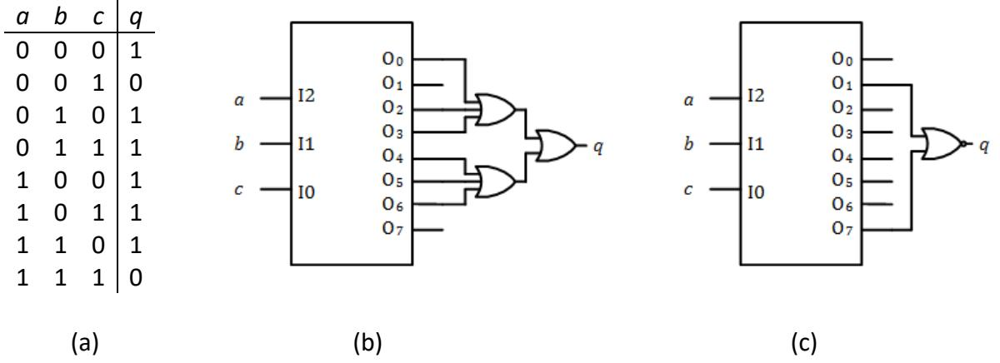

Figure 5.3: Implementing the function $q=a'b'c'+a'bc'+a'bc+ab'c'+ab'c+abc'$ using a decoder: (a) Truth table; (b) Decoder circuit implementation; (c) Decoder circuit implementation using inverse function.

Just as we did in a previous chapter, we can realize the inverse of this function (using maxterms) and then invert the output to realize the original function. For this function, this is equivalent to saying that $q'=1$ if either $O_1$ ($a'b'c$) or $O_7$ ($abc$) is equal to 1. We can logically OR $O_1$ and $O_7$ to realize $q'$, and then invert this value to generate $q$. The simplest way to do this is to NOR $O_1$ and $O_7$, which generates $q$ directly. This circuit is shown in Figure 5.3 (c).

## 5.2 Implementing Functions using Multiplexers

Just as decoders can be used to implement combinatorial logic functions, multiplexers can also be used to implement these functions. To see how this works, let's start with the 3-input AND function. Its truth table is shown in Figure 5.4 (a). Output $q=1$ only when $a=1$, $b=1$, and $c=1$, or $q=abc$.

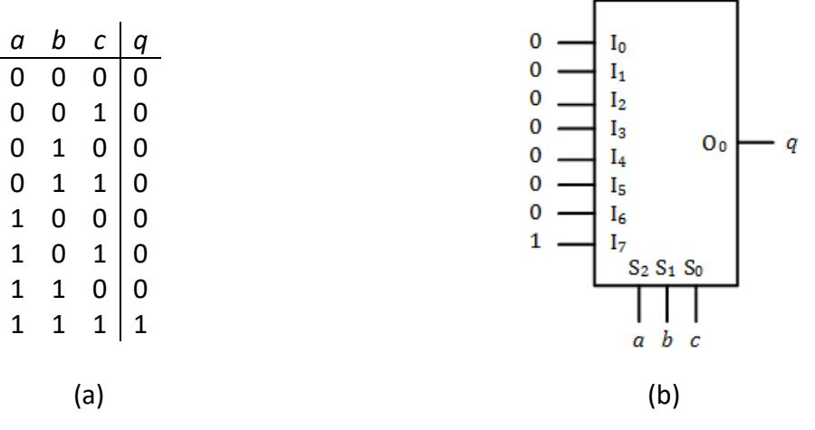

Figure 5.4: $q=abc$: (a) Truth table; (b) Implementation using an 8 to 1 multiplexer.

To implement a function using a multiplexer, we connect the function inputs ($a$, $b$, and $c$, for this function) to the select inputs of the multiplexer. Then we connect the value of the function for each possible set of function inputs to the corresponding multiplexer input. For example, consider the circuit shown in Figure 5.4 (b). When $a=0$, $b=0$, and $c=0$, the multiplexer will pass whatever value is at input $I_0$ directly to output $O_0$. Since $q=0$ for these values, we want to have 0 at this multiplexer input. In fact, we want to have 0 connected to all inputs except $I_7$. That input is selected when $a=1$, $b=1$, and $c=1$. For these values, $q=1$, not 0, and we need to set the value of this input to 1.

Examining the values of $q$ in the truth table, we can see that they are exactly the same as the data inputs to the multiplexer. In essence, this circuit is not computing the value of the function; it is looking up the value by selecting the multiplexer input.

As the number of inputs to a function increases, the size of a multiplexer needed to implement the function increases exponentially. For example, a function of 10 variables would require a multiplexer with 10 select signals and 210=1024 data inputs. This is simply not feasible. However, we can still use a smaller multiplexer by having some of the function inputs select a multiplexer input and using the other function inputs to generate the multiplexer data inputs. At first, this may seem confusing, but there is a straightforward method to design such a circuit.

To show how this works, let's redesign our circuit to realize the function $q=abc$ using a 4 to 1 multiplexer. The truth table for this function is repeated in Figure 5.5 (a). The first part of the design is to connect the function inputs to the select signals of the multiplexer. With three function inputs and two select signals, we must choose which function inputs to connect to the select signals, and which to exclude. I chose to connect inputs $a$ and $b$ to the select signals and to exclude input $c$. You can choose any two inputs and still create a working circuit, but choosing the leftmost bits in the truth table can make your work slightly easier for reasons we'll discuss shortly. The circuit, so far, is shown in Figure 5.5 (b).

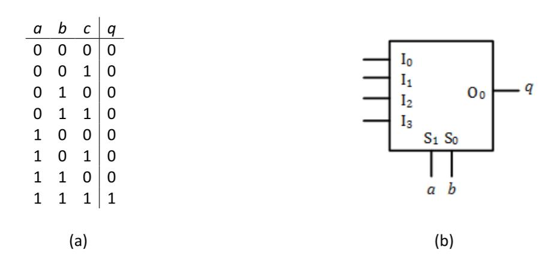

Figure 5.5: $q=abc$: (a) Truth table; (b) Assignment of function inputs to select signals.

Now we have to determine the values of the data inputs to the multiplexer. To do this, we are going to take a divide and conquer approach. We return to the truth table and divide it into several separate tables, one for each multiplexer input. Consider multiplexer input $I_0$. It is selected and its value is passed through to output $O_0$ when $S_1=0$ and $S_0=0$. For our circuit, this occurs when $a=0$ and $b=0$. We take all the rows of our truth table with $a=0$ and $b=0$ and make them into a separate table. We do this for each multiplexer input. (This is why I used the leftmost bits of the truth table as the select inputs, so that each of these tables would consist of consecutive rows.) The tables for this circuit are shown in Figure 5.6 (a).

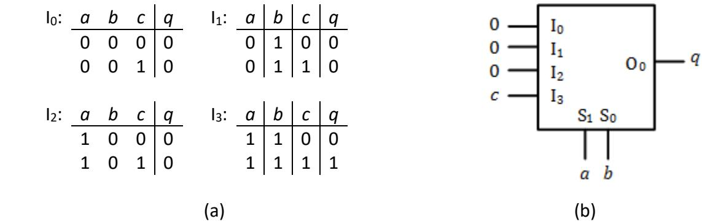

Figure 5.6: $q=abc$: (a) Partitioned truth tables; (b) Final design using a 4 to 1 multiplexer.

Finally, we must create and implement a function for each of the multiplexer data inputs. To do this, we express $q$ as a function of the function inputs we excluded earlier, that is, all the function inputs that are *not* input to the multiplexer's select signals. We are already taking the select values into account when we partition the tables. For example, let's look at input $I_0$. This value is only passed through to output $O_0$ when the select signals are both 0, or $a=0$ and $b=0$. If $a$ and $b$ have any other values, this multiplexer input will not be passed through to the output, so we don't care what its value is for any other values of $a$ and $b$. We may, however, need to take into account the value of other function inputs, $c$ in this example.

For $I_0$, $I_1$, and $I_2$, this is not the case. Each of these functions always sets $q=0$, so we simply hardwire a logic 0 to these three multiplexer inputs. For $I_3$, however, things are different. When $c$=0, we want to set output $q$ to 0, and when $c$=1 we want to set $q$ to 1. The simplest way to do this is to set $I_3=c$. When $a=1$, $b=1$, and $c=0$, $a$ and $b$ select multiplexer data input $I_3$, and its input value is 0 ($I_3=c=0$). When $a=1$, $b=1$, and $c=1$, we again select $I_3$, but this time its value is 1. The final design for this circuit is shown in Figure 5.6 (b).

Before we leave this topic, there are a couple of points I want to emphasize. First, each function input is used either as a select signal or to generate the data inputs to the multiplexer, but not both. If it is in both places, your circuit can be simplified.

The second point concerns the choice of function inputs used for the multiplexer select signals. I used the leftmost function inputs in the truth table because that always creates separate tables consisting of lines of the truth table that are next to each other. However, this does not always result in an optimal design (although it will always produce a correct design, sometimes with more hardware than absolutely necessary).

Figure 5.7 (a) shows the truth table for a function. Let's say we implement this function using a 4 to 1 multiplexer and connect $a$ and $b$ to the multiplexer select inputs. Using the procedure we just demonstrated, we would create the four separate tables shown in Figure 5.7 (b). These give us input functions $I_0=0$, $I_1=c'$, $I_2=c$, and $I_3=c'$. The circuit to realize the function is shown in Figure 5.7 (c).

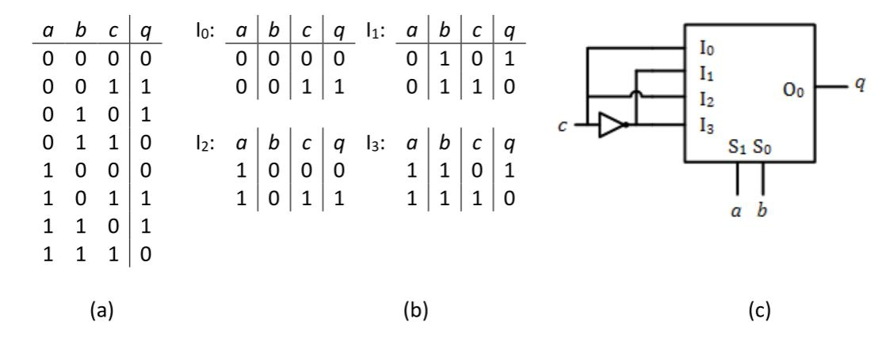

Figure 5.7: Function $q$: (a) Truth table; (b) Partitioned truth tables; (c) Implementation using a 4 to 1 multiplexer.

Now let's design this circuit again, but this time using $b$ and $c$ as the multiplexer inputs. The truth table, repeated in Figure 5.8 (a) is partitioned as shown in Figure 5.8 (b). For this design, we have $I_0=0$, $I_1=1$, $I_2=1$, and $I_3=0$. The final design is shown in Figure 5.8 (c).

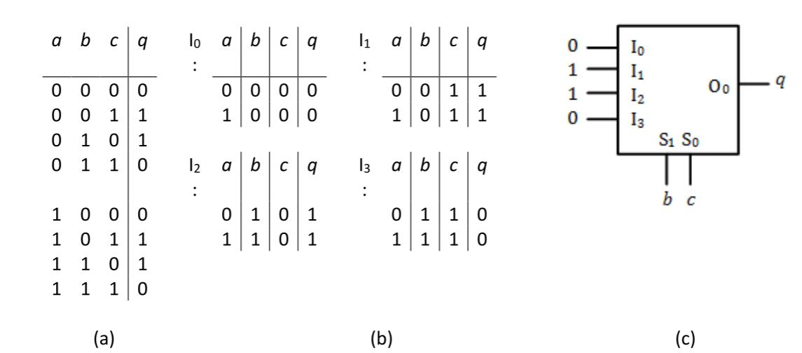

Figure 5.8: Function $q$: (a) Truth table; (b) Partitioned truth tables using $b$ and $c$ as multiplexer select inputs; (c) Implementation using a 4 to 1 multiplexer.

Comparing these two circuits, we see that some things do not vary between the designs. The multiplexer is always the same size, output $O_0$ always gives the value of $q$, and two of the function inputs are connected to the multiplexer select inputs. The only thing we can change by choosing which function inputs are connected to the multiplexer select inputs is the functions (and thus the circuits needed to generate the functions) of the multiplexer data inputs. The first design needed one NOT gate to generate these inputs, while the second design needed no logic gates at all. This example was constructed just to illustrate this concept. For more complex functions, the reduction in hardware needed to generate the multiplexer data inputs can be much greater than in this example.

## 5.3 ROM Lookup Circuits

In the previous section, I mentioned that the multiplexer circuit looks up the value of a function rather than calculating the value. A read-only memory, or ROM, can be used to generate values in much the same way. We'll look at ROMs and other memory components in more detail later in this book. For now, this section introduces just enough information about ROMs for us to use them to realize logic (or arithmetic) functions.

### 5.3.1 The Very Basics of ROMs

Memory chips are aptly named. They "remember" values that you can retrieve when needed, that is, they store values. In computer systems, memory chips may store the instructions that comprise a program, such as Microsoft Word, or data used by a program, for example, a Word document. If your computer has a solid state hard drive, that drive is constructed from memory chips. Flash drives are also built using memory chips.

Memory chips can be divided into two groups, depending on what happens to their data values when power goes off. **Volatile** memory only keeps its values when power is on. Once power goes off, all the data values it had stored are lost. The most common type of volatile memory is random access memory, or RAM. If a computer manufacturer says their computer has 16GB of memory, or whatever value they say, they are talking about RAM.

ROM (read only memory), on the other hand, is a **non-volatile** memory. When power is off, the data within the memory chip remains unchanged. If you turn power off and later turn it back on, you can access the exact data that was there before you turned the power off, which is why it is useful for things like flash drives, and for lookup tables for logic and arithmetic functions.

To be clear, even though ROM chips store their data when power is off, you can't read this data from the chip unless power is on. The memory chips need to have power in order to output their data. In addition to the memory cells that actually store the data, there are other components used by the chip to access specific memory cells and to perform other functions needed to read data from the memory chip. These components cannot function unless power is on.

So, if a ROM is a read-only memory, how do you write data into it in the first place? There are several types of ROMs, each with its own way to store data. Some chips are fabricated with the data stored in its memory cells, and others use special programming hardware to write values into these cells. We'll talk about the writing process in more detail in Chapter 10. For our ROM lookup circuits, we will assume that, somehow, the data for our lookup function has already been written into the ROM.

### 5.3.2 Memory Chip Configuration

Regardless of the type of memory chip, its inputs and outputs work in a similar manner. We input an **address** to the memory chip. This is just some number of Boolean inputs that are used to select one unique memory cell, or **location**, within the chip. On a memory chip, each address bit is assigned to a unique pin. The number of address inputs depends on how many memory cells are in the chip. Remember from our discussion of numeric representations in Chapter 1 that $n$ bits can represent $2^n$ unique values. Here, $2^n$ is the number of memory locations within a chip and $n$ is the number of address bit inputs. For example, consider a memory chip with 1024 locations. Since $1024=2^{10}$, this chip must have 10 address bit inputs. If the address inputs are 00 0000 0000, we will access memory location 0 within the chip. Address 00 0000 0001 accesses location 1, and so on, up to address 11 1111 1111 accessing location 1023.

There are different ways to label these address inputs. For consistency, we will use a notation called **little Endian** throughout this book. The least significant bit is labeled $A_0$. The next bit is $A_1$, and so on. The most significant bit is $A_{n-1}$. For our 1024-location ROM, 1024=2^{10}, so $n=10$ and these bits are $A_9$ to $A_0$.

The memory chip may have one bit of data at each memory location, or it may have more bits. Each bit must have its own data bit output. For a memory chip with $m$ data outputs, we again use little Endian notation, labeling them from $D^m-1$ (most significant bit) to $D_0$ (least significant bit). As with the address inputs, each data output is assigned to a unique pin on the memory chip.

For RAMs, these data pins are used both to input and output data. Programming hardware may also use these bits to store data in a ROM. We won't worry about that for now since we are assuming the data is already stored in the ROM.

The size of a memory chip is said to be $2^n \times m$. For our 1024-location memory chip, if it has eight output bits, we would say it is of size 1024x8.

There are other pins on the memory chips that are important for other uses of these chips. One of these is the chip enable, or chip select, input. Going back to our computer with 16GB of memory, it is unlikely that this computer has a single chip with 16GB locations. It is much more likely that this 16GB of memory is constructed using smaller chips. Different addresses in the 16GB range are assigned to different chips. When we want to get data from a specific location, we need to get the data from one specific chip. We use the chip enable input to choose the correct chip. We also use the chip enable inputs of the other chips to make sure we're not choosing those chips. Fortunately for us, ROM lookup circuits typically include just one single memory chip, so we can always enable the chip in our circuits.

### 5.3.3 Using ROMs in Lookup Circuits

All ROM lookup circuits follow the same basic design procedure, summarized in the following three steps.

1. All function inputs are connected to the address inputs of the ROM.
2. Function values are output on the ROM's data outputs.
3. Each memory location in the ROM stores the value of the function for its input values.

I think the best way to illustrate how this works is to jump right in with an example. Let's start with a 3-input AND function. Its three inputs are $a$, $b$, and $c$, and its output $q$ is 1 only when all three inputs are equal to 1. Its truth table is shown in Figure 5.9 (a).

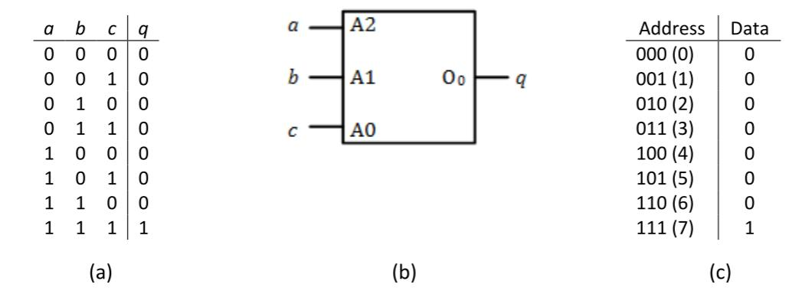

Figure 5.9: 3-input AND function $q=abc$: (a) Truth table; (b) Lookup ROM circuit; (c) ROM data.

Following the procedure introduced at the beginning of this subsection, first we connect the function inputs, $a$, $b$, and $c$, to the address inputs of the ROM, $A_2$, $A_1$, and $A_0$, respectively. Next, we connect the function output, $q$, to data output $D_0$. Since we have three address inputs and one data output, $n=3$ and $m=1$, and the size of our ROM is 23x1, or 8x1. That is, the ROM has eight memory locations, each with one bit of data. The lookup ROM and its connections are shown in Figure 5.9 (b).

Finally, we must determine the data values to store in every memory location. Let's start with address 0, or 000 in binary. We will read data from this memory location when $a=0$, $b=0$, and $c=0$. When the function inputs have these values, $q=abc=0 \land 0 \land 0=0$, so we store a 0 at memory location 0. We follow the same procedure to calculate the values at the other locations. All other locations also have the value 0, except for location 7 (111), which has the value $q=1 \land 1 \land 1=1$. These values are shown in Figure 5.9 (c).

Notice that the two tables in Figure 5.9 are essentially the same. This happens because we connected our function inputs directly to the address inputs of the ROM, that is, $A_2=a$, $A_1=b$, and $A_0=c$.

Now, instead of an AND function, let's say we want to implement an OR function. The truth table for this function is shown in Figure 5.10 (a). Since this function has the same inputs and outputs (though not the same output values) as the AND function, its connections are the same as those for the AND circuit, as shown in Figure 5.10 (b). **This is a really important point and we'll come back to this shortly.** Finally, we determine the values to be stored in each memory location. For this function, location 0 ($a=0$, $b=0$, and $c=0$) has the value 0 and all other locations have the value 1, as shown in Figure 5.10 (c).

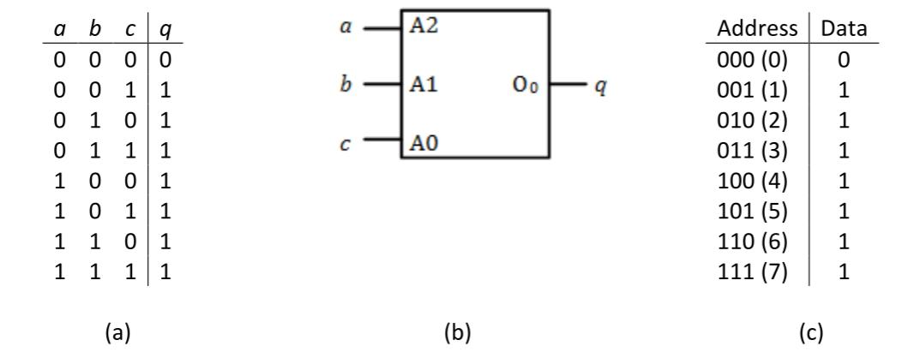

Figure 5.10: 3-input OR function $q=a+b+c$: (a) Truth table; (b) Lookup ROM circuit; (c) ROM data.

Now, back to our really important point. Both functions use exactly the same hardware with identical input and output connections. **We change the function of the circuit by changing the contents of the ROM.** By doing so, we can realize any function of the inputs using the same circuit and modifying the data stored in the ROM.

Finally, it is possible to use a lookup ROM to generate more than one function. To do this, you need one data output for each function. After assigning each function to an output, we determine the value for each location for each function and store those values in the ROM. Consider a lookup ROM that generates both the AND and OR functions for three input values. Here, $q=abc$ and $r=a+b+c$. Figure 5.11 (a) shows the combined truth table for the two functions. The circuit diagram is developed just as before. The ROM still has three inputs because the functions each use the same three function inputs, $a$, $b$, and $c$. However, with two functions to generate, the ROM now must have two outputs, so the ROM is of size 8x2. The circuit diagram is shown in Figure 5.11 (b). To complete the design, we determine the values to be output for both functions. These are shown in Figure 5.11 (c).

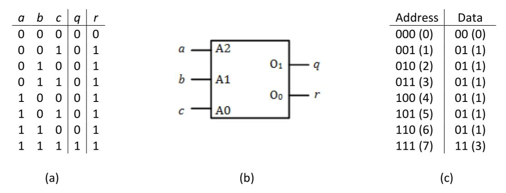

Figure 5.11: 3-input AND $q=abc$ and OR $q=a+b+c$ functions: (a) Truth table; (b) Lookup ROM
circuit; (c) ROM data.

### 5.3.4 Arithmetic Lookup ROM Circuits

The previous examples used a lookup ROM to generate the output of a logic function. But there's nothing that stops us from using a lookup ROM to output other types of data values. The ROM doesn't know what type of data it outputs. It gets an address and outputs the data stored at that address. By specifying the values input to the address pins, the contents of each memory location within the ROM, and the connections from its outputs, the designer specifies its function and the type and format of its data.

Arithmetic circuits are one type of circuit that can be implemented using a lookup ROM. As in the previous examples, the function inputs are connected to the address pins of the ROM. Instead of being Boolean logic values, however, these bits represent binary numbers. More than one bit may be used to represent a number, and each bit is connected to a separate address bit. Similarly, we may need several output bits to represent a single value.

To see how this works, consider a lookup ROM that multiplies two 2-bit numbers, $X$ and $Y$. Each input number has one of four possible values: 0 (00), 1 (01), 2 (10), or 3 (11). We'll represent $X$ and $Y$ as the two bit values $X_1X_0$ and $Y_1Y_0$. The product output by the ROM ranges

from 0 (0x0) to 9 (3x3), or 0000 to 1001 in binary. So, we need four bits to represent the product, which we'll call $Q$ and represent as $Q_3Q_2Q_1Q_0$ in binary.

Just as before, we'll connect our function inputs ($X_1$, $X_0$, $Y_1$, and $Y_0$) to the ROM's address inputs and the product outputs ($Q_3$, $Q_2$, $Q_1$, and $Q_0$) to its data outputs. The circuit designer can choose which function input and output bits are connected to each address and data pin on the ROM. (Hint: Keeping the bits for each operand input and the product output together and in order will make it easier to calculate the values to be stored in the lookup ROM.) For this example, I decided to connect input value $X$ to address bits $A_3$ ($X_1$) and $A_2$ ($X_0$), and input $Y$ to address bits $A_1$ ($Y_1$) and $A_0$ ($Y_0$). Output $Q$ is connected to data outputs $D_3$ ($Q_3$), $D_2$ ($Q_2$), $D_1$ ($Q_1$), and $D_0$ ($Q_0$). This is shown in Figure 5.12 (a).

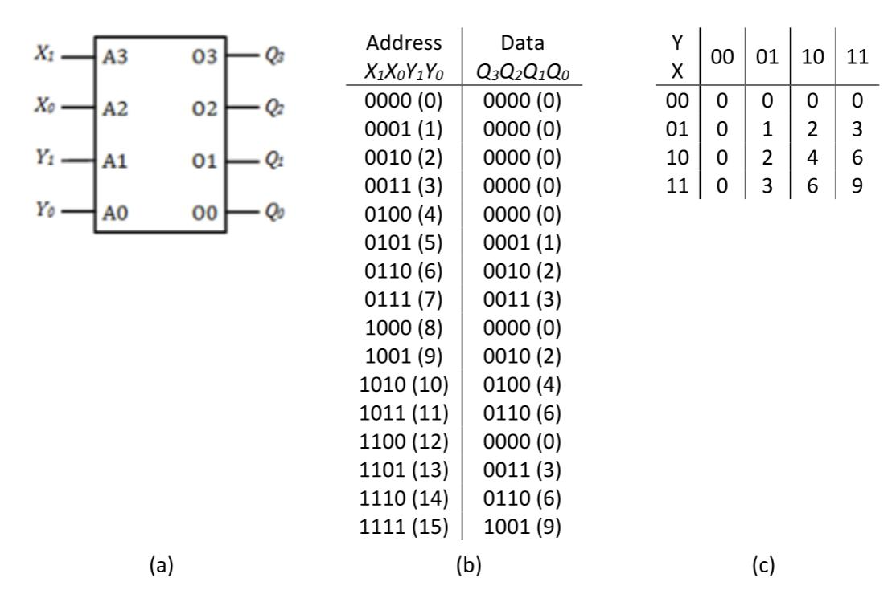

Figure 5.12: 2-bit multiplier lookup ROM: (a) Lookup memory circuit; (b) ROM contents; (c) Calculating values using a grid.

To complete the design of this circuit, we must specify the contents of the ROM. We do exactly what we've done all along; we look at each possible set of input values and figure out what output values they should produce. For this circuit, we can start with $X=0$ and $Y=0$, or $X_1=0$, $X_0=0$, $Y_1=0$, and $Y_0=0$. When we multiply these values, we access memory address 0000, or 0. The product of $X$ and $Y$, $0 \times 0=0$, must be stored in that location. Doing this for all possible values of $X$ and $Y$ gives us the data shown in Figure 5.12 (b).

It may be easier to visualize this if we use a grid to show these values, such as the one shown in Figure 5.12 (c). Each row corresponds to a unique value of $X$ and each column represents a specific value of $Y$. The value at each location in the grid is the product of $X$ and $Y$ for its row and column. We can concatenate $X$ and $Y$ to give the address associated with each entry. For example, the third entry in the fourth row has $X=11$ and $Y=10$, and a data value of 0110. This shows that address 1110 has the value 0110, generating the output value 6 when we multiply 3x2.

## 5.4 Summary

In this chapter, we examined several ways to design combinatorial logic circuits to realize Boolean functions. Decoders can be used to generate the minterms of their inputs, and we can logically OR the desired minterms to create a sum of products realization of the function. A multiplexer can be configured to select the correct value of a function for any set of input values and output it directly. A ROM can be used to look up one or more function values. The function inputs specify the address and the data outputs produce the function values. Lookup ROMs can be used to realize Boolean or arithmetic functions.

In Chapter 10, we'll introduce programmable logic devices. These components have many logic gates on a single chip. The design engineer can configure the connections between gates to realize the desired function. Programmable logic devices can reduce the number of chips in a design, as well as the amount of wiring and power needed in a circuit.

This concluded the material on combinatorial logic. In the next chapter, we begin our discussion of sequential logic. Unlike combinatorial logic, which produces outputs based solely on the current value of its inputs, sequential logic outputs are based on both the current inputs and the current state, which in turn is based on previous values of the inputs. This may seem confusing at first, but it will become clearer as we examine the basic components of sequential logic and how they are used, along with combinatorial logic components, to realize sequential designs.

## Exercises

1. Design a circuit to realize the following truth table using a decoder and an OR gate.

| a | b | c | q |
|---|---|---|---|
| 0 | 0 | 0 | 0 |
| 0 | 0 | 1 | 1 |
| 0 | 1 | 0 | 1 |
| 0 | 1 | 1 | 0 |
| 1 | 0 | 0 | 1 |
| 1 | 0 | 1 | 0 |
| 1 | 1 | 0 | 0 |
| 1 | 1 | 1 | 1 |

2. Design a circuit to realize the following truth table using a decoder and an OR gate.

| a | b | c | q |
|---|---|---|---|
| 0 | 0 | 0 | 0 |
| 0 | 0 | 1 | 1 |
| 0 | 1 | 0 | 1 |
| 0 | 1 | 1 | 0 |
| 1 | 0 | 0 | 1 |
| 1 | 0 | 1 | 0 |
| 1 | 1 | 0 | 0 |
| 1 | 1 | 1 | 1 |

3. Repeat problem 2, this time using a NOR gate to generate $q$ instead of an OR gate.

4. Design circuits to perform the following functions for three inputs using a decoder.
	- a. AND
	- b. OR
	- c. XOR
	- d. NAND
	- e. NOR
	- f. XNOR

5. Show the truth table and minimal function realized by the following circuit.

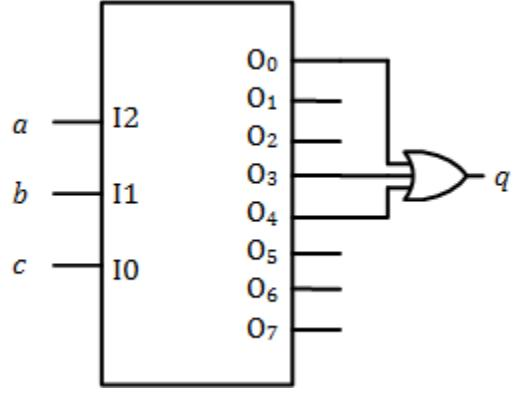

6. Using a 4 to 16 decoder, design a circuit to generate output $a$ of the BCD to 7-segment decoder.

7. Design a circuit to realize the following truth table using a multiplexer.

| a | b | c | q |
|---|---|---|---|
| 0 | 0 | 0 | 0 |
| 0 | 0 | 1 | 1 |
| 0 | 1 | 0 | 1 |
| 0 | 1 | 1 | 0 |
| 1 | 0 | 0 | 1 |
| 1 | 0 | 1 | 0 |
| 1 | 1 | 0 | 0 |
| 1 | 1 | 1 | 1 |

8. Design a circuit to realize the following truth table using a multiplexer.

| a | b | c | q |
|---|---|---|---|
| 0 | 0 | 0 | 0 |
| 0 | 0 | 1 | 1 |
| 0 | 1 | 0 | 1 |
| 0 | 1 | 1 | 0 |
| 1 | 0 | 0 | 1 |
| 1 | 0 | 1 | 0 |
| 1 | 1 | 0 | 0 |
| 1 | 1 | 1 | 1 |

9. Design circuits to perform the following functions for three inputs using a multiplexer.
	- a. OR
	- b. XOR
	- c. NAND
	- d. NOR
	- e. XNOR

10. Show the truth table and minimal function realized by the following circuit.

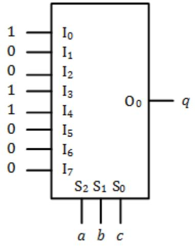

11. Using a 16 to 1 multiplexer, design a circuit to generate output $a$ of the BCD to 7 segment decoder.

| a | b | c | q |
|---|---|---|---|
| 0 | 0 | 0 | 0 |
| 0 | 0 | 1 | 1 |
| 0 | 1 | 0 | 1 |
| 0 | 1 | 1 | 0 |
| 1 | 0 | 0 | 1 |
| 1 | 0 | 1 | 0 |
| 1 | 1 | 0 | 0 |
| 1 | 1 | 1 | 1 |

12. Design a circuit to realize the following truth table using a ROM. Show the circuit and the contents of the ROM.

| a | b | c | q |
|---|---|---|---|
| 0 | 0 | 0 | 0 |
| 0 | 0 | 1 | 1 |
| 0 | 1 | 0 | 1 |
| 0 | 1 | 1 | 0 |
| 1 | 0 | 0 | 1 |
| 1 | 0 | 1 | 0 |
| 1 | 1 | 0 | 0 |
| 1 | 1 | 1 | 1 |

13. Design a circuit to realize the following truth table using a ROM. Show the circuit and the contents of the ROM.

| a | b | c | q1 | q0 |
|---|---|---|----|----|
| 0 | 0 | 0 | 0  | 0  |
| 0 | 0 | 1 | 0  | 1  |
| 0 | 1 | 0 | 0  | 1  |
| 0 | 1 | 1 | 1  | 0  |
| 1 | 0 | 0 | 0  | 1  |
| 1 | 0 | 1 | 1  | 0  |
| 1 | 1 | 0 | 1  | 0  |
| 1 | 1 | 1 | 1  | 1  |

14. Design a circuit to realize the following truth table using a ROM. Output $q_1q_0$ is the sum of $a$, $b$, and $c$. Show the circuit and the contents of the ROM.

15. Design a single circuit to perform the following functions for three inputs using a ROM. Show the circuit and the contents of the ROM.
	- a. AND
	- b. OR
	- c. XOR
	- d. NAND
	- e. NOR
	- f. XNOR

16. Repeat Problem 15 for functions with four inputs.

17. Show the truth table and minimal function realized by the following circuit and contents of memory.

| Address | Data |
|---------|------|
| 000     | 1    |
| 001     | 0    |
| 010     | 0    |
| 011     | 1    |
| 100     | 1    |
| 101     | 0    |
| 110     | 0    |
| 111     | 0    |

18. Design a BCD to 7-segment decoder using a ROM and show the contents of memory. Segments $a$ through $g$ are connected to outputs $O_6$ to $O_0$, respectively.

19. A ROM has three address bits and three data bits. The inputs, $a$, $b$, and $c$ form a 3-bit binary value and are input to the ROM as in problem 17. The outputs of the ROM realize the function $(abc + 1) \mod 8$. Show the contents of the ROM.
