# Chapter 7: More Complex Sequential Components

Earlier in this book, we saw that there are some combinatorial logic functions that are used so frequently that engineers created components specifically to realize these functions. When a digital designer wants to include a decoder, encoder, multiplexer, or demultiplexers in a design, they can simply use a chip with that function or call up a predefined component in their design software. This is an efficient and cost-effective way to streamline the design process and minimize design errors. The same reasoning can be used to justify the creation of similar components for sequential logic. In this chapter, we examine some of these components, their functions, and their internal designs.

First, we examine **registers**. A flip-flop is sufficient to store a single bit of data, but we often use data consisting of multiple bits, such as the *n*-bit binary numbers we introduced earlier in this book. Registers do just that; they store multi-bit binary values. We will see how they can be designed in a straightforward manner using the flip-flops introduced in the previous chapter.

There are certain types of registers that can not only store data, but can also perform one or more operations on that data. We will look at **shift registers**, which, as the name implies, can shift their bits one place to the right or left. These are particularly useful for data communication, in which a multi-bit value is transmitted one bit at a time. We will introduce several types of shift registers and how they are designed using flip-flops.

Finally, we will present **counters**. They may count up or down, or have the ability to count in either direction. There are counters that count in binary or decimal. A digital circuit may cascade several counters to count a larger number, much as the odometer on an automobile uses several digits to count the number of miles driven. We will show how this works and the signals used by the counters to communicate with each other. We will also examine the methodologies used in the internal designs of these counters.

## 7.1 Registers

In digital circuits, it is fairly common to store and perform operations on numeric, binary values. In some cases, the value may be a single bit, and a flip-flop is sufficient to store these values. Most of the time, however, the value will have more than one bit. Although we could use multiple flip-flops to store these values, this can become cumbersome, resulting in additional wiring and greater power usage. For this reason, digital circuit designers developed dedicated chips and components just for this purpose. These are called **registers**.

Internally, you can think of a register as several D flip-flops connected in parallel. Each flip-flop receives one bit of a value as its input and outputs that one bit. Consider, for example, the 8-bit register shown in Figure 7.1. An 8-bit value is input to the register via inputs *D7*-*D0* and the output is made available at outputs *Q7*-*Q0*.

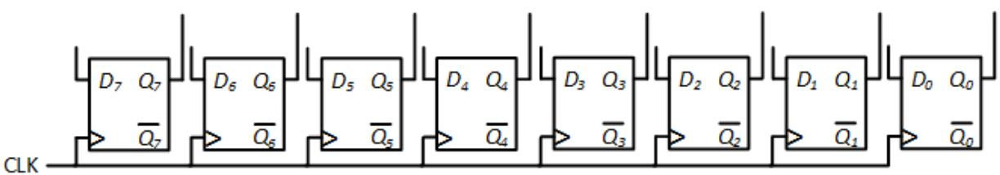

Figure 7.1: 8-bit positive edge-triggered register.

Note that all flip-flops within the register use the same clock signal. That is, when we load a value into a register, we load all the bits of the register. Since registers are used to hold a single, multi-bit value, we usually want to load the entire value or nothing at all. You can't load, say, bits 3, 5, and 6 with new values and leave the other bits unchanged. If you need your circuit to be able to load individual bits, you should not use a register; you should use individual flipflops instead.

In more complex digital systems, such as microprocessors, the system may have a clock signal that is used to synchronize all components within the system. In these systems, good design practice is to use the clock input only for the system clock, and to have a separate signal that indicates when to load the register.

Digital designers have modified the register design shown in Figure 7.1 just for this purpose. They added a separate signal, which we call LOAD. When LOAD = 1, we load the new value into the register on the rising edge of the clock. When LOAD = 0, we do not load in a new value, regardless of the clock value. Figure 7.2 shows a generic 8-bit register with a LOAD signal and a sample timing diagram. The animation shows this progression over time.

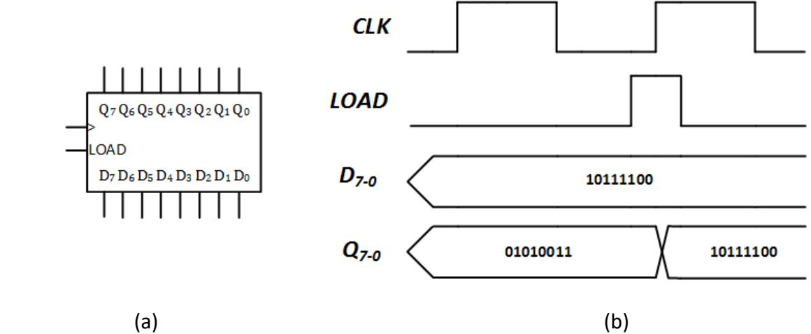

Figure 7.2: 8-bit register with LOAD: (a) Generic diagram showing inputs and outputs; (b) Example timing diagram.

Before you continue reading, think about how you can make the CLK and LOAD signals work with flip-flops that have only a single clock signal.

Hopefully you developed your own method to make the register with CLK and LOAD signals function properly. Here's my solution, which is not the only solution and may or may not match yours. Even if our solutions are not the same, it is still quite possible that your solution is perfectly valid.

I started by creating a truth table, with the LOAD and CLK signals as inputs and the clock signal of the flip-flops as the output. Since we only care about the rising edge of CLK, I use ↑ and not↑ as the value for CLK instead of the usual 0 and 1. This truth table is shown in Figure 7.3 (a).

| LOAD | CLK   | FF CLOCK | My     |     |
|------|-------|----------|--------|-----|
|      |       |          | choice |     |
| 0    | not ↑ | not ↑    | 0      |     |
| 0    | ↑     | not ↑    | 0      |     |
| 1    | not ↑ | not ↑    | 0      |     |
| 1    | ↑     | ↑        | ↑      |     |
|      |       |          |        |     |
|      |       | (a)      |        | (b) |

Figure 7.3: 8-bit register with LOAD: (a) Truth table for flip-flop clock inputs; (b) Final design.

From the table, we see that we must generate a rising edge when LOAD = 1 and CLK = ↑, and any value that is not a rising edge in all other cases. I choose to make this value 0 when LOAD = 0 and the same value as CLK when LOAD = 1. (The latter works both when we do and do not have a rising edge.) To create this value, we can simply AND together the LOAD and CLK signals. Figure 7.3 (b) shows the final design for an 8-bit register with LOAD signal.

## 7.2 Shift Registers

Registers were created to simplify the design process. Instead of wiring up several chips containing individual flip-flops, engineers could use a single chip to store multi-bit values. Registers are very useful, but their functionality is somewhat limited. They can load and store data, but they cannot perform any operations on that data.

For that reason, design engineers created extended versions of registers, components that can load and store data, but also perform specific operations on that data. The designers chose functions that are frequently used by circuit designers. In this section, we look at one class of registers, the **shift register**. First we will introduce the **linear shift** operation, how it works, and the designs of linear shift registers using both D and J-K flip-flops. Then we will discuss ways to combine shift registers for data values with large numbers of bits.

### 7.2.1 Linear Shifts

Imagine that you are in a small store. There is one line of customers at the checkout. When a customer finishes checking out and leaves, the next customer moves up to the cashier, and everyone else in line moves forward one step. This is essentially how a linear shift operation works.

Instead of customers in a checkout line, consider an 8-bit binary value, for example, 10110110. We can perform a linear shift on this data in one of two ways: linear shift left or linear shift right. First, let's look at the linear shift left. Just as with our line of customers, every bit is shifted one position to the left, as shown in Figure 7.4 (a). This takes care of most of the bits, but it leaves us with two questions. What happens to the most significant bit? And what gets shifted into the least significant bit? Just as the customer who finishes paying leaves the store, the most significant bit also leaves. We say it is shifted out. As for the least significant bit, by definition a linear shift places a 0 in this position.

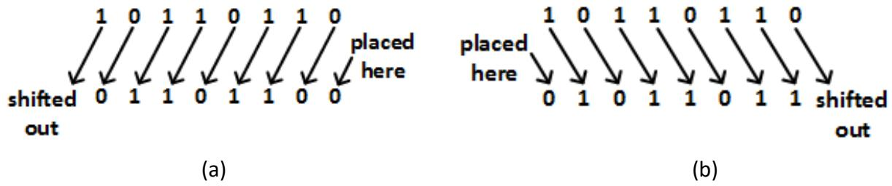

Figure 7.4: (a) Linear left shift; (b) Linear right shift.

The linear shift right works in exactly the same way, but in the opposite direction. The least significant bit is shifted out and a 0 is placed in the most significant bit, as shown in Figure 7.4 (b).

### 7.2.2 Shift Register Design Using D Flip-Flops

Now that we know how linear shift operations work, we can design shift registers to implement these operations. The easiest way to do this is to use flip-flops. First, we will see how to do this using D flip-flops, which is the most straightforward design.

Consider the 8-bit register constructed from eight D flip-flops shown in Figure 7.5. The subscripts 7 to 0 represent the positions of the eight bits, with bit 7 being the most significant and bit 0 being the least significant. When we perform a linear shift right, we want to move the value from bit 7 to bit 6, from bit 6 to bit 5, and so on. More specifically, we want to load the value in bit 7 into bit 6, and so on. To do this, we connect the Q output of bit 7, *Q7*, to the D input of bit 6, *D6*; we do the same for the other bits. We do not connect *Q0* to anything since that value is shifted out. We connect *D7* to a hard-wired 0 since the linear shift places a 0 in that bit position. Finally, our shift register must have an input signal, which I'll call SHIFT, that causes the shift operation to occur on its rising edge. Putting all of this together gives us the design shown in Figure 7.5.

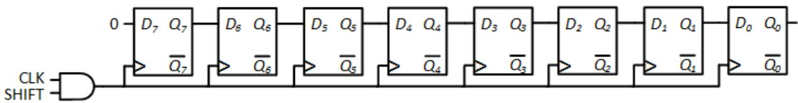

Figure 7.5: 8-bit linear shift right register constructed using D flip-flops.

We can use exactly the same design to implement the linear shift left operation. We simply reverse the labels. Instead of labeling the flip-flops from 7 to 0 (left to right), we number them from 0 to 7. It's perfectly acceptable to do this. The flip-flops don't really care what you call them. The only thing that matters to them is how their inputs, outputs, and clock signals are connected. Figure 7.6 shows this configuration.

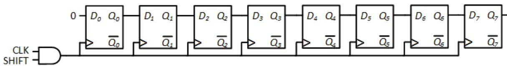

Figure 7.6: 8-bit linear shift register relabeled for linear shift left operation.

There is one extremely important point to emphasize when it comes to shift registers. **All the shifts occur at exactly the same time**. The values that are shifted are the values in each flip-flop at the beginning of the shift operation. We don't shift a value from bit 7 to bit 6, and then shift that value from bit 6 to bit 5, and so on. We shift the original value from bit 7 to bit 6, the original value from bit 6 to bit 5, and so on. This ensures that our design implements the linear shift operation properly.

One final point I want to mention concerns the 0 that is loaded into the most significant (linear shift right) or least significant (linear shift left) bit. In most shift register designs, there is a dedicated input called SHIFT\_IN that supplies this input. This is particularly useful when we cascade shift registers to accommodate larger numbers; we'll examine this later in this section. For now, we have hard-wired a logic 0 to this input for the designs presented here.

### 7.2.3 Shift Register Design Using J-K Flip-Flops

We can also design a shift register using J-K flip-flops. Just as before, we use one flip-flop for each bit and use the outputs of each flip-flop to generate the inputs of the next flip-flop. Here, the key is to determine the functions for inputs *J* and *K* for each flip-flop.

Figure 7.7 (a) shows the excitation table for a J-K flip-flop within the shift register. In this table, *Q* is the output of the previous flip-flop, and also the value we want to load into this J-K flip-flop.

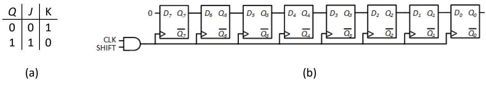

Figure 7.7: Linear shift register constructed using J-K flip-flops: (a) Excitation table; (b) Final design.

Looking at the excitation table, it is fairly easy to see that *J* = *Q* and *K* = . Since the J-K flip-flop produces both *Q* and outputs, they can be connected directly to the inputs of the next flip-flop. We do this for every flip-flop except the first one. Since the linear shift operation must set that bit to 0, we set *J* = 0 and *K* = 1 for that flip-flop. The final design for the register that shifts to the right is shown in Figure 7.7 (b). We can simply relabel the bits as we did for the shift register constructed using D flip-flops to make this shift register perform a shift to the left.

If our register has a SHIFT\_IN signal, we would handle the first bit slightly differently. Instead of hard-wiring *J* = 0 and *K* = 1, we would use SHIFT\_IN to generate the *J* and *K* inputs. When SHIFT\_IN = 0, we want to set the flip-flop to 0, which we do by setting *J* = 0 and *K* = 1. If SHIFT\_IN = 1, we set the output to 1 by setting *J* = 1 and *K* = 0. Combining these two gives us the functions *J* = SHIFT\_IN and *K* = SHIFT\_IN*'*. The shift register with a SHIFT\_IN signal is shown in Figure 7.8.

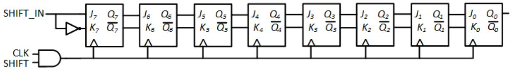

Figure 7.8: Linear shift register with SHIFT\_IN signal constructed using J-K flip-flops.

### 7.2.4 Bidirectional Shift Registers

You may need to design a circuit that can shift its data either left or right. A single input, which we'll call SHIFT\_DIR, would indicate the direction to shift the data; we will use SHIFT\_DIR = 0 for shift left and SHIFT\_DIR = 1 for shift right. You cannot use the designs we've seen so far; they can only shift data in one direction. However, we can modify these designs to create a bidirectional shift register. We'll modify our design using D flip-flops.

The key to this design is to develop functions for each flip-flop input and the circuitry to realize these functions. Let's start by considering one of the flip-flops in the middle of the shift register, say bit 4. If SHIFT\_DIR = 1, we want to shift the contents of the register one bit to the right. Bit 4 must get the value of bit 5, which is available on its output, *Q5*. If SHIFT\_DIR = 1,

*D4* = *Q5*. If SHIFT\_DIR = 0, however, we are shifting the data left by one bit, and bit 4 must get the value of bit 3; when SHIFT\_DIR = 0, *D4* = *Q3*.

We can combine the two cases to generate *D4* by using combinatorial logic gates or a 2 to 1 multiplexer. Figure 7.9 shows one possible design using multiplexers. Notice that the designs for the inputs to the bit 7 and bit 0 flip-flops are slightly different. Rather than getting one of two flip-flop outputs as their *D* input value, they get either one flip-flop value or the SHIFT\_IN value.

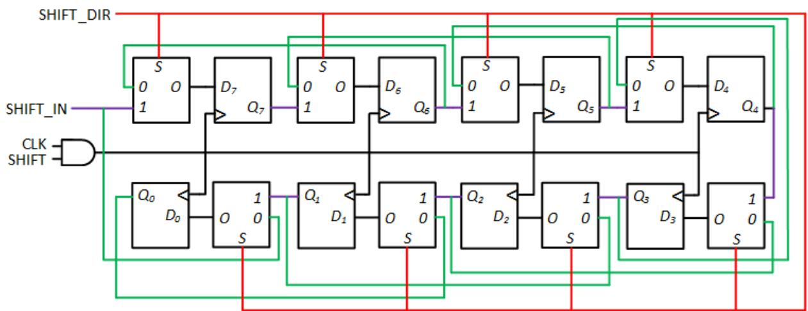

Figure 7.9: Bidirectional shift register constructed using D flip-flops and multiplexers, color coded as follows: RED = direction of shift (0=left, 1=right); GREEN = data paths for left shift; PURPLE = data paths for right shift; BLACK = clock and data path from multiplexers to flip-flops.

If we do not have a SHIFT\_IN signal on our shift register, we can use the same design to perform a regular linear shift operation. The only change we need to make to our design is to replace SHIFT\_IN with a hardwired 0.

### 7.2.5 Shift Registers with Parallel Load

It is very useful to be able to load a shift register in parallel, that is to load data into all the bits of a shift register simultaneously, just as we load all bits of a traditional register. In computer systems, a microprocessor may send data to a specialized chip called a **Universal Asynchronous Receiver/Transmitter**, or **UART**. The microprocessor sends the data in parallel, and the UART outputs the data to a modem or other serial device one bit at a time. As you may have guessed, UARTs incorporate shift registers designed to perform a parallel load in their designs.

We can modify the designs presented previously in this section to add the ability to load the shift register in parallel. We need to add some input signals to do this. First, we add eight inputs, *I7* to *I0*. When we load data in parallel, the data will be placed on these inputs. We also need to add a signal that tells the shift register to load the data; we'll just call that signal LOAD.

With these additional signals, we can modify any of the shift registers presented so far. As an example, we will modify the bidirectional shift register shown in Figure 7.9. We start by creating the truth table for our design, which is given in Figure 7.10. As shown in this table, one of four things can happen. When LOAD = 0 and SHIFT = 0, we do not want to load in a new value nor shift the current value. We want to keep the value in the register unchanged. If LOAD = 0 and SHIFT = 1, we want to shift the data. The value of SHIFT\_DIR determines whether we should shift left (SHIFT\_DIR = 0) or right (SHIFT\_DIR = 1). Finally, if LOAD = 1 we must load in the data on the data inputs.

Notice what happens when LOAD = 1 and SHIFT = 1. You cannot both load and shift data simultaneously. You must choose one or the other. Since I'm writing this book, I get to choose, and I choose to give LOAD priority over SHIFT. If both signals are high, our register will load data.

| LOAD | SHIFT | SHIFT_DIR | Q                 |
|------|-------|-----------|-------------------|
| 0    | 0     | X         | Q0                |
| 0    | 1     | 0         | Q6-0,SHIFT_IN     |
| 0    | 1     | 1         | SHIFT_IN,Q7-1 |
| 1    | X     | X         | I7-0              |

Figure 7.10: Truth table for the bidirectional shift register with parallel load.

As shown in the truth table, there are three possible values we can load into each flipflop: the next lower bit or SHIFT\_IN (shift left); the next higher bit or SHIFT\_IN (shift right); or the value on input *I* (load). To do this, we follow the same design methodology we used for the original bidirectional shift register: we use a multiplexer to select the correct input. Since we have three inputs, we need a larger multiplexer, a 4 to 1 multiplexer. (Multiplexers always have the number of inputs equal to a power of 2. Nobody makes a 3 to 1 multiplexer. We just don't use the extra input and we make sure we never select that input.) Figure 7.11 (a) shows how I chose to assign the possible data values to the multiplexer inputs.

|     | LOAD | SHIFT | SHIFT_DIR | S1 | S0 |
|-----|------|-------|-----------|----|----|
|     | 0    | 0     | X         | X  | X  |
|     | 0    | 1     | 0         | 0  | 0  |
|     | 0    | 1     | 1         | 0  | 1  |
|     | 1    | X     | X         | 1  | 0  |
| (a) |      |       | (b)       |    |    |

Figure 7.11: Multiplexer to generate *Di*: (a) Data connections – replace Qi-1 or Qi+1 with SHIFT\_IN for *D0* and *D7*, respectively; (b) Excitation table for multiplexer select signals.

Next, we must determine the functions for *S1* and *S0* to select the correct input. We create the excitation table shown in Figure 7.11 (b) and develop the function for each

multiplexer select signal. We can set *S1* = LOAD and *S0* = LOAD*'* ^ SHIFT ^ SHIFT\_DIR. There is a simpler function for *S0*; finding this function is left as an exercise for the reader.

The last step is to determine when to load data into the flip-flops. We do not want to load new data on every rising edge of the clock; when LOAD = 0 and SHIFT = 0, we want to leave the data unchanged. We only want to change the data when one or both of these signals are 1 and the clock is rising. The function to realize these conditions is (LOAD + SHIFT) ^ CLOCK. Putting all of this together gives us the final design shown in Figure 7.12.

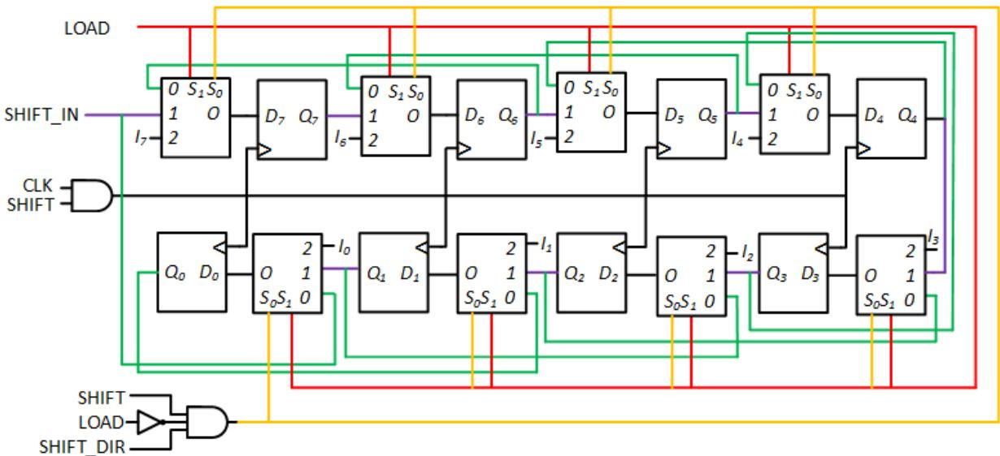

Figure 7.12: Bidirectional shift register with parallel load, color coded as follows: RED and ORANGE = multiplexer select signals; GREEN = data paths for left shift; PURPLE = data paths for right shift; BLACK = clock and data path from multiplexers to flip-flops.

### 7.2.6 Combining Shift Registers

It is not feasible to design shift registers for all possible applications. Consider, for example, a circuit that, for some reason, needs to shift data that has 128 bits. Designing a single TTL chip to incorporate such a large shift register would not be feasible for several reasons. One has to do with the number of pins on the chip. Shift registers can output their current values, that is, the output of each flip-flop is connected to an output pin on the chip. The only chips with enough pins for all these outputs are the **pin grid array** chips used for microprocessors and advanced programmable gate arrays.

To get around these practical restrictions, designers created shift registers that can be combined to form larger shift registers. To illustrate this, consider how we would create a 16-bit shift right register using two 8-bit shift registers.

The two registers take care of shifting their own data internally, and we can shift in data using the SHIFT\_IN signal of one of the registers. But one bit must be shifted out of one register and into the other. The way to do this is to connect the output for the least significant bit of the first register, the bit that will be shifted out, to the SHIFT\_IN input of the second register, as shown in Figure 7.13.

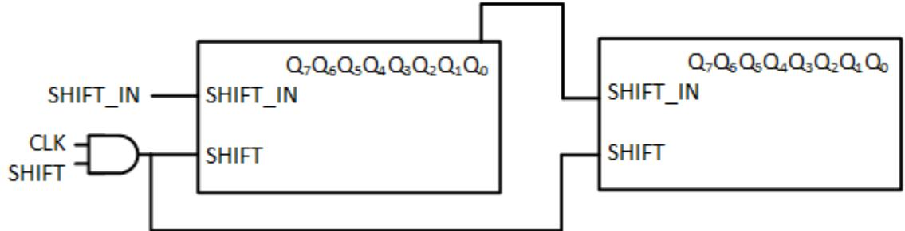

Figure 7.13: 16-bit shift register constructed from two 8-bit shift registers.

With the data connections completed, the final task is to set up the control signals, just the SHIFT signal in our design. The way we do this is to connect the SHIFT inputs of the two shift registers together. When the SHIFT input is asserted, this ensures that both registers shift their data at the same time, which is what we want to happen.

To expand this even further, we could combine more registers using the same methodology to create even larger shift registers. However, there is one thing you have to consider. You must ensure that the fan-out of the SHIFT signal is sufficient to supply a valid signal to all of the shift registers. If it is not sufficient, you can use buffers to alleviate this problem, just as we did for the combinatorial circuits in Chapter 3; see Figure 3.16 in subsection 3.4.3.

## 7.3 Counters

So far in this chapter, we have seen components that store data (registers) and components that move individual data bits (shift registers). There are also components that modify stored data by performing arithmetic operations on the data. One class of this type of components is **counters**.

As the name implies, counters count. That is, they may increment (add 1 to) or decrement (subtract 1 from) their value. There are counters that operate on binary or decimal data, and it is possible to design a counter for any numeric base. In this chapter, we will examine designs for these types of counters.

When we increment a number, we may change more than one bit. For example, incrementing the binary value 0111 gives us 1000, which changes all four bits. As we design the various counters, we will examine ways to tell the correct bits to change their values when incrementing or decrementing. We will also introduce carry and borrow bits and see how they can be used to combine counters for larger numbers of bits.

## 7.4 Binary Counters – Function

There are many applications that require a circuit to count something. A car odometer and a digital clock are just two examples. The circuit we discussed in Chapter 6, which outputs a 1 when three 1s have been input, can also use a counter to realize its function. More complex circuits, such as microprocessors, often incorporate counters within their designs.

Many (but not all) of these counters are simple binary counters. These counters store a binary value, like a register. When a COUNT signal is asserted, the counter adds 1 to (or subtracts 1 from) that value and stores the result as its new value. For example, a 3-bit **upcounter** (a fancy way of saying a counter that increments, or counts up) will go through the following sequence.

000 → 001 → 010 → 011 → 100 → 101 → 110 → 111 → 000 →

In decimal, this sequence is 0 → 1 → 2 → 3 → 4 → 5 → 6 → 7 → 0 →

Just like an odometer, when it reaches its largest value, the next increment operation brings the value back to the lowest value – from 111 (7) to 000 (0) in this case. And just like an odometer, this may cause the next digit to be incremented, as when an odometer increments from 19 to 20. If each digit has its own counter, we need a way for one counter to tell the next counter that it has gone from the highest value to the lowest. In the odometer example, the ones digit counter needs to inform the tens digit that it also must be incremented. To do this, counters typically have a **carry out** signal that is set to 1 when this happens. The next counter will use this signal to determine when it must increment its value.

Internally, we must do the same for the bits within the counter. For our 3-bit counting sequence, for example, consider the transition from 001 to 010. The least significant bit changes from its maximum value, 1, to its minimum value, 0. It must signal the next bit so that it changes from 0 to 1, otherwise we will not produce the correct value of 010. In the next section, we will introduce two design methodologies for counters that address this design task in two different ways.

**Downcounters** work in a similar manner, but in the opposite direction. A 3-bit downcounter goes through the sequence:

111 → 110 → 101 → 100 → 011 → 010 → 011 → 000 → 111 →

In decimal, this is 7 → 6 → 5 → 4 → 3 → 2 → 1 → 0 → 7 →

Just as upcounters have a carry bit to indicate when the counter goes from its maximum value to its minimum value, downcounters have a **borrow** signal that is asserted when it loops back from its minimum value to its maximum value.

There are also counters that can count in either direction called **up-down counters**. Like the bidirectional shift register, these counters have an additional input that determines whether the counter increments or decrements its value. Also like the shift registers, many counters can load data in parallel. Finally, many counters can clear their data, setting all bits to 0. We'll look at these options as we design counters in the remainder of this section.

## 7.5 Binary Counters – Design

Now that we have established what binary counters do, we can design them. There are two types of designs for these counters based on how one digit rolling over causes the next digit to increment or decrement, as happens with the odometer in the previous section increments from 19 to 20. These two methodologies, **ripple counters** and **synchronous counters**, are described in the two subsections that follow.

Before we look at these methodologies, I want to introduce a couple of things that are common to all binary counters, regardless of which methodology they use. The first thing is the number of flip-flops used to store the value within the counter. An *n*-bit counter must always have *n* flip-flops, one for each bit of the count value. This is the case regardless of which type of flip-flop is used. We'll look at examples of counters using D and J-K flip-flops in the following subsections. This may seem intuitively obvious, but it's best to specify this right up front.

The second commonality is not quite so obvious, but is important to note when designing the counters. Look back at the sequence for the 3-bit count up, which goes from 000 to 111 and then back to 000. For every bit, we either leave the bit unchanged, or change it from 0 to 1 or from 1 to 0. Rephrasing this, we either do not load a new value into the flip-flop for a bit or we complement its value. Thinking of the function in this way will simplify our work when we design our counters.

### 7.5.1 Ripple Counters

I think the best way to illustrate the design of ripple counters is to jump right into a design. So, let's start by designing a 4-bit ripple counter using positive edge-triggered D flip-flops. There are two steps in the design process: establish the data paths and implement the clock signals. There are two possible functions for every flip-flop in our counter at any given time; either:

● *Do not load a new value into the flip-flop*: If you don't want to load in a new value, don't send a positive edge to the clock. The flip-flop only loads data when the clock goes from 0 to 1. If it stays at 0, or at 1, or it goes from 1 to 0, the flip-flop does not load in data; it retains its previous value.

Or

● *Complement its value*: When we do want to change the value of a flip-flop, we load the complement of the value. The flip-flop outputs its value on its *Q* output and the complement of its value on its output. If we connect to the *D* input for a flip-flop, it will load its complement on the rising edge of its clock input.

Putting these together allows us to design the data paths, the connections used for the data as opposed to the clocks. This partial design is shown in Figure 7.14.

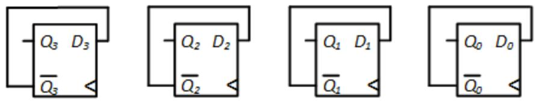

Figure 7.14: Data paths for the 4-bit ripple counter constructed using D flip-flops.

Now we need to tell each flip-flop when to load in a new value. We'll start with the least significant bit, the rightmost flip-flop in this design. Consider the complete sequence for a 4-bit upcounter:

000 → 001 → 010 → 011 → 100 → 101 → 110 → 111 → 000 →

Whenever our COUNT signal is 1, we need to invert the least significant bit on the rising edge of the CLOCK input. We can do this by ANDing together these two signals. Adding this to our circuit gives us the partial design shown in Figure 7.15.

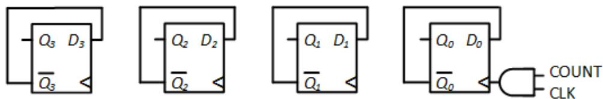

Figure 7.15: 4-bit ripple counter with data paths and clock input for the least significant bit.

Next, let's look at the next bit. Going back to the count sequence, we find that bit 1 changes only when bit 0 changes from 1 to 0. When this happens, *Q0* changes from 1 to 0 and 0 changes from 0 to 1. If we connect 0 to the clock input of the flip-flop for bit 1, it will invert bit 1 exactly when we want it to.

We can repeat this process for bits 2 and 3 to see that 1 is connected to the clock input for bit 2, and 2 serves as the clock input for bit 3. The complete design for the 4-bit ripple counter is shown in Figure 7.16.

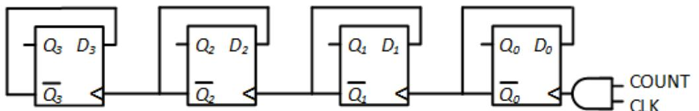

Figure 7.16: 4-bit ripple counter – final design.

If we wish to design this counter using J-K flip-flops instead of D flip-flops, we can easily modify our design. Instead of connecting to our inputs, we simply set *J* = *K* = 1. When *JK* = 11, we complement the value stored in the J-K flip-flop on the rising edge of the clock. Since we still want to invert our counter bits at the same time as we did in the design using D flip-flops, our clock signals remain the same. This design is shown in Figure 7.17.

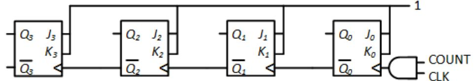

Figure 7.17: 4-bit upcounter constructed using J-K flip-flops.

In addition to the bits that contain the count value, many counters also have one additional output bit called the **carry out**, or **carry bit**, or just **carry**. The counter sets this bit to 1 when its count value changes from all 1s to all 0s, or from 1111 to 0000 for our 4-bit counters. The counter does not use a register for the carry bit; it generates the carry using combinatorial logic. The carry is set to 1 when *Q* = 1 for all flip-flops in the counter and COUNT = 1. The circuitry to add a carry to our 4-bit counters is shown in Figure 7.18 (a). The timing diagram in Figure 7.18 (b) shows how the counter outputs change as its value changes from 1111 to 0000. Note that the carry is 1 until the value changes. Once it does change, the *Q* values input to the AND gate become 0 and the carry output immediately changes from 1 to 0.

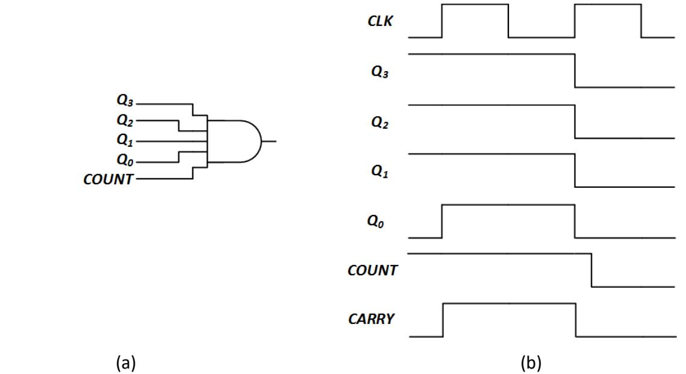

Figure 7.18: Counter carry-out: (a) Circuit to generate CARRY; (b) Sample timing diagram setting CARRY = 1.

#### 7.5.1.1 Downcounter

For some applications, you might need to count down instead of up. As it turns out, we can modify our upcounter fairly easily to change it into a **downcounter**. Consider the sequence for a 4-bit downcounter shown here.

> 1111 → 1110 → 1101 → 1100 → 1011 → 1010 → 1011 → 1000 → 0111 → 0110 → 0101 → 0100 → 0011 → 0010 → 0011 → 0000 → 1111 →

In the upcounter, whenever a bit changed from 1 to 0 we would also need to change the next most significant bit. For the downcounter sequence, the opposite is true. We change the next most significant bit when a bit changes from 0 to 1. For example, when we change the value from 0110 to 0101, the least significant bit changes from 0 to 1, so the next significant bit must also change, from 1 to 0 for these values. We can do this by using *Q* instead of as our clock signal. This design is shown in Figure 7.19.

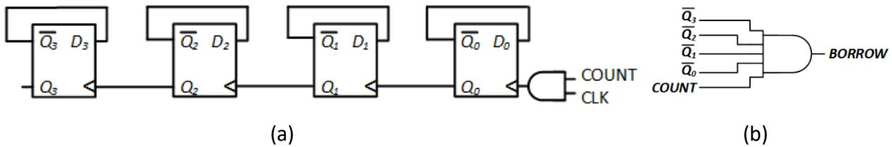

Figure 7.19: Ripple downcounter: (a) Circuit design; (b) Circuit to generate the BORROW signal.

Instead of a CARRY signal, downcounters have a BORROW signal that is set to 1 when going from a value of all 0s to all 1s. It is set to 1 when all the *Q*s are 0 (or all the s are 1) and COUNT = 1. The circuit to generate the BORROW signal is combinatorial, just like the circuit that generates CARRY in the upcounter. This circuit is shown in Figure 7.19 (b).

#### 7.5.1.2 Up/Down Counter

Earlier in this chapter, we combined the designs for registers that shift right and shift left to create a bidirectional shift register. Here, we will follow a similar procedure to create a single counter that can count either up or down. We will add a new signal, /, to indicate whether we count up (/ = 1) or down (/ = 0). This is similar to the SHIFT\_DIR signal in the bidirectional shift register.

There is one very important difference in our design procedure. In the shift register design, our data varied depending on the direction of the shift, but our clock signals were always the same. It is exactly the opposite for the up/down counter. The data inputs to the flipflops are always the same; *D* = whether we are counting up or down. It is the clock that varies.

With this in mind, we can use a multiplexer to select which value to use for our clock signals. If / = 0, we should use *Q*; if / = 1, we use . This circuit is shown in Figure 7.20.

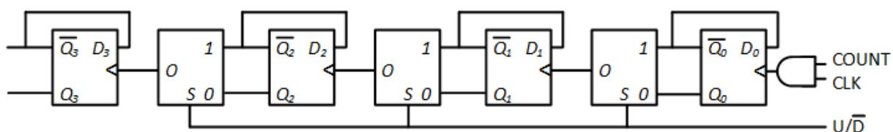

Figure 7.20: 4-bit up/down counter.

Bidirectional counters typically combine the CARRY and BORROW signals into a single output signal. This design is left as an exercise for the reader.

#### 7.5.1.3 Additional Signals

It is possible to enhance the capabilities of our counters to include additional functions. For counters, the two most common functions are to load a value into the counter and to clear the counter, that is, set its value to zero. Both modifications are left as exercises for the reader, but here are some hints about how to proceed.

You can add the capability to load data into the counter in the same way that we added this function to the bidirectional shift register in Section 7.2. You will need a LOAD signal that causes the counter to load the data on its inputs *I3* to *I0* into its flip-flops on the rising edge of the clock. You will need to modify both the data inputs and the clock signal of the flip-flops to implement this function.

To enable the counter to clear its value, you will need to add a CLEAR input signal. Using D flip-flops with preset and clear inputs will greatly simplify your design.

#### 7.5.1.4 Why Are They Called Ripple Counters?

Given these designs, why are they called ripple counters? Think about this for half a minute or so, then read on.

The ripple in ripple counters has to do with how the clock signals propagate through the counter, from one flip-flop to the next. Consider the transition from 0111 to 1000. The COUNT signal is high and the CLOCK signal changes from 0 to 1. This generates a rising edge on the clock input to the flip-flop for bit 0. That bit changes from 1 to 0. As it changes, the output for 0 changes from 0 to 1, which sends a rising edge to the clock for bit 1. This bit also changes from 1 to 0, 1 changes from 0 to 1 and it generates a rising edge on the clock for bit 2. Bit 2 does exactly the same thing, sending a rising edge to the flip-flop for bit 3. The flip-flops all toggle their values, but not simultaneously. Bit 0 toggles first, then bit 1, followed by bit 2, and finally bit 3. The changes move through the counter much like the ripples on a pond after something disturbs the still water.

The ripple design is very efficient in terms of hardware, but it does have a very significant drawback. It takes a relatively long time to set the final value of the counter if you are changing the value of all or most of the bits. We will introduce another design methodology in the next subsection that was developed specifically to address this concern.

### 7.5.2 Synchronous Counters

In Chapter 4, we introduced carry-lookahead adders. These adders incorporate logic to generate the carry out signals of the full adders within adders without having to wait for carry bits to propagate (ripple) through the full adder. In this section, we will follow the same methodology to speed up our counters. As an example, we will redesign the 4-bit upcounter as a synchronous counter, one that sets all its bits simultaneously. First, let's go back to the sequence for this counter.

0000 → 0001 → 0010 → 0011 → 0100 → 0101 → 0110 → 0111 → 1000 → 1001 → 1010 → 1011 → 1100 → 1101 → 1110 → 1111 → 0000 →

Looking at the least significant bit, we can easily see that it changes every time the counter counts up, which occurs when COUNT = 1. The second bit changes when the least significant bit is 1 and we count up, or when *Q0* = 1 and COUNT = 1. The third bit changes when the last two bits are both 1 and we count up, or when *Q1* = 1, *Q0* = 1 and COUNT = 1. You may have noticed a pattern already, or you may simply check the sequence to realize that the most significant bit changes when *Q2* = 1, *Q1* = 1, *Q0* = 1 and COUNT = 1. We can summarize this as follows.

*For every bit in the counter, the bit changes on the rising edge of the clock if every less significant bit is 1 and COUNT is 1.*

With this in mind, we can create a new design for the 4-bit counter, as shown in Figure 7.21. Our design will be a synchronous counter that loads all bits simultaneously, that is, they will all have the same clock input. For our counter, we AND together the CLK and COUNT inputs.

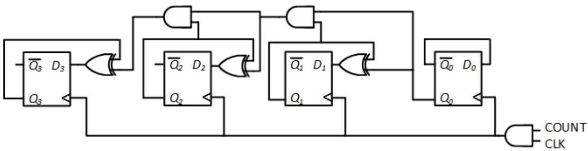

The data inputs generate one of two values. If all less significant bits are 1, we want to load the counter with the complement of its current value. Otherwise, we want to load in the same value it currently has stored so that its output stays the same. For the least significant bit, there are no less significant bits and we always want to change that bit; inputting on the *D* input accomplishes this task.

For the other bits, an XOR gate realizes this function. One input is *Q*. If the other input is 0, *Q* ⊕ 0 = *Q* and we reload the current value. However, if the other input is 1, *Q* ⊕ 1 = and we complement the value in the flip-flop. We want this second input to be 1 when all less significant bits are 1. This is the function we implement for this XOR gate input for each flipflop. For *D1*, we only need to check *Q0*. *D2* needs both *Q0* and *Q1* to be 1. And *D2* requires *Q0*, *Q1*, and *Q2* all to be 1.

The design for the synchronous counter can be derived almost directly from the carrylookahead adder with *Cin* = 0. The carry-lookahead adder from Figure 4.31 is repeated in Figure 7.22.

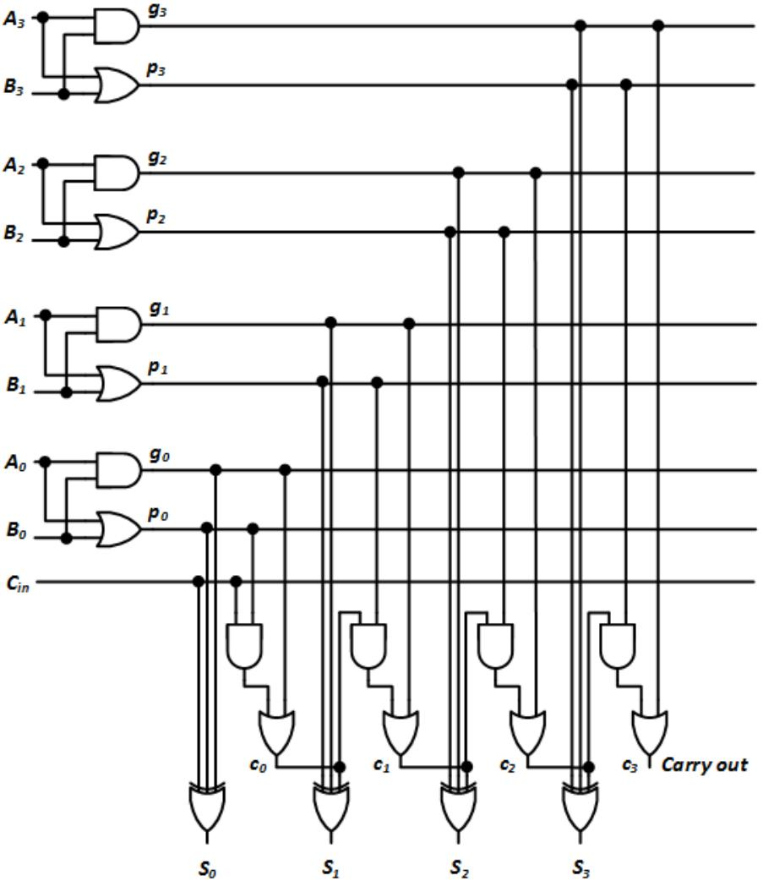

Figure 7.22: 4-bit carry-lookahead adder.

Instead of adding *A3A2A1A0* + *B3B2B1B0*, however, we will add *A3A2A1A0* + 1. This sets our *p* and *g* signals as follows:

$$\begin{aligned} \rho o &= \mathsf{A}\_{O} + \mathsf{B}\_{O} = \mathsf{A}\_{O} + \mathsf{1} = \mathsf{1} \\ \varrho\_{O} &= \mathsf{A}\_{O} \wedge \mathsf{B}\_{O} = \mathsf{A}\_{O} \wedge \mathsf{1} = \mathsf{A}\_{O} \\ \rho\_{1} &= \mathsf{A}\_{1} + \mathsf{B}\_{1} = \mathsf{A}\_{1} + \mathsf{O} = \mathsf{A}\_{1} \\ \varrho\_{1} &= \mathsf{A}\_{1} \wedge \mathsf{B}\_{1} = \mathsf{A}\_{1} \wedge \mathsf{O} = \mathsf{0} \\ \rho\_{2} &= \mathsf{A}\_{2} + \mathsf{B}\_{2} = \mathsf{A}\_{2} + \mathsf{O} = \mathsf{A}\_{2} \\ \varrho\_{2} &= \mathsf{A}\_{2} \wedge \mathsf{B}\_{2} = \mathsf{A}\_{2} \wedge \mathsf{O} = \mathsf{0} \\ \rho\_{3} &= \mathsf{A}\_{3} + \mathsf{B}\_{3} = \mathsf{A}\_{3} + \mathsf{O} = \mathsf{A}\_{3} \\ \rho\_{3} &= \mathsf{A}\_{3} \wedge \mathsf{B}\_{3} = \mathsf{A}\_{3} \wedge \mathsf{O} = \mathsf{0} \end{aligned}$$

In Figure 7.23, we modify the carry-lookahead adder to include these simplified signal functions.

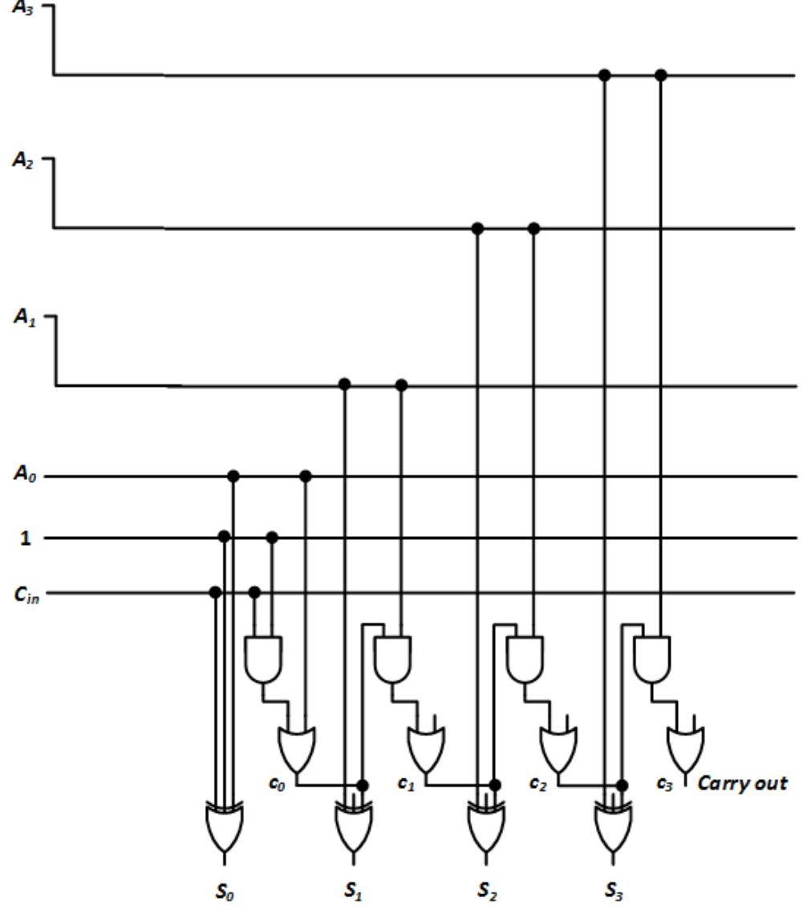

Figure 7.23: 4-bit carry-lookahead adder with simplified *p* and *g* signals when *B* = 0001.

Next, we move to generate the carry signals. Our counter will not have a *Cin* signal, so we set *Cin* = 0. When we use the new *p* and *g* values, our carry signals become:

$$\begin{aligned} \mathbf{c}\_{0} &= \mathbf{g}\_{0} + \mathbf{p} \mathbf{c}\_{m} = \mathbf{A}\_{0} + \mathbf{A}\_{0} \wedge \mathbf{0} = \mathbf{A}\_{0} \\ \mathbf{c}\_{1} &= \mathbf{g}\_{1} + \mathbf{p}\_{1} \mathbf{c}\_{0} = \mathbf{0} + \mathbf{A}\_{1} \wedge \mathbf{A}\_{0} = \mathbf{A}\_{1} \wedge \mathbf{A}\_{0} \\ \mathbf{c}\_{2} &= \mathbf{g}\_{2} + \mathbf{p}\_{2} \mathbf{c}\_{1} = \mathbf{g}\_{2} + \mathbf{p}\_{2} \mathbf{g}\_{1} + \mathbf{p}\_{2} \mathbf{p}\_{1} \mathbf{g}\_{0} = \mathbf{0} + \mathbf{A}\_{2} \wedge \mathbf{0} + \mathbf{A}\_{2} \wedge \mathbf{A}\_{1} \wedge \mathbf{A}\_{0} = \mathbf{0} + \mathbf{A}\_{2} \wedge \mathbf{A}\_{1} \wedge \mathbf{A}\_{0} \\ \mathbf{c}\_{3} &= \mathbf{g}\_{3} + \mathbf{p}\_{3} \mathbf{c}\_{2} = \mathbf{g}\_{3} + \mathbf{p}\_{3} \mathbf{g}\_{2} + \mathbf{p}\_{3} \mathbf{p}\_{2} \mathbf{g}\_{1} + \mathbf{p}\_{3} \mathbf{p}\_{2} \mathbf{g}\_{2} \mathbf{g}\_{0} = \mathbf{0} + \mathbf{A}\_{3} \wedge \mathbf{0} + \mathbf{A}\_{3} \wedge \mathbf{A}\_{2} \wedge \mathbf{0} + \mathbf{A}\_{3} \wedge \mathbf{A}\_{2} \wedge \mathbf{A}\_{1} \wedge \mathbf{A}\_{0} \\ &= \mathbf{A}\_{3} \wedge \mathbf{A}\_{2} \wedge \mathbf{A}\_{1} \wedge \mathbf{A}\_{0} \end{aligned}$$

Figure 7.24 shows our circuit with these changes.

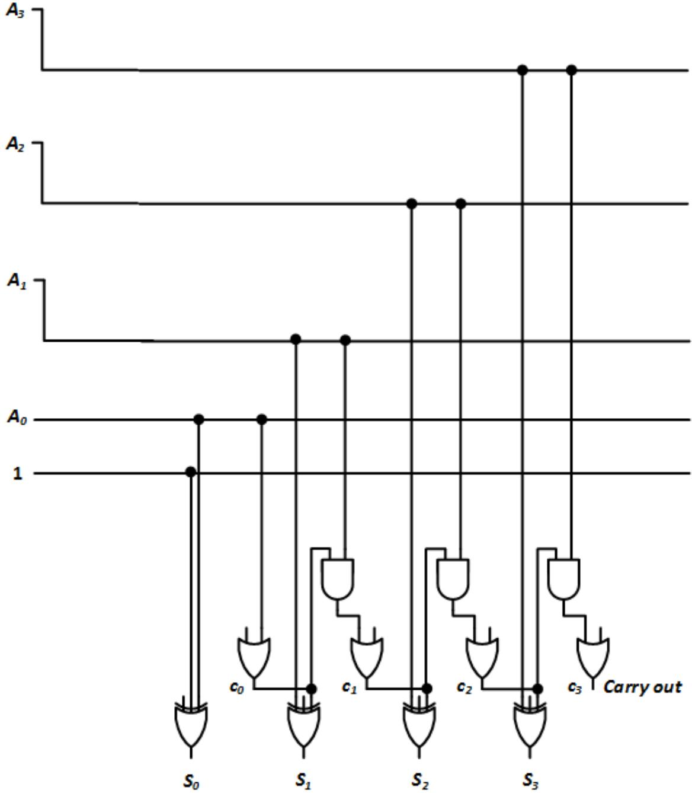

Figure 7.24: 4-bit carry-lookahead adder with simplified *c* signals.

Finally, we get to the XOR gates that generate the sum bits. These are exactly the bits we want to load into the flip-flops of the counter. Removing gate inputs that are equal to zero gives us the circuit shown in Figure 7.25. Comparing this circuit to the circuit in Figure 7.20, we can see that the *S* outputs of the modified carry-lookahead adder are the same as the inputs to the flip-flops.

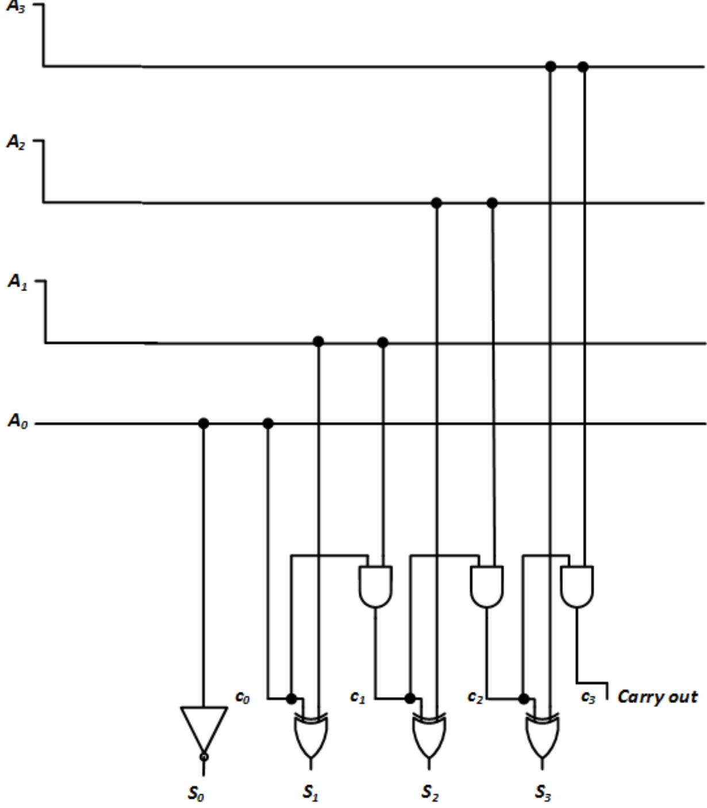

Figure 7.25: Carry-lookahead adder modified to add *A* + 1.

Inputting these sum bits to flip-flops, and adding the clock signal, gives us the final circuit for the synchronous 4-bit upcounter shown in Figure 7.26.

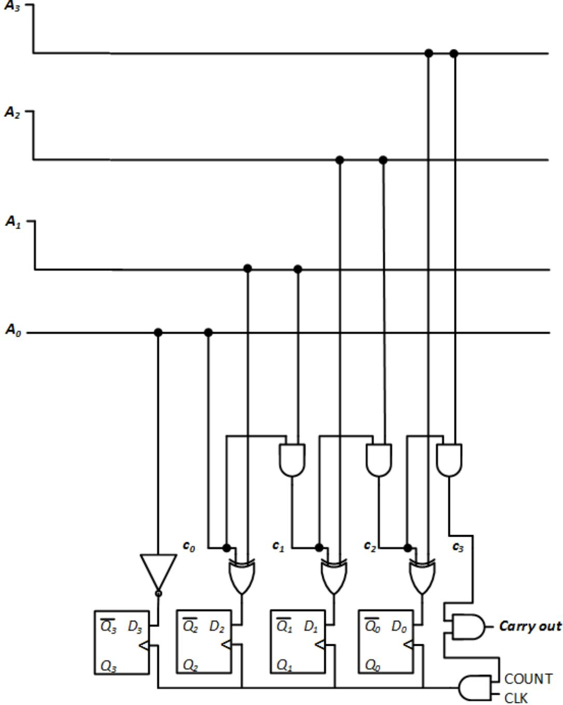

Figure 7.26: Final design for the 4-bit synchronous upcounter.

Figure 7.27 is an animation-only figure that shows this complete sequence.

Figure 7.27: Conversion of the 4-bit carry-lookahead adder to the 4-bit synchronous upcounter.

## 7.6 Cascading Counters

Just as there are practical limitations on the size of shift registers, there are also practical limitations on the size of counters. And just like shift registers, counters have been designed so they can be cascaded, combined to create counters with larger numbers of bits. To do this, the counters we use must have a carry out signal.

A generic 16-bit counter constructed using two 8-bit counters is shown in Figure 7.28. Just as our odometer needed a way to tell the tens digit to increment when the ones digit went back to 0 when the odometer went from 19 to 20, the carry out of the counter on the right (our ones digit) is used to generate the signal that increments the second counter (our tens digit). Note that CLK is only input to the first counter. Internally, it is used to generate the carry out signal for that counter, so it is already accounted for and does not need to be input separately into any other counter.

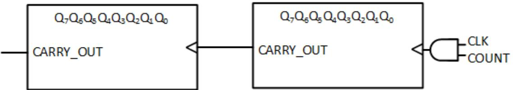

Figure 7.28: 16-bit counter constructed using two 8-bit counters.

## 7.7 Other Counters

So far we have seen several ways to design counters, but all of the designs presented focus on one type of counter, the binary counter. There are other types of counters that are useful for some applications. One is the **BCD counter**. Instead of counting from 0000 to 1111 (0 to 15), this 4-bit counter counts from 0000 to 1001 (0 to 9). It is particularly useful for applications involving digital displays. We will introduce this counter and its design in this section.

The idea behind a BCD counter can be extended to any **modulo-***n* **counter**. For example, the ten-minutes digit on a digital clock could be implemented with a modulo 6 counter that counts from 000 to 101. We will introduce another design that can be used to create a modulo*n* counter for any value of *n*.

### 7.7.1 BCD Counters

The **BCD counter**, also called a **decimal counter** or a **decade counter**, is used frequently in digital circuit design. In this subsection, we design this counter using D flip-flops. Our counter must go through the following sequence.

0000 → 0001 → 0010 → 0011 → 0100 → 0101 → 0110 → 0111 → 1000 → 1001 → 0000 →

As with the synchronous binary counter, we will AND together the COUNT and CLK inputs to produce the clock input to the flip-flops. Our remaining design task is to generate the D inputs to the flip-flops.

We then create the excitation table for the BCD counter, as shown in Figure 7.29. Before we continue, there's something I need to explain about this table. Notice the last six rows, with *Q* = 1010 to 1111. These are not valid BCD digits. So, why are they in the table? Think about this for a minute before reading on.

| Q3 | Q2 | Q1 | Q0 | D3 | D2 | D1 | D0 |
|----|----|----|----|----|----|----|----|
| 0  | 0  | 0  | 0  | 0  | 0  | 0  | 1  |
| 0  | 0  | 0  | 1  | 0  | 0  | 1  | 0  |
| 0  | 0  | 1  | 0  | 0  | 0  | 1  | 1  |
| 0  | 0  | 1  | 1  | 0  | 1  | 0  | 0  |
| 0  | 1  | 0  | 0  | 0  | 1  | 0  | 1  |
| 0  | 1  | 0  | 1  | 0  | 1  | 1  | 0  |
| 0  | 1  | 1  | 0  | 0  | 1  | 1  | 1  |
| 0  | 1  | 1  | 1  | 1  | 0  | 0  | 0  |
| 1  | 0  | 0  | 0  | 1  | 0  | 0  | 1  |
| 1  | 0  | 0  | 1  | 0  | 0  | 0  | 0  |
| 1  | 0  | 1  | 0  | 0  | 0  | 0  | 0  |
| 1  | 0  | 1  | 1  | 0  | 0  | 0  | 0  |
| 1  | 1  | 0  | 0  | 0  | 0  | 0  | 0  |
| 1  | 1  | 0  | 1  | 0  | 0  | 0  | 0  |
| 1  | 1  | 1  | 0  | 0  | 0  | 0  | 0  |
| 1  | 1  | 1  | 1  | 0  | 0  | 0  | 0  |

Figure 7.29: Excitation table for the BCD counter.

Once your counter has a valid BCD value, it will always progress through the decimal counting sequence and will always have a valid BCD value. But what happens if the counter has one of the invalid values? A design flaw could cause this to happen, but the most likely reason for this to occur is that the flip-flops are set to invalid values when the circuit first powers up. To address this concern, we load in the value 0000 whenever the counter has one of the non-BCD values. Once that is done, the counter will function as we want it to.

With this table developed, we can create Karnaugh maps for the individual flip-flop inputs. I did this and derived the following functions.

$$\begin{aligned} \mathcal{D}\_{\mathcal{O}} &= \underbrace{Q\_{3}}\_{\mathcal{O}\_{3}} \wedge \underbrace{Q\_{0}}\_{\{\mathcal{Q}\_{1} \oplus \mathcal{Q}\_{0}\}} \wedge \underbrace{Q\_{1}}\_{\mathcal{O}\_{0}} \wedge \underbrace{Q\_{0}}\_{\mathcal{O}} \\ \mathcal{D}\_{\mathcal{I}} &= \underbrace{Q\_{3}}\_{\mathcal{O}\_{3}} \wedge \{\mathcal{Q}\_{2} \oplus \{\mathcal{Q}\_{1} \wedge \mathcal{Q}\_{0}\}\} \\ \mathcal{D}\_{\mathcal{I}} &= \overbrace{\{Q\_{3}}\_{3}}^{\mathcal{A}} \wedge \mathcal{Q}\_{2} \wedge \mathcal{Q}\_{1} \wedge \mathcal{Q}\_{0}\} + \{\mathcal{Q}3 \wedge \mathcal{Q}\_{2} \wedge \mathcal{Q}\_{1} \wedge \mathcal{Q}\_{0}\} \end{aligned}$$

The final circuit, with these functions implemented using combinatorial logic, is shown in Figure 7.30.

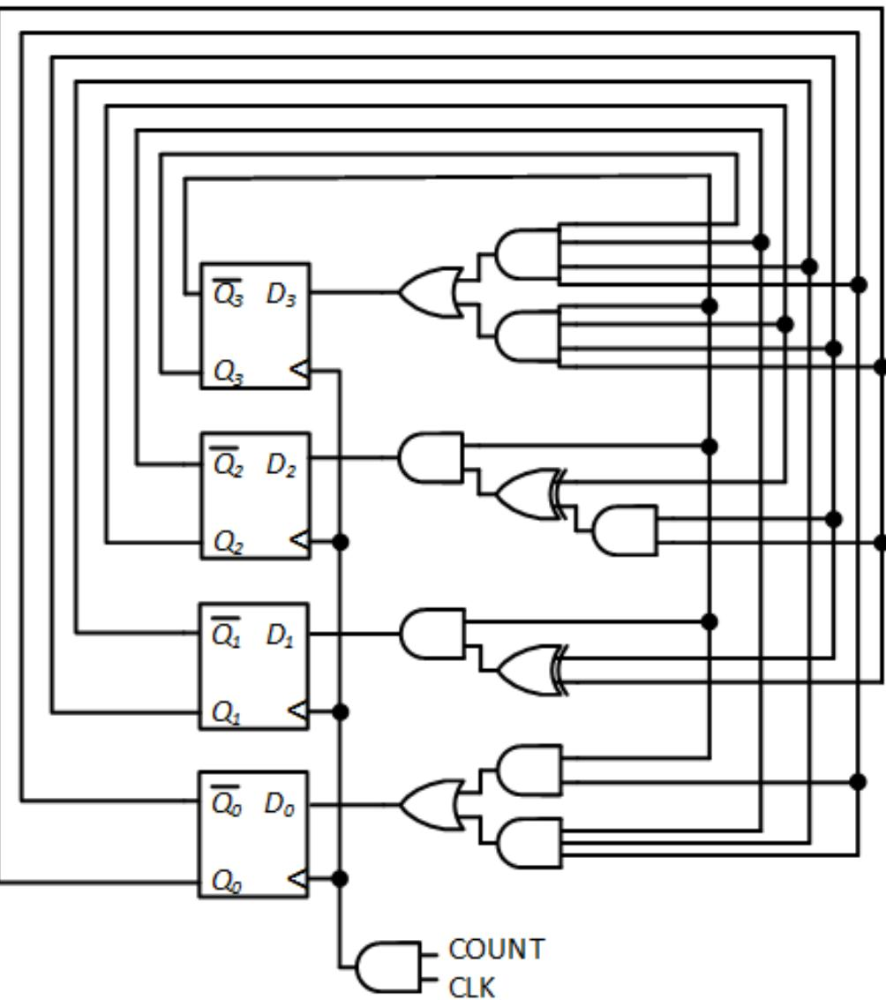

Figure 7.30: Synchronous BCD counter.

Now, if we're going to load 0000 into the counter when we reach the end of our sequence or an invalid value, why don't we just use D flip-flops with CLR inputs and clear the counter instead? We'll see what happens if we try to do this in the next subsection.

### 7.7.2 Modulo-n Counters

The BCD counter is a modulo-10 counter. That is, it counts from 0 to 9, 0000 to 1001, and then goes back to 0000, continuing this cycle ad infinitum. In practice, we can design and construct a modulo-*n* counter for any value of *n* > 1. (A modulo-1 counter would just output a 0 at all times, which would be fairly useless.)

Consider our 1s counter from Chapter 6. It counts the number of 1s coming in and outputs a 1 when it has counted three 1s. This is basically a modulo-3 counter; the output would be generated whenever the counter goes back to 0.

We can follow the procedure from the previous section to design this modulo-3 counter, or any modulo-*n* counter. However, there is a simpler way to do this if your circuit can tolerate a momentary glitch in its output.

The basic procedure is to start with a synchronous binary counter constructed using D flip-flops with preset and clear inputs, and with a maximum value that is greater than *n* – 1. If its maximum value is equal to *n* – 1, we just use the binary counter. For example, a modulo-8 counter can just use a 3-bit binary counter which has values ranging from 000 (0) to 111 (7).

We will increment the counter as before, ANDing together the COUNT and CLK signals. Unlike the previous design methodology, however, we do not change the *D* inputs. Instead, we generate a clear signal whenever we have an invalid value. For the BCD counter, we would increment the counter from 1001 (9) to 1010 (10) and then immediately clear the counter back to 0. The CLR input on the D flip-flop is asynchronous, that is, independent of the clock, so this occurs very quickly, on the order of nanoseconds, after the count goes to 1010. The design of a BCD counter using this methodology is shown in Figure 7.31.

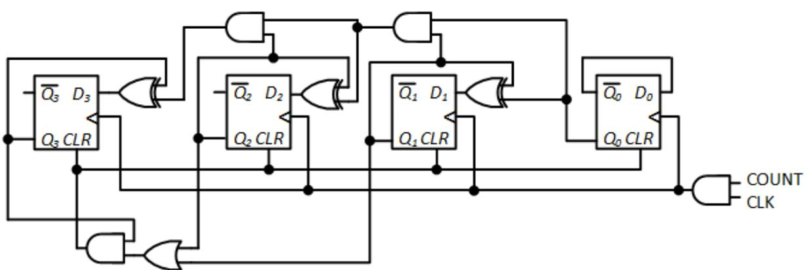

Figure 7.31: BCD counter with transient 1010 output.

For something like a digital clock, it is quite possible that nobody will ever see this invalid value on the display, but for other applications, this may not be the case.

Figure 7.32 shows the timing diagram for this counter as it transitions from 1001 to 1010 to 0000.

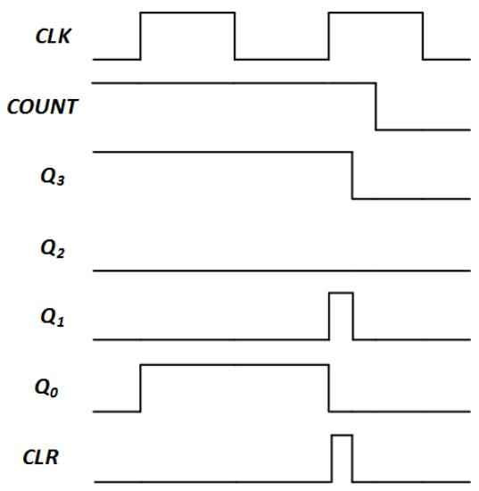

Figure 7.32: Timing diagram for the BCD counter with transient 1010 output.

In response to the question I raised at the end of section 7.7.1, the transient 1010 output is the reason I did not use the clear input in the previous design. You can always use the earlier design, but the latter design using the clear input can only be used in circuits that can tolerate the transient 1010 output.

## 7.8 Summary

Just as with combinatorial logic, digital designers have developed components for frequently used sequential logic. First and foremost among these components are registers. Essentially, these are a series of flip-flops configured in parallel to store multi-bit values. The flip-flops have common control signal inputs so that they act together on the bits of their stored value. Their clock signals are the same, as are other signals they may have, such as a clear input.

Shift registers store data, just like registers, but they can also shift their data. Some shift registers can shift their data in one direction, left or right; others can shift data in either direction. Some shift registers can also load data in parallel. Shift registers can be connected together to store and shift data values with larger numbers of bits.

Counters can store data, but also increment or decrement (or both) their stored values. Ripple counters propagate clock signals from one flip-flop to the next within the counter. This is efficient in terms of hardware, but it can result in slower performance as the clock signals propagate through the counter. Synchronous counters use additional logic gates to speed up the performance of the counters.

Upcounters can generate a carry out bit to indicate that its value has reached its maximum value and looped back to its slowest value, generally 0. Downcounters generate a borrow bit when they loop back from – to their highest value. These bits are particularly useful when we cascade counters to count values with larger numbers of bits.

Traditional counters count in binary; an *n*-bit counter sequences through values in the range from 0 to 2*n* – 1. BCD counters, in contrast, are 4-bit counters that only sequence through the values corresponding to decimal digits, 0 (0000) through 9 (1001). It is also possible to design modulo-*n* counters that can store any of *n* possible values, 0 to *n* – 1. Both the BCD and modulo-*n* counters have a wide variety of applications.

## Exercises

1. Show the outputs of the register in Figure 7.1 for the inputs shown in the following timing diagram.

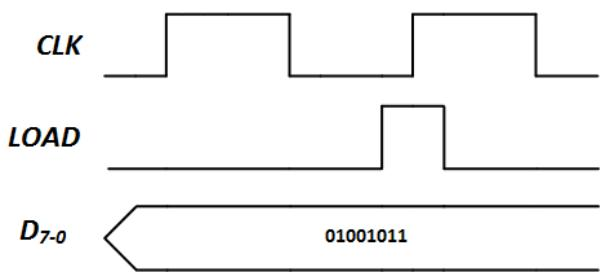

2. Show the outputs of the register in Figure 7.2 for the inputs shown in the following timing diagram.

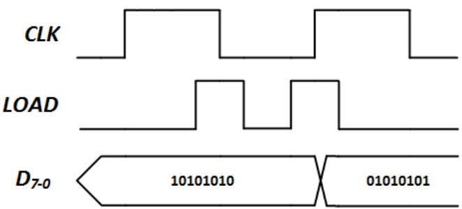

- 3. Show the results of the linear shift left and linear shift right operations on the data value 11010101.
- 4. Show the values of the *D* inputs and *Q* outputs of the linear shift register after the shift left and shift right operations. The register initially has the value 01101011.
- 5. Repeat Problem 4 for the linear shift register constructed using J-K flip-flops.
- 6. Repeat Problem 4 for the bidirectional shift register with
	- a. SHIFT\_DIR = 0
	- b. SHIFT\_DIR = 1
- 7. Design a bidirectional shift register using J-K flip-flops.
- 8. Redesign the bidirectional shift register using combinatorial logic instead of multiplexers.
- 9. Modify the bidirectional shift register with parallel load to prioritize SHIFT over LOAD.
- 10. Minimize the function for *S0* in the bidirectional shift register with parallel load.
- 11. A circular shift operation works much like a linear shift, except the bit that is shifted out is circulated back and loaded into the bit that receives a 0 value in the linear shift. Modify the existing designs for the linear shift register to implement the circular shift left and circular shift right operations.
- 12. An arithmetic shift operation is similar to a linear shift, except it leaves the most significant bit unchanged. For the arithmetic shift left, all other bits are shifted left and the next to most significant bit is shifted out. For the arithmetic shift right, the most significant bit is unchanged and is also shifted into the next to most significant bit. Modify the existing designs for the linear shift register to implement the arithmetic shift left and arithmetic shift right operations.
- 13. Design a 32-bit shift register using 8-bit shift registers.
- 14. Design a 4-bit upcounter using T flip-flops.
- 15. Design a downcounter using J-K flip-flops.
- 16. Design a downcounter using T flip-flops.
- 17. Simplify the up-down counter of Figure 7.19 by using a single logic gate instead of a multiplexer to generate the clock signal.
- 18. Design a combined CARRY-BORROW signal for the bidirectional counter in Figure 7.19.
- 19. Design a 4-bit up-down counter using J-K flip-flops.
- 20. Design a 4-bit up-down counter using T flip-flops.
- 21. Modify the up-down counter to include LOAD and CLEAR signals.
- 22. Design a synchronous 4-bit upcounter using J-K flip-flops.
- 23. Design a 4-bit synchronous downcounter using:
	- a. D flip-flops
	- b. J-K flip-flops
	- c. T flip-flops
- 24. Design a 16-bit counter using 4-bit counters.
- 25. Create Karnaugh maps for the *D* bits in the excitation table in Figure 7.28 and derive functions that do not use XOR gates.
- 26. Design the 1s counter from Section 6.1.1 with and without transient values
