# Chapter 10: Programmable Devices

Almost all of the devices presented so far in this book have static configurations. An AND gate has some set number of inputs and only sets its output to 1 when all its inputs are 1. There are AND gates with different numbers of inputs, but for any particular AND gate the number of inputs does not change. A 2-input AND gate doesn't suddenly become a 3-input AND gate. Nor does it change its function, changing, for example, into a 2-input OR gate. Once the gate is fabricated, it stays that way.

There are a couple of types of components, however, that are not static. These are **programmable devices**. We can program these devices so they output whatever values we want for specific input values, or they realize different functions for different inputs. A designer can change how a circuit functions by programming one of these chips. This chapter begins by examining the programmable device methodology and its advantages and disadvantages.

Next, we introduce **programmable logic devices**, or **PLDs**. Unlike memory devices, which store data values, PLDs incorporate a large number of logic gates (and sometimes flipflops) on a single chip. We do not program the gates themselves; they are fixed and do not change. Rather, we program the interconnections between gates. By programming these data paths, we connect gate outputs to the inputs of other gates, or chip outputs, and chip inputs to gate inputs. In essence, this is like wiring up our circuit within the chip. Making these connections creates a circuit to realize any desired function.

Finally, we examine programmable memory devices. We saw one type of memory device, read-only memory, when we introduced lookup ROMs in Chapter 5. In this chapter, we introduce several types of memory devices, as well as their internal organization. We discuss some of the uses for these devices in digital logic circuits, computer systems, and inside of a microprocessor.

## 10.1 Why Programmable Devices?

Programmable logic devices and programmable memory chips offer a number of advantages when used to construct combinatorial and sequential logic circuits, and are used frequently in engineering design. Quite often, a single programmable chip can replace several chips in a circuit. This can lower the cost of the final circuit. Having functions realized using a single chip can also reduce the amount of wiring in the circuit, allowing it to be manufactured using a smaller circuit board, as well as reducing the amount of power required for the circuit. Programmable components can also simplify the process of modifying an existing circuit. For many designs, we can correct design errors or modify our designs to add or change functionality simply by reprograming a chip, without needing to modify the rest of the circuit and its wiring.

Programmable devices also have some drawbacks. Depending on the application, a programmable device may have too many memory locations or components, and the extra logic would be wasted in the circuit design. Another consideration is the speed of the circuit. Memory chips, for example, are generally slower than combinatorial logic gates. Replacing gates with a lookup ROM, as we did in Chapter 5, can increase the amount of time needed to generate the circuit's outputs. For complex circuits, however, the opposite may be true, depending on how many gates data must pass through to reach the circuit's outputs.

## 10.2 Programmable Logic Devices

Of all the methods we've looked at so far to realize combinatorial logic functions, the most efficient is the very first method we saw: minimize the function and design a circuit using fundamental logic gates. Decoders, multiplexers, and ROMs all incorporate logic components within their designs that are not needed for specific logic functions. However, building a circuit with different types and sizes of logic gates may require several chips. This means you'll also need a larger circuit board, additional wiring to connect the chips, and more power. This was the impetus behind the creation of **programmable logic devices**, or **PLDs**.

A PLD is a single chip with many basic logic gates built into it. The designer can specify the connections between the gates, and between input and output pins and the gates, to realize the desired function. Some types of PLDs allow only limited connections, while others are more flexible.

The designer "builds" the circuit using a computer program, which converts the design to the connections needed within the chip. The computer has a programmer, a piece of hardware attached to the computer (usually through a USB port), and the program sends the connection information to the programming hardware, which sends it to the PLD chip, thus creating the circuit to realize the desired function.

This section examines several classes of PLDs: **Programmable Array Logic** (**PAL**), **Programmable Logic Array** (**PLA**), **Complex Programmable Logic Device** (**CPLD**), and **Field-Programmable Gate Array** (**FPGA**).

### 10.2.1 Programmable Array Logic

A Programmable Array Logic, or PAL, chip consists of several AND-OR arrays of gates. That is, each array has several AND gates, and the outputs of the AND gates are connected to the inputs of an OR gate. The function inputs are connected to the input pins of the PAL chip, and the designer selects which function inputs and complements of function inputs are connected to the inputs of each AND gate. The designer also specifies which chip pin each OR gate output is connected to. PALs can typically output the value generated by the OR gate or its complement as specified by the designer. Some PALs have registers on their outputs that can store their values even after the inputs are changed. For now, we'll limit our discussion of all programmable logic devices to those without registers.

A generic PAL array is shown in Figure 10.1. This array is one of several that may be contained within the PAL chip. This chip has four inputs, and each input and its complement can be connected to an input of each AND gate. In this figure, each AND gate is shown with a single input line. This is the convention used for PLDs. This line represents all inputs to the gate. The Xs on this line indicate that a signal is connected to a gate input. In this figure, the uppermost AND gate has $a$ and $c$ as its inputs, and the second AND gate has inputs $a'$, $b$, and $c'$. The third gate has no inputs shown. Some functions do not need to use every AND gate. By convention,

showing no connections indicates that the gate's inputs are 0. This causes the AND gate to output a 0, which is then input to the OR gate. Since anything ORed with 0 is just the logical OR of the other inputs, this essentially removes that AND gate from the equation. The output of the OR gate is $ac + a'bc' + 0$, or $ac + a'bc'$, the same function we've seen in previous chapters.

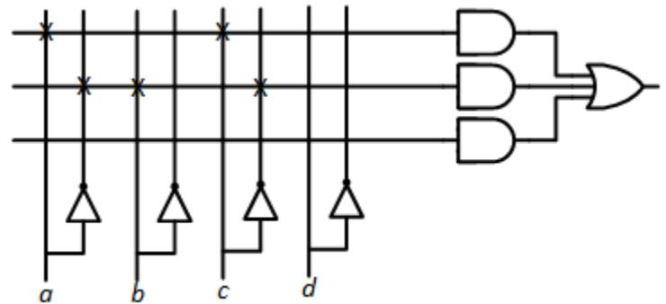

Figure 10.1: Generic PAL cell implementing the function $ac + a'bc'$

A PAL may include a feedback path from the output of some or all of the OR gates, allowing these outputs to be used as inputs to an AND gate in another AND-OR array within the chip. This is useful for functions that have many terms logically ORed together. Consider, for example, the function $a \oplus b \oplus c$; its truth table is shown in Figure 10.2 (a). Since PALs do not incorporate XOR gates, we must express this function solely using AND and OR functions. We must also use NOT gates to produce the complements of the inputs, $a'$, $b'$, and $c'$, but the PAL already does that for us. This function can be expressed as $a \oplus b \oplus c=a'b'c+a'bc'+ab'c'+abc$. If our cells use the configuration shown in Figure 5.13, we could not fit this design into a single cell. We need four AND gates to generate the terms to be logically ORed together, but each cell has only three AND gates. However, if we have feedback paths, we could OR together the first three terms in one cell and feed this result back to a second cell. This cell could OR the feedback value with the fourth term, producing the desired function. This two-cell design is shown in Figure 10.2 (b).

To give you an idea for the size of a real-world PAL, consider the PAL16L8 chip. This chip has 10 dedicated input pins, two dedicated output pins, and six pins that can be configured either as input or output pins. There are eight cells, each of which can output its results to an output or bidirectional pin. Each cell has eight AND gates. The six cells that can drive the bidirectional pins can also feedback their outputs to be used as inputs to AND gates in the other cells.

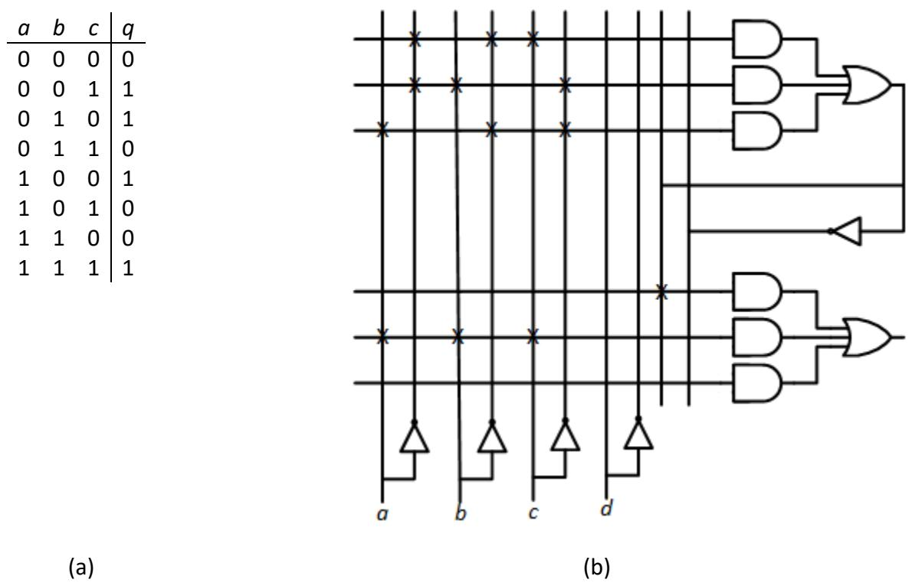

Figure 10.2: $a \oplus b \oplus c$: (a) Truth table; (b) Implementation using two cells of a PAL. The upper cell generates $a'b'c+a'bc'+ab'c'$ and the lower cell generates the final function.

### 10.2.2 Programmable Logic Arrays

Although its name is similar to that of the PAL, a programmable logic array, or PLA, has one significant difference. In addition to being able to specify the inputs to the AND gate, the designer can also specify which AND gates input their values to each OR gate. In the generic PAL, each OR gate can have up to three AND gates supply its inputs. Here, we do not have this limitation. Also, one AND gate can send its output to more than one OR gate. Figure 10.3 shows a generic PLA cell.

The PLA is more flexible than the PAL, and at first glance it might seem to make sense to always use a PLA instead of a PAL. In fact, the exact opposite is the case. Most designs use PALs instead of PLAs. In spite of their flexibility, PLAs have some shortcomings. This flexibility introduces additional costs to the PLA. Besides being more expensive to fabricate, the PLA is generally slower than a PAL chip that implements the same function. For these reasons, PAL chips are used much more frequently than PLAs.

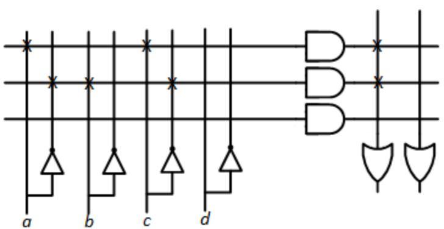

Figure 10.3: Generic PLA cell implementing the function $ac + a'bc'$

### 10.2.3 Complex PLDs and Field Programmable Gate Arrays

PALs and PLAs are frequently used in digital logic design. However, as the complexity of digital circuits increased, the need arose for more complex programmable logic devices to hold these designs. In this section, we'll briefly examine two classes of these devices: Complex Programmable Logic Devices (CPLDs) and Field-Programmable Gate Arrays (FPGAs).

PALs and PLAs are classified as **Simple Programmable Logic Devices**, or **SPLDs**. (I'm not sure why developers in this field seem to be more enamored with acronyms than those in other areas, but it is what it is.) Typical SPLDs have on the order of hundreds of gates. The PAL16L8 introduced earlier has about 100 gates. Complex PLDs, in comparison, have thousands of gates.

Beyond the sheer increase in the number of gates, CPLDs have a more complex internal architecture to allow the components to communicate with each other. A CPLD is designed as a series of logic blocks. Each logic block includes a logic array that is similar to a complete array within a PAL or PLA, and a **macrocell**. The macrocell may include registers to store results, and may act as an intermediary between the logic block and rest of the chip. We will refer to all of this as a cell.

The CPLD has an interconnect structure that allows the output of a cell to be sent to other cells. The rationale is much like that of the feedback connections within a PAL or PLA. Doing so allows for the implementation of more complex functions. But beyond this, it allows the designer to partition the design. One cell could be used to generate the value of some function, and the chip could send that value to other cells that perform different actions based on that value. For example, let's say your CPLD inputs some 4-bit value. When that value reaches 0000, you want the chip to cause several things to happen. Maybe you want to light an LED, start another sequence, or perform whatever operations you need to perform. One cell could be programmed to check the input value and generate an output that indicates whether or not it is 0000. It could send that value to other cells via the interconnect structure, and each of those cells could perform one of the necessary operations.

In addition to these interconnects, a CPLD also has logic blocks to coordinate I/O operations, that is, accepting inputs via the chip's input pins and outputting data via its output pins.

Like SPLDs, CPLDs are programmed before they are used in a circuit. Once the power is turned on, they begin to function right away. This may seem pretty obvious, but it is not the case for our next component.

Field-Programmable Gate Arrays are several orders of magnitude more complex than CPLDs. Whereas CPLDs have thousands of gates, FPGAs can have millions of gates. This allows designers to program much more complex designs into the chip than they can using CPLDs. These applications may include digital signal processing designs, and even some complete microprocessors. The OpenCores website has over 200 microprocessor designs that can be downloaded and programmed directly into an FPGA, as well as many designs for other components of computer systems.

Unlike SPLDs and CPLDs, many FPGAs are programmed when power is turned on. Typically, an FPGA circuit will include a ROM with the configuration programming information and any additional circuitry needed to load this information into the FPGA. This must be done every time the circuit's power is turned on, but once this is done the FPGA operates as desired as long as the power remains on.

## 10.3 Memory Devices

There are several different types of memory components, each with its own applications in digital system design. In Chapter 5, we noted that memory components can be classified as volatile, losing their contents when power is removed, and non-volatile, retaining stored data even when power is disconnected. Within each classification, there are several types of memory devices. We'll look at those in the next two subsections. Then we'll look inside the memory chip to see how it functions.

### 10.3.1 Volatile Memory Devices

In a typical personal computer, there are several types of memory. Two of these types are classified as volatile memory. One of these is dynamic random access memory, **DRAM**, or **dynamic RAM**. If your PC has 16GB of memory, this refers to its dynamic RAM.

Conceptually, you can think of dynamic RAM as acting like leaky capacitors. You can store charge in a capacitor or discharge a capacitor to remove its charge. These two conditions correspond to logic values 1 and 0. As long as power is supplied to the dynamic RAM, it stores its value. But when power is disconnected, the capacitors lose their charge and the data values are lost.

The capacitors in our model for dynamic RAM are not perfect. Even when power is connected, they leak charge. If we did not do anything, dynamic RAM would leak all its charge and lose its data, whether or not power is on. Figure 10.4 (a) represents the loss of charge over time for a logic value of 1.

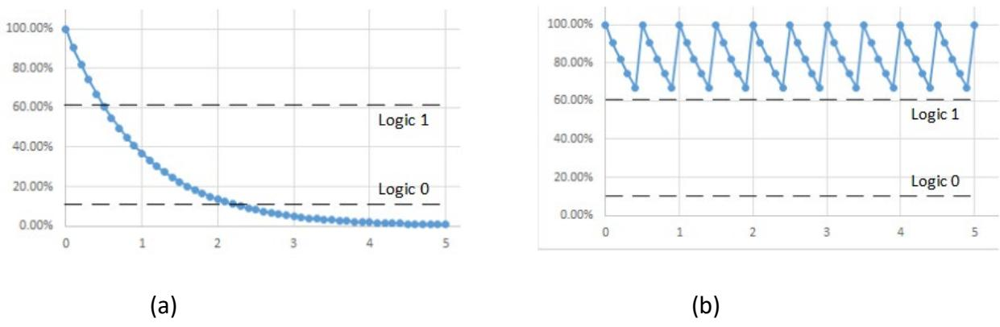

Figure 10.4: Model of dynamic RAM charge: (a) Without refresh; (b) With refresh.

To resolve this problem, dynamic RAM includes **refresh** circuitry. This circuitry reads the contents of memory locations and then writes the same values back to these locations. This does not change the data values, but it does store the maximum charge in the memory locations as shown in Figure 10.4 (b).

As stated earlier, Figure 10.4 shows this process for logic value 1. The same refresh process is used for all bits of dynamic RAM. The bits storing logic value 0, however, remain in a discharged state.

The other type of volatile memory in a computer system is called **static RAM**, or **SRAM**. This type of memory acts more like D flip-flops. Unlike dynamic RAM, static RAM does not leak charge and does not need to be refreshed. It is also faster than dynamic RAM. Unfortunately, it is also much more expensive than dynamic RAM, which is why DRAM is used as the primary physical memory in computer systems. Static RAM is used to construct **cache memory**, a small, high-speed memory found within a microprocessor chip. Cache memory is beyond the scope of this book. I recommend you check out my other book or any book on computer systems for a detailed description of cache memory and how it is used in computer systems.

### 10.3.2 Non-volatile Memory Devices

When power is removed from a non-volatile memory, it retains the data in its memory cells. This has many practical uses, one of which is the lookup tables introduced in Chapter 5. But this is just one application; in fact, it is one of the less frequently used applications of non-volatile memory. Before reading on, try to think of some devices you have used that include nonvolatile memory.

I hope you did stop to think about everyday uses of non-volatile memory before reading this paragraph. If you did, I'd guess the most common (correct) answer that students chose is USB flash drives. You can insert the drive into the USB port of a computer, which gives it power and access to data. After writing a file to the drive, as I'm doing as I write this chapter, you can eject the drive and remove it from the USB port. This removes power from the flash drive. When you reinsert it into the USB port, you can access the file again. The non-volatile memory retained its contents, even when power was removed. An **SD card**, typically used to store data

in devices such as cameras, operates in much the same way, except it uses a different interface than USB.

A typical personal computer includes a non-volatile memory called the **BIOS ROM**, **BIOS**, or **UEFI**. The BIOS (Basic Input/Output System) or UEFI (Unified Extensible Firmware Interface) is used when the computer first starts up to initialize and test system hardware, and then load in software to start up the operating system (Windows, MacOS, Linux, et. al.).

One other place you'll find non-volatile memory in a computer system is inside the microprocessor chip. Many modern microprocessors use a microsequencer as a control unit. (If you think of the microprocessor as the *brain* of a computer, the control unit is the brain of the microprocessor.) A microsequencer stores data that causes it to perform the correct sequence of micro-operations to process instructions. The details are beyond the scope of this book; see my other book or any book on computer architecture for more details about microsequencers and how they work.

Just as there are different types of volatile memory, there are also several types of nonvolatile memory.

#### 10.3.2.1 Masked ROM, or ROM

A **masked ROM**, or just a ROM, is a read-only memory that has its data fixed when it is manufactured. This is useful when you're manufacturing a large number of a single product that uses a non-volatile memory that will never change its data. Some consumer appliances, such as washing machines or microwave ovens, which use simple microprocessors may use this type of memory. The memory in the microsequencer of a microprocessor chip would also fall into this category.

#### 10.3.2.2 Programmable ROM

A **programmable read-only memory**, or **PROM**, is a ROM that can be programmed by the user with specialized programming hardware, but only once. The PROM chip contains a fuse for each bit of memory. Programming the PROM chip blows out the fuse or leaves it intact to store a logic 0 or 1 for that bit. Just as with fuses in electrical circuits, once a fuse is blown, it cannot be un-blown. PROMs are useful when prototyping circuits, or when manufacturing a small quantity of a product that might otherwise use a masked ROM.

#### 10.3.2.3 Erasable PROM

Unlike a PROM, an **erasable PROM**, or **EPROM**, can be erased. The EPROM chip is programmed using specialized programming hardware, much like a PROM. Instead of blowing fuses, however, the EPROM stores data in separate cells that set the data for each bit. These cells retain their data under normal circumstances, but leak charge when exposed to ultraviolet light. EPROM chips have a clear window at the top of the chip. To erase the contents of the chip, it is placed in a UV eraser, just a strong ultraviolet light in a completely enclosed case. The EPROM is *cooked*, or exposed to the UV light for approximately 20 minutes to erase its contents so it can be reprogrammed. When used in a circuit, it is common practice to cover the window

with black electrical tape to prevent ultraviolet light from entering the chip and erasing its contents.

#### 10.3.2.4 Electrically Erasable PROM

The **electrically erasable programmable read-only memory**, **EEPROM**, or **E2PROM**, functions like an EPROM, but it can be erased and reprogrammed electrically. The hardware to erase and reprogram an E2PROM is typically built into the circuit that uses the E2PROM, allowing its contents to be modified in place, without removing it from the circuit. The BIOS or UEFI ROM in a computer is constructed using E2 PROM technology. Flash drives and SD cards use a type of E2PROM that is block programmable. These devices write and read entire blocks of memory locations, rather than individual locations. They are particularly well suited for storage devices such as these, as well as the solid state drives becoming commonplace in personal computers.

### 10.3.3 Internal Organization

Internally, there are two primary ways to model a read-only memory. One is to model it as a PLD, with a series of AND gates sending their outputs to a series of OR gates. The other is to model each bit of storage as a D flip-flop, with associated hardware to access the individual bits within the memory chip. We'll look at both, starting with the PLD model.

In the PLD model, the address bits and their complements are sent as inputs to an array of AND gates. Figure 10.5 shows this model for a ROM with eight memory locations, each of which stores a 2-bit value. The connections to the AND gates are fixed, that is, they are always connected as shown in the figure. The uppermost AND gate outputs a 1 when $A'_2 = A'_1 = A'_0 = 1$, or when the address is $A_2A_1A_0 = 000$. The next AND gate sets its output to 1 when the address is 001, and so on, continuing to the last AND gate, which outputs a 1 when the address is 111. This portion of the memory chip acts as a decoder, setting the output of exactly one AND gate to 1.

The outputs of the AND gates are sent to the OR array. If a bit at a given memory address is 1, we connect the output of the AND gate corresponding to that memory location to the input of the OR gate for that bit. In the animation for this figure, address input 4 (100) sets the output of the memory to 2 (10).

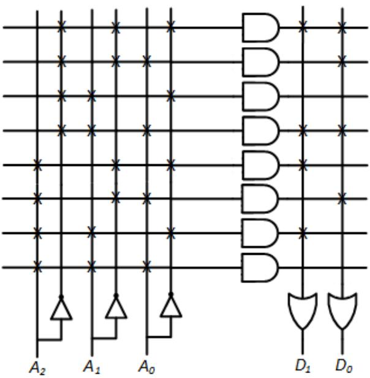

Figure 10.5: PLD model of an 8x2 ROM

Now let's look at the model using D flip-flops. Figure 10.6 shows a model for a 16x2 ROM. Here, we show the decoder explicitly rather than construct it using an array of AND gates. Inside the decoder, however, you basically have that AND gate array. Instead of making connections from the AND gates directly to the OR gates to represent the data, this model takes a different approach. The data is stored in an array of D flip-flops. When we access a memory location, we enable the tri-state buffers for the bits of only that memory location. This allows these bits to be output on the data pins of the memory chip.

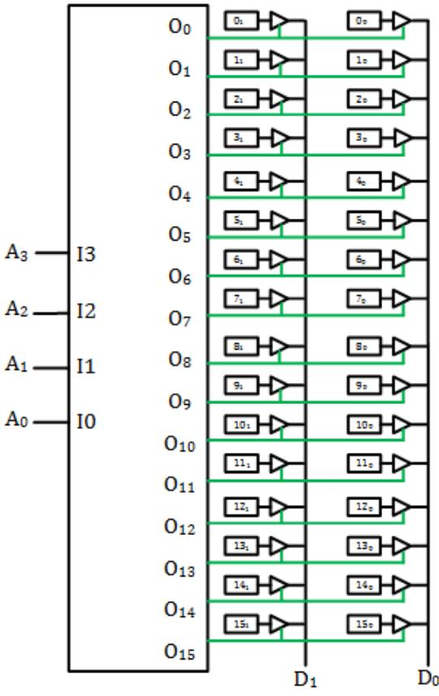

Figure 10.6: D flip-flop model of a 16x2 ROM. Buffer enable signals shown in green.

There is one problem with this model. It works fine when our chip has only eight locations, but what happens when it has 8G (233) locations? Its decoder would have 33 address bits and 233 outputs. The size of a decoder is proportional to the number of outputs, and this decoder would be huge. Instead, memory chips can divide the address bits into different groups and decode each group. They then combine the outputs of the decoders to select individual locations.

Consider a chess board, as shown in Figure 10.7. In algebraic notation, letters $a$ through $h$ represent the columns of the board, and numbers 1 to 8 represent the rows. Each square is represented by the labels of its row and column, and each combination of labels corresponds to one unique square of the chessboard.

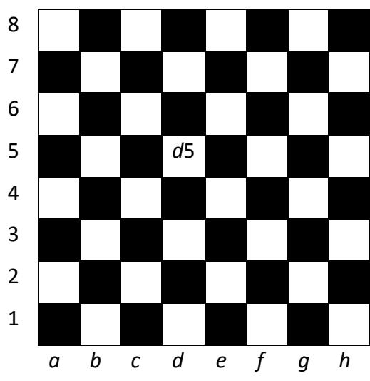

Figure 10.7: Chess board with algebraic notation. Square d5 labeled.

When using two-level decoding, we split up the bits into two groups. In the chess board analogy, one group is decoded to specify the row and the other group is decoded to specify the column. We combine the two decoded values to select a single memory location, or square on the chess board.

Figure 10.8 shows the 16x2 memory chip constructed using two 2 to 4 decoders. The first decoder enables every memory address with the two address bits corresponding to that decoder output. In this figure, address bits $A_3$ and $A_2$ are input to the upper decoder. Decoder output 0 is active when $A_3A_2 = 00$, so we want that decoder output to enable all locations having addresses with $A_3A_2 = 00$. For this chip, this is addresses 0000, 0001, 0010, and 0011, or 0, 1, 2, and 3. The other decoder outputs enable the remaining locations. This decoder is equivalent to selecting the row of the chess board.

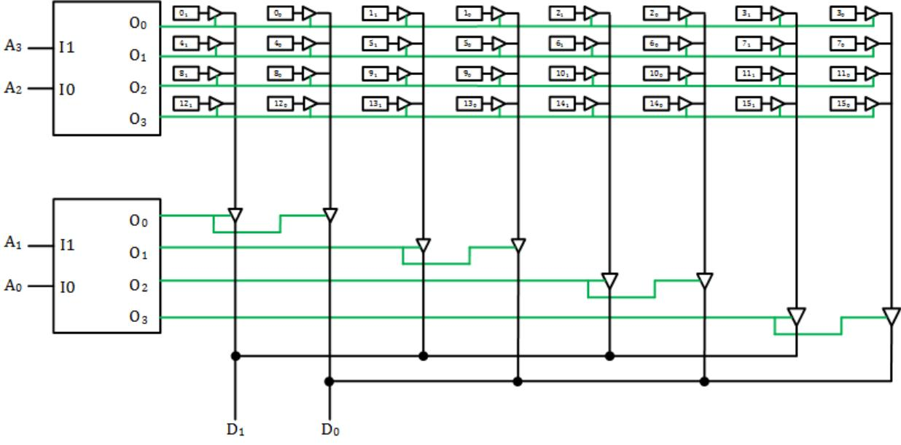

Figure 10.8: Memory chip constructed using two-level decoding. Buffer enable signals shown in green.

The remaining bits are decoded to select all locations with the address bits corresponding to its inputs, $A_1$ and $A_0$. When $A_1A_0 = 00$, the chip enables the tri-state buffers that can receive data from all memory locations with these low-order address bits, 0000 (0), 0100 (4), 1000 (8), and 1100 (12) in this case. The other values of $A_1$ and $A_0$ select their corresponding locations. This is equivalent to selecting the column of the chess board.

By selecting one row and one column, the memory chip accesses one memory address within the chip, just as specifying one row and one column specifies one square on the chess board.

By using two smaller decoders, this chip reduces the overall size of the decoders. Since the size of the decoder is proportional to the number of outputs, using two-level decoding reduces the total size of the decoding hardware from O(16) to O(4) + O(4), or O(8), a savings of about 50%. For larger memory chips, this savings can reach over 99%. It is also possible to use more than two levels of decoding to realize even greater reductions in decoding hardware.

The models are meant to give you a basic idea of how a ROM works, but they are incomplete. Real memory chips include an enable signal. When used in a computer system, there may be many ROM chips, as well as RAM chips, and we need to make sure only one memory chip is active at a given time. (If your circuit uses the ROM chip as a lookup table, you can just set this input so the chip is always enabled.) The memory chip may also have a separate output enable signal. In a computer system, you would typically enable the chip first and give it time to decode its address, enable the tri-state buffers, and have the data ready to be output. Then the computer system would enable the outputs, usually through additional tri-state buffers, by asserting the output enable signal. (For lookup ROMs, this signal can always be asserted too.) Figure 10.9 shows how these signals could be used within the memory chip to achieve their desired functions.

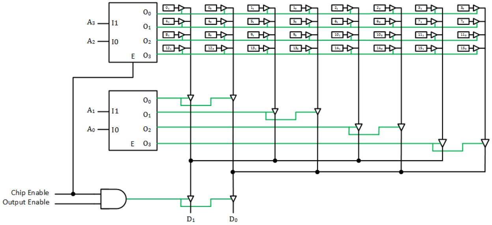

Figure 10.9: D flip-flop model of a 16x2 ROM with chip enable and output enable signals.

One final thing that is missing is how we can have the chip write data into a memory location. First, we would include a data path from the data pins of the chip to the D inputs of the flip-flops for each memory location. We would also load the location when its conditions are met. The chip would decode the address just as it does to output data. It would also combine it with a chip enable signal and some signal that indicates we are programming the chip (for ROMs) or just writing data to memory (for RAMs). When using ROMs in digital circuits, we generally don't need to do that once the chip is programmed initially, so we do not cover that here. The reader should consult a book on computer organization and architecture for more information on how this is done.

## 10.4 Summary

Programmable devices offer designers a number of advantages. Using a single chip to hold several components can reduce circuit size, wiring, power consumption, and propagation delay.

One class of programmable devices is PLDs, or programmable logic devices. A PLD has many combinatorial logic gates within the chip; some, but not all, also include a limited number of flip-flops. By specifying the connections of chip inputs, gate inputs and outputs, and chip outputs, the designer can create an entire circuit within a single chip.

There are several types of PLDs. A PAL, programmable array logic, is composed of multiple AND-OR arrays. The output of the OR gate, or its complement, may be connected to a chip output or to a flip-flop input, with the output of the flip-flop connected to the chip output. Some PALs allow the output of some or all OR gates to be fed back and made available as an input to other AND-OR arrays on the chip. This is especially useful for more complex functions.

A programmable logic array, PLA, is similar to a PAL. Unlike a PAL, however, any AND gate can send its output to any OR gate; the AND-OR array is not fixed. PLAs are more flexible than PALs, but in general they are slower than PALs.

Complex Programmable Logic Devices, CPLDs, have many more gates than the simpler PALs and PLAs, as well as more complex internal architectures. This increases the ability for components within the chip to be interconnected and communicate with each other. CPLDs include multiple logic blocks and macrocells.

Field Programmable Gate Arrays, FPGAs, have several orders of magnitude more gates than CPLDs. Many FPGAs are programmed when power is connected, whereas the other components are programmed before they are added to the circuit. The FPGA typically includes a ROM with configuration information and hardware that uses this information to set up the FPGA.

There are several types of memory devices. Random Access Memory, RAM, is volatile. When power is removed from a RAM chip, its data is lost. Dynamic RAM is the type of memory used in most computer systems. Its contents are constantly refreshed to restore leaked charge. Static RAM is faster but more expensive than DRAM. It is used to construct cache memory within a microprocessor.

Masked ROMs, PROMs, EPROMs, and E2PROMs are types of read-only memory. They are used in USB flash drives, SD cards, and other devices that are required to retain their data when power is removed. As discussed earlier in this book, they can be used as lookup tables in digital circuits. They are also used to store microcode within many microprocessors. Internally, a ROM can be modeled as a PAL in which the array of AND gates is in a fixed configuration that decodes the input address bits. It can also be modeled as an array of flip-flops with outputs enabled by decoders that explicitly decode the address bits. Multiple decoders can be used to divide the address bits and decrease the total size of the decoding hardware.

## Exercises

1. List additional advantages of using a programmable memory and PLDs beyond those listed in Section 10.1.

2. List additional advantages of using a programmable memory and PLDs beyond those listed in Section 10.1.

3. List the contents of all memory locations in the memory component shown in Figure 10.5.

4. Show the PLD model for a ROM with four address inputs, four data outputs, and the following values stored in locations 0 to 15, respectively: 2,5,8,9,0,11,3,14,12,5,7,15,1,6,14,11.

5. Implement the function $ab+ac+bc$ on the PAL cell shown in Figure 10.1.

6. Implement the function $a'bc$ on the PAL cells shown in Figure 10.2.

7. Modify the connections of the PAL cell shown in Figure 10.1 to realize the following truth table.

| a | b | c | q |
|---|---|---|---|
| 0 | 0 | 0 | 1 |
| 0 | 0 | 1 | 1 |
| 0 | 1 | 0 | 1 |
| 0 | 1 | 1 | 0 |
| 1 | 0 | 0 | 1 |
| 1 | 0 | 1 | 0 |
| 1 | 1 | 0 | 0 |
| 1 | 1 | 1 | 1 |

8. Modify the connections of the PAL cell shown in Figure 10.2 to realize the following truth table.

| a | b | c | q |
|---|---|---|---|
| 0 | 0 | 0 | 1 |
| 0 | 0 | 1 | 0 |
| 0 | 1 | 0 | 1 |
| 0 | 1 | 1 | 1 |
| 1 | 0 | 0 | 0 |
| 1 | 0 | 1 | 1 |
| 1 | 1 | 0 | 1 |
| 1 | 1 | 1 | 0 |

9. Show the connections in Figure 10.1 or 10.2 needed for a PAL to realize the following functions for three variables. Use feedback if necessary.
	- a. AND
	- b. OR
	- c. XOR
	- d. NAND
	- e. NOR
	- f. XNOR

10. Show the truth table and function in minimal form realized by the following PAL cell.

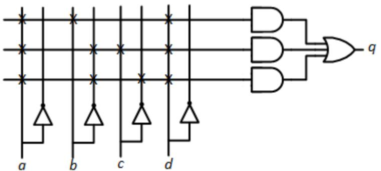

11. Show the connections in Figure 10.3 needed to realize the functions $a+b+c$ and $abc$.

12. Show the connections in Figure 10.3 needed to realize the functions $ab+ac$ and $ac+bc$.

13. Show the connections in Figure 10.1 needed to realize the following truth table.

| a | b | c | q | r |
|---|---|---|---|---|
| 0 | 0 | 0 | 0 | 0 |
| 0 | 0 | 1 | 0 | 1 |
| 0 | 1 | 0 | 1 | 0 |
| 0 | 1 | 1 | 0 | 1 |
| 1 | 0 | 0 | 0 | 0 |
| 1 | 0 | 1 | 0 | 1 |
| 1 | 1 | 0 | 1 | 1 |
| 1 | 1 | 1 | 1 | 1 |

14. Show the connections in Figure 10.3 needed to realize the following truth table.

| a | b | c | q | r |
|---|---|---|---|---|
| 0 | 0 | 0 | 0 | 1 |
| 0 | 0 | 1 | 1 | 1 |
| 0 | 1 | 0 | 0 | 1 |
| 0 | 1 | 1 | 1 | 0 |
| 1 | 0 | 0 | 1 | 1 |
| 1 | 0 | 1 | 1 | 0 |
| 1 | 1 | 0 | 0 | 0 |
| 1 | 1 | 1 | 0 | 0 |

15. A PLA has three inputs, four AND gates, and two OR gates. The OR gate outputs can be fed back as inputs to the AND gates. Show this PLA and the connections needed to realize the functions $a'b+c$ and $ab'+ac+a'b+c$.

16. Show the truth table and functions realized by the following PLA. Reprogram the PLA to generate the same truth table using the fewest possible connections.

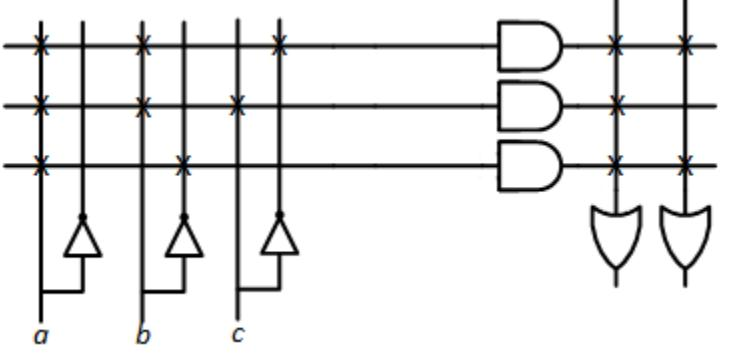

17. Design an 8x2 memory chip using 3-level decoding.

18. Show the contents of the following ROM.

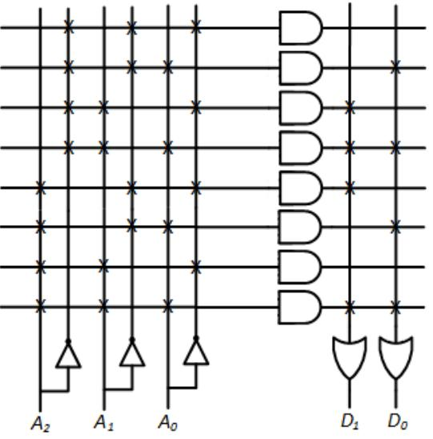

19. A ROM has three inputs and three outputs. Show the AND-OR configuration of a ROM with the following contents: 7, 6, 5, 4, 3, 2, 1, 0.

20. Repeat Problem 19 for a D flip-flop configuration of the ROM using a single decoder.

21. Repeat Problem 20 for a ROM using two-level decoding.

22. In Figure 10.6, swap $A_3$ and $A_0$, and swap $A_2$ and $A_1$. Show the address corresponding to each bit in the memory.

23. In Figure 10.8, swap $A_3$ and $A_2$, and swap $A_1$ and $A_0$. Show the address corresponding to each bit in the memory.

24. Show the 2-bit multiplier lookup ROM in Figure 5.12 as an AND-OR array implementation.
