# Chapter 8: Sequential Circuits

In the previous two chapters, we introduced the fundamental components of sequential logic: latches and flip-flops, as well as some more complex components that are designed using these components: registers and counters. In this chapter, we extend this knowledge to design synchronous sequential digital systems.

To design these systems, we will model each system as a finite state machine. In this approach, the system is always in one of its possible states. Depending on the values of the system inputs, the system will produce specific output values and transition to a different state (or remain in the same state). This may sound a bit confusing, but it will become clearer as we progress through this chapter. Using this methodology, we can design any digital system from the simplest controller to the most complex (non-quantum) computer system.

This chapter begins by introducing the basic model of finite state machines and the tools frequently used in their design: state diagrams and state tables. The state tables are not the same as the truth tables we've already seen, but they do have some similarities.

Next, we'll present the two main types of finite state machines, **Mealy machines** and **Moore machines**. Both are useful design models; they differ primarily in how they generate their output values.

With this background, we will then examine the state machine design process using flipflops. We will go through design examples using both Mealy and Moore machines.

For some state machines, it is possible to use some of the more complex combinatorial and sequential components introduced earlier in this book to simplify our designs. We'll look at when this is helpful and which components to use.

Regardless of the design methodology used, sometimes it is helpful, or even necessary, to refine your design. It may be possible for your design to be in a state that it does not use, or there may be two or more states that are equivalent and can be merged together to simplify your final design. We close out this chapter by examining these and other scenarios.

## 8.1 Finite State Machines – Basics

When we started our study of sequential logic in Chapter 6, we noted that we can use the finite state machine methodology to model any sequential system. In this section, we introduce some of the fundamental ideas and tools used in finite state machine design. Let's start with perhaps the most fundamental idea of all.

### 8.1.1 What Is a State?

The Merriam-Webster dictionary has numerous definitions of the word *state*. The definition of interest for finite state machines is *a mode of condition of being*. This sounds really unclear, but it is a succinct and correct definition. This might be explained best by going through a couple of familiar examples.

First, let's look at a very simple example, the D flip-flop. At any given time, this flip-flop stores one of two values, 0 or 1. These two conditions of being, storing 0 and storing 1, are the two states of the D flip-flop. The system that is the D flip-flop has two states.

In this case, the $Q$ output of the D flip-flop is 0 when it is in the storing 0 state, and 1 when it is in the storing 1 state. This is not necessarily the case for all finite state machines.

Remember the 1s counter we introduced in Chapter 6. When it has received an input value of 1 three times, it sets its output to 1. As noted in that chapter, this system has three states.

- Zero values of 1 have been input so far.
- One value of 1 has been input so far.
- Two values of 1 have been input so far.

For the first two states, our output is set to 0. Only when the system is in the third state, and we input a third 1, do we set the output to 1.

For some systems, the output values directly correspond to the state. Usually, however, this is not the case, and more than one state may generate the same output values.

In both examples, we performed the first step in the finite state machine design process. We listed all the possible states that can exist in our system. Next, we must determine every possible change that can occur in each state. We'll start with a system model.

### 8.1.2 System Model

In Chapter 6, we introduced a generic model of a sequential circuit. Figure 6.1 (b) shows this model, which is repeated and enhanced as Figure 8.1. This is also the model for a finite state machine. The state block is a set of flip-flops that stores a value corresponding to the state of the machine; this value is called the **present state**. We combine the value of the present state with the values of the inputs to determine what state we should next have for our system. This value, called the **next state**, is sent back to the state block.

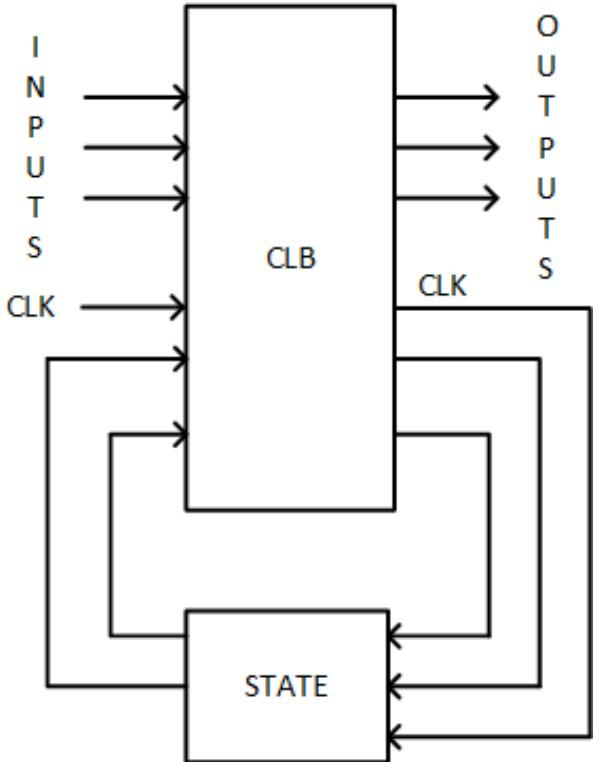

Figure 8.1: Generic finite state machine.

Notice that the clock (*CLK*) is also input to the block with the flip-flops that store the present state. Finite state machines are generally synchronous circuits, that is, they have a system clock that coordinates the flow of data. In our model, the logic within the combinatorial logic block (CLB) will require some amount of time to set its outputs, including the value of the next state. When selecting the frequency of the system clock, we must ensure that it is slow enough to let the CLB set all its values.

The final part of the finite state machine model is its outputs. Depending on the type of finite state machine we use, the outputs will be generated either as a function of the value of the present state and the inputs, or as a function of only the present state. We'll look at this in more detail in Section 8.2.

### 8.1.3 State Diagrams (Excluding Outputs)

A state diagram is a convenient mechanism used to graphically represent the functioning of the finite state machine. Each state is represented as a circle with the name of the state shown inside the circle. Directed arcs, basically arrows, show the transition from one state to another, or from one state back to itself. The conditions under which each transition occurs are shown on the arc. Outputs are also shown on the state diagram, but each type of finite state machine shows them in a different way. We will not show outputs in this subsection, but we'll come back to them when we introduce our models in Section 8.2.

Consider the D flip-flop. It has only two states, storing 0 and storing 1. We give each state a shorter label that fits more easily inside the state circle; I'll use *S0* for storing 0 and *S1* for storing 1. So far, our state diagram consists of just two states, no transitions yet, as shown in Figure 8.2 (a).

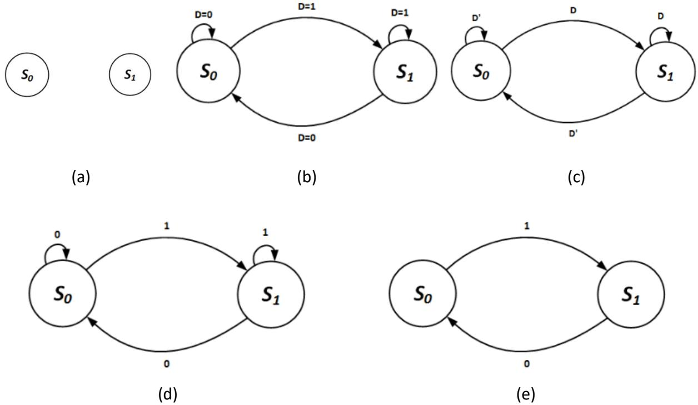

Figure 8.2: D flip-flop state diagram: (a) States; (b) States and all transitions; (c) and (d) Alternate representations of values; (e) Representation with self-arcs removed.

Now, let's see what happens in each individual state for all possible input values, starting with *S0*. If *D* = 1, we want our flip-flop to go to *S1*, storing 1. It should stay in the same state if *D* = 0. When our system is in state *S1*, we want it to go to *S0* if *D* = 0 or to stay in *S1* if *D* = 1. Figure 8.2 (b) shows the state diagram with these state transitions included. The label above each arc indicates the conditions that must be met for the transition to occur.

Figure 8.2 (c) shows an alternative and more common way to represent the conditions. Here, we list the condition that must be true, equal to 1, for the transition to occur. *D* = 1 simply becomes *D*. *D* = 0 becomes *D'* because, if *D* = 0, then *D'* = 1. We can also dispense with the *D*s and simply show the input values, as in Figure 8.2 (d).

State diagrams can also be represented without the self-arcs, the arcs that go from a state back to itself. By default, if a system is in a state, and the conditions are not met for any of the arcs coming out of the state, then the system just stays in its current state. Figure 8.2 (e) shows the state diagram with self-arcs removed.

All of this brings up an important point regarding the condition values. The conditions on all arcs coming out of a state must be **mutually exclusive**. That is, the conditions for only one arc (or possibly zero arcs if self-arcs are eliminated) can be true at any given time. This ensures that the system only tries to go to one state at a time.

Finally, there is one input signal we did not include in our state diagram, the system clock. The system clock is only used to synchronize the flow of data within the system, generally by causing edge-triggers that store the value of the present state to load in the value of the next state. This is implicit to the finite state machine and is not explicitly shown in the state diagram.

As another example, consider the 1s counter. This system has three states, which we'll call *S0*, *S1*, and *S2*, which correspond to the states with 0, 1, and 2 1s already counted, respectively. In state *S0*, we stay in *S0* if the input is 0 or go to *S1* if the input is 1. Similarly, if we are in state *S1*, an input of 0 keeps us in *S1* and an input of 1 brings our system to *S2*. In *S2*, we remain in *S2* when the input is 0. However, if the input is 1, that becomes our third 1 and we reset our count back to 0 by going to *S0*. The state diagram for this system is shown without self-arcs in Figure 8.3.

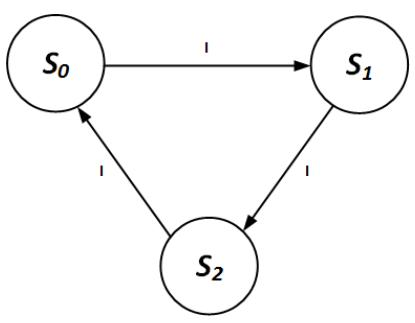

Figure 8.3: State diagram for the 1s counter.

### 8.1.4 State Tables (Also Excluding Outputs)

Another tool frequently used in finite state machine design is the **state table**. It is quite similar in format to the truth tables we've already seen throughout this book. The input side of the table includes not only the system inputs, but also the present state. The output portion of the table includes both the system outputs and the next state. To save space, we usually denote the present state and next state as *PS* and *NS*, respectively.

To illustrate this, the state table for the D flip-flop, excluding output values, is shown in Figure 8.4. Each row of the table corresponds to one state and one set of input values for the state machine. The animation for this figure shows how each row corresponds to an arc in the state diagram.

| PS | D | NS | Q |
|----|---|----|---|
| S0 | 0 | S0 |   |
| S0 | 1 | S1 |   |
| S1 | 0 | S0 |   |
| S1 | 1 | S1 |   |

Figure 8.4: D flip-flop state table, excluding output values.

Figure 8.5 shows the state table for the 1s counter, also excluding output values.

| PS | I | NS | O |
|----|---|----|---|
| S0 | 0 | S0 |   |
| S0 | 1 | S1 |   |
| S1 | 0 | S1 |   |
| S1 | 1 | S2 |   |
| S2 | 0 | S2 |   |
| S2 | 1 | S0 |   |

Figure 8.5: 1s counter state table, excluding output values.

## 8.2 Types of Finite State Machines

With this background, we're almost ready to design circuits to realize our finite state machines, except for one thing. As currently designed, our state machines don't generate any outputs. We excluded them so far because we had not yet introduced the models of finite state machines, each of which uses a different method to produce its outputs. In this section, we introduce these two methodologies, **Mealy machines** and **Moore machines**, and we complete the specifications, state diagrams, and state tables we developed for our two examples. In the next section, we will begin the actual design process.

Both Mealy and Moore machines are used frequently in sequential logic design. Neither is superior to the other. I chose to introduce them in alphabetical order, which is also the order in which they were developed.

### 8.2.1 Mealy Machines

The Mealy machine model for finite state machines was first published by George Mealy in 1955. It makes use of the state diagram and state table introduced in the previous section to indicate the transitions between states and the specification of the next state. It extends what we presented so far to include the output values generated by the state machine. This is where Mealy and Moore machines differ.

In the Mealy machine, outputs are specified as functions of both the present state and the input values. This being the case, they are shown on the arcs in state diagrams. The standard notation lists the inputs, then a slash, followed by the output values.

To illustrate this, let's return to the state diagram for the D flip-flop. We'll use the diagram in Figure 8.2 (d). We look at each arc in the state diagram and determine the output values it will produce, and then we add those values to the diagram. We start with state *S0* and its self-arc. When the flip-flop is in this state and *D* = 0, we want it to set output *Q* to 0. We denote this input/output combination as *0/0* on the state diagram. Similarly, when *D* = 1, the flip-flop should set *Q* = 1, or *1/1* in our notation. Repeating this process for the two arcs coming out of state *S1* gives us the final Mealy machine state diagram shown in Figure 8.6.

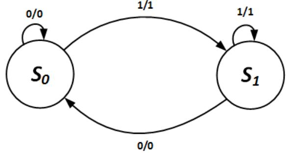

Figure 8.6: Mealy machine state diagram for the D flip-flop.

We modify the state table in the same manner. We determine the outputs generated by the present state and input values for each row in the state table. This is exactly how we generated the outputs for the state diagram. As shown in the state table in Figure 8.7, the state table outputs are identical to the values in the state diagram.

| PS | D | NS | Q |
|----|---|----|---|
| S0 | 0 | S0 | 0 |
| S0 | 1 | S1 | 1 |
| S1 | 0 | S0 | 0 |
| S1 | 1 | S1 | 1 |

Figure 8.7: Mealy machine state table for the D flip-flop.

#### [WATCH ANIMATED FIGURE 8.7](https://digitalcommons.njit.edu/dld-animations/102)

As another example, let's look at the 1s counter. We want to output a 1 when we have counted three 1s, and 0 at all other times. If we add the self-arcs to the state diagram, and include the output values, we get the mostly complete state diagram shown in Figure 8.8.

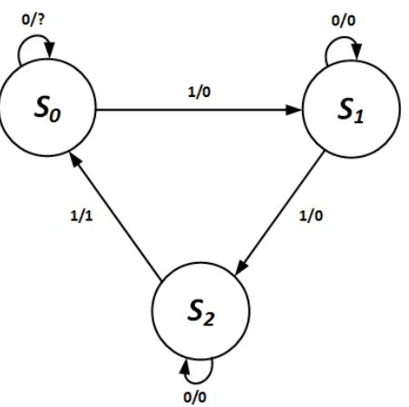

Figure 8.8: Mostly complete Mealy machine state diagram for the 1s counter.

This diagram would be fine if it weren't for the unspecified output on the self-arc at state *S0*. The problem is not with the Mealy machine per se, but rather with the original specification. We said that we want the final circuit to set its output to 1 when it inputs a total of three 1s, but we did not say how long this signal should stay set to 1. Do we want it to continue to output a 1 until the next input value of 1, or do we want it to output a 1 for only one clock cycle, regardless of the input values that follow?

In the first case, the unspecified output should be 1. This will keep the output equal to 1 until another 1 is input; when this happens, the state machine transitions from *S0* to *S1* and sets its output to 0.

In the latter case, the unspecified output should be set to 0. The state machine would input its third 1, transition from *S2* to *S0*, and set its output to 1. In the next clock cycle, it would either stay in *S0* (if the input value is 0) or go to *S1* (if the input is 1). In either case, it would set its output to 0, resulting in an output of 1 for only one clock cycle. The state diagrams for both cases are shown in Figure 8.9.

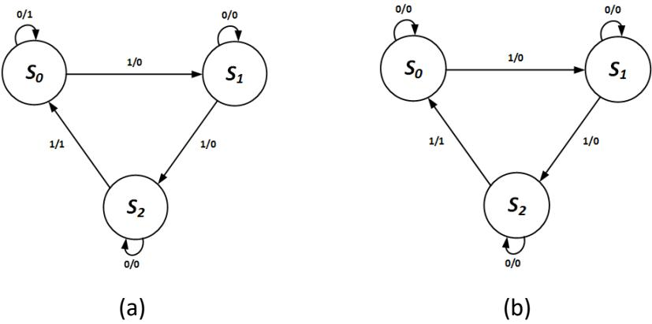

Figure 8.9: Mealy machine state diagram for the 1s counter: (a) Output is 1 until the next sequence begins; (b) Output is 1 for only one clock cycle.

The state tables are constructed just as we did for the previous example. The state tables for both outputs are shown in Figure 8.10.

| PS  | I | NS | O | PS | I   | NS | O |
|-----|---|----|---|----|-----|----|---|
| S0  | 0 | S0 | 1 | S0 | 0   | S0 | 0 |
| S0  | 1 | S1 | 0 | S0 | 1   | S1 | 0 |
| S1  | 0 | S1 | 0 | S1 | 0   | S1 | 0 |
| S1  | 1 | S2 | 0 | S1 | 1   | S2 | 0 |
| S2  | 0 | S2 | 0 | S2 | 0   | S2 | 0 |
| S2  | 1 | S0 | 1 | S2 | 1   | S0 | 1 |
| (a) |   |    |   |    | (b) |    |   |

Figure 8.10: Mealy machine state table for the 1s counter: (a) Output is 1 until the next sequence begins; (b) Output is 1 for only one clock cycle.

### 8.2.2 Moore Machines

One year after George Mealy introduced his model for finite state machines, Edward Moore published a different model that is also commonly used today. Unlike Mealy machines, Moore machines generate their outputs based solely on the present state. Moore machines do not use the values of the inputs to generate the output values. The input values do have an indirect role in generating the outputs since they may cause the machine to go to a specific next state, and that state has certain output values. However, when we ultimately develop sequential circuits to realize these state machines, the circuitry that generates the outputs has only the present state as its inputs.

Since a Moore machine always produces the same output values when it is in a given state, we use a different notation in the state diagram than we use for Mealy machines. The output values are included after the label for the state, separated from the state by a forward slash.

Consider once again the D flip-flop state machine. Whenever the machine is in state *S0*, we want it to set its *Q* output to 0. When it is in state *S1*, it should output *Q* = 1. Figure 8.11 shows the state diagram for the Moore machine version of the D flip-flop.

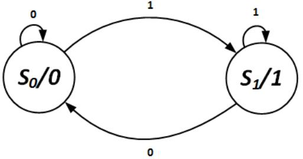

Figure 8.11: Moore machine state diagram for the D flip-flop.

The state table for the Moore machine has exactly the same format as that of the Mealy machine, though its values for the outputs may differ. In the Moore machine, the output value for each state is not changed by the input values. For the D flip-flop, our machine always outputs a 0 when it is in state *S0*; in state *S1*, it always outputs a 1. The state table for this machine is shown in Figure 8.12.

| PS | D | NS | Q |
|----|---|----|---|
| S0 | 0 | S0 | 0 |
| S0 | 1 | S1 | 0 |
| S1 | 0 | S0 | 1 |
| S1 | 1 | S1 | 1 |

Figure 8.12: Moore machine state table for the D flip-flop.

#### [WATCH ANIMATED FIGURE 8.12](https://digitalcommons.njit.edu/dld-animations/103)

If you compare the state tables for the Mealy and Moore machines for the D flip-flop, you will find that the only difference is the value of output *Q* in the two middle rows. These are the only two rows associated with a change in state, that is, the next state is not the same as the present state. *The Moore machine generates outputs based on the present state, whereas the Mealy machine generates outputs associated with the next state.* In the state table for the Moore machine, *Q* = 0 when the present state is *S0* and *Q* = 1 when it is *S1*. The Mealy machine sets *Q* = 0 when the next state is *S0* and *Q* = 1 when it is *S1*.

Now let's revisit the 1s counter. Remember that there are two interpretations of the output value: it remains at 1 until the next 1 is input, or it is set to 1 for only one clock cycle. We'll look at both cases in that order.

When the value stays at 1, we can simply set the output for state *S0* to 1 and set it to 0 for the other states. This state diagram is shown in Figure 8.13 (a); its corresponding state table is shown in Figure 8.13 (b).

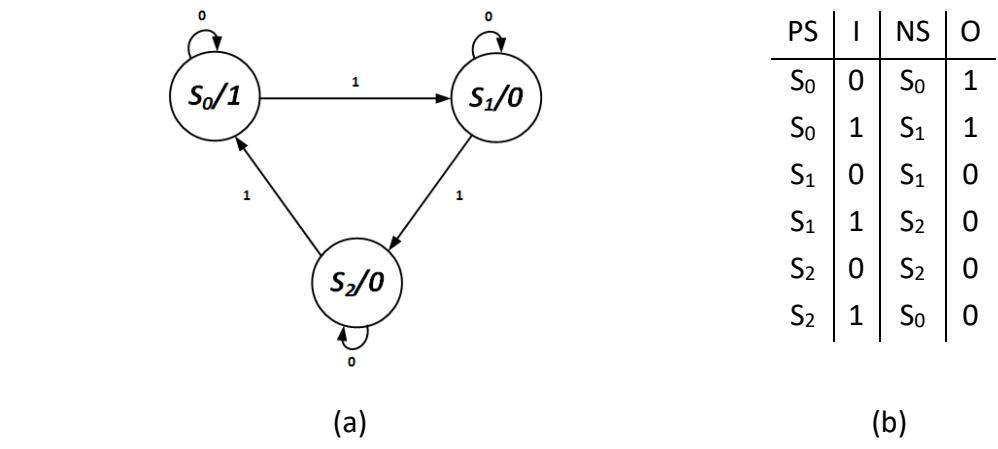

Figure 8.13: Moore machine for the 1s counter that outputs 1 until the next sequence begins: (a) State diagram; (b) State table.

#### [WATCH ANIMATED FIGURE 8.13](https://digitalcommons.njit.edu/dld-animations/104)

The latter case, which sets the output to 1 for only one clock cycle, is not so simple. When we go to state *S0* from *S2*, we want the output to be 1. However, if we then loop back from *S0* to itself (because we input a 0), we want the output to be 0. In Moore machines, we cannot have a state generate different output values at different times; it must always produce the same output values. Before reading on, think about how you would resolve this problem.

Here is one way to handle this issue. I created a new state, *S3*. When the machine receives its third input of 1, it transitions from *S2* to *S3* instead of going to *S0*. The output is set to 1 in this new state. If we are in state *S3* and receive a 0 input, we go to state *S0* since we have not input any 1s for our new group of three ones. If we instead input a 1, our group has one input of 1 and we go to state *S1*. The rest of the state diagram is unchanged. This state diagram and its associated state table are shown in Figure 8.14.

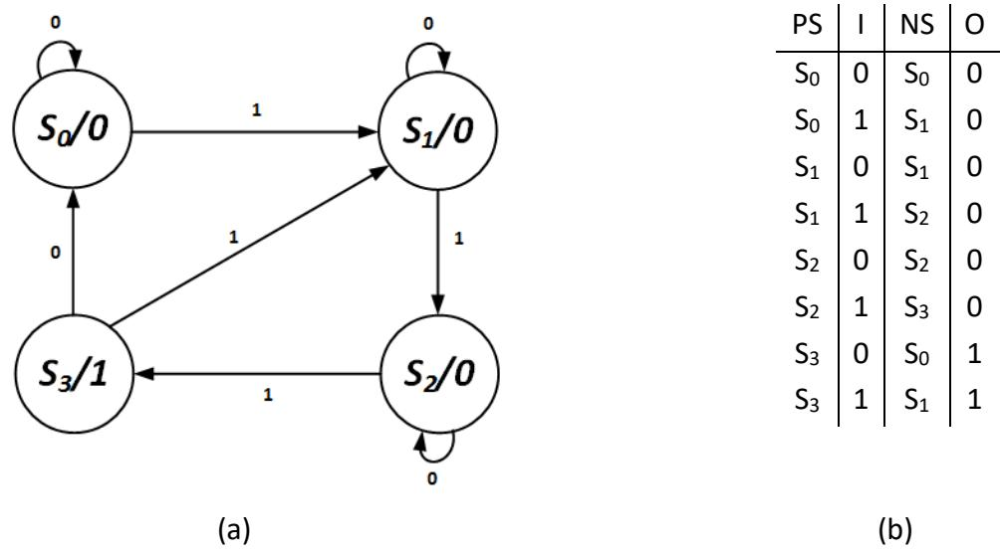

Figure 8.14: Moore machine for the 1s counter that outputs 1 for only one clock cycle: (a) State diagram; (b) State table.

### 8.2.3 A Word about Infinite State Machines

All of this discussion about finite state machines raises the question, "Are there infinite state machines?" The short answer is yes, at least in theory. Consider, for example, a state machine that recognizes all sequences of inputs that are palindromes, that is, they are the same when read from first to last bit or from last to first. Since the string of inputs can be of any length, even infinite, we would need an infinite number of states in our machine to represent these input strings. The classic Turing machine and pushdown automata can also be considered as infinite state machines.

The problem with having an infinite number of states is that your system needs an infinite amount of storage to represent these states. You can't really design nor build such a system. For this reason, we'll note that infinite state machines can be specified mathematically, but since this book focuses on digital logic design, we won't be discussing them any further.

## 8.3 Design Process

There are several ways to enumerate the steps in the design process for finite state machines. The process used in this book has seven steps. Other processes may split some of these steps into multiple steps or combine two or more steps into a single step. I can't say that the process presented here is better or worse than other processes. This is very subjective and may be a matter of personal preference, as all of these design processes should lead to valid final designs.

With that said, here is our seven-step process. Throughout this process, we'll use the 1s counter as a running example.

### Step 1: Specify System Behavior

You can't design something until you know what it is supposed to do. This probably sounds obvious, but a lot of design errors start in this step. Occasionally a designer misrepresents the desired system behavior, but many errors in this step occur because the designer doesn't consider all possibilities. Thinking back to our BCD counter, it is straightforward to specify that the counter must sequence from 0 to 9 and then go back to 0. However, an incomplete specification might neglect to indicate that any invalid values (1010 to 1111) should go to 0 as well.

For the 1s counter, we specify that the system should input a sequence of values and output a 1 when it has received a total of three inputs equal to 1 and then start again.

### Step 2: Determine States and Transitions, and Create the State Diagram

What are the possible conditions of being for our system? When we determine this, each becomes a state in our design. Then we look at each state individually, and each possible set of input values, to determine the outputs to generate and the next state to go to. Once this is done, we can create either the Mealy or Moore machine state diagram.

The Mealy machine implementation has three states:

- *S0*: Zero values of 1 have been input so far.
- *S1*: One value of 1 has been input so far.
- *S2*: Two values of 1 have been input so far.

For the Moore machine, we add a fourth state so we can set the output to 1 for only a single clock cycle.

*S3*: Three values of 1 have been input so far.

Next, we look at each individual state and each input value to determine the next state and output value, and create the state diagram. We already did this in the previous section. The state diagram for the Mealy machine is shown in Figure 8.9 (a). The Moore machine state diagram is shown in Figure 8.14 (a).

### Step 3: Create State Table with State Labels

You've already done most of the work for this in the previous step. The state diagram and state table are equivalent. The diagram illustrates system behavior graphically, whereas the state table enumerates the behaviors explicitly. The state tables for the Mealy and Moore machines are given in Figures 8.10 (b) and 8.14 (b), respectively.

As you can see, the first three steps are things we have already done in the previous section. The remaining steps, however, are new for our design. We present the steps here, and then we use the steps to complete the design of the Mealy and Moore machines in the next two subsections.

### Step 4: Assign Binary Values to States

In our final design, we will be using digital logic. We need to store the value of the current state, and we will use flip-flops for this purpose. A flip-flop can only store the values 0 and 1; it can't store a state label such as *S0*. So, we need to create a unique binary value for each state. The number of bits in the state value is based on the total number of states in the machine. Mathematically, a machine with *n* states needs at least ⎡lg *n*⎤ bits.

### Step 5: Update the State Table with the Binary State Values

We take the state table created in Step 3 and substitute the binary state values developed in Step 4. For example, if state *S0* is represented as binary value 00, we replace *S0* with 00 in the state table wherever it is shown as either a present state or next state.

### Step 6: Determine Functions for the Next State Bits and Outputs

At this point, our state table is essentially a truth table. The table inputs are the present state bits and the system inputs, and the table outputs are the next state bits and the system outputs. We can proceed as we have done previously to develop functions for these table outputs. Taking each table output individually, we create a function based solely on the table inputs. For small numbers of table inputs, a Karnaugh map will suffice. Larger numbers of inputs may require the Quine-McCluskey method to determine the final function.

### Step 7: Implement the Functions Using Combinatorial Logic

Finally, we create combinatorial logic circuits to implement the functions developed in the previous step. This logic must be combinatorial because the system must transition from the present state to the next state in a single clock cycle. This would not be possible if the functions included sequential logic.

Some parts of this design process are relatively straightforward; others, perhaps less so. In the next two subsections, we illustrate how these steps work as we complete the Mealy and Moore machine designs for the 1s counter that sets the output to 1 for a single clock cycle.

### 8.3.1 Design Example – Mealy Machine

First, we'll design the 1s counter as a Mealy machine. We developed the state diagram and state table for this machine in Section 8.2, so we've already completed the first three steps of the design process. The state diagram and state table are repeated in Figure 8.15.

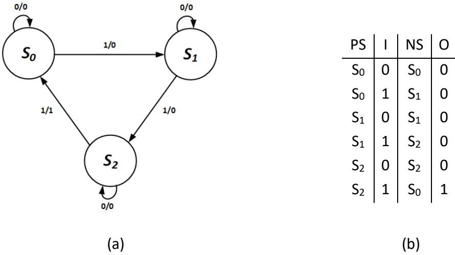

Figure 8.15: Mealy machine (a) state diagram, and (b) state table for the 1s counter.

Now we move on to Step 4 of the design process and assign binary values to states. Since there are three states, and ⎡lg 3⎤ = 2, we need two bits to represent the state values. You can choose any assignment you wish, as long as your design generates the correct output value and next state values. For this example, I assign 00 to *S0*, 01 to *S1*, and 10 to *S2*.

With these assignments made, we proceed to Step 5 and update the state table to include these values for both the present state and the next state. This table is shown in Figure 8.16.

| PS | PS1 | PS0 | I | NS | NS1 | NS0 | O |
|----|-----|-----|---|----|-----|-----|---|
| S0 | 0   | 0   | 0 | S0 | 0   | 0   | 0 |
| S0 | 0   | 0   | 1 | S1 | 0   | 1   | 0 |
| S1 | 0   | 1   | 0 | S1 | 0   | 1   | 0 |
| S1 | 0   | 1   | 1 | S2 | 1   | 0   | 0 |
| S2 | 1   | 0   | 0 | S2 | 1   | 0   | 0 |
| S2 | 1   | 0   | 1 | S0 | 0   | 0   | 1 |

Figure 8.16: Mealy machine state table for the 1s counter with binary state values.

Notice in this table that I have created separate names for each bit of the present state and the next state. As you'll see in the next step, we will create separate functions for the output and each individual bit of the next state value, and each function may use the individual bits of the present state, as well as the value of the input.

Now that everything in the state table is in binary, we can proceed as if it were a truth table. The three inputs, *PS1*, *PS0*, and *I*, will be used to create functions to generate *NS1*, *NS0*, and *O*. Figure 8.17 shows the Karnaugh maps. Notice the two don't-care values in each K-map. These correspond to present state value 11, which is not used in this design. We will proceed with this for now, but we will revisit this decision in the next section.

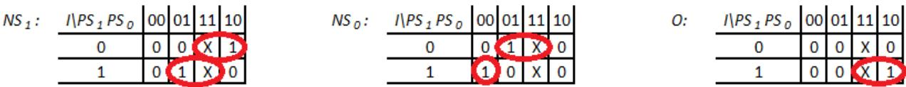

Figure 8.17: Karnaugh maps for the next state and output functions for the Mealy machine.

Here are the functions we derived from these Karnaugh maps.

$$\begin{aligned} \mathsf{NS}\_{I} &= \mathsf{PS}\_{O}l + \mathsf{PS}\_{I}l' \\ \mathsf{NS}\_{O} &= \mathsf{PS}\_{O}l' + \mathsf{PS}\_{I}l' \mathsf{PS}\_{O}l' \\ \mathsf{O} &= \mathsf{PS}\_{I}l \end{aligned}$$

Finally, in Step 7, we create combinatorial logic circuits to realize these functions, as shown in Figure 8.18. The complete circuit is shown in Figure 8.19.

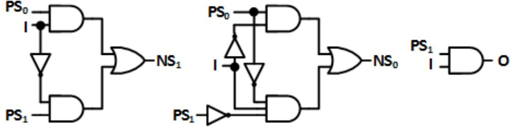

Figure 8.18 Combinatorial logic circuits to generate the next state and output for the Mealy machine.

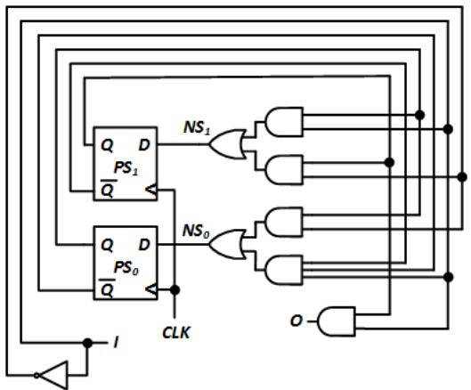

Figure 8.19: Complete circuit for the Mealy machine implementation of the 1s counter.

There is actually one more step in the design process that I did not list explicitly. After you have created the final design, you must verify that the design functions as desired for all possible states and input values. Simulation can be used for much of this work, but your design doesn't really work until you have actually built it and tested the circuit and have shown that it functions as desired.

### 8.3.2 Design Example – Moore Machine

Now let's create another design for this system based on the Moore machine we previously developed. The first three steps produced the state diagram and state table for this machine. Both are repeated in Figure 8.20.

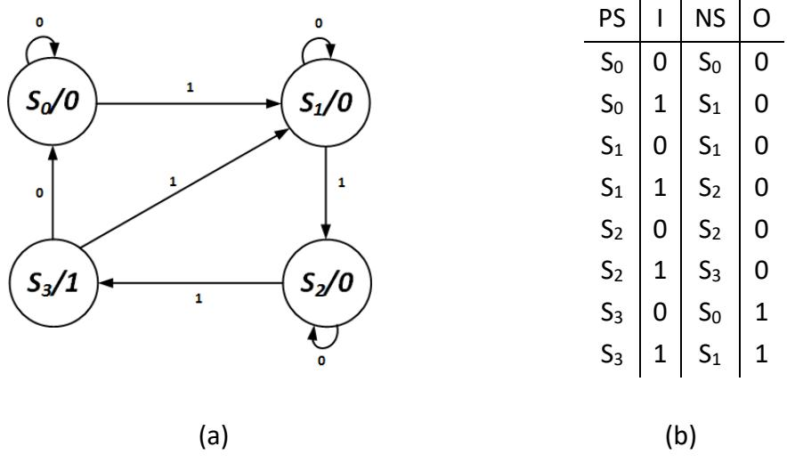

Figure 8.20: Moore machine (a) state diagram, and (b) state table for the 1s counter.

The Moore machine has one more state than the Mealy machine for the 1s counter. Nevertheless, it still needs only two bits to represent the state since ⎡lg 4⎤ = 2. As with the Mealy machine, you can choose any assignments you wish; there are 4! = 24 possible state assignments. For this example, I assign 00 to *S0*, 01 to *S1*, 10 to *S2*, and 11 to *S3*.

Next, in Step 5, we update the state table to include these values. This is shown in Figure 8.21.

| PS | PS1 | PS0 | I | NS | NS1 | NS0 | O |
|----|-----|-----|---|----|-----|-----|---|
| S0 | 0   | 0   | 0 | S0 | 0   | 0   | 0 |
| S0 | 0   | 0   | 1 | S1 | 0   | 1   | 0 |
| S1 | 0   | 1   | 0 | S1 | 0   | 1   | 0 |
| S1 | 0   | 1   | 1 | S2 | 1   | 0   | 0 |
| S2 | 1   | 0   | 0 | S2 | 1   | 0   | 0 |
| S2 | 1   | 0   | 1 | S3 | 1   | 1   | 0 |
| S3 | 1   | 1   | 0 | S0 | 0   | 0   | 1 |
| S3 | 1   | 1   | 1 | S1 | 0   | 1   | 1 |

Figure 8.21: Moore machine state table for the 1s counter with binary state values.

From the table, we create Karnaugh maps for the next state bits and the output and determine functions for each one. These K-maps are shown in Figure 8.22. Notice that the map for output *O* is different from the other maps, and different for output *O* of the Mealy machine. Since this is a Moore machine, outputs are based solely on the present state; input values are not used to generate outputs.

| NS 1 : 1   PS 1 PS o   00 01 11 10 |         |  |  | NS o: I PS 1 PS 1 PS o 00 01 11 10 |  |            | 0: | PS 2 \PS o 00 01 |     |
|------------------------------------|---------|--|--|------------------------------------|--|------------|----|------------------|-----|
| 0 0 0 0 1                          |         |  |  |                                    |  | 0 1) 0 0   |    |                  | 0 0 |
|                                    | 0 1 0 1 |  |  |                                    |  | 120 (1 (1) |    |                  | 01  |

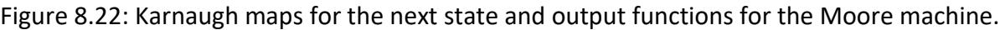

We derive the following functions from the Karnaugh maps.

$$\begin{aligned} \mathsf{NS}\_{1} &= \mathsf{PS}\_{1}\mathsf{P}\mathsf{S}\_{O}l + \mathsf{PS}\_{1}\mathsf{P}\mathsf{S}\_{O}l'\\ \mathsf{NS}\_{O} &= \mathsf{PS}\_{1}\mathsf{P}\mathsf{S}\_{O}l' + \mathsf{PS}\_{1}l + \mathsf{PS}\_{O}l'\\ \mathsf{O} &= \mathsf{PS}\_{1}\mathsf{P}\mathsf{S}\_{O} \end{aligned}$$

Next, we create the combinatorial circuit to generate these values. These circuits are shown in Figure 8.23, and the complete circuit is shown in Figure 8.24. Finally, we must build, test, and verify that our circuit functions as desired.

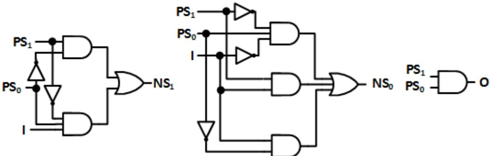

Figure 8.23 Combinatorial logic circuits to generate the next state and output for the Moore machine.

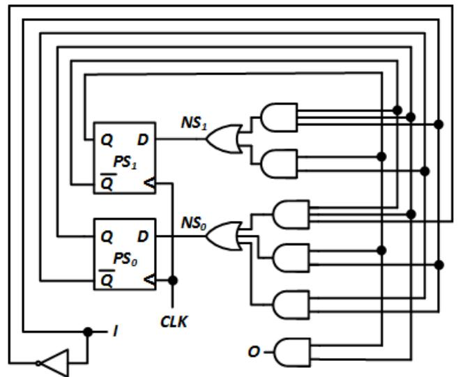

Figure 8.24: Complete circuit for the Moore machine implementation of the 1s counter.

### 8.3.3 A Brief Word about Flip-Flops

For the Mealy and Moore machines we just presented, we used D flip-flops to store the present state value. This is not strictly necessary; any type of edge-triggered flip-flop could be used instead. D flip-flops, however, do simplify the design process a bit.

When we generate the next state, we are producing the next value to be stored in the present state flip-flops. For D flip-flops, this is exactly the value we want to place on the D inputs of the flip-flops. For other flip-flops, such as J-K or T flip-flops, this is not necessarily the case. For implementations using these flip-flops, we would need to take the state table with the binary values, created in Step 5 of our design process, and create an excitation table for the flipflops. In the remaining steps of the design process, we would create functions and circuits for the flip-flop inputs rather than the next state. The process of creating functions and circuits to generate the output values would remain the same.

### 8.3.4 Comparing our Two Designs

Now that we have completed the Mealy and Moore machine designs for the 1s counter circuit, how do the two designs compare? Is one better than the other?

Looking at the state diagrams, one difference is immediately apparent. The Mealy machine has fewer states than the Moore machine. This is not uncommon. It occurs whenever a Mealy machine has a state with two or more arcs going into the state, and those arcs have different output values. In a Moore machine, we need a separate state for each of these output values.

Having more states may result in a design with additional hardware, but this is not always the case. For the 1s counter design, both the Mealy and Moore machine need two flipflops to store the present state value, since ⎡lg 3⎤ = ⎡lg 4⎤ = 2.

The combinatorial logic to generate the next state and output values is slightly less complex for the Mealy machine for this particular design. This is not always the case, and it is also impacted by other factors, such as the values assigned to each state. Output values for the Moore machine may require less combinatorial logic than those of the Mealy machine simply because they do not use system input values. Moore machine outputs are generated only from the present state. Once again, this is not always the case. For the 1s counter, both machines use a single 2-input AND gate to produce output *O*.

As far as the end user is concerned, both circuits perform the same function. They read in a sequence of bits and output a 1 for one clock cycle whenever it reads in three values set to 1.

## 8.4 Design Using More Complex Components

All the finite state machine designs we have seen so far in this chapter use edge-triggered flipflops and basic logic gates in their final circuits. For some state machines, it is possible to use some of the more complex components introduced earlier in this book to simplify our designs. In this section, we'll look at three of these components: counters, decoders, and ROMs, and when and how they can be used in finite state machine design.

### 8.4.1 Design Using a Counter

Counters are useful when designing finite state machines that always go through a specific sequence of states. You have already seen one example of this: the Mealy machine implementation of the 1s counter. Looking at the state diagram in Figure 8.9 (b), and repeated in Figure 8.15 (a), we see that, for every state, the machine either stays in its current state or goes to one specific next state. Furthermore, this one specific next state is different for every state.

We have already spent a fair amount of time on the 1s counter, so we will illustrate how counters can be used in finite state machines using a different example. In this subsection, we design a 3-bit Gray code sequence generator using a counter; we will design this system as a Moore machine.

#### Step 1: Specify System Behavior

Our system will produce a 3-bit Gray code. It has a clock input, *CLK*, and a data input *I*. It has a 3-bit output *O*, consisting of bits *O2*, *O1*, and *O0*, that give the current value in the sequence. On the rising edge of the clock, if *I* = 1, *O* changes to the next value in the Gray code sequence; otherwise it keeps its current output value. As we described in Chapter 1, the 3-bit Gray code sequence is

000 → 001 → 011 → 010 → 110 → 111 → 101 → 100 → 000 → …

#### Step 2: Determine States and Transitions, and Create the State Diagram

We are designing a Moore machine, and our system has eight possible output values. Therefore, our system must have at least eight states. From each state, we go to one of two states: the state that outputs the next value in the Gray code sequence, or back to itself so that it outputs the same value.

For example, let's say that state *S0* sets the output to 000. On the rising edge of the clock, if *I* = 1, we want the sequence generator to transition to a state that outputs 001; we'll call this state *S1*. Otherwise we want to remain in state *S0* and continue to output 000. In *S1*, we want to stay in *S1* and output 001 if *I* = 0, or go to *S2* and output 011 if *I* = 1 on the rising edge of the clock. Following this process for the entire sequence gives us the state diagram shown in Figure 8.25; self-loops are not shown.

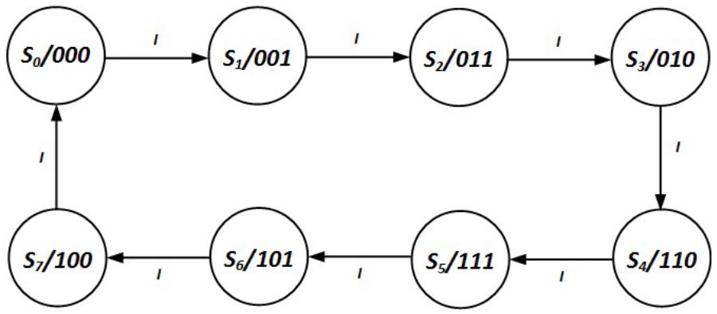

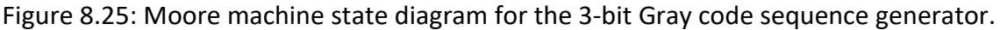

#### Step 3: Create State Table with State Labels

Now we can convert our state diagram into a state table. Although the self-loops are not shown explicitly in the state diagram, they do exist and we must include them in the state table. Following the same procedure we have used throughout this chapter, we develop the state table shown in Figure 8.26.

| PS | I | NS | O2 | O1 | O0 |
|----|---|----|----|----|----|
| S0 | 0 | S0 | 0  | 0  | 0  |
| S0 | 1 | S1 | 0  | 0  | 0  |
| S1 | 0 | S1 | 0  | 0  | 1  |
| S1 | 1 | S2 | 0  | 0  | 1  |
| S2 | 0 | S2 | 0  | 1  | 1  |
| S2 | 1 | S3 | 0  | 1  | 1  |
| S3 | 0 | S3 | 0  | 1  | 0  |
| S3 | 1 | S4 | 0  | 1  | 0  |
| S4 | 0 | S4 | 1  | 1  | 0  |
| S4 | 1 | S5 | 1  | 1  | 0  |
| S5 | 0 | S5 | 1  | 1  | 1  |
| S5 | 1 | S6 | 1  | 1  | 1  |
| S6 | 0 | S6 | 1  | 0  | 1  |
| S6 | 1 | S7 | 1  | 0  | 1  |
| S7 | 0 | S7 | 1  | 0  | 0  |
| S7 | 1 | S0 | 1  | 0  | 0  |

Figure 8.26: State table for the 3-bit Gray code sequence generator.

#### Step 4: Assign Binary Values to States

When using a counter in a finite state machine design, your work will be much easier if you assign sequential values to the states corresponding to the order in which they are accessed. For example, if we assign 000 to *S0*, and we next go to *S1*, we should assign 001 to *S1*. This allows us to simply increment the counter to transition from one state to the next, and counters already have the ability to increment their values built into their designs. Doing this gives us the following state value assignments.

| S0    | S4    |
|-------|-------|
| = 000 | = 100 |
| S1    | S5    |
| = 001 | = 101 |
| S2    | S6    |
| = 010 | = 110 |
| S3    | S7    |
| = 011 | = 111 |

Note that the state values are not the same as the output values, but that's OK. Later in the design process, we will use these values for the present state, along with the value of *I*, to generate the output values *O2*, *O1*, and *O0*. As we'll soon see, we will use (or not use) the counter's increment function to generate the next state.

#### Step 5: Update the State Table with the Binary State Values

This is pretty straightforward. We take the binary values we just developed and substitute them for the state labels in the state table. This gives us the updated state table shown in Figure 8.27.

| PS | PS2 | PS1 | PS0 | I | NS | NS2 | NS1 | NS0 | O2 | O1 | O0 |
|----|-----|-----|-----|---|----|-----|-----|-----|----|----|----|
| S0 | 0   | 0   | 0   | 0 | S0 | 0   | 0   | 0   | 0  | 0  | 0  |
| S0 | 0   | 0   | 0   | 1 | S1 | 0   | 0   | 1   | 0  | 0  | 0  |
| S1 | 0   | 0   | 1   | 0 | S1 | 0   | 0   | 1   | 0  | 0  | 1  |
| S1 | 0   | 0   | 1   | 1 | S2 | 0   | 1   | 0   | 0  | 0  | 1  |
| S2 | 0   | 1   | 0   | 0 | S2 | 0   | 1   | 0   | 0  | 1  | 1  |
| S2 | 0   | 1   | 0   | 1 | S3 | 0   | 1   | 1   | 0  | 1  | 1  |
| S3 | 0   | 1   | 1   | 0 | S3 | 0   | 1   | 1   | 0  | 1  | 0  |
| S3 | 0   | 1   | 1   | 1 | S4 | 1   | 0   | 0   | 0  | 1  | 0  |
| S4 | 1   | 0   | 0   | 0 | S4 | 1   | 0   | 0   | 1  | 1  | 0  |
| S4 | 1   | 0   | 0   | 1 | S5 | 1   | 0   | 1   | 1  | 1  | 0  |
| S5 | 1   | 0   | 1   | 0 | S5 | 1   | 0   | 1   | 1  | 1  | 1  |
| S5 | 1   | 0   | 1   | 1 | S6 | 1   | 1   | 0   | 1  | 1  | 1  |
| S6 | 1   | 1   | 0   | 0 | S6 | 1   | 1   | 0   | 1  | 0  | 1  |
| S6 | 1   | 1   | 0   | 1 | S7 | 1   | 1   | 1   | 1  | 0  | 1  |
| S7 | 1   | 1   | 1   | 0 | S7 | 1   | 1   | 1   | 1  | 0  | 0  |
| S7 | 1   | 1   | 1   | 1 | S0 | 0   | 0   | 0   | 1  | 0  | 0  |

Figure 8.27: State table updated with binary state values.

#### Step 6: Determine Functions for the Next State Bits and Outputs

This is the step where we save ourselves some work by using a counter. If our next state is always either the same as our current state or our current state + 1 (or 000 when our current state is 111), we can use the counter's clock signal to generate our next state. To do this, we'll do something we did in Chapter 7. We AND together the clock signal (*CLK*) and our input signal (*I*) to generate the clock input to the counter, as shown in Figure 8.28. When *I* = 0, the output of the AND gate is always 0, regardless of the value of *CLK*. Since this does not produce a rising edge, the counter does not increment; it keeps its current value. For our system, it stays in its current state. If *I* = 1, however, the output of the AND gate is the same as *CLK*. A rising edge on *CLK* produces a rising edge on the clock input of the counter, causing it to increment its value. For our system, this goes to the next state and outputs the next value in the Gray code sequence.

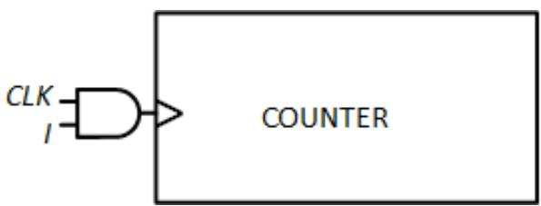

Figure 8.28: Generating the next state using a counter.

Even though we simplified how we generate the next state, we still must develop functions for our outputs. Since we are using a Moore machine, we only need to consider the present state value. To make it a little easier to visualize this, I've taken our state table and removed everything except the present state and output values; this is shown in Figure 8.29. From this table, you can create Karnaugh maps or simply create the functions by just inspecting the table itself. The final functions for *O2*, *O1*, and *O0* are also shown in the figure. I chose to use the XOR function, but any valid Boolean function will suffice.

| PS2 | PS1         | PS0 | O2 | O1 | O0 |  |
|-----|-------------|-----|----|----|----|--|
| 0   | 0           | 0   | 0  | 0  | 0  |  |
| 0   | 0           | 1   | 0  | 0  | 1  |  |
| 0   | 1           | 0   | 0  | 1  | 1  |  |
| 0   | 1           | 1   | 0  | 1  | 0  |  |
| 1   | 0           | 0   | 1  | 1  | 0  |  |
| 1   | 0           | 1   | 1  | 1  | 1  |  |
| 1   | 1           | 0   | 1  | 0  | 1  |  |
| 1   | 1           | 1   | 1  | 0  | 0  |  |
|     |             |     |    |    |    |  |
|     | O2= PS2 |     |    |    |    |  |

*O1* = *PS2* ⊕ *PS1 O0* = *PS1* ⊕ *PS0*

Figure 8.29: Reduced state table and functions for system outputs.

#### [WATCH ANIMATED FIGURE 8.29](https://digitalcommons.njit.edu/dld-animations/105)

#### Step 7: Implement the Functions Using Combinatorial Logic

For this system, we need a total of two 2-input XOR gates to generate our outputs. The complete, final design is shown in Figure 8.30.

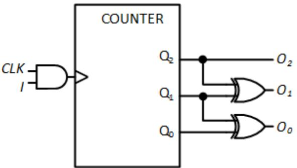

Figure 8.30: Final circuit for the 3-bit Gray code sequence generator using a counter.

#### [WATCH ANIMATED FIGURE 8.30](https://digitalcommons.njit.edu/dld-animations/106)

### 8.4.2 Design Using a Decoder

As we have seen in earlier chapters, decoders can be used in numerous combinatorial logic circuits. They also can be used in sequential circuits. When used in finite state machines, there is one role they play particularly well: producing signals corresponding to individual states.

To show how this works, we'll redesign the 3-bit Gray code sequence generator to use a decoder. Fortunately for us, we can reuse much of the work we just completed for this state machine in the previous subsection. The state behavior (Step 1), state diagram (Step 2), state table with state labels (Step 3), state assignments (Step 4), and state table with binary values (Step 5) are exactly the same as the previous design using a counter. We will also use a counter in this design, and the logic needed to create the clock signal for the counter is the same as that shown in Figure 8.28. The only thing we will change is the logic to generate the output values.

To do this, we take the output of the counter and send it to the inputs of a 3 to 8 decoder, as shown in Figure 8.31. When the counter value is 000, output *O0* of the decoder is asserted. From our state assignments (Step 4), we know that the value 000 is assigned to state *S0*; therefore, decoder output *O0* corresponds to state *S0*. The other decoder outputs correspond to the remaining states as shown in the figure.

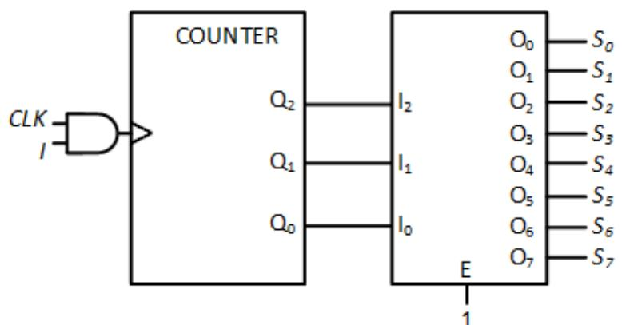

Figure 8.31: Generating state signals using a decoder.

Since we are developing a Moore machine, and outputs are based solely on the present state, we can combine these state signals to generate the system's outputs. We take the state table and remove everything except the present state label and binary output values as shown in Figure 8.32. For each output, we take all the states that set the output to 1 and logically OR them together. Output *O2* = 1 when the state machine is in state *S4*, *S5*, *S6*, and *S7*, so *O2* = *S4* + *S5* + *S6* + *S7*. We do the same for *O1* and *O0*, giving us the functions shown in the figure.

| PS                                                                                                             | O2 | O1 | O0 |  |  |  |
|----------------------------------------------------------------------------------------------------------------|----|----|----|--|--|--|
| S0                                                                                                             | 0  | 0  | 0  |  |  |  |
| S1                                                                                                             | 0  | 0  | 1  |  |  |  |
| S2                                                                                                             | 0  | 1  | 1  |  |  |  |
| S3                                                                                                             | 0  | 1  | 0  |  |  |  |
| S4                                                                                                             | 1  | 1  | 0  |  |  |  |
| S5                                                                                                             | 1  | 1  | 1  |  |  |  |
| S6                                                                                                             | 1  | 0  | 1  |  |  |  |
| S7                                                                                                             | 1  | 0  | 0  |  |  |  |
| O2= S4+ S5+ S6+ S7O1= S2+ S3+ S4+ S5O0= S1+ S2+ S5+ S6 |    |    |    |  |  |  |

Figure 8.32: Reduced state table and functions for system outputs.

Looking back to the earlier chapters, you may realize that the decoder generates minterms based on the state value. Each output function is expressed as a sum of products. Finally, we create combinatorial logic circuits to realize these functions. Each can be created using a single 4-input OR gate. The final design is shown in Figure 8.33.

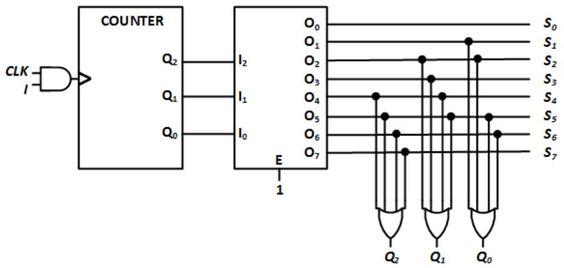

Figure 8.33: Final circuit for the 3-bit Gray code sequence generator using a counter and a decoder.

#### [WATCH ANIMATED FIGURE 8.33](https://digitalcommons.njit.edu/dld-animations/107)

For this machine, using a decoder makes the circuit more complex than the circuit that uses only two XOR gates to generate its outputs. For other circuits, this strategy can reduce the hardware complexity. In either case, it is a viable design methodology that can be employed when appropriate.

### 8.4.3 Design Using a Lookup ROM

In Chapter 5, we introduced the concept of a lookup ROM. Instead of using combinatorial logic to realize a logical or arithmetic function, we store values in a non-volatile memory chip. The function inputs are connected to the address inputs of the ROM, and the data output pins supply the values of the functions for those input values. We can do something similar for sequential circuits.

Looking at our state tables, we can see that there are two types of information we need in order to use a lookup ROM in a finite state machine. As with the earlier lookup ROM circuits, we need to know the values of the inputs. But for sequential circuits, we also need to know which state we are presently in. With all this information, we can determine our next state and the value of all system outputs.

Figure 8.34 shows a generic configuration for a finite state machine using a lookup ROM. The bits of the present state and the inputs are connected to the address inputs of the lookup ROM. At each location in the ROM, data is stored. Some bits specify the next state of the machine for the present state and input values, and other data bits give the values of the system outputs. The next state bits are loaded into a register every clock cycle. They become the new present state and are fed back to the address bits of the ROM.

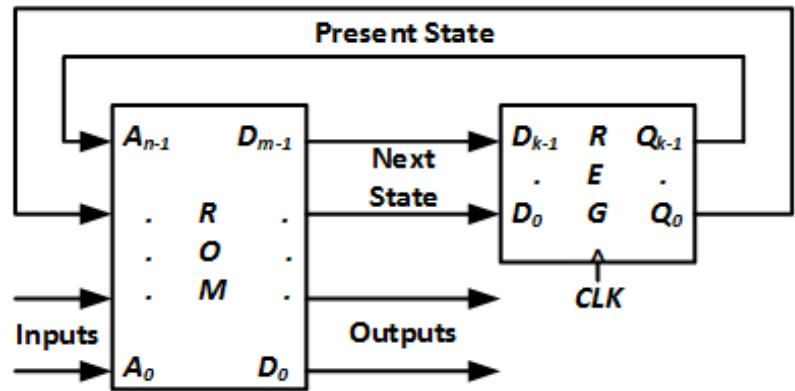

Figure 8.34: Generic state machine constructed using a lookup ROM.

#### [WATCH ANIMATED FIGURE 8.34](https://digitalcommons.njit.edu/dld-animations/108)

To illustrate how this works, let's redesign the 3-bit Gray code sequence generator one final time. This system has the following:

- 3-bit present state (*PS2*, *PS1*, *PS0*)
- 1-bit input (*I*)
- 3-bit next state (*NS2*, *NS1*, *NS0*)
- 3-bit Gray code output (*O2*, *O1*, *O0*)

We will connect *PS2*, *PS1*, *PS0*, and *I* to the address bits of the ROM, and the ROM outputs will supply the values of *NS2*, *NS1*, *NS0*, *O2*, *O1*, and *O0*. The three next state bits are connected to the data inputs of a register. The register stores the present state value and its outputs are fed back to the address inputs of the ROM. Our system needs a ROM with four address pins and six data pins, and has a total size of 24 = 16 locations; its size is 16 × 6. Figure 8.35 shows the circuit for this state machine.

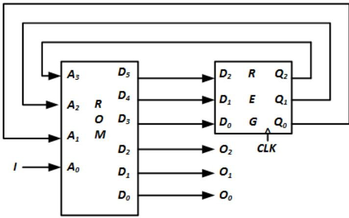

Figure 8.35: Circuit for the 3-bit Gray code sequence generator using a lookup ROM.

To make this circuit function properly, we must determine the data values to be stored in all of the locations in the ROM. We can do this by starting with the state table with binary values, repeated once again in Figure 8.36 (a). Then we see which address pin is connected to each present state bit and input, and we replace these labels in the table with the labels for the corresponding address bits. We do the same for the next state and output bits, this time replacing their labels with those of the corresponding data bits. This gives us the data table shown in Figure 8.36 (b). The left side of the table lists the addresses in the ROM and the right side shows the data stored at each location in the ROM.

| PS2 | PS1 | PS0 | I | NS2 | NS1 | NS0 | O2 | O1 | O0 |
|-----|-----|-----|---|-----|-----|-----|----|----|----|
| 0   | 0   | 0   | 0 | 0   | 0   | 0   | 0  | 0  | 0  |
| 0   | 0   | 0   | 1 | 0   | 0   | 1   | 0  | 0  | 0  |
| 0   | 0   | 1   | 0 | 0   | 0   | 1   | 0  | 0  | 1  |
| 0   | 0   | 1   | 1 | 0   | 1   | 0   | 0  | 0  | 1  |
| 0   | 1   | 0   | 0 | 0   | 1   | 0   | 0  | 1  | 1  |
| 0   | 1   | 0   | 1 | 0   | 1   | 1   | 0  | 1  | 1  |
| 0   | 1   | 1   | 0 | 0   | 1   | 1   | 0  | 1  | 0  |
| 0   | 1   | 1   | 1 | 1   | 0   | 0   | 0  | 1  | 0  |
| 1   | 0   | 0   | 0 | 1   | 0   | 0   | 1  | 1  | 0  |
| 1   | 0   | 0   | 1 | 1   | 0   | 1   | 1  | 1  | 0  |
| 1   | 0   | 1   | 0 | 1   | 0   | 1   | 1  | 1  | 1  |
| 1   | 0   | 1   | 1 | 1   | 1   | 0   | 1  | 1  | 1  |
| 1   | 1   | 0   | 0 | 1   | 1   | 0   | 1  | 0  | 1  |
| 1   | 1   | 0   | 1 | 1   | 1   | 1   | 1  | 0  | 1  |
| 1   | 1   | 1   | 0 | 1   | 1   | 1   | 1  | 0  | 0  |
| 1   | 1   | 1   | 1 | 0   | 0   | 0   | 1  | 0  | 0  |

(a)

| A3 | A2 | A1 | A0 | D5 | D4 | D3 | D2 | D1 | D0 |
|----|----|----|----|----|----|----|----|----|----|
| 0  | 0  | 0  | 0  | 0  | 0  | 0  | 0  | 0  | 0  |
| 0  | 0  | 0  | 1  | 0  | 0  | 1  | 0  | 0  | 0  |
| 0  | 0  | 1  | 0  | 0  | 0  | 1  | 0  | 0  | 1  |
| 0  | 0  | 1  | 1  | 0  | 1  | 0  | 0  | 0  | 1  |
| 0  | 1  | 0  | 0  | 0  | 1  | 0  | 0  | 1  | 1  |
| 0  | 1  | 0  | 1  | 0  | 1  | 1  | 0  | 1  | 1  |
| 0  | 1  | 1  | 0  | 0  | 1  | 1  | 0  | 1  | 0  |
| 0  | 1  | 1  | 1  | 1  | 0  | 0  | 0  | 1  | 0  |
| 1  | 0  | 0  | 0  | 1  | 0  | 0  | 1  | 1  | 0  |
| 1  | 0  | 0  | 1  | 1  | 0  | 1  | 1  | 1  | 0  |
| 1  | 0  | 1  | 0  | 1  | 0  | 1  | 1  | 1  | 1  |
| 1  | 0  | 1  | 1  | 1  | 1  | 0  | 1  | 1  | 1  |
| 1  | 1  | 0  | 0  | 1  | 1  | 0  | 1  | 0  | 1  |
| 1  | 1  | 0  | 1  | 1  | 1  | 1  | 1  | 0  | 1  |
| 1  | 1  | 1  | 0  | 1  | 1  | 1  | 1  | 0  | 0  |
| 1  | 1  | 1  | 1  | 0  | 0  | 0  | 1  | 0  | 0  |

(b)

Figure 8.36: (a) State table for the 3-bit Gray code sequence generator; (b) Data table showing the contents of the lookup ROM.

Figure 8.37 shows an animation of the final circuit. To illustrate how this works, consider the case when the circuit is in state *S3* (011) and input *I* = 1. The 011 state value is stored in the register and fed back to ROM address bits *A3*, *A2*, and *A1*. *I* = 1 is connected to address bit *A0*. Thus, we are accessing address 0111 in the ROM. Now, looking at the data table for the ROM, we see that this location stores the data 100010. The three most significant bits, 100, are output on data pins *D5*, *D4*, and *D3*. These are the next state bits. When we are in state *S3* and *I* = 1, we want to go to state *S4*, which is represented by this value. The three least significant bits, 010, are output on pins *D2*, *D1*, and *D0*. These are the Gray code output bits, and they are the correct output values for our present state, *S3*.

#### [WATCH ANIMATED FIGURE 8.37](https://digitalcommons.njit.edu/dld-animations/109)

Figure 8.37: Animation of the ROM-based 3-bit Gray code sequence generator.

On the rising edge of the clock, the next state value, 100, is loaded into the register and becomes our new present state. If input *I* remains at 1, the ROM address becomes 1001. The ROM then outputs the value 101110, corresponding to next state value 101 (*S5*) and the output value for present state *S4*, 110. This process repeats for every rising edge of the clock.

This overall configuration is used in many applications, including microprocessor design. It is used there for a type of control unit called a microsequencer. That is beyond the scope of this book, but you can find out more information about microsequencers and microprocessor design in my other book (Carpinelli, J. 2001. *Computer Systems Organization and Architecture*. Chapter 7) and numerous other books about computer architecture.

## 8.5 Refining Your Designs

So far in this chapter, we have gone through the entire design process for finite state machines, or so it might appear. Actually, we have gone through the process of creating a first draft of our designs. The designs we have seen so far mostly work properly, but it is often necessary to refine our designs to minimize the hardware needed to implement them and to ensure they work properly under all conditions. In this section, we will look at three design refinements: handling unused states, combining equivalent states, and handling glitches.

### 8.5.1 Unused States

As we have seen in the designs presented so far in this chapter, finite state machines generally use either flip-flops, a register, or a counter to store the binary value representing the present state of the machine. A machine with *n* states requires ⎡lg *n*⎤ bits to store the state value. When *n* is an exact power of 2 (2, 4, 8, 16, etc.), this works out fine. Every value that could possibly be stored represents a valid state. When *n* is not an exact power of 2, however, our state machine will have one or more possible values that do not correspond to valid states. If any of these values ever ends up being stored as the state value, for example, when the system first powers up, our system may fail.

One way to avoid this problem is to create extra states that correspond to these unused values. Each of these states should unconditionally (regardless of the input values) transition to a valid state. Once the machine does this, it should function normally.

Consider again the Mealy machine implementation of the 1s counter that outputs a 1 for only one clock cycle. Its state diagram is repeated in Figure 8.38 (a), and its state table is shown again in Figure 8.38 (b).

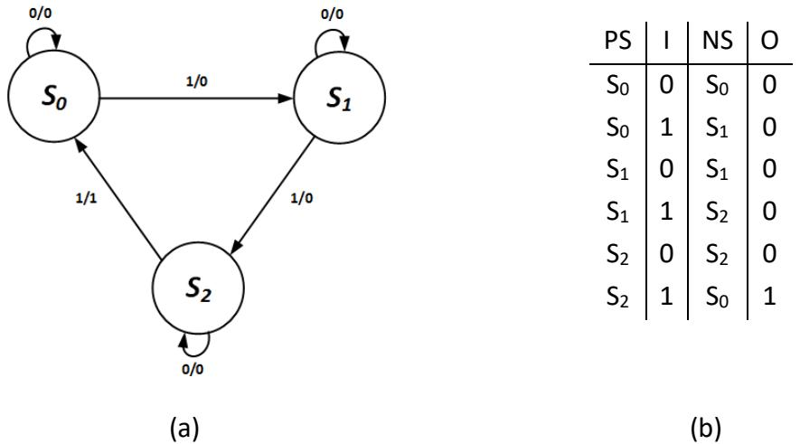

Figure 8.38: Mealy machine (a) state diagram, and (b) state table for the 1s counter.

As we went through this design in Section 8.3.1, we decided to represent states *S0*, *S1*, and *S2* as 00, 01, and 10, respectively. We treated state value 11 as a don't care when developing the functions and digital logic to generate the next state and output values. The functions we developed are

> *NS1* = *PS0I* + *PS1I' NS0* = *PS0I'* + *PS1'PS0'I O* = *PS1I*

If our machine ever ends up in state 11, this becomes

$$\begin{aligned} \mathsf{NS}\_{\mathcal{I}} &= \mathsf{1} \wedge \mathsf{I} + \mathsf{1} \wedge \mathsf{I}' = 1 \\ \mathsf{NS}\_{\mathcal{O}} &= \mathsf{1} \wedge \mathsf{I}' + \mathsf{O} \wedge \mathsf{O} \wedge \mathsf{I} = \mathsf{I}' \\ \mathcal{O} &= \mathsf{1} \wedge \mathsf{I} = \mathsf{I} \end{aligned}$$

In short, if *I* = 0, then we stay in this undefined state, and if *I* = 1 we transition to state *S2* (10) and incorrectly set the output to 1.

To resolve this problem, we can add one extra state to our machine for every unassigned state value. For this machine, there is only one unassigned state value, 11, so we add only one additional state to this machine, which I'll call *S3*. I choose to have the machine go from this state to state *S0*. The revised state diagram is shown in Figure 8.39 (a). Notice the

notation on the arc from *S3* to *S0*. The dash indicates that this transition always occurs, no matter what values the inputs have. I also set the output to 0, as required.

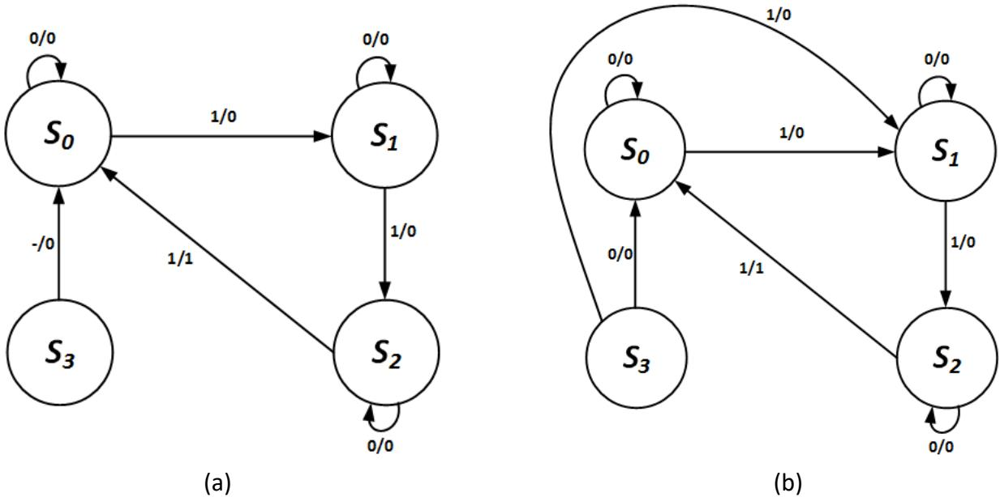

Figure 8.39: Revised state diagram for the Mealy machine implementation of the 1s counter: (a) Excluding the first input bit; (b) Including the first input bit.

This works fine, as long as the first input bit is 0. But what happens if it is 1? In that case, the first 1 takes the machine to state *S0*, the next 1 takes it to *S1*, and the third brings it to *S2*. None of these transitions sets the output to 1. We need a fourth input of 1 to set the output of 1 in this initial sequence. One way to get around this issue is to specify that the state machine ignores the data read in during the first clock cycle. A better way is to modify the state diagram further, so that it goes from *S3* to *S0* when *I* = 0 and from *S3* to *S1* when *I* = 1. This is shown in Figure 8.39 (b).

You can proceed through the rest of the design process as before to complete your design. When I say you can do this, I do mean you. This is left as an exercise for the reader.

There is one other strategy that I want to introduce to address this issue. When power is first applied to the state machine, we can asynchronously clear the flip-flops or other components used to store the state value. This forces the state value to become all zeroes, 00 for this machine. As long as this is a valid state, *S0* in this case, this strategy ensures that the machine goes to a valid state when power is applied.

Early microprocessors, such as Intel's 8085, have dedicated reset pins. The reset pin on the 8085 is active low. A logic 0 causes the processor to clear its registers and reset its state, much like we wish to do for the 1s counter.

To do this, designers set up an R-C circuit, as shown in Figure 8.40 (a). When the circuit initially powers up, there is no charge on the capacitor. All the voltage is dropped across the resistor, and the voltage at the point between the resistor and the capacitor is at 0 V, which a digital circuit would recognize as logic 0. The capacitor charges up and the voltage across the

capacitor increases roughly as shown in the voltage curve in Figure 8.40 (b). The time required to reach the maximum voltage will vary, depending on the values of R and C; after five time constants (R × C), it will have reached over 99% of the source voltage value. For the 8085, and for our circuit, this will be on the order of microseconds. When the capacitor reaches its maximum charge, it drops the entire 5 V and there is no voltage drop across the resistor. The voltage level at the point between the resistor and the capacitor is 5 V, which is recognized as a logic 1. The voltage stays at this level as long as the circuit has power.

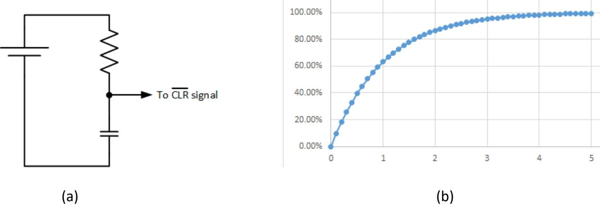

Figure 8.40: (a) R-C circuit to clear state value on power-up; (b) Voltage curve for the signal.

For our state machine, we can connect the point between the resistor and capacitor to the active-low signal of the flip-flops storing the state value. When the circuit first powers up, this signal is logic 0 and the flip-flops set their outputs to 0. Once the capacitor charges, becomes logic 1 and does not affect the flip-flop's value any more.

### 8.5.2 Equivalent States

After creating the initial state diagram and state table for a finite state machine, it might be possible to reduce the number of states. We do this by identifying **equivalent states** and combining them into a single state. Reducing the number of states simplifies the state machine, which can lead to less digital logic needed to implement the machine, as well as other ancillary benefits such as reduced power requirements and faster circuits.

Two states are equivalent if all the conditions for its type of machine are met.

*Moore machines*:

- The states' output values are all exactly the same.
- For every combination of input values, both states transition to the same next state.

*Mealy machines:*

● For every combination of input values, both states transition to the same next state and produce **exactly** the same output values.

As one example, consider the state diagram and state table shown in Figure 8.41. To identify equivalent states, we compare every pair of states individually. Some pairs clearly are not equivalent because they generate different output values for the same input values, such as *S0* and *S2* with *I* = 1.

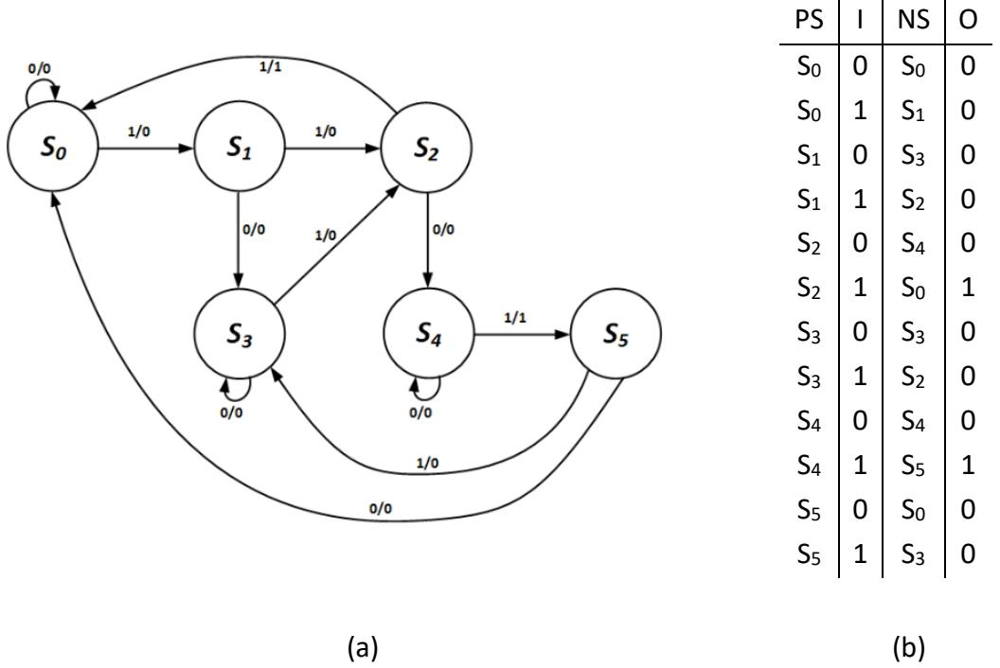

Figure 8.41: Initial state diagram (a) and state table (b) for the example state machine.

For this machine, we find that states *S1* and *S3* are equivalent, so we combine them into a single state. I choose to combine them into a state named *S13*, but any name will do. The arcs coming out of the combined state must be the same as those coming out of *S1* and *S3*, which are identical. All arcs going into *S1* and *S3* must be redirected to the combined state. The state table must be updated to replace the two states. The updated state diagram and state table are shown in Figure 8.42.

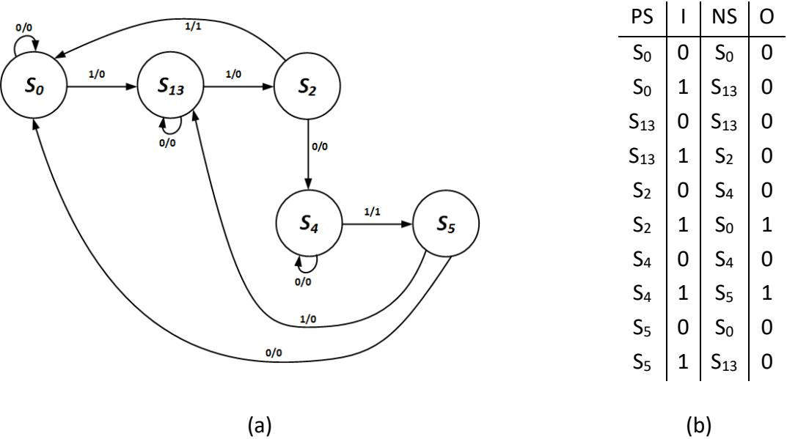

Figure 8.42: State diagram (a) and state table (b) after combining *S1* and *S3*.

Now we repeat this process on the reduced state machine, continuing until all equivalent states have been identified and combined. In this example, we find that states *S0* and *S5* are equivalent, and we combine them into a single state, *S05*. The updated state diagram and state table are shown in Figure 8.43.

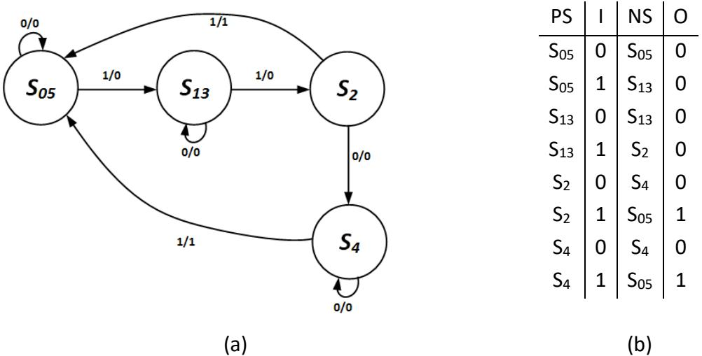

Figure 8.43: State diagram (a) and state table (b) after combining *S0* and *S5*.

With *S0* and *S5* combined, we see that *S2* and *S4* are now equivalent. We combine them to give us the state diagram and state table shown in Figure 8.44. None of these states are equivalent, so this becomes our final design, in this case the Mealy machine for the 1s counter.

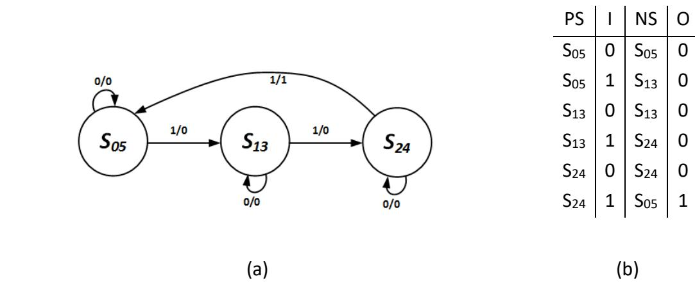

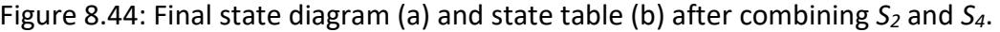

#### [WATCH ANIMATED FIGURE 8.44](https://digitalcommons.njit.edu/dld-animations/110)

To formalize this process, designers can use a mechanism called an **implication table**. We start by creating a table with one row per state for all but one state, and one column per state for all but one different state. By convention, we exclude the first state from the rows and the last state from the columns, but any selections will work. Each entry indicates the equivalence of the states for its row and column. We remove the redundant entries; for example, we keep row *S3* column *S2*, but we remove row *S2* column *S3*. We also remove entries with the same state in the row and column. Doing this for the previous example gives us the empty table shown in Figure 8.45 (a).

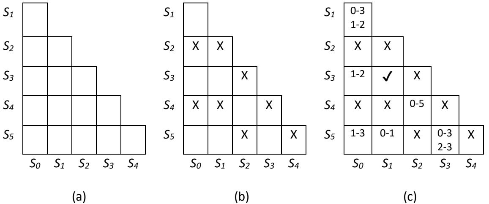

Figure 8.45: Implication table for the state diagram and state table in Figure 8.41: (a) Blank table; (b) Table with states that cannot be equivalent; (c) Completed initial table.

Next, we populate our table. For each cell, we look at the entries in the state table for the states of its row and column. For each input value, we compare the outputs. If they are not the same for any input values, the two states cannot be equivalent. For example, in the state table in Figure 8.41 (b), we see that *S0* outputs a 0 when *I* = 0 and *I* = 1. State *S2*, however, outputs a 0 when *I* = 0, but it outputs a 1 when *I* = 1. Therefore, *S0* and *S2* cannot be equivalent, and we place an X at the location in the table for row *S2* and column *S0*. Figure 8.45 (b) shows the table with states that cannot be equivalent.

The cells that are still blank may or may not be equivalent. Since we know their outputs are the same, we examine their next states. Sometimes we are fortunate to have a pair of states that go to exactly the same next states for all possible input values. In this state machine, *S1* and *S3* both transition to *S3* when *I* = 0 and *S2* when *I* = 1. We denote this using a ✔ in the table.

For all other cells, the two states are equivalent if their next states are equivalent. We don't know if their next states are equivalent, at least not yet, so we simply list the required equivalences in each cell. As an example, consider the uppermost cell in row *S1* column *S0*. If *I* = 0, the next state for *S0* is *S0* and the next state for *S1* is *S3*. This means that these two states can only be equivalent if states *S0* and *S3* are equivalent. Also, if *I* = 1, *S0* transitions to *S1* and *S1* goes to *S2*, so we must also have *S1* and *S2* be equivalent. We place both entries in the cell since we need both to be true for *S0* and *S1* to be equivalent.

Some entries are self-evident and can be excluded. Consider the cell for states *S0* and *S5*. If *I* = 0, both states transition to state *S0*. We don't need to include this in the table; *S0* is always equivalent to itself.

Similarly, we don't need to include an equivalency that refers to the cell itself. For example, when *I* = 0, *S0* goes to the next state *S0*, and *S3* goes to *S3*. We do not need to include this entry in the table. That would be like saying "*S0* and *S3* are equivalent if *S0* and *S3* are equivalent." This is clearly true, and including it in the table doesn't help us find the equivalent states.

Following this process for each cell gives us the completed initial table shown in Figure 8.45 (c).

Next, we update the table based on the pairs of states that we know are or are not equivalent. For example, we know that *S1* and *S2* are not equivalent, so every cell that has this combination as a requirement can be changed to an X. That is, since *S0* and *S3* are equivalent only if *S1* and *S2* are equivalent, and we know that *S1* and *S2* are not equivalent, then *S0* and *S3* are not equivalent.

We also know that *S1* and *S3* are equivalent. Looking at the table, we see that *S0* and *S5* are equivalent only if *S1* and *S3* are equivalent. Since there are no other requirements for *S0* and *S5*, these two states are equivalent, and we change the entry for this cell to ✔. Doing this for each table entry gives us the updated table shown in Figure 8.46.

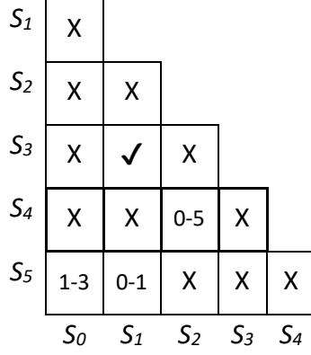

Figure 8.46: Implication table updated for initial entries.

Just as we did in the previous example, we would continue to revise our table to consider the new values created in the previous iteration, repeating until all entries are completed. We only need one more iteration for this example. Since *S0* and *S1* are not equivalent, *S1* and *S5* cannot be equivalent. Also, because *S0* and *S5* are equivalent, *S2* and *S4* must be equivalent. This gives us the completed table shown in Figure 8.47. With this information, we can update the state diagram and state table, and proceed with the rest of the design process.

| S1 | X  |    |    |    |    |
|----|----|----|----|----|----|
| S2 | X  | X  |    |    |    |
| S3 | X  | ✔  | X  |    |    |
| S4 | X  | X  | X  | X  |    |
| S5 | ✔  | X  | X  | X  | X  |
|    | S0 | S1 | S2 | S3 | S4 |

Figure 8.47: Completed implication table.

[WATCH ANIMATED FIGURE 8.47](https://digitalcommons.njit.edu/dld-animations/111)

### 8.5.3 Glitches

Glitches are the bane of digital designers. Often just a momentary change in a signal's value, they can wreak havoc with an otherwise well-designed system. They can be caused by

component timing and propagation delay issues, signal noise, or transmission line effects. They can also be caused by design errors, particularly those that do not take all possibilities into account. We look at one of these errors in this subsection.

To examine this error, we return to the Mealy machine for the 1s counter shown in Figure 8.19. Consider the values for the clock, present state, and input *I* shown in Figure 8.48. Before continuing, take a couple of minutes to sketch out the values of the next state and output *O*, as well as the value of the present state once the rising edge of the clock is reached.

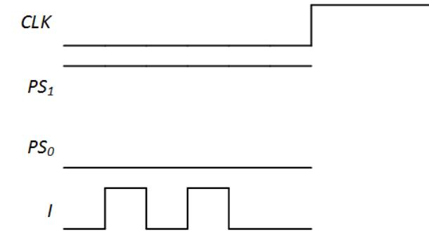

Figure 8.48: Partial timing diagram for the 1s counter.

Hopefully you've completed the timing diagram and found the area of concern. Just so we're all on the same page, we'll work from my completed timing diagram, shown in Figure 8.49. As input *I* changes, both *NS1* and output *O* also change. The change in *NS1* isn't really a problem, since this value is not loaded into its flip-flop until we have a rising edge on the clock signal. The change in *O*, however, is quite visible and is not what we want our system to show to the outside world.

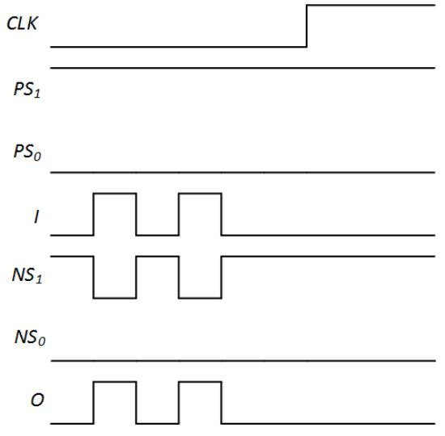

Figure 8.49: Completed timing diagram for the 1s counter.

[WATCH ANIMATED FIGURE 8.49](https://digitalcommons.njit.edu/dld-animations/112)

The problem occurs because the state transition is synchronized to the clock, while the output is not. That is, the present state only changes on the rising edge of the clock, but the output can change at any time. In this timing diagram, a change in the value of input *I* changes the value of output *O* immediately.

The present state does not have this issue because it uses an edge-triggered flip-flop, and we can use this same strategy to get rid of this problem with output *O*. We send the value we generate for *O* to an edge-triggered D flip-flop and connect the same clock signal used for the present state flip-flops to the new flip-flop, as shown in Figure 8.50. Now, *O* will also change only on the rising edge of the clock; it will not be impacted by the glitch on input *I.*

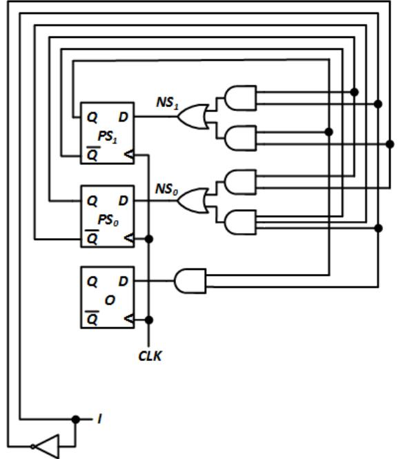

Figure 8.50: Circuit implementing the Mealy machine for the 1s counter with flip-flop for output *O*.

## 8.6 Summary

Sequential digital systems can be modeled as finite state machines. A finite state machine accepts inputs, and outputs values, just like combinatorial circuits. But unlike combinatorial circuits, the outputs depend on both the input values and the present state of the system. The same input values, when accepted while the system is in different states, may produce different output values.

To design a finite state machine, we determine all possible states. For each state we consider all possible input values to ascertain the next state of the machine and the outputs to be generated. We can represent this information using a state diagram and a state table. After assigning a binary value to each state, we can develop the functions and design the digital logic to generate the next state and output values.

There are two primary types of finite state machines that vary in how they generate their outputs. The outputs of the Mealy machine are a function of both the present state and the input values. Moore machines generate their outputs based solely on the present state. Both machines use both the present state and input values to produce the next state.

Most finite state machines use flip-flops or registers to store their present state, though it is also possible to use a counter for some systems. Decoders can be used to generate signals corresponding to individual states. A lookup ROM may be used to generate next state and output values in place of traditional combinatorial logic.

Initial designs can often be refined to correct errors, account for unused state values, and simplify the design and resultant hardware. Designers can create additional states that correspond to all unused binary state values. Should the circuit end up in one of these states, such as when the circuit initially powers up, the designer ensures that the machine transitions to a valid state and then functions properly.

Some machines may have states that are equivalent. These states can be merged into a single state, which simplifies the state machine and ultimately the circuit designed to implement the state machine. Implication tables can be used to identify equivalent states.

Glitches can occur for a number of reasons. When designing a circuit to implement a finite state machine, it is important to ensure that output values change only at the desired time. Using flip-flops to store the output value is one way to address this issue.

This completes Part III of this book. In the next chapter, we introduce asynchronous circuits. Although less frequently used than synchronous circuits, they have valid real-world applications. However, they also have issues that must be taken into account during system design, issues beyond those of synchronous systems. We'll look at all of this next.

## Exercises

- 1. List the states of a 3-bit binary counter.
- 2. List the states of a BCD counter.
- 3. Show the Mealy machine state diagram and state table for a J-K flip-flop.
- 4. Show the Moore machine state diagram and state table for a J-K flip-flop.
- 5. Show the Mealy machine state diagram and state table for a T flip-flop.
- 6. Show the Moore machine state diagram and state table for a T flip-flop.
- 7. Modify the Mealy machine 1s counter state diagram and state table so it outputs a 1 for one clock cycle after counting five inputs equal to 1.
- 8. Complete the design of the Mealy machine with the state diagram and state table you developed in the previous problem.
- 9. Modify the Moore machine 1s counter state diagram and state table so it outputs a 1 for one clock cycle after counting five inputs equal to 1.
- 10. Complete the design of the Moore machine with the state diagram and state table you developed in the previous problem.
- 11. Is the following state table for a Mealy or Moore machine? How can you tell?

| PS | I | NS | O1 | O0 |
|----|---|----|----|----|
| S0 | 0 | S0 | 0  | 0  |
| S0 | 1 | S1 | 1  | 0  |
| S1 | 0 | S1 | 1  | 0  |
| S1 | 1 | S2 | 1  | 1  |
| S2 | 0 | S2 | 1  | 1  |
| S2 | 1 | S3 | 0  | 1  |
| S3 | 0 | S3 | 0  | 1  |
| S3 | 1 | S0 | 0  | 0  |

12. Show the state table and state diagram for the following circuit.

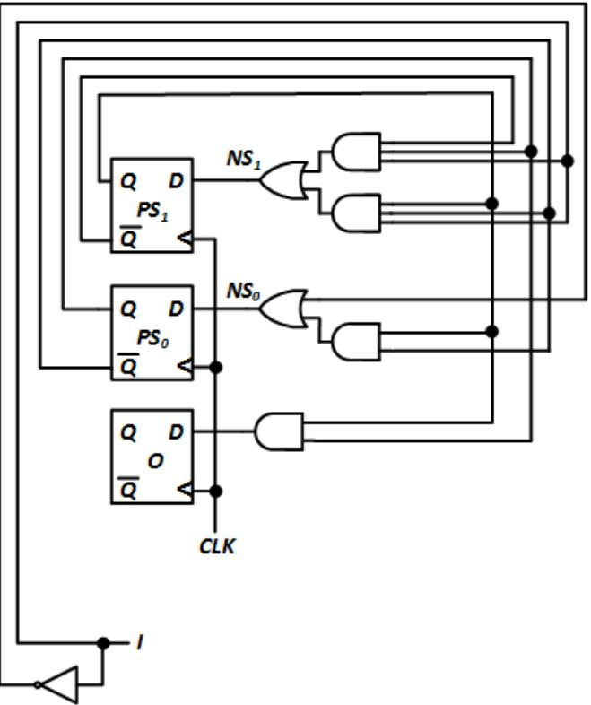

- 13. Design a circuit that reads in a series of individual bits and outputs a 1 whenever the sequence 1101 is read in. The circuit has a single input, *I*, and a single output, *O*. Design your circuit as a Mealy machine.
- 14. Design the circuit in the previous problem as a Moore machine.
- 15. Redesign the Mealy machine for the 1s counter that outputs a 1 for a single clock cycle so that it uses the following state assignments: *S0* = 11; *S1* = 00; *S2* = 01.
- 16. Redesign the Moore machine for the 1s counter that outputs a 1 for a single clock cycle so that it uses the following state assignments: *S0* = 11; *S1* = 00; *S2* = 01; *S3* = 10.
- 17. Redesign the Mealy machine for the original 1s counter using a 2-bit counter with a clear input.
- 18. Redesign the Moore machine for the original 1s counter using a 2-bit counter with a clear input.
- 19. Design a 3-bit Gray code sequence generator as a Mealy machine using a 3-bit binary counter and combinatorial logic.
- 20. Design a 4-bit Gray code sequence generator using a 4-bit binary counter and combinatorial logic.
- 21. Design a 4-bit Gray code sequence generator using a 4-bit binary counter and a 4 to 16 decoder.
- 22. Redesign the 1s counter using a lookup ROM.
- 23. Design a 3-bit Gray code sequence generator as a Moore machine using a lookup ROM.
- 24. Complete the design of the 1s counter in Section 8.5.1 using the state diagram in Figure 8.39 (b).
- 25. Revise the design of the BCD counter to incorporate unused states.
- 26. For the following state diagram (a) and state table (b), simplify this design by combining all equivalent states.

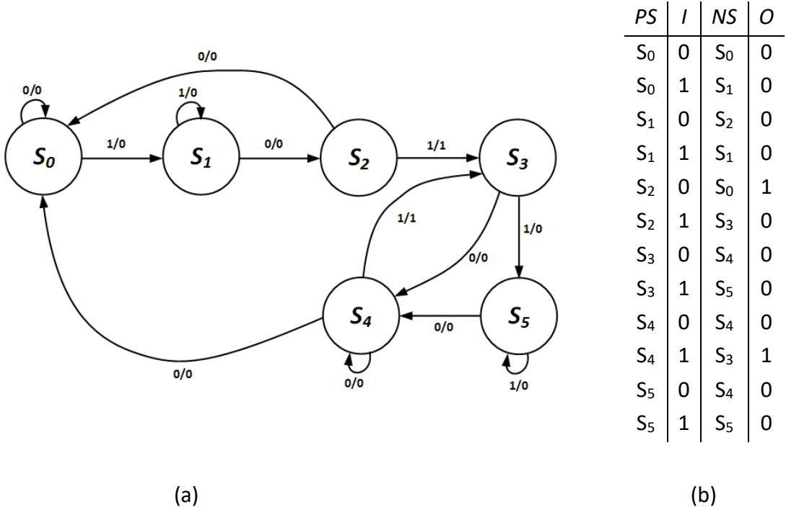
