# Chapter 6: Sequential Components

In Part II of this book, we introduced combinatorial logic. Combinatorial circuits generate outputs that depend *only* on the current values of the inputs. It doesn't matter what value the inputs were set to previously; the circuit only takes the current values into consideration when generating its outputs.

Sequential circuits, in contrast, set their outputs based on both the values of the inputs and its current status, or current state. The same input values could produce different outputs if the circuit is in one state or another.

Consider a classroom filled with students. If the instructor asks the students to add 4 and 5, every student should come up with the same answer, 9. Their calculations depend only on the values of the two inputs (4 and 5) and that we are adding them together. It does not matter what the students were doing before the instructor asked them this question, whether they were adding other numbers, performing a different arithmetic operation on the same or other numbers, or watching online videos.

Now the instructor tells each student to stand up, take one step to the left, and sit back down wherever they are. (For this example, every student has a seat available one step to their left and nobody starts next to a wall on their left.) The students do not end up all sitting in the same seat; if they follow directions properly, each student ends up in a different seat. Each student received the same input (move one step to the left), but because they started in different locations (current states), they ended up in different places.

As you've probably guessed, adding 4+5 is analogous to a combinatorial circuit, whereas stepping to the left is more like a sequential circuit.

In order to access its current state, a sequential circuit must store this information somewhere. We need digital components that can hold that information and make it available to us as needed. That is largely the focus of this chapter.

The rest of this chapter is organized as follows. First, we examine basic models for sequential circuits. We introduce synchronous circuits, which use a periodic signal called a **clock** to synchronize the flow of data through the circuit. The rest of the chapter introduces two classes of circuits that can store data: latches and flip-flops. We will look at several types of each one, both their internal designs and external functions. We will expand on this in future chapters to create more complex components and more advanced sequential circuits.

## 6.1 Modeling Sequential Circuits

As already noted, combinatorial circuits generate their outputs based solely on the values of their inputs. Figure 6.1 (a) shows a very generic representation of a combinatorial circuit. The circuit has inputs and combinatorial components, and it generates outputs. The inputs and outputs are set to binary values. The combinatorial logic block may consist of fundamental logic gates, more complex components, and other digital logic. The combinatorial block has one restriction: it cannot contain any components that store information. When the values of the inputs change, the outputs and the values within the combinatorial logic block change to give the correct output for these input values. It doesn't matter what outputs and values within the

logic block were generated previously. The new values depend only on the current input values. Specific input values always produce the same output values.

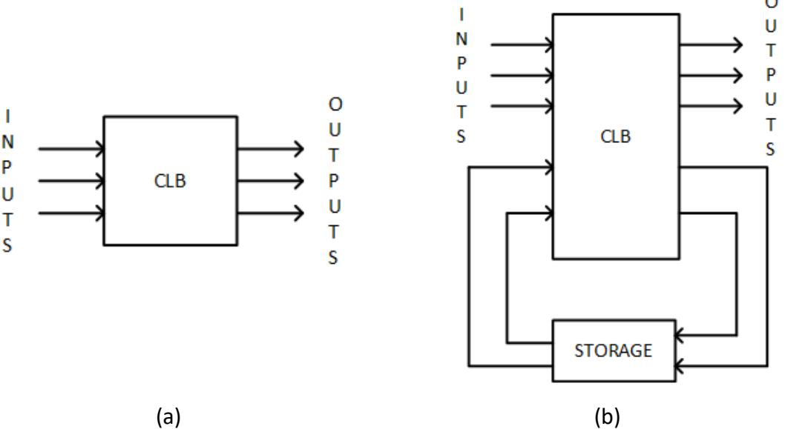

Figure 6.1: Generic models: (a) Combinatorial circuit; (b) Sequential circuit.

For sequential circuits, outputs are based on both the current input values and the previous state of the circuit. If a circuit inputs the exact same values at two different times, and the circuit is in a different state at these two times, it may produce different output values. In order to do this, a sequential circuit must have a way to store the current state and to use that state, along with the input values, to generate both the output values of the current state and the value of the new state. Figure 6.1 (b) shows the very generic representation of a sequential circuit.

Everything in this circuit is similar to the combinatorial logic circuit except for the block labeled STORAGE in Figure 6.1 (b). So far, we haven't seen any circuits that can lock in and store data. There are two main classes of circuits we use for this purpose: **latches** and **flip-flops**. We'll look at these in much greater detail in the remaining sections of this chapter. For now, it is enough to know that there is a way to store the state.

This leads us to an obvious question – what is a state? – which we address in the following subsection.

### 6.1.1 What Is a State?

In its simplest form, a state is just a way to represent the current condition of a circuit. Each condition is its own state. We generate the outputs based on the values of the inputs and the current state, and we also generate the new value of the current state (often called the **next state**) based on these same values. We can model any sequential circuit as a **finite state**

**machine**. Finite state machines is a large enough topic to warrant its own chapter, Chapter 8 in this book.

To illustrate how this works on a generic level, consider the following specification. We want to design a circuit that receives a single data input. When that input has been equal to 1 for a total of three times, we want to set a single output to 1 and start the whole process again. To do this, we need to check the input to see if it is 1. We also need to keep track of how many 1s we have input so far, otherwise we won't know when to set the output to 1. This is why we need the states in our sequential circuit.

Our system needs three states:

- Zero values of 1 have been input so far.
- One value of 1 has been input so far.
- Two values of 1 have been input so far.

Now let's look at the behavior of our system for each individual state. We'll start with the first state, *Zero values of 1 have been input so far*. If we input a 0, we still have zero 1s input, and we have to do two things. We need to set our output to 0 because we have not read in three 1s. Also, we still have zero 1s input, so we need to remain in this state. If we input a value of 1, we still need to output a 0 since we still have not read in three 1s. However, since we have now input 1 value of 1, we need to change to the state *One value of 1 has been input so far*.

The second state works in a similar way. If the input is 0, we output a 0 and remain in the same state. If it is 1, we still output a 0 (because we now have read in two values of 1, not three) and go to the state *Two values of 1 have been input so far*.

The final state acts like the others when the input is 0. It stays in the same state and sets the output to be 0. If the input is 1, however, our circuit behaves differently. This is our third input value of 1, so we have to set our output to 1. We also need to go to a different state. There is no state called *Three values of 1 have been input so far*. Instead, we do what we said we would do: set the output to 1 and start the whole process again. We do this by going back to the state *Zero values of 1 have been input so far*.

Figure 6.2 shows the generic diagram for this circuit. The animation shows how the state and output change for the input sequence 0, 1, 0, 1, 0, 1.

We're not done yet. If I have the input set to 0, how do I know if that is one 0, two 0s, or just how many 0s it is? The same question applies to the input value of 1.

There is another signal in this circuit labeled CLOCK. We use this signal to tell our circuit when to check the input value. This signal might be used when generating the output value, but it is mainly used to determine when to go from one state to the next. For that reason, it is also passed directly to the portion of the circuit that stores the state. This leads us to our next question: What is a clock?

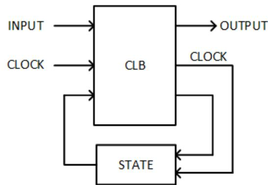

Figure 6.2: Block diagram of a circuit that outputs 1 when three 1's have been input.

### 6.1.2 What Is a Clock?

There are many types of clocks. One that I built a number of years ago is shown in Figure 6.3. In terms of sequential circuits, however, this has nothing to do with the CLOCK signal. This is not our CLOCK.

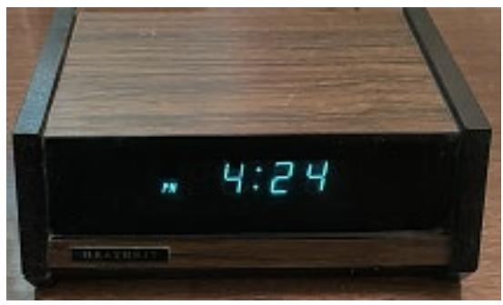

Figure 6.3: Not our clock.

In digital circuits, a clock is a signal that alternates between high and low, or 1 and 0. In order to minimize the time spent by the signal in between the voltage levels for logic 0 and logic 1, it usually is implemented as a square wave, as shown in Figure 6.4 (a). This is an idealized square wave, which instantaneously changes from 0 to 1 and from 1 to 0. In practice, it does change extremely quickly, but not instantaneously. It does have a small rise and fall time, as shown in Figure 6.4 (b).

For most circuits, the rise and fall times are insignificant. This can be of concern, however, for circuits that run at a very high **frequency**, that is, a large number of clock cycles per second. Modern microprocessors, for example, may have clock frequencies over 3GHz (3 billion clock cycles per second). At this frequency, light travels about 4 inches, or 10 centimeters, in one clock cycle, which has a **period** (the time for a single clock cycle) of 0.33ns. At this frequency, the rise or fall time is a greater percentage of the clock period.

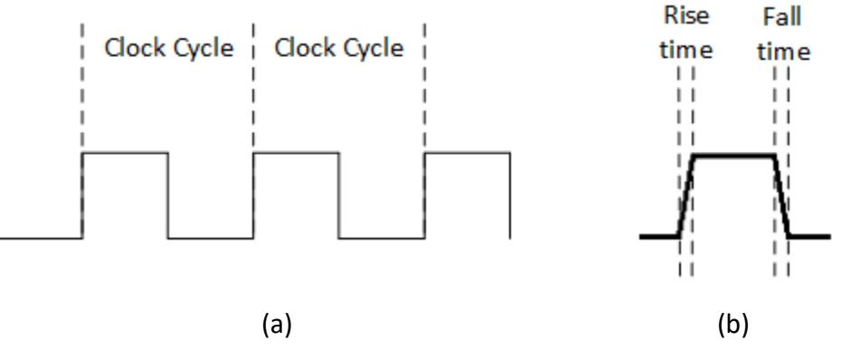

Figure 6.4: Our clock: (a) Idealized with clock cycles shown; (b) Rise and fall times.

As we will see in the following two sections, latches and flip-flops will use the clock signal either as an enable signal to set the new state value when it is at the desired level, or they will make use of its edges to set the new level.

Most sequential circuits are synchronous. They are easier to design and debug when a clock signal can be used to synchronize changes in states within the circuit. As clock frequencies increase, the circuits can do things more quickly, almost as if they aren't even making use of the clock. However, there is another type of sequential circuit that does not use a clock. We'll look at that next.

### 6.1.3 Asynchronous Sequential Circuits

Whereas synchronous sequential circuits use a clock to synchronize the changing of their states, asynchronous sequential circuits do not use a clock signal. Instead, they typically incorporate timing delays, or unclocked latches, in place of the storage found in synchronous sequential circuits. Figure 6.5 shows the basic configuration of an asynchronous sequential circuit.

Other than replacing storage with time delays, this model is similar to that used for synchronous sequential circuits. The circuit inputs values to a combinatorial logic block that generates outputs and the next state of the circuit. This next state value is fed back to the combinatorial logic block, after a delay, to use as it generates these values. In essence, the asynchronous sequential circuit is just a combinatorial circuit with feedback and delays.

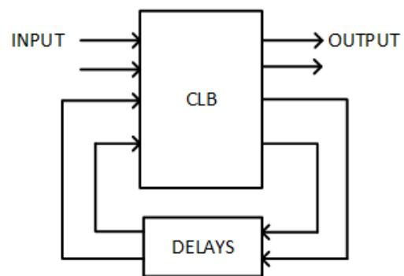

Figure 6.5: Generic model for an asynchronous sequential circuit.

Asynchronous sequential circuits are more difficult to design than synchronous sequential circuits. Being able to synchronize when values change in a circuit is a great advantage that asynchronous sequential circuits, by their nature, simply do not have. In this chapter and in Chapter 8, we will focus on synchronous sequential circuits. However, when we design the latches and flip-flops used in synchronous sequential circuits, we will see that they are actually combinatorial circuits with feedback, much like asynchronous sequential circuits.

## 6.2 Latches

So far we have alluded to the fact that we need to be able to store the current state of a sequential circuit. So, what are we storing and how do we store it? The answer to the first part of this question is "a binary value." When we want to store the current state of the circuit, we list all the possible states and assign a binary value to each state. The number of bits in these binary values must be the same for all states. From our discussion of binary numbers at the beginning of this book, we know that an *n*-bit number can have 2*n* unique values. We will choose the smallest value possible for *n* such that:

$$\begin{array}{l} \#\mathit{of}\,\mathit{states} \leq \mathfrak{2}^n,\ \mathsf{op}\\ n = \left\lceil \lg(\#\mathit{of}\,\mathit{states}) \right\rceil \end{array}$$

where ⎡ ⎤ represents the ceiling function, the smallest integer value that is greater than or equal to the number it encloses, and lg is the base 2 logarithm function.

In the example in the previous section, our circuit has three states, based on the number of 1s read in so far. The smallest possible value of *n* for this circuit is 2. One possible assignment of 2-bit values to states is shown in Figure 6.6.

| State Value | State                                     |
|-------------|-------------------------------------------|
| 0 0         | Zero values of 1 have been read in so far |
| 0 1         | One value of 1 has been read in so far    |
| 1 0         | Two values of 1 have been read in so far  |

Figure 6.6: One possible assignment of state values to states.

This brings us to the second question: how to store these values. In this section we look at latches. A latch consists of cross-coupled gates that settle into a stable state. Much as the latch on a door keeps the door in place, a latch keeps its outputs at one value, our stable state. In the next subsection, we will look at the S-R latch, and in the following subsection we introduce the D latch.

### 6.2.1 S-R Latch

The S-R (Set-Reset) latch was the first latch developed for digital circuits. It consists entirely of combinatorial logic, but is connected in such a way that the circuit locks in a binary value, 1 or 0, based on the values of its inputs. Figure 6.7 (a) shows one way to construct the S-R latch using NOR gates. Notice that the output of each NOR gate is fed back to supply one of the inputs of the other NOR gate. This is the cross-coupling mentioned earlier; this is what allows the circuit to lock in a value.

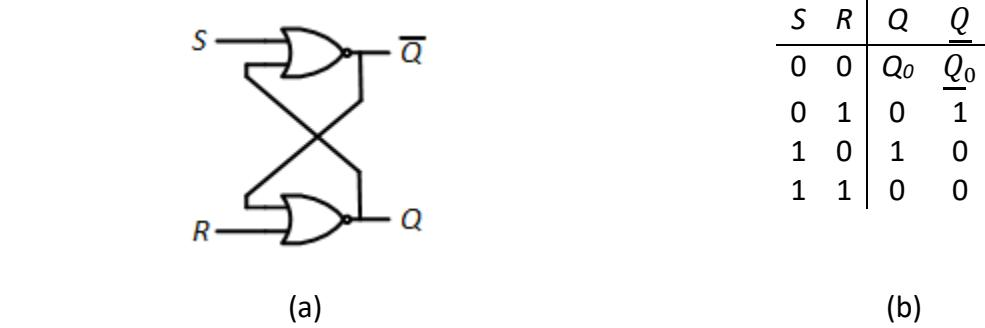

The truth table for this circuit is shown in Figure 6.7 (b). When *S* = 1 and *R* = 0, we set output *Q* to 1 and the complemented output, to 0. When *S* = 0 and *R* = 1, we do the opposite: *Q* = 0 and = 1. When *S* = 1 and *R* = 1, both NOR gates output a 0. This is an invalid value because it sets *Q* = , which should never be the case. This combination of input values is not allowed for the S-R latch. The final input values, *S* = 0 and *R* = 0, do something different. This

keeps whatever value is already stored unchanged. If *Q* = 0, *SR* = 00 keeps *Q* = 0. If *Q* = 1, they keep *Q* = 1.

The animation for this figure shows how the internal values change as we go through the following sequence of values for *S* and *R*: 00 → 01 → 00 → 10 → 00 → 11. In this animation, we start by setting *SR* = 01. Since *R* = 1, the output of the lower NOR gate will be 0, no matter what its other input is. The upper NOR gate has *S* = 0 as its first input and the output of the second NOR gate, also 0, as its second input. With both inputs equal to 0, its output is 1. This is fed back as an input to the second NOR gate, but does not change its value. The circuit is in a stable state with *Q* = 0 and = 1.

Next, we set *SR* = 00. Since *Q* = 0, both inputs to the upper NOR gate are still 0, and it continues to output a 1. This value is fed back into the lower NOR gate; *R* = 0 is also an input to that gate. With input values of 1 and 0, the NOR gate outputs a 0. The circuit is once again stable, with *Q* = 0 and = 1.

Then we set *S* = 1 and *R* = 0. Since *S* = 1, the upper NOR gate outputs a 0 regardless of the value of the other input. This 0, and *R* = 0, are input to the lower NOR gate, which outputs a 1. Feeding this back into the first NOR gate does not change its output. In its stable state, the circuit has *Q* = 1 and = 0.

Now we set *SR* = 00 again. The upper NOR gate has input values *S* = 0 and *Q* = 1, and sets its output to 0. The lower gate inputs = 0 and *R* = 0, setting its output to 1. The circuit is stable with *Q*= 1 and = 0. Just as it did earlier, the circuit retains its output values when *SR* = 00.

Finally, we set *SR* = 11. Both NOR gates have an input equal to 1, so both gates set their outputs to 0, giving us the invalid outputs *Q* = 0 and = 0.

There is another configuration for the S-R latch that uses NAND gates. It is shown in Figure 6.8 (a). Notice that the *S* and *R* inputs are inverted; this is necessary for this circuit to function in the same way as the cross-coupled NOR circuit. Its truth table is shown in Figure 6.8 (b). Notice that there is one difference between this truth table and the truth table for the previous circuit. When we have invalid inputs *SR* = 11, this circuits sets *Q* = 1 and = 1 instead of setting both to 0.

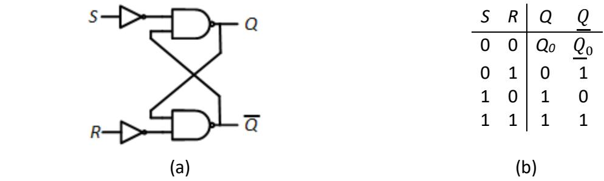

Figure 6.8: S-R Latch: (a) Internal configuration using NAND gates; (b) Truth table.

The animation for this figure takes us through the same input sequence as before: *SR* = 00 → 01 → 00 → 10 → 00 → 11.

An alternative design dispenses with the two NOT gates and leaves it to the designer to invert *S* and *R* before inputting them to the circuit. This is sometimes called the - latch and is shown in Figure 6.9 (a). Its truth table, with values for , , *S*, and *R*, is shown in Figure 6.9 (b). The animation shows the internal signals as it goes through the same sequence of values for *S* and *R*, this time shown as = 11 → 10 → 11 → 01 → 11 → 00.

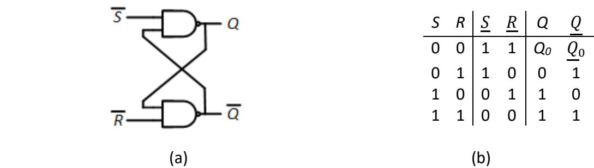

Figure 6.9: - Latch: (a) Internal configuration using NAND gates; (b) Truth table.

### 6.2.2 S-R Latch with Enable

In Chapter 4, we introduced several more complex components. Some of these components have an enable input. When the enable signal is asserted, usually by setting its value to 1, the component behaves normally, as it is designed to do. When the enable signal is not asserted, however, it does not perform its intended function. As an example, consider the 2 to 4 decoder shown in Section 4.1.2, Figure 4.5. When its enable signal is 0, all the outputs are set to 0, no matter what values the select inputs *I1* and *I0* have.

We can also add an enable signal to an *S*-*R* latch. When the enable signal is 1, the *S*-*R* latch functions just as described in the previous subsection. However, when it is 0, we do not change the outputs regardless of the values of *S* and *R*. Here, we will call it an enable signal. *As we use the S-R latch to create flip-flops in the next section, this signal will morph into a clock.*

We can incorporate this enable signal into the *S*-*R* latch fairly easily by taking advantage of the fact that setting *SR* = 00 does not change the output values. This is exactly what we want to happen when our enable signal is 0. We keep the cross-coupled design of the *S*-*R* latch the same, and combine the enable with the *S* and *R* inputs to create the final *SR* inputs to the latch. This is shown in Figure 6.10.

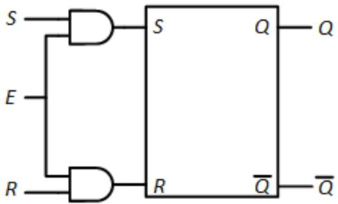

Figure 6.10: S-R Latch with Enable Signal.

The way this works is fairly straightforward. When *E* = 1, *S* ^ 1 = *S*, *R* ^ 1 = *R*, and the original *S* and *R* values are input to the S-R latch, it functions as it normally would. When *E* = 0, *S* ^ 0 =0, *R* ^ 0 =0, then the circuit inputs 00 to the S-R latch which keeps its outputs unchanged.

This methodology, conditioning the inputs and using the rest of the circuit without changes, is used regularly in digital design. The unmodified portion of the circuit, the original S-R latch in this case, may be available only as a component or integrated circuit chip that cannot be modified. There are also other advantages, including that the unmodified portion has already been verified as correct, which simplifies the design cycle. In my other book, we use this methodology to design the arithmetic and logic unit (ALU) portion of a microprocessor.

### 6.2.3 D Latch

In many instances, we don't want to deal with the latch inputs. We have a value that we want to store in the latch, and we don't want to spend time and construct circuitry to create the latch inputs to store that value. We want to say, "Here's the value; store it in the latch." This led to the creation of the D (Delay) latch. Its truth table is shown in Figure 6.11 (a).

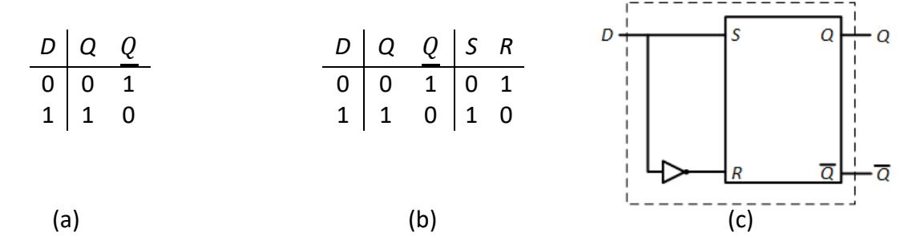

Figure 6.11: D Latch: (a) Truth table; (b) Excitation table with *S* and *R* input values; (c) Circuit design.

As was the case with the S-R latch, with enable, we design the D latch by starting with an S-R latch and conditioning its inputs. Looking at the truth table, we see that we want *Q* to be the same as input *D*. To do this, we need to determine the values of *S* and *R* that will accomplish this. In Figure 6.11 (b), we expand the truth table to show the *S* and *R* values we need to produce. This is called an **excitation table**. An excitation table is very much like a truth table. Instead of showing outputs, however, it shows the inputs to be generated for the given values of the inputs and the current state/outputs.

From this table, we can easily see that we must set *S* = *D* and *R* = *D'*. We can connect input *D* directly to *S* of the *S*-*R* latch, and we pass *D* through a NOT gate to generate *D'*, which we connect to input *R*. This circuit is shown in Figure 6.11 (c). Everything inside the dashed box comprises the D latch.

Looking at the behavior of this circuit, you might argue that it is fairly useless. You may be storing some value, but as soon as the value of *D* changes, the latched value changes too. If this is your argument, well, you're quite correct. In this circuit, we always output the same value that we input.

For this reason, D latches always have an enable input, which functions much like the enable signal we added to the S-R latch. When the enable input is 1, we set output *Q* to the value of input *D* (and output to its complement). When the enable is 0, *Q* retains its previous value, no matter what value input *D* has. The excitation table for the D latch with enable is shown in Figure 6.12 (a), including the values of *S* and *R*.

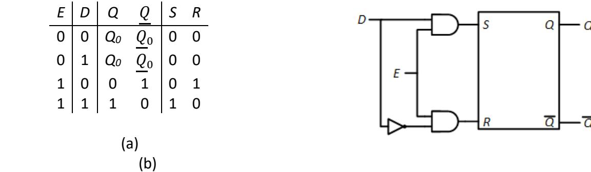

Figure 6.12: D latch: (a) Excitation table; (b) Circuit design.

To implement this, we'll do exactly what we did for the S-R latch with enable. We take the *S* and *R* inputs for the latch without enable and logically AND them with the enable signal. When the enable input is 1, *S* = *D* ^ 1 = *D* and *R* = *D'* ^ 1 = *D'*. When the enable input is 0, *S* = *D* ^ 0 = 0 and *R* = *D'* ^ 0 = 0, and the output is unchanged. The circuit to implement the D latch with enable is shown in Figure 6.12 (b).

## 6.3 Flip-Flops

For the D latch with an enable signal presented in the previous subsection, what happens if the value on the *D* input changes while the enable signal is high? For example, consider the values shown for the *D* input and the enable signal shown in Figure 6.13. What would the waveform for output Q look like? Think this through for a minute before proceeding.

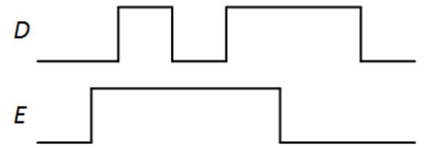

Figure 6.13: D latch input values with *D* changing while *E* = 1.

Hopefully you did take some time to think this through, and to look back at the truth table in Figure 6.12 (a). When *E* = 1, we set *Q* to whatever value is being input on *D*. As *D* goes from 0 to 1, back to 0, and then back to 1 again, the *Q* output does the same because *E* = 1. When *E* goes to 0, the circuit locks in the value of *Q* and does not change it, even when *D* changes from 1 to 0. The timing diagram, with output values, is shown in Figure 6.14. The animation for this figure shows how the inputs, *S* and *R* values, and outputs change over time.

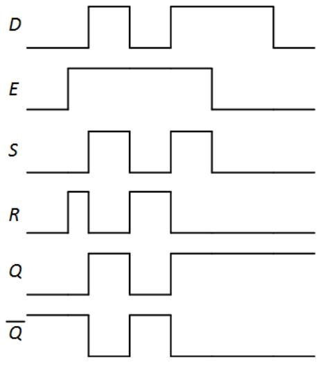

Figure 6.14: D latch input, output, and internal signal values.

For many designs, this behavior is undesirable. We want to update our output values and lock them in. When we use a clock to enable our latch, we often want to update these values only once in each clock cycle. This is the reason why most sequential circuits do not use latches.

Instead, engineers designed another type of device to store data values and only update them once per clock cycle, usually on the rising or falling edge of the clock. (The **rising edge**

occurs when the clock changes from 0 to 1, and the **falling edge** is when the clock changes from 1 to 0.) These are called **flip-flops**, and that is what we'll be discussing in this section. There are several types of flip-flops, all of which incorporate latches in their design. This is why I spent time writing a section on a component you won't use; we do use it to design the component you actually will use.

The remainder of this section introduces three flip-flops: the D, J-K, and T flip-flops. We will see how they are constructed from the D and S-R latches introduced in the previous section, their overall functions, and how some of them are extended to include asynchronous signals to preset (set *Q* = 1) and clear (set *Q* = 0) them, regardless of the value of the clock.

### 6.3.1 D Flip-Flop

The D flip-flop is functionally similar to the D latch. The data value on the *D* input becomes the value placed on the *Q* output. Unlike the D latch, however, the value is only loaded into the D flip-flop on one of the clock edges. Throughout this section, we will design flip-flops so they load in data on the rising edge of the clock. Figure 6.15 (a) shows the truth table for the D flipflop. The symbol ↑ indicates the rising edge of the clock.

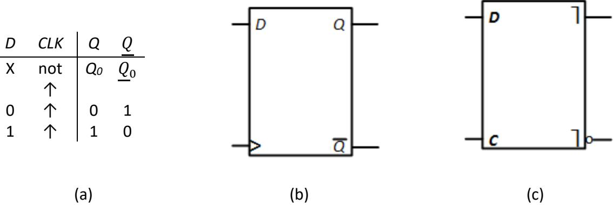

Figure 6.15: Positive edge-triggered D flip-flop: (a) Truth table; (b) Logic symbol (edgetriggered); (c) Logic symbol (pulse triggered).

The standard symbols to represent the D flip-flop are shown in Figures 6.15 (b) and (c). Note that there are two types of flip-flops. The edge-triggered flip-flops use only one edge of the clock internally; the > symbol indicates the clock input and that this is a positive edgetriggered clock. A pulse-triggered flip-flop uses both edges of the clock. From the outside, we see only one edge changing data, but internally there are operations occurring on both edges. The ⎤ symbol on the *Q* and outputs indicate that the flip-flop is pulse triggered.

#### 6.3.1.1 Leader-Follower Design

Given all of this, let's look at the internal design of the D flip-flop. The most straightforward design consists of two D latches in what has been called a **master-slave** configuration, but in this book will be referred to as a **leader-follower** configuration. This design is shown in Figure 6.16 (a). It is pulse-triggered, as each edge of the clock enables one of the latches. It works as follows.

- 1. When *CLK* = 0, the first D latch is enabled and it continuously sets its output *Q* to whatever value *D* has. It passes its *Q* value to the *D* input of the second D latch, but that latch is not enabled, so it ignores that input and keeps its previous value.
- 2. On the rising edge of the clock, the first D latch is no longer enabled. Whatever value it has at that time is locked in and is held as the *D* input to the second latch. Any changes in the *D* input of the first latch are ignored. At the same time, the second latch is now enabled. It continually passes the value on its *D* input to its *Q* output as long as *CLK* = 1. This input value is the value that was just locked into the first latch. Since that value does not change, neither does its output.
- 3. The clock eventually hits its falling edge, transitioning from 1 to 0. This disables the second latch, locking in its value. The first latch is now enabled, and we're back at the first step in this process.

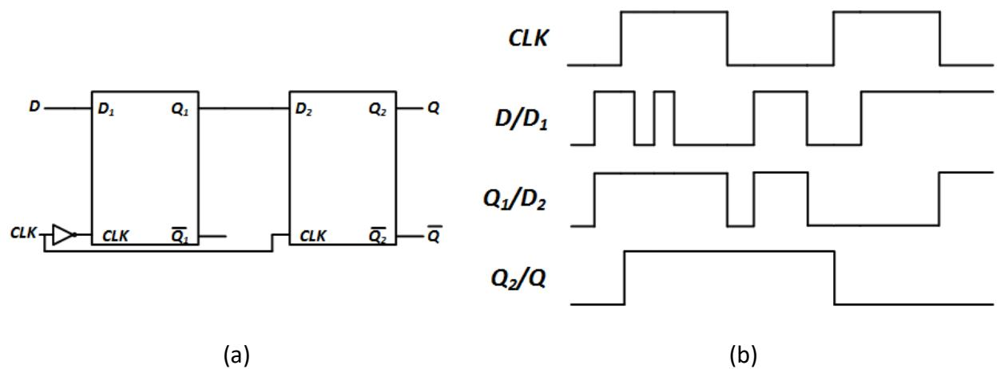

Figure 6.16: D flip-flop: (a) Leader-follower design; (b) Signal values for sample input sequence.

- Figure 6.16 (b) shows a timing diagram for a sample *D* and *CLK* input sequence. This sequence is shown in the animation for this figure and briefly described below.
	- 1. Initially, *CLK* = 0. The first D latch is enabled. The value in its *D* input, *D1*, is passed through to its output, *Q1*. The second latch is disabled; its output remains unchanged.
	- 2. The clock changes from 0 to 1 on its rising edge. The first latch is disabled and locks in its value. It does not change when its *D* input changes as long as *CLK* = 1. The second latch is now enabled. It passes the value on its *D* input, *D2*, to its output, *Q2*, and to the *Q* output of the flip-flop. Since its input is connected to the output of the first *D* latch, which does not change, its output stays at 1 the entire time that *CLK* = 1.
	- 3. The clock goes back to 0. The second latch is disabled and locks in its output. The first latch is now enabled and passes the value on its input *D1* to its output *Q1*.
- 4. On the next rising edge of *CLK*, *D* = 0, and this value is locked into the first latch; *Q1* = 0. The second latch reads in this value and passes it through to its *Q* output.
- 5. On the final falling edge, the second latch is disabled and locks in its output value of 0. The first latch is enabled and passes the *D* input to its *Q* output.

#### 6.3.1.2 Preset and Clear

There is another design commonly used for edge-triggered D flip-flops. It uses three latches, a total of six gates. This design, however, includes two additional inputs, (preset) and (clear). When =0, it sets output *Q* to 1, regardless of the state of the *D* input. Similarly, =0 sets *Q* to 0. Unlike the *D* input, which is sent to the output on the rising edge of the clock, and are asynchronous. When either value goes to 0, the output is changed immediately; it does not have to wait for the rising edge of the clock. The truth table for this flip-flop is shown in Figure 6.17.

| D | CLK | 𝑃𝑃𝑃𝑃 | 𝐶𝐶𝐶𝐶 | Q  | 𝑄𝑄  |
|---|-----|----------|------|----|-----|
| X | X   | 0        | 1    | 1  | 0   |
| X | X   | 1        | 0    | 0  | 1   |
| 0 | ↑   | 1        | 1    | 0  | 1   |
| 1 | ↑   | 1        | 1    | 1  | 0   |
| X | not | 1        | 1    | Q0 | 𝑄𝑄0 |
|   | ↑   |          |      |    |     |

Figure 6.17: Truth table for the edge-triggered D flip-flop with preset and clear. and may not both be set to 0 at the same time.

The complete circuit used to design the 7474 integrated circuit chip that has two edgetriggered D flip-flops is shown in Figure 6.18. Note what happens to the *Q* output when = 0. This value is input directly to the NAND gate that generates *Q*. Once it is set to 0, the output of that gate becomes 1, regardless of the values of *D* and the clock. In a similar way, setting = 0 causes to become 1 immediately.

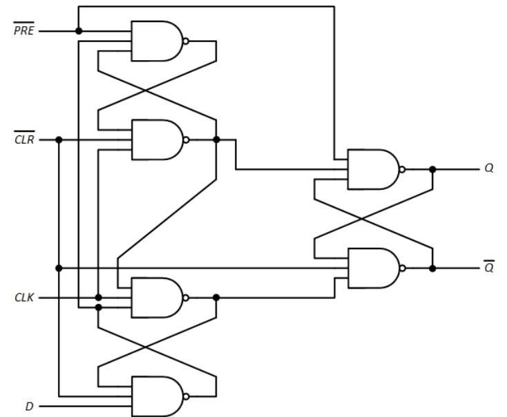

Figure 6.18: Internal design of the positive edge-triggered D flip-flop with preset and clear.

### 6.3.2 J-K Flip-Flop

The S-R latch would be a good candidate to extend and create an S-R flip-flop, except for one thing – the invalid *SR* = 11 input values. To address this, digital design engineers developed another type of flip-flop that defines a function to be performed with these input values; it inverts the output values. To avoid confusion with the S-R latch, this is called the J-K flip-flop. Here, *J* replaces *S* and *K* replaces *R*. Its truth table and logic symbols are shown in Figure 6.19.

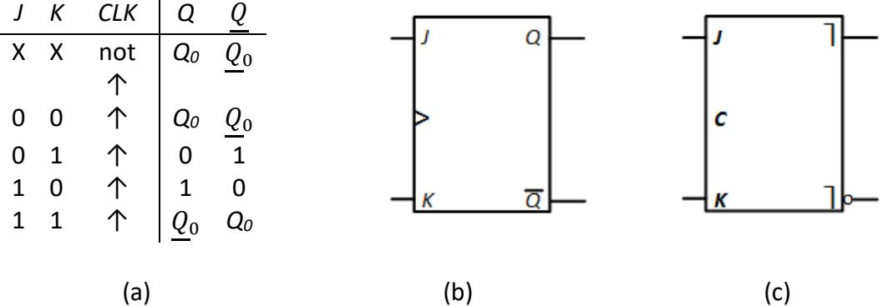

Figure 6.19: J-K flip-flop: (a) Truth table; (b) Logic symbol (edge-triggered); (c) Logic symbol (pulse triggered).

There are a couple of ways to design this flip-flop. We can use the leader-follower methodology we employed for the D flip-flop. Like its counterpart, this is technically considered to be pulse triggered because it uses both the rising and falling clock edges. This design uses two S-R latches as the leader and follower, as shown in Figure 6.20.

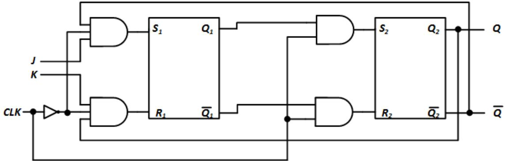

Figure 6.20: J-K flip-flop: Leader-follower design.

When the clock input is 0, the first latch has *S* = *J* ^ *Q'* and *R* = *K'* ^ *Q*. This ensures the latch never has the invalid *SR* = 11 input. Also during this time, the two inputs to the second latch's *S* and *R* inputs are both 0, so it does not change its outputs. When the clock goes from 0 to 1, the *SR* inputs to the first latch become 00 and it locks in its value. Its outputs become the inputs to the second latch, which produces the desired output. The outputs of the first latch are always 10 or 01, so this latch also never receives the invalid 11 input.

It is also possible to design a J-K edge-triggered flip-flop using the D flip-flop we designed in the previous subsection. We just need to generate the *D* input using *J*, *K*, and the current outputs *Q* and *Q'*. To do this, consider the excitation table shown in Figure 6.21 (a). In this table, note that *Q* is an input, not an output. We are trying to generate *D* and we will use the current output of the J-K flip-flop to do this.

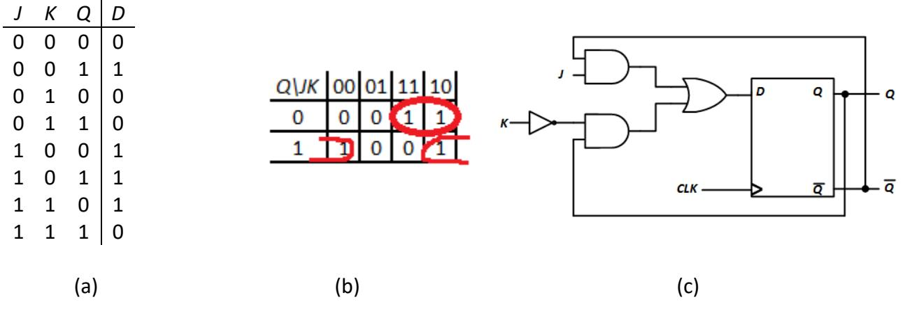

Figure 6.21: Creating a J-K flip-flop using a D flip-flop: (a) Excitation table; (b) Karnaugh map to generate *D*; (c) Final circuit.

With this excitation table, we can create the Karnaugh map shown in Figure 6.21 (b), identify the essential prime implicants (*JK'* is not essential, nor is it needed to generate *D*), and determine the function to produce the desired value of *D*. The final circuit is shown in Figure 6.21 (c).

Finally, it is possible to incorporate asynchronous preset and clear signals in an edgetriggered J-K flip-flop, just as we did for the D flip-flop. Figure 6.22 shows the design for this circuit. This is mostly the design for the 74112 TTL chip, except the clock is inverted. This changes the design from the negative edge-triggered circuit in this chip to a positive edgetriggered design.

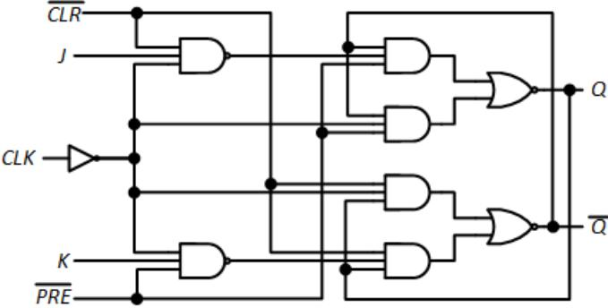

Figure 6.22: Internal design of the positive edge-triggered J-K flip-flop with preset and clear.

### 6.3.3 T Flip-Flop

The T (toggle) flip-flop, unlike the D and J-K flip-flops, cannot set its output to 0 or 1 explicitly. Rather, it can invert its output or leave it unchanged. It has one input, *T*, and a clock, and the usual *Q* and outputs. If *T* = 0 on the rising edge of the clock, output *Q* remains unchanged; if *T* = 1, it is inverted. Figure 6.23 shows the truth table and logic symbol for the positive edgetriggered T flip-flop. Note that the clock is not shown in the truth table. We can leave it out of the truth table when it is implicit that all transitions must occur on a clock edge. We could not leave it out of the truth tables for the flip-flops with preset and clear signals, since those signals do not need a clock edge to perform their functions.

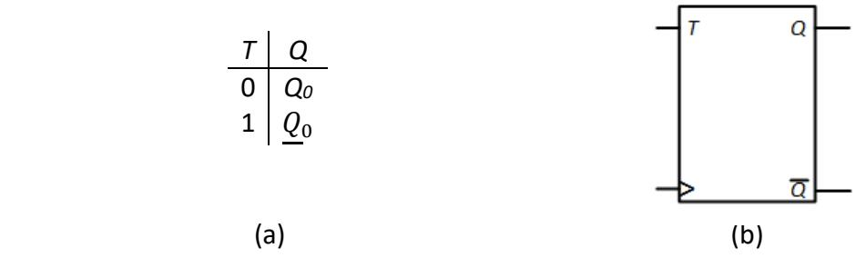

Figure 6.23: T flip-flop: (a) Truth table; (b) Logic symbol.

Several companies manufacture chips with D and J-K flip-flops for designers to use in their circuits. However, no company manufactures a chip with T flip-flops. Nevertheless, they are commonly used, and no company makes them because they are very easy to construct using existing flip-flops. First, let's look at how to construct a T flip-flop using a D flip-flop.

To design a T flip-flop from a D flip-flop, we start by going back to the truth table and using it to generate the excitation table. We expand the table to list all values of *Q* explicitly; this is shown in Figure 6.24 (a).

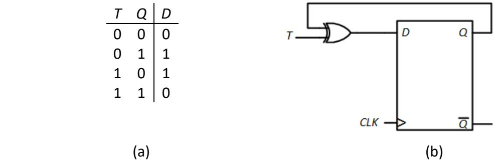

Figure 6.24: T flip-flop constructed using a D flip-flop: (a) Excitation table; (b) Final design.

One way to generate *D* from the *T* and *Q* values is to set *D* = *T'Q* + *TQ'*. A simpler way is to XOR *T* and *Q*, giving us *D* = *T* ⊕ *Q*. Either way is fine; we use the latter in the circuit shown in Figure 6.24 (b).

We can also use a J-K flip-flop to construct a *T* flip-flop. As before, we can generate the excitation table, shown in Figure 6.25 (a). Notice that there are several don't care entries in this table. This occurs because there are two ways to set the new output value. For the first row, for example, we have a current value of *Q* = 0 and we want to end up with the same value. We can set *JK* = 00, which keeps it at its current value of 0, or we can set *JK* = 01, which explicitly sets the value to 0. The second row either sets *Q* = 1 explicitly with *JK* = 10 or inverts the output to 1 if *JK* = 11. The remaining entries are derived in a similar manner.

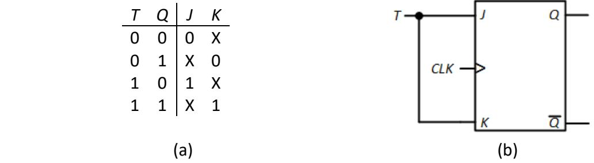

Figure 6.25: T flip-flop constructed using a J-K flip-flop: (a) Excitation table; (b) Final design.

With this table, you could construct Karnaugh maps and derive minimal functions for *J* and *K*; for this design, *J* = *T* and *K* = *T*. The final design is shown in Figure 6.25 (b). For this particular design, we could have said "If *T* = 0, we want the output to remain unchanged, so we want *J* = *K* = 0, and if *T* = 1, we want to invert the output, so we must set *J* = *K* = 1. Putting them together, we want *J* = *K* = *T*." Most designs cannot be completed so easily – good for you if you realized this before reading this paragraph.

## 6.4 Summary

This chapter begins our study of sequential circuits. Unlike combinatorial circuits, which produce outputs based solely on the current input values, a sequential circuit produces outputs based on the current input values and its current state. Depending on the state of the circuit, the same input values may generate different output values.

A sequential circuit requires something to store the current state of the circuit. A block of combinatorial logic reads in the state of this circuit from the storage elements and the data inputs, and it generates the circuit outputs; it also sends the new state of the circuit to the storage elements.

Latches are a fundamental storage component. They use cross-coupled logic gates to lock in (or latch) a data value, either 0 or 1. This chapter introduced the S-R latch (and its variant, the - latch) and the D latch. We examined their overall functions and their internal configurations.

Latches may have an enable signal. When it is asserted, the output changes whenever the input changes. This can be problematic for many sequential circuit designs. For this reason, designers developed flip-flops. These devices load new data only on the rising edge of the clock, when it changes from 0 to 1, though some can force the output to 1 (preset) or 0 (clear) at any time, without regard for the clock. The design of the D flip-flop is based on the S-R latch. The leader-follower design is pulse-triggered, and the design with asynchronous preset and clear signals uses three modified - latches. The J-K flip-flop is created from the edge-triggered D flip-flop by using its inputs and current outputs to generate the next value of *D* to be stored in the flip-flop. The T flip-flop employs the same strategy as it is constructed from either a D or J-K flip-flop.

In the next chapter, we will examine some more complex sequential components. These components are constructed using the flip-flops introduced in this chapter, with the addition of combinatorial logic needed to generate the correct inputs to the flip-flops and the correct component outputs.

## Exercises

- 1. For the 1s counter sequential system in Section 6.1, show the state and output after each input in the following sequence: 0 1 1 1 0 1. Initially the system is in state *Zero values of 1 have been input so far*.
- 2. Repeat Problem 1 for the sequence 1 0 1 1 1 0.
- 3. The 1s counter sequential system has the following sequence of inputs and outputs.

| Input  | 0 | 1 | 1 | 1 | 1 | 0 |
|--------|---|---|---|---|---|---|
| Output | 0 | 0 | 1 | 0 | 0 | 0 |

Show its initial and final state.

- 4. Show the outputs of the S-R latch in Figure 6.8 for the input sequence *SR* = 10 00 01 10 01 00.
- 5. Repeat Problem 4 for the sequence *SR* = 01 10 01 00 10 00.
- 6. Show the outputs of the latch in Figure 6.9 for the input sequence = 10 11 01 10 01 11.
- 7. Repeat Problem 6 for the sequence = 01 10 01 11 10 11.
- 8. For the S-R latch with enable in Figure 6.10, show the values of *Q* and for the input values in the following timing diagram.

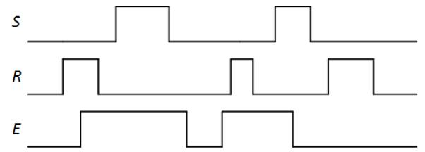

9. Repeat Problem 8 for the input sequence shown in the following timing diagram.

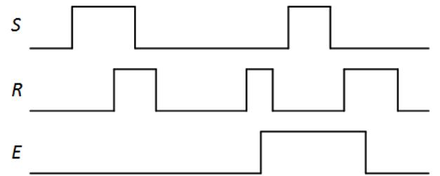

- 10. For the D latch in Figure 6.11, show the values of *S*, *R*, *Q*, and for the input sequence *D* = 0 1 1 0 1 0.
- 11. Repeat Problem 10 for the input sequence shown in the following timing diagram.

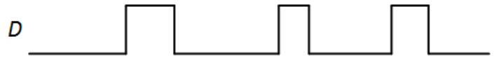

- 12. For the D latch with enable in Figure 6.12, show the values of *S*, *R*, *Q*, and for the input sequence *DE* = 01 11 10 00 11 01.
- 13. Repeat Problem 12 for the input sequence shown in the following timing diagram.

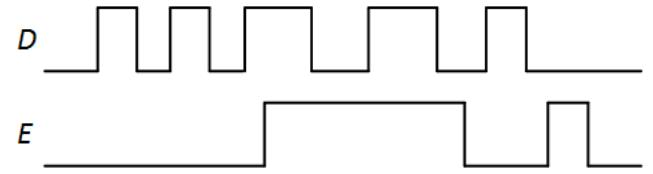

- 14. For the leader-follower D flip-flop shown in Figure 6.16, show the output of each D latch for the input sequence *D CLK* = 00 10 11 01 00 11.
- 15. Repeat Problem 14 for the input sequence shown in the following timing diagram.

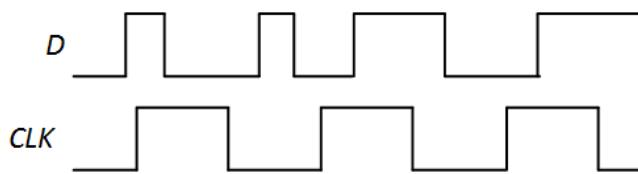

16. For the edge-triggered D flip-flop with preset and clear in Figure 6.18, show the output of each NAND gate for the input values shown in the following timing diagram.

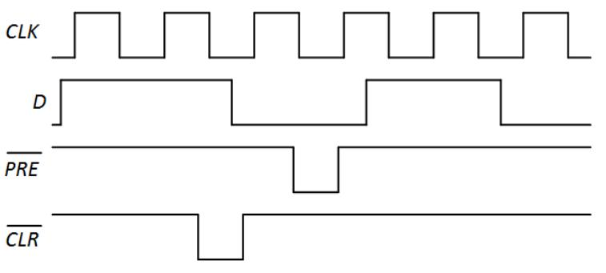

17. Repeat Problem 16 for the input values shown in the following timing diagram.

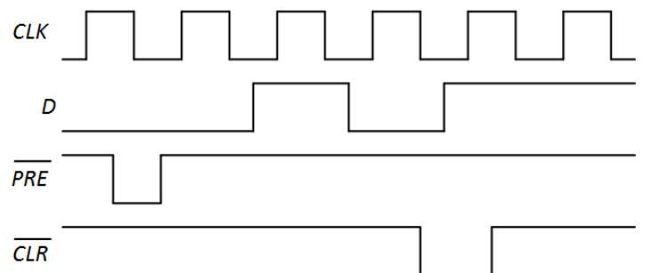

- 18. For the leader-follower J-K flip-flop shown in Figure 6.20, show the output of each S-R latch for the input sequence *J K CLK* = 010 011 000 001 100 101 110 111.
- 19. Repeat Problem 18 for the input sequence shown in the following timing diagram.

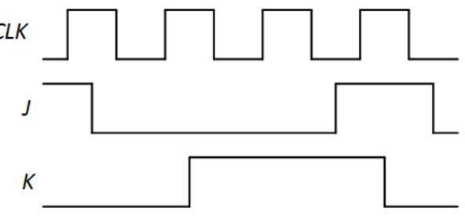

- 20. Repeat Problem 18 for the positive edge-triggered J-K flip shown in Figure 6.21.
- 21. Repeat Problem 19 for the positive edge-triggered J-K flip shown in Figure 6.21.
- 22. For the positive edge-triggered J-K flip-flop with preset and clear shown in Figure 6.22, show the output of each gate for the input values in the following timing diagram.

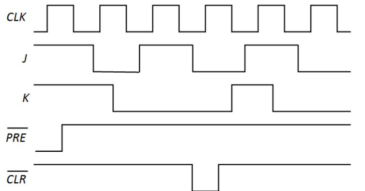

23. For the T flip-flop shown in Figure 6.24, show the values of *D*, *Q* and for the input sequence *T CLK* = 00 01 10 111 10 11.

24. Repeat Problem 23 for the input sequence shown in the following timing diagram.

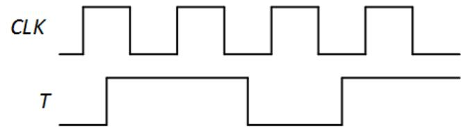

- 25. For the T flip-flop shown in Figure 6.25, show the values of *J*, *K*, *Q,* and for the input sequence shown in Problem 6.23.
- 26. Repeat Problem 25 for the input sequence shown in Problem 6.24.
- 27. Design a D flip-flop using a J-K flip-flop. (Hint: Create the excitation table, then determine the functions for *J* and *K*.)
- 28. Design a D flip-flop using a T flip-flop.
- 29. Design a J-K flip-flop using a T flip-flop.
