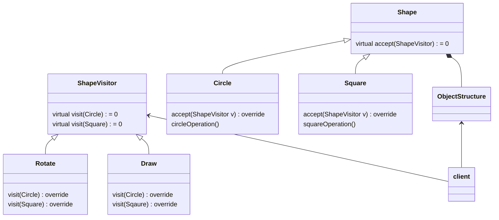

# Visitor模式

```mermaid
classDiagram


ShapeVisitor <|-- Rotate
ShapeVisitor <|-- Draw
Shape <|-- Circle
Shape <|-- Square
ShapeVisitor <-- client
ObjectStructure <-- client
Shape *-- ObjectStructure
class client
class ObjectStructure
class ShapeVisitor {
    virtual visit(Circle) = 0
    virtual visit(Square) = 0
}

class Rotate {
    visit(Circle) override
    visit(Square) override
}

class Draw {
    visit(Circle) override
    visit(Sqaure) override
}

class Shape {
    virtual accept(ShapeVisitor) = 0
}

class Circle {
    accept(ShapeVisitor v) override
    circleOperation()
}

class Square {
    accept(ShapeVisitor v) override
    squareOperation()
}

```
