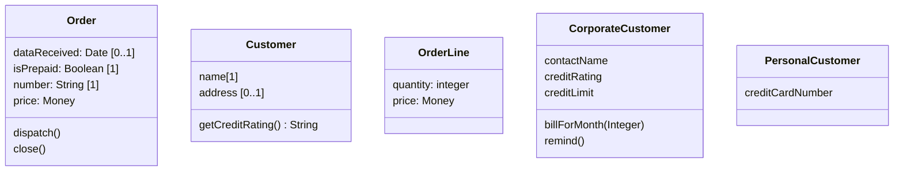

# UML

## 类图

```mermaid
classDiagram

class Order {
    dataReceived: Date [0..1]
    isPrepaid: Boolean [1]
    number: String [1]
    price: Money
    dispatch()
    close()
}

class Customer {
    name[1]
    address [0..1]
    getCreditRating() String
}

class OrderLine {
    quantity: integer
    price: Money
}

class CorporateCustomer {
    contactName
    creditRating
    creditLimit
    billForMonth(Integer)
    remind()
}

class PersonalCustomer {
    creditCardNumber
}


```

## 时序图

## 状态图
