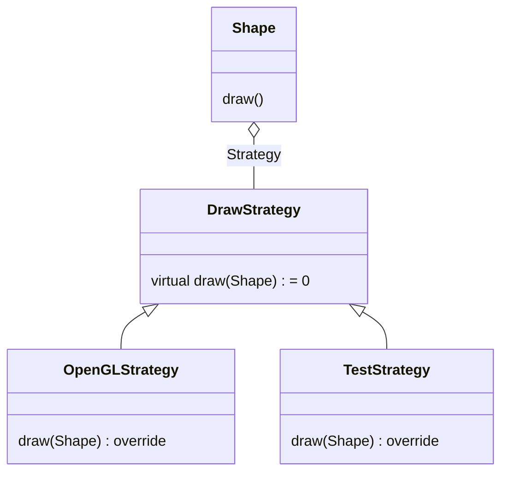

# strategy

```mermaid
classDiagram

Shape o-- DrawStrategy: Strategy
DrawStrategy <|-- OpenGLStrategy
DrawStrategy <|-- TestStrategy

class Shape {
    draw()
}

class DrawStrategy {
    virtual draw(Shape) = 0
}

class OpenGLStrategy {
    draw(Shape) override
}

class TestStrategy {
    draw(Shape) override
}
```
