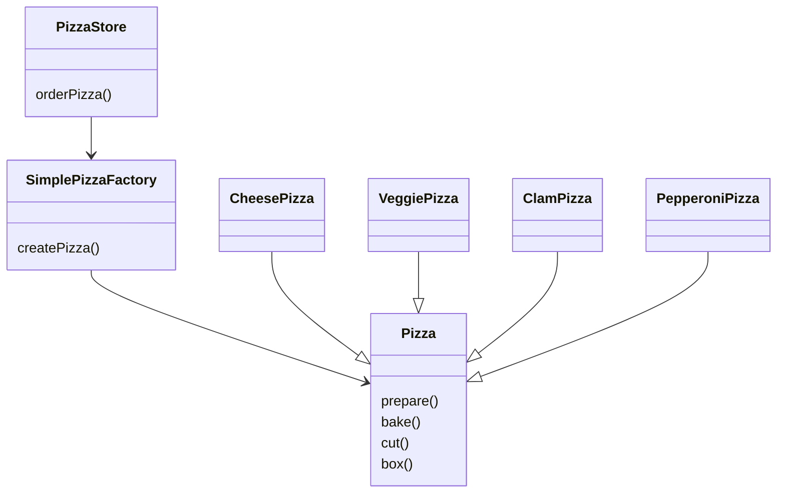
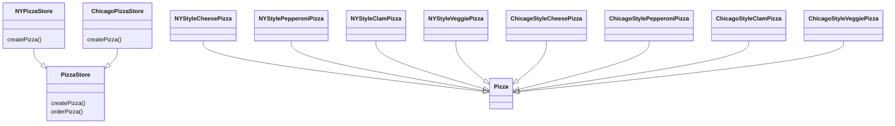

# 工厂模式总结

## 简单工厂模式

```mermaid
classDiagram

    class PizzaStore{
        orderPizza()
    }

    class SimplePizzaFactory{
        createPizza()
    }

    class Pizza{
        prepare()
        bake()
        cut()
        box()
    }

    PizzaStore --> SimplePizzaFactory
    SimplePizzaFactory --> Pizza
    CheesePizza --|> Pizza
    VeggiePizza --|> Pizza
    ClamPizza --|> Pizza
    PepperoniPizza --|> Pizza

```

## 工厂模式

```mermaid
classDiagram

    class PizzaStore{
        createPizza()
        orderPizza()
    }

    class NYPizzaStore{
        createPizza()
    }

    class ChicagoPizzaStore{
        createPizza()
    }

    NYPizzaStore --|> PizzaStore
    ChicagoPizzaStore --|> PizzaStore

    NYStyleCheesePizza --|> Pizza
    NYStylePepperoniPizza --|> Pizza
    NYStyleClamPizza --|> Pizza
    NYStyleVeggiePizza --|> Pizza
    ChicageStyleCheesePizza --|> Pizza
    ChicagoStylePepperoniPizza --|> Pizza
    ChicagoStyleClamPizza --|> Pizza
    ChicagoStyleVeggiePizza --|> Pizza
```

## 抽象工厂模式
