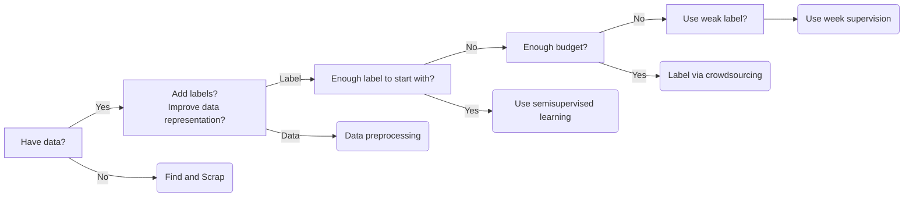
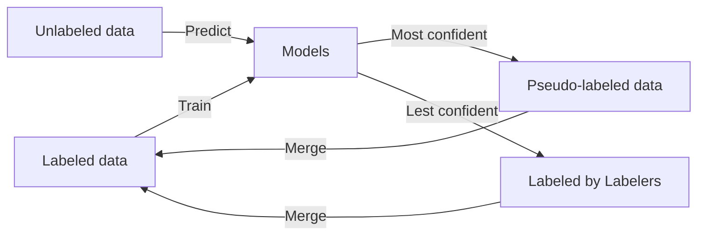

# 机器学习数据获取和处理

## 数据集获取

[wiki机器学习数据集](https://en.wikipedia.org/wiki/List_of_datasets_for_machine-learning_research)

• Paperswithcodes Datasets: academic datasets with 
leaderboard
• Kaggle Datasets: ML datasets uploaded by data 
scientists
• Google Dataset search: search datasets in the Web 
• Various toolkits datasets: tensorflow, huggingface
• Various conference/company ML competitions 
• Open Data on AWS: 100+ large-scale raw data 
• Data lakes in your own organization

## 数据集生成

GAN生成数据

数据增强

## 数据抓取

爬虫技术：selenium, bs4

## 数据标注

### 半监督学习

对数据分布有如下假设：

- 连续性假设：类似特征的数据有很大可能有相同的标签
- 聚类假设：数据内在有类的分布
- 流型假设：通过降维

#### 自学习结合主动学习

