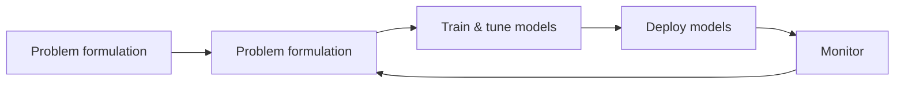

# 机器学习整体流程和挑战

## 流程

## 挑战

• Formulate problem: focus on the most impactful industrial problems
• Data: high-quality data is scarce, privacy issues
• Train models: ML models are more and more complex, data-hungry, expensive 
• Deploy models: heavy computation is not suitable for real-time inference
• Monitor: data distributions shifts, fairness issues
