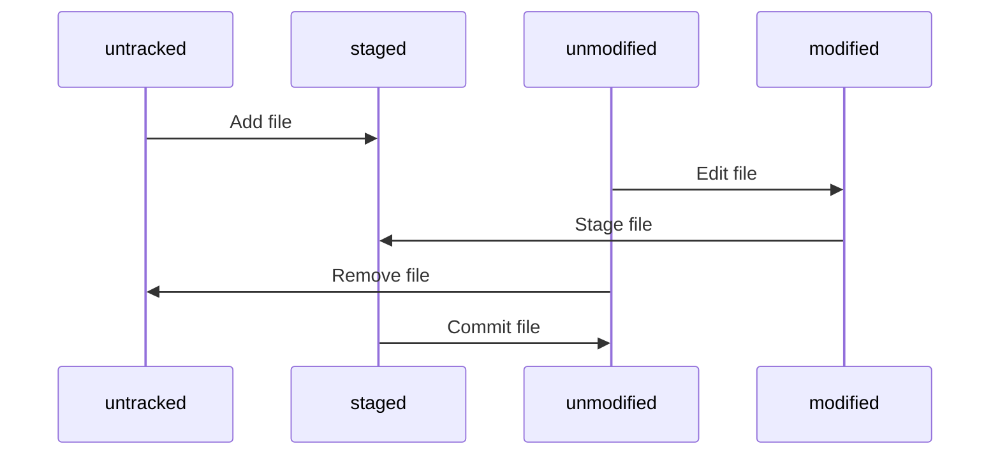

# Git Concepts

Git is a distributed version control system written by the brilliant Linus, who developed Linux.

The most important distinction of Git from other version control systems is the concept of snapshots, where each modification submission is viewed as the creation of a new snapshot of the file system.

The most important concept in Git is the "Three Areas": working directory, staging area, and repository. The `add` operation adds files from the working directory to the staging area, while the `commit` operation adds files from the staging area to the repository.

In Git, file statuses are divided into two categories: untracked and tracked. Tracked files can be further categorized as unmodified, modified, and staged. Their transitions are as follows:

When you stage a file in Git, Git calculates a `SHA-1` value. When you commit a version, it calculates the `SHA-1` for each directory and constructs a tree object that represents the organization of folders and files. A commit object points to the tree object and contains other information such as the author.

Each commit is essentially a snapshot of the file tree and may have 0, 1, or multiple parent nodes:

A branch is simply a lightweight, movable pointer pointing to a specific commit.

Creating a branch is like creating a new pointer at the current position, for example: `git branch testing`.

`HEAD` is a special pointer that points to the current branch:

You can easily see the branches and where `HEAD` is pointing using the following command:

`git log --oneline --decorate`

Switching branches with `git checkout testing` moves `HEAD` to the testing branch and modifies the working directory to reflect the state of the commit that `testing` points to.

Different branches can evolve separately, and you can use the following command to visualize this:

`git log --oneline --decorate --graph --all`
